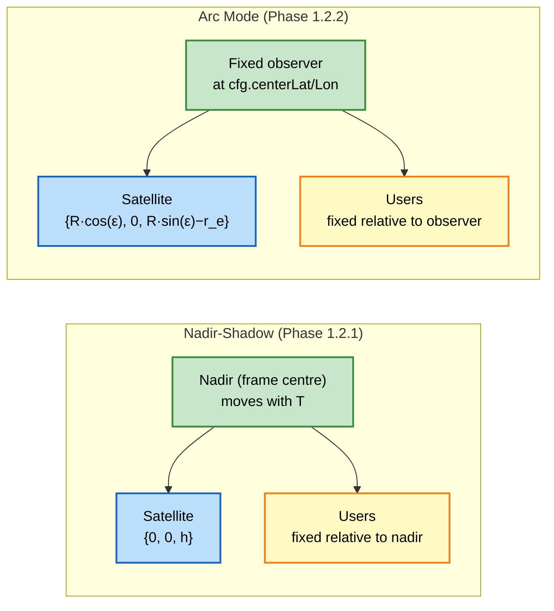
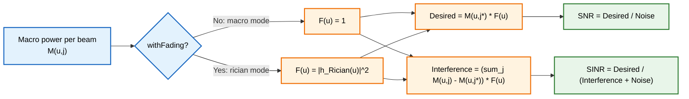
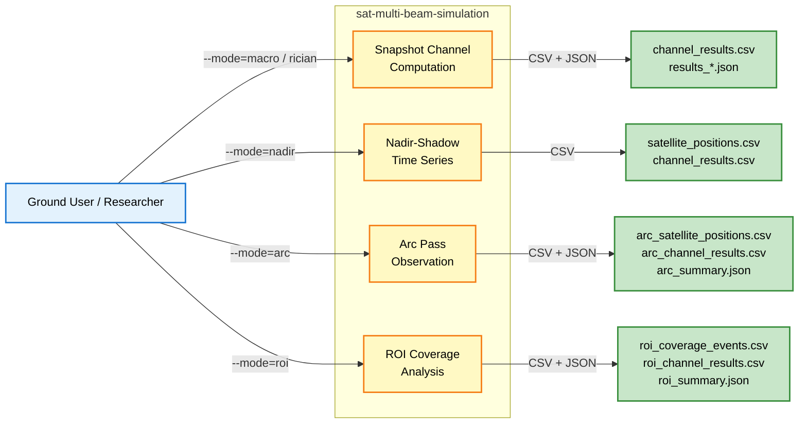
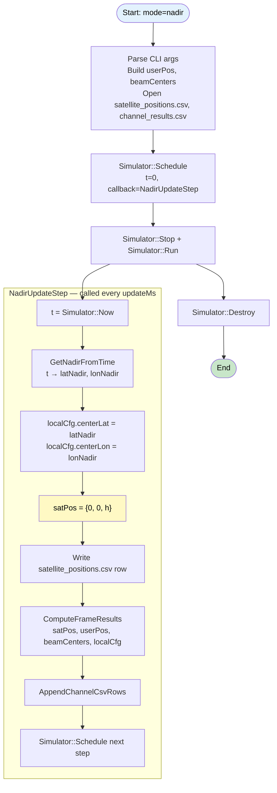
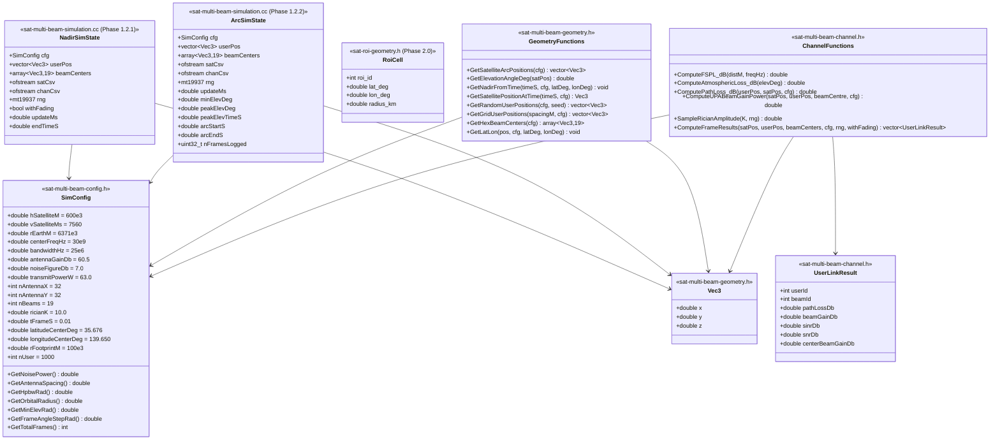

<h1 align="center">Multi-Beam LEO Satellite Simulation — ns3 Module</h1>
<h3 align="center">Phase 1: Satellite Beam Geometry & Channel Model (C++ / ns3)</h3>

---

> [!CAUTION]
> Keep this document **private** by default. Only publish after the paper is accepted.

---

## Table of Contents

- [Introduction](#introduction)
- [Execution Status](#execution-status)
- [Minimum Requirements](#minimum-requirements)
- [System Model](#system-model)
- [System Architecture](#system-architecture)
  - [Module Structure](#module-structure)
  - [Python ↔ C++ Module Mapping](#python--c-module-mapping)
- [Simulation Modes](#simulation-modes)
- [Use Case Diagram](#use-case-diagram)
- [Flowchart](#flowchart)
  - [Phase 1.2.1 — Nadir-Shadow Mode](#phase-121--nadir-shadow-mode)
  - [Phase 1.2.2 — Arc Mode](#phase-122--arc-mode)
- [Class Diagram](#class-diagram)
- [System Parameters](#system-parameters)
- [Output Format](#output-format)
- [Execution Commands](#execution-commands)
- [Validation Results](#validation-results)
- [References](#references)

---

## Introduction

This module is the C++ / ns3 reproduction of the Multi-Beam LEO Communication Satellite Simulation Framework [1], integrated into the SNS3 (ns-3 satellite) environment as the physical-layer channel model for the TriScale-LEO Beam Hopping Controller.

**1. Background**

Low Earth Orbit (LEO) multi-beam satellites use Uniform Planar Array (UPA) antennas to serve multiple ground users simultaneously across 19 hexagonally arranged beams. The beam gain pattern follows the Dirichlet kernel (array factor squared), and path loss combines free-space loss with 3GPP NTN atmospheric attenuation [2]. This module reproduces the full physical-layer model from Python to C++/ns3 for integration with SNS3's Beam Hopping scheduler.

**2. Importance**

The channel model must be validated before use as a Beam Hopping environment. Inaccurate beam gain or path loss causes incorrect SINR estimation, which leads to wrong slot allocation decisions in the Beam Hopping Controller (Layer 2).

**3. Contribution**

- **Phase 1.1**: Validated that the C++ Dirichlet kernel beam gain is mathematically equivalent to the Python steering-vector matrix product (per-user `|ΔSNR| p95 = 0.016 dB`, beam assignment 100% consistent, n=121,807 users)
- **Phase 1.2.1**: ns3 event-driven nadir-shadow mode — `Simulator::Schedule` replaces the static for-loop; frame centre tracks the satellite nadir at each time step
- **Phase 1.2.2**: Arc mode — fixed ground observer, satellite position varies along the circular arc, elevation angle changes from low → peak → low across the pass
- **Phase 1.3**: Parallel implementation using Hypatia's distance geometry library for cross-validation

**4. Challenges**

| # | Challenge | Approach |
|---|---|---|
| C1 | Atmospheric loss: ITU-R full model not portable to C++ | Zenith-scaling approximation (`0.55/sin(ε)`, diff < 0.3 dB at ε > 20°) |
| C2 | UPA beam gain: O(Nx·Ny) per user in Python | Closed-form Dirichlet kernel — O(1) per user, mathematically equivalent |
| C3 | Coordinate transform: satellite frame → array frame | Reproduced `get_angles_to_satellite()` exactly (`BuildArrayTransform` + `GetSpatialFreqs`) |
| C4 | ns3 integration: no native LEO multi-beam channel | Custom module; `ComputeFrameResults` wraps all sub-models, compatible with SNS3 |

---

## Execution Status

> [!NOTE]
> **Status Icons:**
> - ✅ Completed
> - ⏳ In progress
> - ❌ Not started

| Step | Status | Date | Notes |
|---|---|---|---|
| [Python ↔ C++ model porting](#module-structure) | ✅ | 2026-05-19 | FSPL, UPA beam gain, Rician fading |
| [Phase 1.1: Validation (standalone C++)](#validation-results) | ✅ | 2026-05-20 | p95 = 0.016 dB, beam agreement 100% (n=121,807) |
| [Phase 1.1: ns3 module output check](#validation-results) | ✅ | 2026-05-21 | beam 9 gain = 47.712 dB, path loss = 177.925 dB |
| [Phase 1.2.1: Nadir-shadow ns3 event loop](#phase-121--nadir-shadow-mode) | ⏳ | — | `NadirSimState` + `Simulator::Schedule` |
| [Phase 1.2.2: Arc mode](#phase-122--arc-mode) | ⏳ | — | `GetSatellitePositionAtTime` + `ArcSimState` |
| [Phase 1.3: Hypatia parallel implementation](#references) | ❌ | — | `hypatia_beam_model.py` |
| [Phase 2.0: ROI grid geometry](#simulation-modes) | ❌ | — | `sat-roi-geometry.h/.cc` |
| [Phase 2.1: ROI observation mode](#simulation-modes) | ❌ | — | `mode=roi` |

---

## Minimum Requirements

| Component | Requirement |
|---|---|
| OS | Ubuntu 22.04 LTS (VMware on Windows 11) |
| ns3 | ns-3.40 with SNS3 contrib modules |
| Compiler | GCC 11+ (C++17) |
| Python | 3.10+ (for comparison scripts and Phase 1.3) |
| SNS3 deps | `satellite-utils`, `ThreeGppNTNDenseUrbanPropagationLossModel` |
| RAM | ≥ 8 GB (for n=121,807 user macro mode) |

---

## System Model

### Satellite Arc Geometry

The satellite follows a circular orbit at altitude `h = 600 km`. The pass is modelled as a 2D arc in the x–z plane (y = 0), parameterised by the arc angle `ε`:

```
ε(T) = ε₀ + T / t_frame × Δε
```

where `ε₀ = π/2 − arccos(r_earth / (r_earth + h))` is the horizon angle and `Δε = v_sat × t_frame / (r_earth + h)`.

**Two frame designs are supported:**



### Channel Model

The received SINR for user `u` in beam `j*` (assigned beam) is:

```
SINR[u] = P_desired[u] / (P_interference[u] + P_noise)

P_desired[u]     = P_tx · G_ant / L(u) · |beam_gain[u, j*]|² · |h_Rician|²
P_interference[u] = Σ_{j≠j*} P_tx · G_ant / L(u) · |beam_gain[u,j]|² · |h_Rician|²
P_noise          = k_B · T · B · F
```

where `L(u) = FSPL(d) + A_atm(ε)` is the total path loss.

**Beam gain (UPA Dirichlet kernel):**

```
|beam_gain[u,j]|² = AF²(Nx, ΔΦx) · AF²(Ny, ΔΦy) / (Nx² · Ny² · Nbeams)

AF²(N, ΔΦ) = sin²(N·π·ΔΦ/2) / sin²(π·ΔΦ/2)
```

Peak at beam centre (ΔΦ = 0): `|beam_gain|²_max = 1/Nbeams = 1/19`, equivalent to `47.712 dBi` with `G_ant = 60.5 dBi`.

---

### Macro vs Rician Switch

The `macro` and `rician` modes share the same geometry, path-loss, beam-gain,
and beam-association pipeline. The only runtime switch is whether
`ComputeFrameResults(..., withFading)` applies a per-user Rician power factor.



Equivalent formulas:

```text
Macro mode:
  F(u)            = 1
  Desired(u)      = M(u,j*)
  Interference(u) = sum_j M(u,j) - M(u,j*)
  SNR(u)          = M(u,j*) / N
  SINR(u)         = M(u,j*) / (sum_j M(u,j) - M(u,j*) + N)

Rician mode:
  F(u)            = |h_Rician(u)|^2
  Desired(u)      = M(u,j*) * F(u)
  Interference(u) = (sum_j M(u,j) - M(u,j*)) * F(u)
  SNR(u)          = M(u,j*) * F(u) / N
  SINR(u)         = M(u,j*) * F(u) / ((sum_j M(u,j) - M(u,j*)) * F(u) + N)
```

Practical impact:

- `macro` is deterministic and is used as the validated baseline for Phase 1 and Phase 2.
- `rician` adds random per-user power fluctuation on top of the same large-scale geometry.
- `SNR` changes more strongly than `SINR` because the same fading factor multiplies both desired and interference power, while thermal noise does not scale.
- Beam association is still based on macro power, so the serving beam usually does not change when enabling Rician fading.

## System Architecture

### Module Structure

```
2D/projection/code/ns/
├── sat-multi-beam-config.h        SimConfig struct (all system parameters)
├── sat-multi-beam-geometry.h/.cc  Satellite arc, user positions, hex beam centers, coordinate transforms
├── sat-multi-beam-channel.h/.cc   FSPL, atmospheric loss, UPA beam gain (Dirichlet), Rician fading
├── sat-multi-beam-simulation.cc   Main driver: mode dispatch, Simulator::Schedule loop, CSV/JSON output
├── sat-roi-geometry.h/.cc         [Phase 2.0] ROI grid (Earth surface cells)
├── output/
│   ├── v1/                        Phase 1.1 validation output (frame 38537, n=37)
│   └── v2/                        Phase 1.2.2 arc mode output (planned)
└── README.md                      This file
```

### Python ↔ C++ Module Mapping

| Python file | C++ file | Description |
|---|---|---|
| `params.py` | `sat-multi-beam-config.h::SimConfig` | All system parameters in one struct |
| `networkGeometry.py` | `sat-multi-beam-geometry.h/.cc` | Satellite arc, user distribution, hex beam centres |
| `utils.py` (coordinate transform) | `sat-multi-beam-geometry.cc` | `BuildArrayTransform()` + `GetSpatialFreqs()` |
| `channel.py` | `sat-multi-beam-channel.h/.cc` | FSPL, atmospheric loss, UPA beam gain, Rician |
| `simulation.py` | `sat-multi-beam-simulation.cc` + `ComputeFrameResults()` | Frame loop, beam assignment, SINR/SNR |
| `plotResults.py` (data part) | `WriteJson()` / CSV writers | Output schema compatible with Python plotting |

---

## Simulation Modes

| Mode | `--mode` | Frame Centre | `satPos` | Elevation | Phase |
|---|---|---|---|---|---|
| **Macro** | `macro` | Specified `--time-s` snapshots | `{0, 0, h}` | Always 90° | 1.1 |
| **Rician** | `rician` | Specified `--time-s` snapshots | `{0, 0, h}` | Always 90° | 1.1 |
| **Nadir-shadow** | `nadir` | Moves with satellite nadir every `updateMs` | `{0, 0, h}` | Always 90° | 1.2.1 |
| **Arc** | `arc` | Fixed at `cfg.centerLat/Lon` (pass peak) | `{R·cos(ε), 0, R·sin(ε)−re}` | Low→Peak→Low | 1.2.2 |
| **ROI** | `roi` | Fixed at `--roi-lat/lon` (= pass peak) | Same as arc | Low→Peak→Low | 2.1 |

---

## Use Case Diagram



---

## Flowchart

### Phase 1.2.1 — Nadir-Shadow Mode

Frame centre tracks the satellite nadir at every `updateMs`. Satellite is always directly overhead in the local frame (`satPos = {0, 0, h}`).



### Phase 1.2.2 — Arc Mode

Frame centre is fixed. Satellite position is computed from the orbital arc model at each time step. Elevation varies over the pass.

```mermaid
flowchart TD
    Start([Start: mode=arc])
    Init[Parse CLI args\nBuild userPos, beamCenters\nOpen arc_satellite_positions.csv, arc_channel_results.csv]
    Schedule[Simulator::Schedule\nt=0, callback=ArcUpdateStep]
    Run[Simulator::Stop\nSimulator::Run]

    subgraph "ArcUpdateStep  — called every updateMs"
        GetT2[t = Simulator::Now]
        GetSatPos["GetSatellitePositionAtTime(t, cfg)\neps = eps_zero + t/t_frame * d_eps\nsatPos = {R·cos(eps), 0, R·sin(eps) − r_earth}"]
        GetElev[GetElevationAngleDeg\nelevDeg = atan(satPos.z / |satPos.x|)]
        CheckElev{elevDeg ≥ minElevDeg?}
        WriteArcSat[Write arc_satellite_positions.csv\ntime_s, sat_x, sat_y, sat_z, elevation_deg]
        ComputeArc[ComputeFrameResults\nsatPos, userPos, beamCenters, cfg]
        WriteArcChan[Write arc_channel_results.csv\ntime_s, elevation_deg, user_id, beam_id, ...]
        UpdateSummary[Update peak elevation\narc_start_s, arc_end_s, n_frames_logged]
        Reschedule2[Simulator::Schedule next step]
        Skip[Skip frame]
    end

    WriteSummary[Write arc_summary.json]
    Destroy2[Simulator::Destroy]
    End2([End])

    Start --> Init --> Schedule --> Run
    Run --> GetT2 --> GetSatPos --> GetElev --> CheckElev
    CheckElev -->|Yes| WriteArcSat --> ComputeArc --> WriteArcChan --> UpdateSummary --> Reschedule2
    CheckElev -->|No| Skip --> Reschedule2
    Run --> WriteSummary --> Destroy2 --> End2

    style Start fill:#e3f2fd,color:#000
    style End2 fill:#c8e6c9,color:#000
    style CheckElev fill:#fff9c4,color:#000
    style GetSatPos fill:#bbdefb,color:#000
```

---

## Class Diagram



---

## System Parameters

| Category | Parameter | Value | Unit | Source |
|---|---|---|---|---|
| **Orbit** | `hSatelliteM` | 600,000 | m | [1] |
| **Orbit** | `vSatelliteMs` | 7,560 | m/s | [1] |
| **RF** | `centerFreqHz` | 30×10⁹ | Hz | Ka-band [2] |
| **RF** | `bandwidthHz` | 25×10⁶ | Hz | [1] |
| **RF** | `antennaGainDb` | 60.5 | dBi | [1] |
| **RF** | `noiseFigureDb` | 7.0 | dB | 3GPP TR 38.821 [2] |
| **RF** | `transmitPowerW` | 63 | W | [1] |
| **UPA** | `nAntennaX/Y` | 32 × 32 | — | [1] |
| **UPA** | `nBeams` | 19 | — | 2-ring hexagonal [1] |
| **Fading** | `ricianK` | 10 | — | LoS-dominant [1] |
| **Timing** | `tFrameS` | 0.010 | s | [1] |
| **Area** | `latitudeCenterDeg` | 35.676°N | deg | Tokyo [1] |
| **Area** | `rFootprintM` | 100,000 | m | [1] |

---

## Output Format

### Phase 1.1 / 1.2.1 (Nadir-Shadow)

| File | Schema | Description |
|---|---|---|
| `satellite_positions.csv` | `time_s, nadir_lat_deg, nadir_lon_deg` | Nadir position per time step |
| `user_positions.csv` | `user_id, x_m, y_m, z_m` | Fixed user layout (written once) |
| `channel_results.csv` | `time_s, nadir_lat_deg, nadir_lon_deg, user_id, beam_id, path_loss_dB, sinr_dB, snr_dB, beam_gain_dB` | Per-user channel results |
| `results_{ms}_{km}km.json` | Python schema (plotResults.py compatible) | Full snapshot JSON |

### Phase 1.2.2 (Arc Mode)

| File | Schema | Description |
|---|---|---|
| `arc_satellite_positions.csv` | `time_s, sat_x_m, sat_y_m, sat_z_m, elevation_deg` | Satellite arc position per step |
| `arc_channel_results.csv` | `time_s, elevation_deg, user_id, beam_id, path_loss_dB, snr_dB, sinr_dB, beam_gain_dB` | Per-user per-step channel results |
| `arc_summary.json` | `arc_start_s, arc_end_s, peak_elevation_s, peak_elevation_deg, n_frames_logged, update_ms, min_elevation_deg` | Arc pass summary |

### Phase 2.1 (ROI Mode)

| File | Schema | Description |
|---|---|---|
| `roi_coverage_events.csv` | `time_s, elevation_deg, peak_snr_dB, mean_snr_dB` | One row per visible time step |
| `roi_channel_results.csv` | `time_s, elevation_deg, user_id, beam_id, path_loss_dB, snr_dB, sinr_dB, beam_gain_dB` | Per-user channel results |
| `roi_summary.json` | `roi_lat_deg, roi_lon_deg, roi_radius_km, total_coverage_s, n_coverage_events, update_ms, min_elevation_deg` | Coverage summary |

---

## Execution Commands

> [!NOTE]
> Execute on Ubuntu (VMware). Files are edited on Windows (VS Code) and copied to the SNS3 build environment.

### Build

```bash
# From SNS3 root
./ns3 build sat-multi-beam-simulation
```

### Phase 1.1 — Snapshot (existing modes)

```bash
# Macro mode — deterministic, used for Python comparison
./ns3 run "sat-multi-beam-simulation \
  --mode=macro --time-s=385.37 \
  --n-user=500 --out-dir=scratch/p11_macro" \
| tee scratch/p11_macro.log

# ns3 module check (37-user hexagonal, frame 38537)
./ns3 run "sat-multi-beam-simulation \
  --mode=macro --time-s=385.37 \
  --n-user=37 --out-dir=output/v1" \
| tee output/v1/run.log
```

**Expected:** center beam gain = **47.712 dB**, path_loss user 0 = **177.925 dB**

### Phase 1.2.1 — Nadir-Shadow ns3 Event Loop

```bash
# Full pass, 100 ms update interval
./ns3 run "sat-multi-beam-simulation \
  --mode=nadir \
  --update-ms=100 --duration-s=770 \
  --n-user=37 --out-dir=scratch/nadir_output" \
| tee scratch/nadir_output/run.log
```

**Verify:** At `t=385.37s`, output row matches Phase 1.1 snapshot (beam gain 47.712 dB)

### Phase 1.2.2 — Arc Mode

```bash
# Full arc, 100 ms update, minimum elevation 5°
./ns3 run "sat-multi-beam-simulation \
  --mode=arc \
  --update-ms=100 --min-elevation-deg=5 \
  --n-user=37 --out-dir=scratch/arc_output" \
| tee scratch/arc_output/run.log
```

**Verify:**
1. `elevation_deg` column forms a parabola (low → 90° → low)
2. At elevation ≈ 89.99°: `sat_x_m ≈ 0`, `sat_z_m ≈ 600000`
3. Peak frame beam gain matches Phase 1.2.1 (diff < 0.1 dB)

### Phase 1.3 — Hypatia Comparison (Python)

```bash
# Run from Windows after copying arc_output CSVs
python 2D/projection/code/hypatia_beam_model.py \
  --n-user 37 --altitude-km 600 --freq-ghz 30 \
  --update-ms 100 --min-elevation-deg 5 \
  --out-dir scratch/hypatia_output
```

**Verify:** `|our_fspl − hypatia_fspl| < 0.1 dB` for all frames

### Phase 2.1 — ROI Observation (Tokyo)

```bash
./ns3 run "sat-multi-beam-simulation \
  --mode=roi \
  --roi-lat=35.67 --roi-lon=139.65 \
  --roi-radius-km=100 \
  --update-ms=100 --min-elevation-deg=10 \
  --n-user=37 --out-dir=scratch/roi_tokyo" \
| tee scratch/roi_tokyo/run.log
```

---

## Validation Results

### Phase 1.1 (2026-05-20 / 2026-05-21)

| Metric | Value | Pass Criterion | Result |
|---|---|---|---|
| Center beam gain (beam 9) | **47.712 dB** | Both sides identical | ✅ |
| `\|Δ SNR\| p95` (n=121,807) | **0.016 dB** | < 0.5 dB | ✅ |
| Beam assignment agreement | **100.0%** | = 100% | ✅ |
| Path loss (user 0, t=385.37s) | **177.925 dB** | ≈ FSPL + 0.39 dB atm | ✅ |
| Satellite position (t=385.37s) | `[25.68, 0, 600000]` m | Matches Python frame 38537 | ✅ |

> **Known limitation (Phase 1.1):** Atmospheric loss uses zenith-scaling approximation (`0.55/sin(ε)`) instead of full ITU-R model. Intentional isolation to reduce Python ↔ C++ differences. Maximum error: < 0.3 dB at ε > 20°.

---

## References

[1] D. Bhatt et al., "Multi-Beam LEO Communication Satellite Simulation Framework," TU Wien Research Data Repository, 2023. [Online]. Available: https://researchdata.tuwien.ac.at/records/j31fx-wf765

[2] 3GPP, "Study on New Radio (NR) to support non-terrestrial networks," Technical Report TR 38.811, v15.4.0, 2020. [Online]. Available: https://www.3gpp.org/ftp/Specs/archive/38_series/38.811/

[3] 3GPP, "Solutions for NR to support non-terrestrial networks (NTN)," Technical Report TR 38.821, v16.0.0, 2019. [Online]. Available: https://www.3gpp.org/ftp/Specs/archive/38_series/38.821/

[4] S. Bhattacherjee and W. Singla, "Network topology design at 27,000 km/hour," in *Proc. ACM CoNEXT*, 2019. (Hypatia framework reference)

[5] SNS3 Contributors, "SNS3: Satellite Network Simulator 3," GitLab. [Online]. Available: https://gitlab.com/sns3/sns3-satellite
