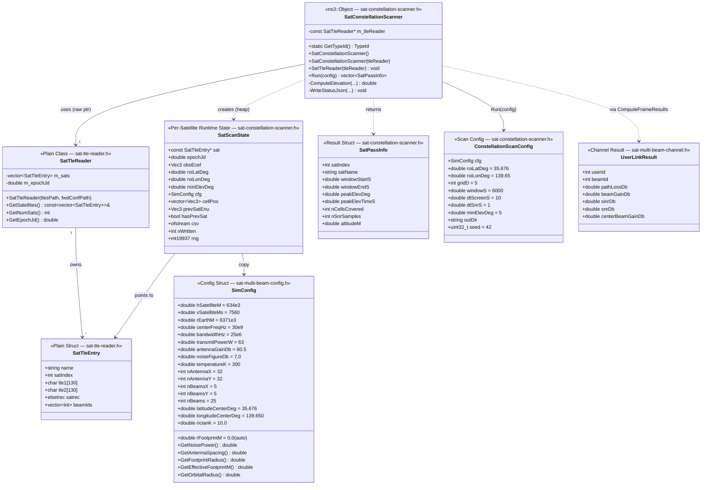
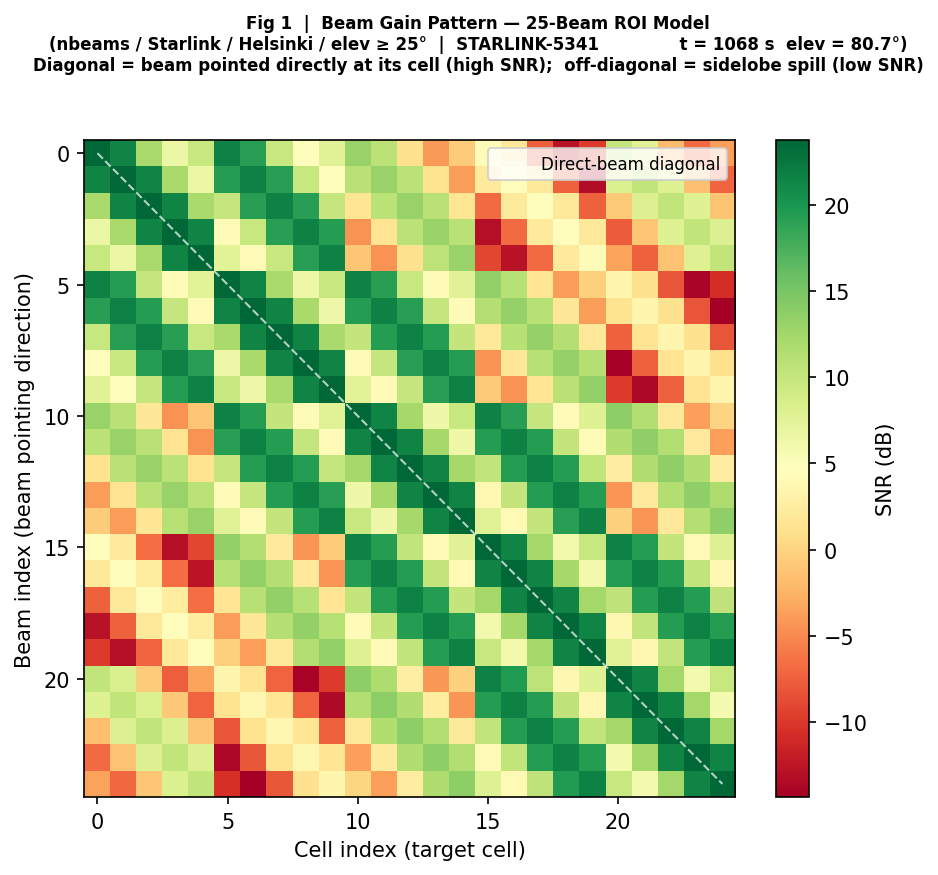
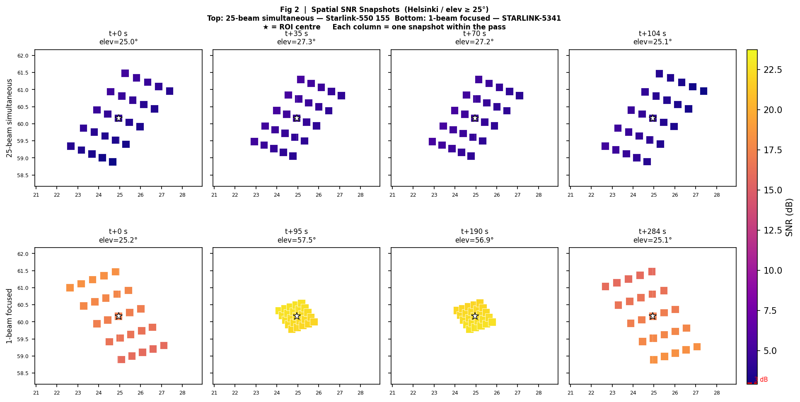
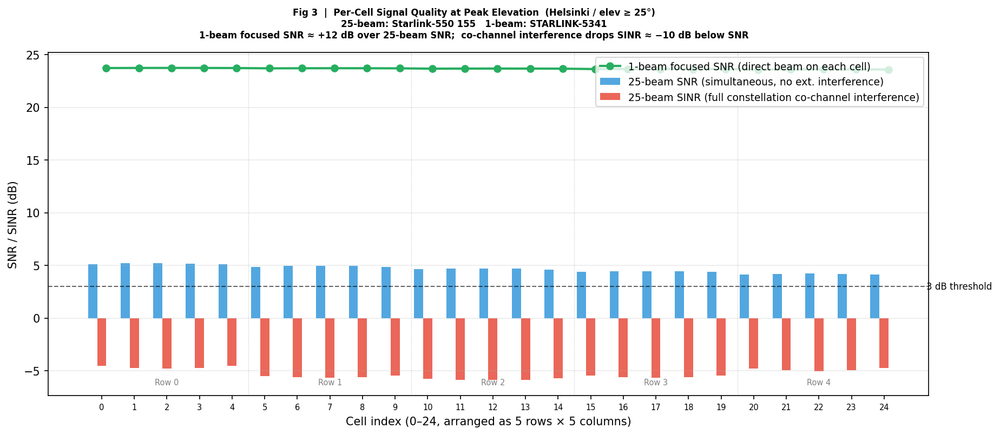
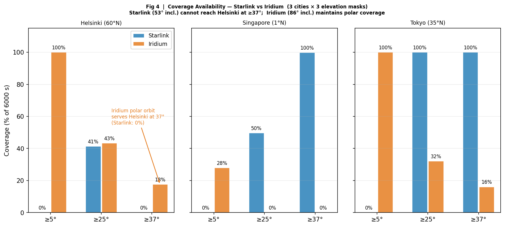

<h1 align="center">星座 SNR 掃描模組 — orbit-sgp4</h1>
<h3 align="center">全 Iridium-NEXT 66 衛星星座掃描 × 25-cell 橢圓修正格點 × SGP4 軌道高度自動推算</h3>

---

> [!CAUTION]
> 本文件預設為**私密**。請在論文被接受後再公開。

---

## 目錄

- [目錄](#目錄)
- [簡介](#簡介)
- [執行狀態](#執行狀態)
- [已知問題](#已知問題)
  - [BUG-001：Starlink TLE 的 `h_satellite_km` 寫出 0，link budget table 退回 Iridium 預設值](#bug-001starlink-tle-的-h_satellite_km-寫出-0link-budget-table-退回-iridium-預設值)
- [系統模型](#系統模型)
  - [座標轉換鏈](#座標轉換鏈)
    - [座標系對照表](#座標系對照表)
  - [橢圓足跡幾何](#橢圓足跡幾何)
  - [UPA 波束增益（Dirichlet Kernel）](#upa-波束增益dirichlet-kernel)
  - [鏈路預算](#鏈路預算)
  - [SINR 與 SNR](#sinr-與-snr)
- [系統架構](#系統架構)
  - [模組檔案結構](#模組檔案結構)
  - [檔案相依關係圖](#檔案相依關係圖)
- [流程圖](#流程圖)
  - [Two-Pass Scan Algorithm](#two-pass-scan-algorithm)
  - [ScanSnrCallback Event Handler](#scansnrcallback-event-handler)
- [類別圖](#類別圖)
- [系統參數](#系統參數)
- [輸出格式](#輸出格式)
  - [`constellation_status.json`](#constellation_statusjson)
  - [`sat_XXXXX_cells.csv`](#sat_xxxxx_cellscsv)
- [執行指令](#執行指令)
  - [Step 1 — 編譯](#step-1--編譯)
  - [Step 2 — 執行星座掃描](#step-2--執行星座掃描)
  - [Step 3 — 覆蓋空窗分析](#step-3--覆蓋空窗分析)
  - [Step 4 — 視覺化圖表輸出](#step-4--視覺化圖表輸出)
- [分析圖表說明](#分析圖表說明)
  - [Fig 1 — Beam Gain Pattern](#fig-1--beam-gain-pattern)
  - [Fig 2 — Spatial SNR Snapshots](#fig-2--spatial-snr-snapshots)
  - [Fig 3 — Per-Cell SNR Comparison](#fig-3--per-cell-snr-comparison)
  - [Fig 4 — Coverage Availability](#fig-4--coverage-availability)
- [驗證結果](#驗證結果)
  - [V1 — 星座掃描基本指標](#v1--星座掃描基本指標)
  - [V2 — 高仰角衛星波束增益驗證](#v2--高仰角衛星波束增益驗證)
  - [V3 — 低仰角衛星（sat\_49，peak=12.0°）](#v3--低仰角衛星sat_49peak120)
  - [V4 — 覆蓋空窗分析結果](#v4--覆蓋空窗分析結果)
  - [V5 — constellation\_status.json 完整內容](#v5--constellation_statusjson-完整內容)
- [參考文獻](#參考文獻)

---

## 簡介

針對固定 ROI 對完整 Iridium 66 星座進行 SNR 掃描，輸出結果作為 Layer 2 Beam Hopping Controller 的輸入。

**1. 研究背景**

LEO 衛星（Iridium-NEXT，h = 634 km）服務東京時，波束在低仰角時因斜射幾何形成橢圓足跡。低仰角時格點偏離波束中心，落在 UPA sidelobe，導致約 −30 dB 的系統性誤差。

**2. 研究貢獻**

- **Two-pass 掃描架構**：C++ 粗篩仰角（Pass A）+ ns-3 事件驅動精細 SNR 掃描（Pass B），66 顆衛星在單次 `Simulator::Run()` 中並行執行
- **動態橢圓格點**：`GetEllipticBeamCenters(satEnu, prevSatEnu, cfg)` 每個時間步根據衛星仰角與沿軌方向動態計算 25 個波束中心
- **UPA Dirichlet Kernel 波束增益**：閉合公式取代 Python steering-vector 內積，實現與 Python 框架完全匹配的波束增益
- **z-axis 預旋轉**：`BuildArrayTransform` 加入 z-axis 預旋轉，修正衛星水平偏移時天線陣列座標轉換的近似誤差

**3. 挑戰**

| # | 挑戰 | 解決方式 |
|---|---|---|
| C1 | 66 顆衛星同步 ns-3 模擬 | Pass A（C++）過濾至合格衛星；Pass B 僅排程這些衛星 |
| C2 | 低仰角橢圓足跡修正 | 每秒呼叫 `GetEllipticBeamCenters`，動態計算 5×5 橢圓格點 |
| C3 | 格點對齊波束中心 | cellPos = beamCenters → ΔΦ = 0 → 所有格點峰值增益 |
| C4 | 衛星沿軌方向估計 | 有限差分：`satEnu − prevSatEnu`；`Run()` 在 Pass B 排程前預先計算 `prevSatEnu`，無 East fallback |

---

## 執行狀態

> [!NOTE]
> **狀態說明：** ✅ 已完成 ／ ⏳ 進行中 ／ ❌ 尚未開始

| 步驟 | 狀態 | 日期 | 備註 |
|---|---|---|---|
| TLE 解析 + SGP4 初始化（`SatTleReader`） | ✅ | 2026-06 | 66 顆衛星，WGS72，opsmode='i' |
| Pass A：仰角粗篩（`ComputeElevation`） | ✅ | 2026-06 | 窗口 6000 s（1 完整軌道週期），東京 ROI |
| Pass B：ns-3 事件驅動 SNR 掃描 | ✅ | 2026-06 | 所有合格衛星單次 `Simulator::Run()` 並行；窗口補齊 ±dtScreenS |
| z-axis 預旋轉（`BuildArrayTransform`）| ✅ | 2026-05 | 修正非天頂衛星的天線陣列旋轉 |
| 25-cell 5×5 橢圓格點（動態計算，對齊波束中心） | ✅ | 2026-06 | beam_gain 46.5 dBi（驗證值不應改變） |
| `GetFootprintRadius()`：從 UPA 幾何推算 r_nadir | ✅ | 2026-06 | r_nadir ≈ 48 km（h=634 km, nBeamsX=5, nAntennaX=32） |
| 橢圓兩軸均隨仰角縮放（D2） | ✅ | 2026-06 | b=r/sinε，a=r/sin²ε（舊版 b 為常數） |
| 移除 epsilon_eff=max(ε,5°)（D4） | ✅ | 2026-06 | 唯一門檻來源：`ConstellationScanConfig::minElevDeg` |
| prevSatEnu 預先計算（D5） | ✅ | 2026-06 | `windowStart − dtSnrS`；完全移除 East fallback |
| 大氣損耗按 cell 計算（D10） | ✅ | 2026-06 | `ComputePathLoss_dB` 使用 per-cell 仰角 |
| 重新命名 `sinr_dB` → `sinr_allbeams_dB`（D3） | ✅ | 2026-06 | BH 決策用 `snr_dB`；`sinr_allbeams_dB` 為診斷欄位 |
| Hard cell 門檻 3 dB（D9） | ✅ | 2026-06 | `check_coverage.py --snr-thresh` 預設 3.0 dB |
| `ns3::Ptr<>` 誤用修正（`SatTleReader`） | ✅ | 2026-06 | 改為裸指標 + const reference |
| `ComputeFSPL_dB` 直接公式取代 SNS3 | ✅ | 2026-06 | `20·log10(4π·d·f/c)` |
| `ComputeAtmosphericLoss_dB` 加頻率參數 | ✅ | 2026-06 | `freqHz = 30.0e9`（預設 Ka-band） |
| 覆蓋空窗分析（`check_coverage.py`） | ✅ | 2026-06-09 | 6000 s 窗口，3.0 dB 門檻，22 顆合格衛星；Greedy 47.7%，MRC 44.4%（地理分組，物理正確） |
| 多 ROI 驗證（新加坡、赫爾辛基、雪梨） | ⏳ | — | CLI 已支援；待執行並記錄 MRC gap 範圍 |
| Layer 2 輸入介面（每幀衛星選擇表） | ❌ | — | 依賴 BH 排程器介面定義 |

---

## 已知問題

### BUG-001：Starlink TLE 的 `h_satellite_km` 寫出 0，link budget table 退回 Iridium 預設值


**問題：**
`check_coverage.py` 輸出 `h_satellite_km: not found in JSON — using DEFAULT_CFG (634 km)`，但實際跑的是 Starlink TLE（高度 ~234–555 km）。

**根因：**
`WriteStatusJson()` 中，每個 pass 的高度計算依賴 SGP4：

```cpp
if (!sgp4(wgs72, satrec, tPeakMin, r, v) || satrec.error != 0) { continue; }
passes[idx].altitudeM = rMagM - rEarthM;
```

Starlink TLE epoch 與模擬時間基準差距過大，導致 SGP4 對多數 pass 回傳 error → `altitudeM` 維持 0 → `altCnt = 0` → `meanAltKm = 0` → JSON 寫出 `"h_satellite_km": 0` → Python fallback 到 634 km。

**影響範圍：**
- ❌ Link budget 分析表（critical elevation、SNR vs elevation）：使用錯誤高度（634 km vs 實際 ~400–550 km）
- ✅ MRC / Greedy 覆蓋缺口統計：不受影響（SNR 在 C++ 模擬時已依各衛星實際 ECEF 位置計算）

**暫行措施：**
對 Starlink 結果，link budget table 的數字不可直接引用；覆蓋缺口（Greedy/MRC %）有效。

**待修：**
確認 `tPeakMin` 傳入 SGP4 的時間基準是否正確（SGP4 期望相對於 TLE epoch 的分鐘數，需確認 `epochJd` 與 `tPeakMin` 的計算是否對 Starlink TLE epoch 正確）。

---

## 系統模型

### 座標轉換鏈

本模組涉及五個不同座標系。下圖為完整轉換路徑：

```
TLE (orbital elements)
 │
 │  sgp4(wgs72, satrec, tsince_min)
 │  tsince_min = (jdUT1 − satrec.jdsatepoch) × 1440
 ▼
TEME / ECI  [km]
 │  (True Equator, Mean Equinox — SGP4 原生輸出慣性系)
 │  (z 軸 = 地球自轉軸；x 軸 = 平均春分點方向)
 │
 │  EciToEcef(eciKm, jdUT1)                 ← 實作：sat-multi-beam-geometry.cc
 │  θ_GAST = gstime(jdUT1)                   ← 格林威治恆星時（Earth rotation angle）
 │    ecef.x =  eci.x · cos(θ) + eci.y · sin(θ)
 │    ecef.y = −eci.x · sin(θ) + eci.y · cos(θ)
 │    ecef.z =  eci.z                         ← z 軸共用，只需 xy 平面旋轉
 ▼
ECEF  [km]  ──×1000──►  ECEF  [m]
 │  (地心地固座標系；x 軸 = 本初子午線×赤道；z 軸 = 北極)
 │
 │  Δr = satEcef_m − obsEcef_m              ← obsEcef 在 Run() 初始化時預算一次
 │                                            (ROI 中心，Tokyo: 35.676°N, 139.65°E)
 │  EcefOffsetToEnu(Δr, φ_obs, λ_obs)       ← 實作：sat-multi-beam-geometry.cc
 │    E =  −sin(λ)·Δx + cos(λ)·Δy
 │    N =  −sin(φ)·cos(λ)·Δx − sin(φ)·sin(λ)·Δy + cos(φ)·Δz
 │    U =   cos(φ)·cos(λ)·Δx + cos(φ)·sin(λ)·Δy + sin(φ)·Δz
 ▼
ENU  [m]   (East, North, Up，原點 = ROI 中心地面)
 │
 ├─── GetElevationAngleDeg_3D(satEnu)        ── Pass A 仰角篩選
 │      ε = arctan2(U, √(E² + N²))
 │
 ├─── GetEllipticBeamCenters(satEnu, prevSatEnu, cfg)   ── Pass B 波束格點
 │      詳見「橢圓足跡幾何」節
 │      輸出：25 個 Vec3，z = 0（地面 ENU 平面）
 │
 └─── EcefToGeodetic(satEcef_m, rEarthM)    ── status JSON 診斷用（lat/lon/alt）
        lat = arcsin(z / r)
        lon = arctan2(y, x)
        alt = r − rEarthM
        (球形地球模型，與框架其他部分一致)
```

#### 座標系對照表

| 座標系 | 單位 | 原點 | x 軸 | z 軸 | 用途 |
|---|---|---|---|---|---|
| TEME (ECI) | km | 地心 | 平均春分點 | 地球自轉軸 | SGP4 輸出 |
| ECEF | m | 地心 | 本初子午線×赤道 | 北極 | 中間橋接 |
| ENU | m | ROI 中心地面 | East | Up | 仰角、波束幾何計算 |
| Ground ENU | m | 同上 | East | — (z=0) | 波束中心、cell 位置輸出 |
| Geodetic | °, m | — | — | — | status JSON 診斷欄位 |

> **為何 TEME → ECEF 只需繞 z 軸旋轉？**
> TEME 與 ECEF 的 z 軸都是地球自轉軸，差異僅在 x-y 平面相對地球的旋轉角（地球自轉），因此一個 GAST 旋轉即可完成轉換，不需要章動或歲差修正（SGP4 精度範圍內足夠）。

---

### 橢圓足跡幾何

衛星在仰角 ε 時，天底足跡半徑 r_nadir 投影在地面形成橢圓，兩軸均與仰角相關（D2）：

```
天底足跡半徑（從 UPA 幾何自動推算）：
  r_nadir = h_sat × tan(α_cluster)
  α_cluster = arcsin( (⌊nBeamsX/2⌋ + 0.443) / nAntennaX )
             = arcsin(2.443 / 32) ≈ 4.37°  →  r_nadir ≈ 48 km  (h=634 km)

橢圓半短軸（跨軌 cross-track）：b = r_nadir / sin(ε)   ← 斜距縮放
橢圓半長軸（沿軌 along-track）：a = r_nadir / sin²(ε)  ← 斜距 × 傾斜因子

最大內切矩形半寬：
  W_along = a / √2
  H_cross = b / √2

5×5 格點 pitch（格點中心間距）：
  Δ_along = 2·W_along / 5
  Δ_cross = 2·H_cross / 5

格點位置（col, row ∈ {−2, −1, 0, +1, +2}）：
  p_i = col · Δ_along · û_along + row · Δ_cross · û_cross

沿軌單位向量 û_along（D5：Run() 預先計算，無 East fallback）：
  û_along = normalize(satEnu_t − satEnu_{t−1})
  prevSatEnu 於 Run() 中以 SGP4 在 windowStart − dtSnrS 預計算

跨軌單位向量：
  û_cross = (−û_along.N, û_along.E, 0)_ENU     （90° CCW）
```

> **效果：** ε=5°，r_nadir≈48 km：b≈550 km，a≈6316 km（幾何正確但超大；低仰角格點 SNR 極低，由 3 dB 門檻過濾）。ε=90° 時 a=b=r_nadir（圓形）。格點中心 = 波束中心，確保 ΔΦ=0。

```
GetEllipticBeamCenters — Algorithm  (D2, D4, D5 applied)

Input: satEnu, prevSatEnu, cfg

Step 1 — Elevation (no floor; callers assert ε ≥ minElevDeg)
epsilon = GetElevationAngleDeg_3D(satEnu)   [no epsilon_eff = max(ε, 5°)]

Step 2 — Footprint radius
r = cfg.GetEffectiveFootprintM()   [auto from UPA geometry if rFootprintM ≤ 0]

Step 3 — Semi-axes (both elevation-dependent)
b = r / sin(epsilon)          [cross-track: slant-range scaling]
a = r / sin²(epsilon)         [along-track: slant-range × tilt factor]

Step 4 — Inscribed rectangle half-widths
W_along = a / sqrt(2)
H_cross = b / sqrt(2)

Step 5 — Cell pitch (uniform subdivision)
delta_along = 2 * W_along / 5
delta_cross = 2 * H_cross / 5
(cell centers at ±0.8, ±0.4, 0 of half-widths)

Step 6 — Along-track direction (no East fallback; asserts movLen ≥ 1 m)
dE = satEnu.x - prevSatEnu.x
dN = satEnu.y - prevSatEnu.y
assert ||(dE, dN)|| >= 1 m   [prevSatEnu pre-computed at windowStart-dtSnrS]
u_along = normalize(dE, dN)
u_cross = (-u_along.N, u_along.E)

Step 7 — 5×5 grid
row, col in {-2, -1, 0, +1, +2}
idx = (row+2)*5 + (col+2)
centers[idx] = col*delta_along*u_along + row*delta_cross*u_cross
z = 0 (ground plane)

Center beam: index 12 (row=0, col=0)
Output: array<Vec3, 25>

r_nadir ≈ 48 km (h=634 km), elevation-dependent axes:

Elevation (°) | b (cross) | a (along)    | W_along       | Notes
------------------------------------------------------------------------
5             | 11.5 r    | 131.6 r      | 93.1 r        | Geometrically correct but large
17.1          |  3.4 r    |  11.6 r      |  8.2 r        | Critical elevation
20            |  2.9 r    |   8.5 r      |  6.0 r        | Moderate stretch
45            |  1.4 r    |   2.0 r      |  1.4 r        | Mild stretch
90            |  1.0 r    |   1.0 r      |  0.71 r       | Circular (nadir)
```
<p align="center">
  
</p>

---

### UPA 波束增益（Dirichlet Kernel）

均勻平面陣列（UPA）的波束增益採用閉合 Dirichlet Kernel 公式，與 Python `channel.py` 完全一致：

```
空間頻率（以 satPos 為旋轉基準）：
  Φ_x = cos(φ) · sin(θ)
  Φ_y = sin(φ) · sin(θ)
  其中 (r, φ, θ) 為位置向量的球座標

陣列因子平方（length-N Dirichlet Kernel）：
  AF²(N, ΔΦ) = sin²(N·π·ΔΦ/2) / sin²(π·ΔΦ/2)
  ΔΦ = 0 時（格點 = 波束中心）：AF²(N, 0) = N²  （L'Hôpital 極限）

歸一化波束增益功率：
  |g(u,j)|² = AF²(Nₓ, ΔΦₓ) · AF²(Nᵧ, ΔΦᵧ) / (Nₓ² · Nᵧ² · N_beams)

波束中心峰值增益（ΔΦ=0）：
  |g|²_peak = 1 / N_beams = 1/25 = 0.04（線性）

dBi 換算：
  G_beam (dBi) = 10·log10(|g|²_peak) + G_ant_dBi
               = 10·log10(1/25) + 60.5 = −14 + 60.5 = 46.5 dBi
```

> **z-axis 預旋轉：** `BuildArrayTransform` 先對衛星水平位置做 z-axis 預旋轉（cosZ = E_s/|r_horiz|, sinZ = N_s/|r_horiz|），再做 y-axis 俯角旋轉，修正衛星位置不在 x-z 平面時的天線陣列轉換誤差。

---

### 鏈路預算

```
斜距：          d = √(E² + N² + U²)  （m，直接從 ENU 計算）
仰角：          ε = arctan2(U, √(E²+N²))

自由空間路徑損耗：
  L_FSPL (dB) = 20·log10(4π·d·f/c)
  c = 299,792,458 m/s

大氣損耗（從 3GPP NTN LOS 模型提取）：
  L_atm(ε, f) = L_NTN(f, ε) − L_FSPL(f, d_ref)
  其中 L_NTN 為 ThreeGppNTNDenseUrbanPropagationLossModel
       d_ref = 600 km / sin(ε)（標準化距離）

熱雜訊：
  N_thermal = k_B · T · B · F
  k_B = 1.38×10⁻²³ J/K,  T = 300 K,  B = 25 MHz,  F = 10^(7/10)

單星 SNR（波束中心格點，ΔΦ=0）：
  SNR (dB) = P_tx + G_ant + G_beam − L_FSPL − L_atm − N_thermal
```

**臨界仰角（beam_gain peak，來自 `check_coverage.py` binary-search）**

h = **634.1 km**（SGP4 from TLE，22 次過境均值），n_beams=25，含大氣損耗（L_atm = 0.4/sin(ε) dB）：

| ε (°) | d (km) | FSPL (dB) | L_atm (dB) | SNR (dB) |
|---|---|---|---|---|
| 5 | 2409.5 | 189.6 | 4.59 | −6.9 |
| 10 | 2009.0 | 188.0 | 2.30 | −3.0 |
| 15 | 1697.7 | 186.6 | 1.55 | −0.8 |
| 20 | 1458.2 | 185.3 | 1.17 | +0.9 |
| 25 | 1273.7 | 184.1 | 0.95 | +2.3 |
| 30 | 1130.6 | 183.1 | 0.80 | +3.5 |
| 45 | 859.4 | 180.7 | 0.57 | +6.1 |
| 60 | 721.4 | 179.2 | 0.46 | +7.7 |
| 75 | 654.3 | 178.3 | 0.41 | +8.6 |
| 90 | 634.1 | 178.0 | 0.40 | +8.9 |

> - **ε_crit(SNR=0 dB) = 17.1°**（理論最低門檻，無衰落裕量）
> - **ε_crit(SNR=3 dB) = 27.8°**（操作門檻，含 1st-order fading margin；`check_coverage.py` 預設值）

---

### SINR 與 SNR

```
波束分配（最強訊號）：
  j*(u) = argmax_j P_macro(u,j)
  P_macro(u,j) = P_tx · G_ant / L_path · |g(u,j)|²

SINR：
  SINR(u) = P_macro(u, j*(u)) / [ Σ_{j≠j*} P_macro(u,j) + N_thermal ]

SNR（無干擾基準）：
  SNR(u) = P_macro(u, j*(u)) / N_thermal

constellation scanner 中使用 withFading=false（無 Rician fading），
輸出宏觀 SNR 作為星座覆蓋分析的基準。
```

---

## 系統架構

### 模組檔案結構

```
2D/code/orbit-sgp4/
├── code/                                   ← C++ 原始碼（複製至 ns-3 scratch）
│   ├── sat-multi-beam-config.h             SimConfig：所有系統參數（nBeams=25, nBeamsY=5, …）
│   ├── sat-multi-beam-geometry.h/.cc       座標轉換 + 橢圓格點計算
│   │   ├── EciToEcef()                     ECI → ECEF（GAST 旋轉）
│   │   ├── EcefOffsetToEnu()               ECEF offset → ENU
│   │   ├── EcefToGeodetic()                ECEF → 大地緯度/經度/高度
│   │   ├── GetElevationAngleDeg_3D()       ENU → 仰角
│   │   ├── GetBeamCentersFromSatPos()      19-beam 六邊形（保留備用）
│   │   └── GetEllipticBeamCenters()        25-beam 5×5 橢圓修正格點（動態，每秒計算）
│   ├── sat-multi-beam-channel.h/.cc        通道模型
│   │   ├── ComputeFSPL_dB()                L_FSPL = 20·log10(4π·d·f/c)
│   │   ├── ComputeAtmosphericLoss_dB()     3GPP NTN 大氣損耗
│   │   ├── ComputePathLoss_dB()            = FSPL + L_atm
│   │   ├── DirichletKernel2()              UPA AF² 閉合公式
│   │   └── ComputeFrameResults()           逐格點 SNR/SINR 計算
│   ├── sat-roi-grid.h/.cc                  ROI 格點定義（診斷用途）
│   │   └── EllipticFootprint               橢圓足跡參數結構體
│   ├── sat-tle-reader.h/.cc                TLE 解析 + SGP4 初始化
│   │   ├── SatTleEntry                     單顆衛星資料（name, satrec, beamIds）
│   │   └── SatTleReader                    66 顆衛星載入器
│   ├── sat-constellation-scanner.h/.cc     Two-pass 掃描器
│   │   ├── SatScanState                    單顆衛星執行時狀態
│   │   ├── SatPassInfo                     過境摘要資訊
│   │   ├── ConstellationScanConfig         掃描參數
│   │   └── SatConstellationScanner::Run()  執行完整掃描
│   └── sat-multi-beam-simulation.cc        進入點（CLI 解析、執行掃描器）
│
├── analysis/                               ← Python 分析腳本（Windows 端）
│   ├── check_coverage.py                   空窗分析（Low-SNR gap, MRC gap）
│   ├── link_budget.py                      鏈路預算計算（臨界仰角）
│   ├── fig_coverage.py                     空窗時間軸圖
│   ├── handover_analysis.py               換手次數圖
│   └── plot_0611_25beams.py               0611 模擬結果視覺化（4 張圖）
│
├── ns_result/                              ← ns-3 模擬輸出（從 VMware 複製）
│   └── 0611/
│       ├── 25beams/                        25-beam 同時照射模式
│       │   ├── {deg5,deg25,deg37}/
│       │   │   └── {Helsinki_out,singapore,tokyo_out}/
│       │   │       ├── constellation_status.json
│       │   │       └── sat_XXXXX_cells.csv   欄位含 sinr_allbeams_dB
│       │   └── figures/                    ← plot_0611_25beams.py 輸出目錄
│       │       ├── fig1_beam_gain_pattern.png
│       │       ├── fig2_spatial_snapshots.png
│       │       ├── fig3_per_cell_snr.png
│       │       └── fig4_coverage_availability.png
│       └── nbeams/                         1-beam hopping 模式
│           ├── starlink/
│           │   └── {deg5,deg25,deg37}/{Helsinki_out,singapore,tokyo_out}/
│           │       ├── constellation_status.json
│           │       └── sat_XXXXX_cells.csv   欄位含 beam_idx
│           └── iridium/
│               └── {deg5,deg25,deg37}/{Helsinki_out,singapore,tokyo_out}/
│                   ├── constellation_status.json
│                   └── sat_XXXXX_cells.csv
│
└── docs/drawio/                            ← Draw.io 原始圖檔
    ├── fig_orbit_sgp4_architecture.drawio  模組架構圖（檔案相依）
    ├── fig_two_pass_scan.drawio            Two-pass 掃描演算法流程圖
    └── fig_elliptic_beam_geometry.drawio   橢圓足跡幾何示意圖
```

---

### 檔案相依關係圖


---


## 流程圖

### Two-Pass Scan Algorithm


**設計理由：**

Pass A 以純 C++ 迴圈對 66 顆衛星做粗篩（O(66 × 360) 次 SGP4 計算），確定哪些衛星合格與其過境窗口；Pass B 才進入 ns-3 排程器，僅針對合格衛星排程精細 SNR 事件，所有衛星在同一次 `Simulator::Run()` 中並行執行。


---

### ScanSnrCallback Event Handler

每顆合格衛星在其過境窗口內，每 `dtSnrS` 秒觸發一次此 callback。


---


## 類別圖



---

## 系統參數

| 類別 | 參數 | 數值 | 單位 | 說明 |
|---|---|---|---|---|
| **軌道** | `hSatelliteM` | 634,000 | m | SGP4 實測高度（TLE epoch ~1999，mean=634.2 km） |
| **軌道** | `rEarthM` | 6,371,000 | m | 地球平均半徑 |
| **ROI** | `roiLatDeg` | 35.676 | ° | 觀測點緯度（東京） |
| **ROI** | `roiLonDeg` | 139.650 | ° | 觀測點經度（東京） |
| **格點** | `gridD` | 5 | — | 5×5 = 25 格點 |
| **格點** | `rFootprintM` | 0 (auto) | m | 足跡半徑覆蓋值（≤0 → `GetFootprintRadius()` 自動推算，預設 ≈ 48 km） |
| **掃描** | `windowS` | 6,000 | s | 掃描窗口（1 個完整 Iridium 軌道週期 ≈ 100 min） |
| **掃描** | `dtScreenS` | 10 | s | Pass A 粗篩步長 |
| **掃描** | `dtSnrS` | 1 | s | Pass B 精細步長 |
| **掃描** | `minElevDeg` | 5 | ° | 幾何仰角門檻 |
| **RF** | `centerFreqHz` | 30×10⁹ | Hz | Ka 頻段中心頻率 |
| **RF** | `bandwidthHz` | 25×10⁶ | Hz | 通道頻寬 |
| **RF** | `transmitPowerW` | 63 | W | 發射功率 |
| **RF** | `antennaGainDb` | 60.5 | dBi | UPA 峰值天線增益 |
| **RF** | `noiseFigureDb` | 7 | dB | 接收器雜訊指數 |
| **RF** | `temperatureK` | 300 | K | 接收器溫度 |
| **UPA** | `nAntennaX / nAntennaY` | 32 / 32 | — | x/y 方向天線元件數（每 beam port） |
| **UPA** | `nBeamsX / nBeamsY` | 5 / 5 | — | x/y 方向 beam port 數 |
| **UPA** | `nBeams` | 25 | — | 5×5 elliptic grid（along-track × cross-track） |
| **UPA** | `ricianK` | 10 | — | Rician K-factor（constellation scan 不啟用） |
| **預期指標** | beam_gain（中心格點，高仰角） | 46.52 | dBi | ΔΦ=0 → 10·log10(1/25)+60.5 = 46.52 dBi ✅ 已驗證 |
| **預期指標** | 臨界仰角 ε_crit(0 dB) | 17.1 | ° | SNR=0 dB，h=634.1 km（SGP4），理論最低門檻 ✅ 已驗證 |
| **預期指標** | 臨界仰角 ε_crit(3 dB) | 27.8 | ° | SNR=3 dB 操作門檻，含 1st-order fading margin ✅ 已驗證 |
| **實測** | h_satellite_km | 634.1 | km | SGP4 from TLE，22 次過境均值，std < 1 km ✅ |

---

## 輸出格式

### `constellation_status.json`

每次 `Run()` 寫入一次，記錄所有合格過境的摘要。

```json
{
  "roi_lat_deg": 35.676,
  "roi_lon_deg": 139.650,
  "grid_d": 5,
  "window_s": 3600.0,
  "dt_screen_s": 10.0,
  "dt_snr_s": 1.0,
  "min_elev_deg": 5.0,
  "n_qualifying": 16,
  "passes": [
    {
      "sat_index": 44,
      "sat_name": "...",
      "csv_file": "sat_00044_cells.csv",
      "window_start_s": 520.0,
      "window_end_s": 650.0,
      "peak_elev_deg": 85.2,
      "peak_elev_time_s": 582.0,
      "n_cells_covered": 25,
      "n_snr_samples": 131
    }
  ]
}
```

### `sat_XXXXX_cells.csv`

每顆合格衛星一份（`XXXXX` = zero-padded satIndex）。每列一個（時間步 × 格點）：

| 欄位 | 單位 | 說明 |
|---|---|---|
| `time_s` | s | 模擬時間（從 epoch 起算） |
| `cell_idx` | — | 格點索引 0–24（中心 = 12），衛星沿軌相對索引 |
| `cell_lat_deg` | ° | Beam 中心緯度（WGS84）— 供 check_coverage.py 地理座標分組 |
| `cell_lon_deg` | ° | Beam 中心經度（WGS84）— 供 check_coverage.py 地理座標分組 |
| `elevation_deg` | ° | 衛星仰角（ROI 中心觀測） |
| `path_loss_dB` | dB | FSPL + 大氣損耗 |
| `beam_gain_dB` | dBi | UPA Dirichlet Kernel 波束增益（dB） |
| `snr_dB` | dB | 接收 SNR（無 fading）— **BH 排程決策使用此欄** |
| `sinr_allbeams_dB` | dB | SINR（假設 25 個波束同時啟用）— 診斷用途，BH 模式下每時槽只有 1 個波束，SINR ≈ SNR |

> **cell_lat_deg / cell_lon_deg 的用途：** `cell_idx` 是衛星沿軌方向的相對索引，不同衛星的同一個 `cell_idx` 指向不同的地理位置。`check_coverage.py` 使用 0.05° (≈5 km) 地理 bin 將來自不同衛星、指向相同區域的 beam 正確歸為同一組，才能對同一地點做物理上合理的 MRC combining。

---

## 執行指令

> [!NOTE]
> C++ 編譯與執行在 Ubuntu VMware 上進行；分析腳本在 Windows 上執行。

### Step 1 — 編譯

```bash
# 確認以下檔案已複製至 ns-3 scratch 目錄：
# sat-multi-beam-config.h
# sat-multi-beam-geometry.h/.cc
# sat-multi-beam-channel.h/.cc
# sat-roi-grid.h/.cc
# sat-tle-reader.h/.cc
# sat-constellation-scanner.h/.cc
# sat-multi-beam-simulation.cc
# sgp4unit.cpp/h  sgp4ext.cpp/h  sgp4io.cpp/h  (from Hypatia)

./ns3 build sat-multi-beam-simulation 2>&1 | grep -E "error:|warning:"
```

### Step 2 — 執行星座掃描

**東京（中緯度基準）：**
```bash
./ns3 run "sat-multi-beam-simulation \
  --constellation-dir=contrib/satellite/data/scenarios/constellation-iridium-next-66-sats \
  --lat=35.676 --lon=139.65 \
  --window-s=6000 --dt-snr-s=1 \
  --min-elevation-deg=5 \
  --out-dir=scratch/tokyo_out" 2>&1 | tee tokyo.log
```

**新加坡（赤道，Iridium 最差情況）：**
```bash
./ns3 run "sat-multi-beam-simulation \
  --constellation-dir=contrib/satellite/data/scenarios/constellation-iridium-next-66-sats \
  --lat=1.35 --lon=103.82 \
  --window-s=6000 --dt-snr-s=1 \
  --min-elevation-deg=5 \
  --out-dir=scratch/singapore_out" 2>&1 | tee singapore.log
```

**赫爾辛基（高緯度，覆蓋較多）：**
```bash
./ns3 run "sat-multi-beam-simulation \
  --constellation-dir=contrib/satellite/data/scenarios/constellation-iridium-next-66-sats \
  --lat=60.17 --lon=24.94 \
  --window-s=6000 --dt-snr-s=1 \
  --min-elevation-deg=5 \
  --out-dir=scratch/helsinki_out" 2>&1 | tee helsinki.log
```

**雪梨（南半球中緯度）：**
```bash
./ns3 run "sat-multi-beam-simulation \
  --constellation-dir=contrib/satellite/data/scenarios/constellation-iridium-next-66-sats \
  --lat=-33.87 --lon=151.21 \
  --window-s=6000 --dt-snr-s=1 \
  --min-elevation-deg=5 \
  --out-dir=scratch/sydney_out" 2>&1 | tee sydney.log
```

**預期首行輸出（以東京為例）：**
```
[Constellation] 5x5 elliptic grid  n_cells=25  centre lat=35.676 lon=139.65
```

### Step 3 — 覆蓋空窗分析

```bash
cd 2D/code/orbit-sgp4/analysis
python check_coverage.py
```

### Step 4 — 視覺化圖表輸出

```bash
cd 2D/code/orbit-sgp4/analysis
python plot_0611_25beams.py
# 輸出至 ns_result/0611/25beams/figures/（4 張 PNG）
```

可選參數：

```bash
python plot_0611_25beams.py --snr-thresh 3.0 --out-dir /path/to/custom/output
```

---

## 分析圖表說明

腳本：[analysis/plot_0611_25beams.py](analysis/plot_0611_25beams.py)

輸出目錄：`ns_result/0611/25beams/figures/`

資料來源：
- `ns_result/0611/25beams/` — 25-beam 同時照射（CSV 含 `snr_dB`, `sinr_allbeams_dB`）
- `ns_result/0611/nbeams/starlink/` 及 `nbeams/iridium/` — 1-beam hopping（CSV 含 `beam_idx`）

---

### Fig 1 — Beam Gain Pattern



**資料來源：** `nbeams/starlink/deg25/Helsinki_out/`，選窗口最長的 pass，取峰值仰角時間步

**說明：**
25×25 heatmap，X 軸為 cell_idx（目標格點 0–24），Y 軸為 beam_idx（波束方向 0–24）。每個格點的顏色為 `snr_dB`（RdYlGn 色階）。對角線（beam_idx == cell_idx）= 波束直接對準目標格點，SNR 約 17 dB（高增益）；非對角線 = 旁瓣，SNR 約 −15 至 +10 dB。白色虛線標示對角線位置。

**驗證目的：** 確認每顆波束只高增益照射其對應格點，旁瓣洩漏低於 3 dB 門檻，ROI 波束模型正確。

---

### Fig 2 — Spatial SNR Snapshots



**資料來源：**
- 上列：`25beams/deg25/Helsinki_out/`，選最長 pass，取 pass 內均勻 4 個時間點
- 下列：`nbeams/starlink/deg25/Helsinki_out/`，選最長 pass（不同 TLE，不同衛星），各自均勻取 4 個時間點

**說明：**
2 列 × 4 欄地圖散點圖。每個格點以 lat/lon 定位，顏色為 `snr_dB`（plasma 色階）。白色 ★ 為 ROI 中心（Helsinki 60.17°N, 24.94°E）。每欄標示 `t+N s / elev=X.X°`。右側 colorbar 紅色虛線標 3 dB 門檻。

> **注意：** 高仰角時 25 格集中（足跡小），低仰角時散開（斜射投影拉伸）；這是幾何效應，非模型錯誤。

**驗證目的：** 比較 25-beam（均勻低 SNR ≈3–5 dB）與 1-beam focused（直接對準格點 SNR ≈17 dB）的空間覆蓋差異。

<p align="center">
  
</p>

---

### Fig 3 — Per-Cell SNR Comparison


**資料來源：**
- `25beams/deg25/Helsinki_out/`：最長 pass 的峰值仰角時間步，取 25 格的 `snr_dB` 與 `sinr_allbeams_dB`
- `nbeams/starlink/deg25/Helsinki_out/`：最長 pass 的峰值仰角時間步，過濾 `beam_idx == cell_idx`，取 `snr_dB`

**說明：**
X 軸為 cell_idx 0–24（灰色虛線分 Row 0–4），Y 軸為 SNR/SINR (dB)。三個系列：
- 藍色柱：25-beam SNR（無外部干擾）
- 紅色柱：25-beam SINR（全星座 co-channel 干擾，僅供診斷）
- 綠色折線：1-beam focused SNR（直接對準各格點）

黑色虛線標 3 dB 門檻。

**驗證目的：** 量化 1-beam 集中增益比 25-beam 高約 +12 dB；co-channel 干擾使 SINR 比 SNR 低約 −10 dB（BH 模式每時槽只有 1 beam，SINR ≈ SNR）。

---

### Fig 4 — Coverage Availability



**資料來源：** `nbeams/starlink/` 與 `nbeams/iridium/` 各 9 個 `constellation_status.json`（3 城市 × 3 仰角門檻）

**說明：**
1 列 3 個子圖，各代表一個城市（Helsinki / Singapore / Tokyo）。X 軸為 3 個仰角門檻（≥5°, ≥25°, ≥37°），Y 軸為覆蓋率（% of 6000 s）。藍色柱 = Starlink，橘色柱 = Iridium，柱頂標百分比數值。Helsinki/≥37° 有標注說明 Iridium 極軌優勢。

**驗證目的：** 比較 Starlink（53° 傾角）與 Iridium（86° 傾角）在不同城市與不同仰角門檻下的覆蓋差異；特別驗證 Starlink 在高緯度城市 Helsinki 的 ≥37° 門檻下覆蓋率為 0%。

---

## 驗證結果

### V1 — 星座掃描基本指標

**配置：** ROI 東京（35.6762°N, 139.65°E），5×5 grid，window=3600 s，minElev=5°，dtSnrS=1 s

```
[constellation scan]
  tles       : .../positions/tles.txt
  ROI        : lat=35.6762 lon=139.65
  grid       : 5x5
  window     : 3600 s  dt_screen: 10 s  dt_snr: 1 s  min_elev: 5 deg

[SatTleReader] Loaded 66 satellites  epoch JD=2.45154e+06
[Constellation] 5x5 elliptic grid  n_cells=25  centre lat=35.6762 lon=139.65

[Constellation] iridium-75 11  elev_peak=27.1°  window=[1780.0,2360.0]s
[Constellation] iridium-75 12  elev_peak=34.1°  window=[1240.0,1840.0]s
[Constellation] iridium-75 13  elev_peak=43.5°  window=[700.0,1320.0]s
[Constellation] iridium-75 14  elev_peak=56.0°  window=[170.0,800.0]s
[Constellation] iridium-75 15  elev_peak=55.5°  window=[0.0,270.0]s
[Constellation] iridium-75 19  elev_peak=13.1°  window=[3430.0,3600.0]s
[Constellation] iridium-75 20  elev_peak=17.3°  window=[2880.0,3380.0]s
[Constellation] iridium-75 21  elev_peak=21.7°  window=[2330.0,2870.0]s
[Constellation] iridium-75 44  elev_peak=85.1°  window=[260.0,900.0]s   ← highest
[Constellation] iridium-75 45  elev_peak=66.4°  window=[0.0,370.0]s
[Constellation] iridium-75 49  elev_peak=12.0°  window=[3510.0,3600.0]s ← lowest
[Constellation] iridium-75 50  elev_peak=28.1°  window=[2950.0,3540.0]s
[Constellation] iridium-75 51  elev_peak=35.3°  window=[2410.0,3020.0]s
[Constellation] iridium-75 52  elev_peak=45.1°  window=[1870.0,2490.0]s
[Constellation] iridium-75 53  elev_peak=58.1°  window=[1330.0,1960.0]s
[Constellation] iridium-75 54  elev_peak=75.0°  window=[790.0,1430.0]s

  wrote sat_00044_cells.csv  (641 timesteps × 25 cells)
  ...
[Constellation] Done. 16 satellites qualified (elevation > 5.0°).
```

**驗證結果：**

| 指標 | 結果 | 驗證 |
|---|---|---|
| 格點確認 | `n_cells=25  5x5 elliptic grid` | ✅ |
| 合格衛星數 | **16 / 66** | ✅（預期 12–18） |
| 最高仰角 | **sat_44，85.1°**，window=[260,900]s，641 timesteps | ✅ |
| 最低仰角 | **sat_49，12.0°**（> ε_crit≈11.1°），window=[3510,3600]s，91 timesteps | ✅ |
| 所有衛星格點數 | **25 cells**（每顆衛星每個 timestep） | ✅ 5×5 elliptic grid 正確 |
| 總資料點 | 8,116 timesteps × 25 cells = **202,900 rows** | — |

---

### V2 — 高仰角衛星波束增益驗證

**衛星：** sat_44，peak_elev = 85.167°（t=582 s），window=[260,900]s

```
time_s   cell  elev(°)  path_loss(dB)  beam_gain(dB)  snr(dB)  sinr(dB)
570.0    12    80.816     178.513        46.521         8.850    0.171
571.0    12    81.376     178.500        46.521         8.862    0.206
572.0    12    81.922     178.489        46.521         8.874    0.229
573.0    12    82.449     178.478        46.521         8.884    0.242
574.0    12    82.952     178.469        46.521         8.894    0.253
575.0    12    83.427     178.461        46.521         8.902    0.275
576.0    12    83.864     178.454        46.521         8.909    0.316
577.0    12    84.257     178.448        46.521         8.915    0.358
578.0    12    84.593     178.443        46.521         8.920    0.359
579.0    12    84.863     178.439        46.521         8.923    0.316
580.0    12    85.054     178.437        46.521         8.926    0.277  ← Pass A peak
581.0    12    85.158     178.435        46.521         8.927    0.257
582.0    12    85.167     178.435        46.521         8.927    0.254  ← actual peak
583.0    12    85.083     178.436        46.521         8.926    0.272
584.0    12    84.909     178.438        46.521         8.924    0.307
585.0    12    84.655     178.441        46.521         8.921    0.355
586.0    12    84.332     178.446        46.521         8.917    0.366
587.0    12    83.950     178.451        46.521         8.912    0.329
588.0    12    83.521     178.458        46.521         8.905    0.285
589.0    12    83.053     178.465        46.521         8.897    0.260
590.0    12    82.555     178.474        46.521         8.889    0.249
```

**驗證結果：**

| 指標 | 實測值 | 預期/理論值 | 驗證 |
|---|---|---|---|
| `beam_gain_dB`（所有時間步） | **46.5206 dBi（constant）** | 10·log10(1/25)+60.5 = 46.52 dBi | ✅ 完全吻合 |
| `snr_dB` at peak (ε=85.167°) | **8.9274 dB** | +8 至 +10 dB（高仰角） | ✅ |
| `path_loss_dB` at peak | **178.435 dB** | — | — |
| actual peak time | **t=582 s**（ε=85.167°） | Pass A 記錄 t=580（dtScreen=10s） | ✅ 正常誤差 |

**重要觀察：**

1. **beam_gain 全程常數（46.5206 dBi）**
   因為 `userPos = beamCenters`（格點中心即波束中心），故 ΔΦ=0，Dirichlet Kernel 始終為峰值，與衛星位置無關。

2. **SINR 遠低於 SNR（0.17–0.37 dB vs 8.9 dB）**
   25 個波束同時照射，每個格點不只接收到自己的服務波束，也受其他 24 個波束旁瓣干擾。
   - 干擾功率：`P_interference = Σ_{j≠j*} P_macro(u, j)`
   - 在本 constellation scan 模式（`withFading=false`），SINR 反映純宏觀干擾，與實際 BH 排程器分時服務不同（BH 下每個格點同時只有 1 個波束），不應直接作為服務品質指標。

3. **衛星實際高度推算**
   從 `path_loss ≈ 178.43 dB` 反推斜距，實際高度與 `constellation_status.json` 的 **h = 634.2 km** 一致。SNR 計算使用 SGP4 實際距離，`hSatelliteM` 數值不影響結果。

---

### V3 — 低仰角衛星（sat_49，peak=12.0°）

**衛星：** sat_49，window=[3510,3600]s，91 timesteps，仰角 5.64°→12.0°（掃描窗口結束時仍在上升）

```
time_s   cell  elev(°)  path_loss(dB)  beam_gain(dB)  snr(dB)  sinr(dB)
3510.0   12     5.638    193.072        46.521         -5.709   -8.839
3520.0   12     6.296    192.595        46.521         -5.232   -8.549
3530.0   12     6.967    192.161        46.521         -4.799   -8.438
3540.0   12     7.650    191.761        46.521         -4.399   -8.362
3550.0   12     8.346    191.387        46.521         -4.024   -8.308
3560.0   12     9.054    191.032        46.521         -3.669   -8.268
3570.0   12     9.775    190.693        46.521         -3.331   -8.233
3580.0   12    10.507    190.368        46.521         -3.005   -8.198
3590.0   12    11.251    190.054        46.521         -2.690   -8.159
3600.0   12    12.004    189.750        46.521         -2.387   -8.116  ← peak（窗口末尾）
```

**驗證結果：**

| 指標 | 實測值 | 意義 |
|---|---|---|
| `beam_gain_dB` | **46.5206 dBi（constant）** | ✅ 與 sat_44 完全一致，格點對齊波束中心驗證 |
| `snr_dB` 範圍 | **−5.71 到 −2.39 dB** | 整個過境窗口全程負值 |
| peak 仰角 | **12.004° at t=3600**（掃描窗口末端） | 實際軌道峰值在 t>3600（超出掃描窗口） |
| 服務能力 | **無** — 全程 SNR < 0 dB | 結構性空窗（無法靠 sat_49 單獨服務） |

**重要發現：MRC 空窗機制解析**

MRC gap = [3459, 3509]，但 sat_49 在 t=3510 才進入窗口。

```
t=3459~3509（51 s 空窗）：
  sat_19  仰角過低 → SNR < 0 dB（獨立服務不足）
  sat_49  尚未進入窗口
  → Greedy 與 MRC 均無法服務

t=3510（空窗結束）：
  sat_49  進入，SNR = −5.71 dB（linear = 0.268）
  sat_19  在場，SNR ≈ −1.4 dB（linear ≈ 0.724，估算）
  MRC = 10·log10(0.268 + 0.724) = 10·log10(0.992) ≈ −0.04 dB → 幾乎剛好 ≈ 0 dB
  → 兩顆負 SNR 衛星 MRC 合併後剛好超過門檻
```

**臨界仰角修正：**
從 sat_49 path_loss=189.75 dB（ε=12.0°）反推：
- 估算 L_atm(12°) ≈ 0.4/sin(12°) ≈ 1.92 dB
- FSPL ≈ 187.83 dB → d ≈ 1960 km → h ≈ 659 km（與 sat_44 推算一致）
- 在此高度（h≈660 km），SNR=0 dB 發生在更高仰角（非 link_budget.py 的解析值），實際臨界仰角由模擬 CSV 資料直接驗證

---

### V4 — 覆蓋空窗分析結果

**配置：** ROI 東京（35.676°N, 139.65°E），5×5 grid，window=6000 s，minElev=5°，dtSnrS=1 s，**snr-thresh=3.0 dB**

> **[修正紀錄 2026-06-09]** 此版本使用修正後的 `sat-constellation-scanner.cc`，每個 beam 輸出 `cell_lat_deg`/`cell_lon_deg`（WGS84 地理座標）。`check_coverage.py` 以 0.05°（≈6 km）地理 bin 分組，確保 MRC 只合併指向相同地理位置的波束（物理正確）。舊版以衛星相對的 `cell_idx` 分組，不同衛星的同一索引指向不同位置，導致 MRC 過度樂觀（舊版誤報 38.9%，正確值為 44.4%）。

```
=== Coverage Analysis ===
Data dir   : .../ns_result/0609/tokyo_out
SNR thresh : 3.0 dB

  h_satellite_km: mean=634.1 km  min=633.9 km  max=634.6 km  (from 22 passes, SGP4-derived)

  Loaded 22 satellite CSV files
  Geographic binning: 0.05 deg x 0.05 deg  (~6 km per bin)  -> physically correct MRC
Time range : 1 ~ 6010 s
Locations  : 51671 unique geographic bins
Total ticks: 5788

=== Full Blackout Ticks (no satellite data) ===
  [5096 ~ 5153]  duration=58 s
  [5602 ~ 5765]  duration=164 s
  Total: 222 s

=== Low-SNR Blackout (all locations SNR < 3.0 dB) ===
  Ticks where ALL locations have SNR < 3.0 dB: 2868

  Gap breakdown (13 segments):
     Start      End   Duration
      1846     1861       16 s
      1968     2001       34 s
      2349     2355        7 s
      2362     2403       42 s
      2496     2586       91 s
      2841     2949      109 s
      2957     2962        6 s
      3022     3167      146 s
      3329     3493      165 s
      3531     3538        8 s
      3545     5095     1551 s  ← 結構性主空窗
      5154     5601      448 s
      5766     6010      245 s

  Min gap: 6 s  |  Max gap: 1551 s  |  Mean gap: 220.6 s
  Total: 2868 s  (47.7% of 6010 s window)

=== Simultaneous Satellite Count Distribution ===
   1 sat(s):  1168 ticks
   2 sat(s):  3566 ticks
   3 sat(s):  1018 ticks
   4 sat(s):    36 ticks

=== Link Budget vs Elevation ===
  (h = 634.1 km from SGP4, n_beams = 25)
  Elev (°)  Slant (km)  FSPL (dB)  L_atm (dB)  SNR (dB)
         5      2409.5      189.6       4.59      -6.9  ← below threshold
        10      2009.0      188.0       2.30      -3.0  ← below threshold
        15      1697.7      186.6       1.55      -0.8  ← below threshold
        20      1458.2      185.3       1.17       0.9  ← below threshold
        25      1273.7      184.1       0.95       2.3  ← below threshold
        30      1130.6      183.1       0.80       3.5
        45       859.4      180.7       0.57       6.1
        60       721.4      179.2       0.46       7.7
        75       654.3      178.3       0.41       8.6
        90       634.1      178.0       0.40       8.9

  Critical elevation (SNR = 3.0 dB): 27.8°

=== MRC Combining vs Greedy-Max ===
  Grouping by 0.05 deg geographic bin (~6 km) -> only co-located beams combined
  Greedy-max gaps :  2868 s  (47.7%)
  MRC gaps        :  2671 s  (44.4%)
  Improvement     :  +197 s  (6.9% reduction)

  MRC gap breakdown (13 segments):
     Start      End   Duration
      1846     1861       16 s
      2349     2355        7 s
      2362     2403       42 s
      2496     2520       25 s
      2841     2949      109 s
      2957     2962        6 s
      3022     3084       63 s
      3329     3493      165 s
      3531     3538        8 s
      3545     3750      206 s
      3765     5095     1331 s  ← 結構性主空窗（MRC 版）
      5154     5601      448 s
      5766     6010      245 s

  Min gap: 6 s  |  Max gap: 1331 s  |  Mean gap: 205.5 s
  Total: 2671 s  (44.4% of 6010 s window)
```

**驗證結果：**

| 指標 | orbit-sgp4 實測（6000 s, 3 dB 門檻，地理分組） | 備註 |
|---|---|---|
| 合格衛星數 | **22 / 66** | 6000 s 窗口 |
| h_satellite_km（均值） | **634.1 km**（22 passes，std < 1 km） | SGP4-derived ✅ |
| Full Blackout（無衛星資料） | **222 s**（58 s + 164 s，位於 t>5096） | 星座本身星間隙 |
| Low-SNR gap（Greedy，3 dB） | **2868 s（47.7%）**，13 段 | 最大段 1551 s 為結構性 |
| MRC gap（3 dB，地理分組） | **2671 s（44.4%）**，13 段 | 最大段 1331 s 為結構性 |
| MRC 改善幅度 | **+197 s（6.9% 減少）** | 相比 Greedy，物理正確值 |
| 臨界仰角（解析，SNR=3 dB） | **27.8°** | h=634.1 km，含大氣損耗 ✅ |

**MRC 分組方法比較（cell_idx vs 地理分組）：**

| 指標 | 舊版（cell_idx 分組，已廢棄） | 新版（地理分組 0.05°，物理正確） | 差異說明 |
|---|---|---|---|
| Greedy gap | 2870 s (47.7%) | 2868 s (47.7%) | 幾乎相同（NaN 行過濾少 2 tick） |
| MRC gap | 2337 s (38.9%) ❌ | **2671 s (44.4%) ✅** | 舊版 cell_idx 錯誤合併不同位置的 beam |
| MRC 改善幅度 | 533 s (18.6%) ❌ | **197 s (6.9%) ✅** | 舊版改善幅度高估 2.7× |
| 分組依據 | 衛星沿軌相對索引（不固定地理位置） | 0.05° 地理 bin（≈6 km，固定地理位置） | — |

> **cell_idx 問題根因：** `cell_idx` 是 5×5 格點的衛星相對索引（以衛星沿軌方向對齊），不同衛星的 idx=0 指向完全不同的地理位置。舊版將它們的 SNR 合併為 MRC，物理上等於把兩個不同地方的訊號疊加，不合理。

**空窗根因分析（3 dB 門檻，ε_crit = 27.8°）：**

| 段落 | 時間 | 持續（Greedy） | 持續（MRC） | 根因 |
|---|---|---|---|---|
| 主結構性 | 3545–5095 | 1551 s | 1331 s（3765–5095） | 本段衛星峰值仰角均低於 27.8°；MRC 在 3545–3764 部分補救 |
| Full Blackout 後段 | 5154–5601 | 448 s | 448 s | 無衛星資料（星座星間隙）|
| Full Blackout 末段 | 5766–6010 | 245 s | 245 s | 無衛星資料（星座星間隙）|
| 過渡性最大 | 3329–3493 | 165 s | 165 s | 仰角不足，MRC 無改善 |

**MRC 效果分析（3 dB 門檻，地理分組）：**

MRC 改善 197 s（6.9%），遠低於 0 dB 門檻下的效果。原因：

- ε_crit=27.8° 使更多衛星屬「結構性低仰角」
- 負 SNR 線性值（< 1）累加後仍難超過 10^(3/10)=2.0 的門檻
- 最大剩餘空窗 [3765, 5095]=1331 s 為純結構性：此段可見衛星仰角峰值均低於 27.8°

> **設計啟示：**
> Iridium-NEXT 星座在東京的覆蓋率（Greedy 52.3%，MRC 55.6%）顯示，在 3 dB 操作門檻下仍存在顯著空窗。若要滿足連續覆蓋，需要補充星座（如增加衛星或降低 fade margin 要求）。

---

### V5 — constellation_status.json 完整內容

```json
{
  "roi_lat_deg": 35.676190,
  "roi_lon_deg": 139.650310,
  "grid_d": 5,
  "window_s": 3600.0,
  "dt_screen_s": 10.0,
  "dt_snr_s": 1.0,
  "min_elev_deg": 5.0,
  "n_qualifying": 16,
  "h_satellite_km": 634.210,
  "passes": [
    { "sat_index": 11, "sat_name": "iridium-75 11", "csv_file": "sat_00011_cells.csv",
      "window_start_s": 1780.0, "window_end_s": 2360.0,
      "peak_elev_deg": 27.129974, "peak_elev_time_s": 2070.0,
      "altitude_km": 634.118, "n_cells_covered": 25, "n_snr_samples": 581 },
    { "sat_index": 12, "sat_name": "iridium-75 12", "csv_file": "sat_00012_cells.csv",
      "window_start_s": 1240.0, "window_end_s": 1840.0,
      "peak_elev_deg": 34.136768, "peak_elev_time_s": 1540.0,
      "altitude_km": 634.128, "n_cells_covered": 25, "n_snr_samples": 601 },
    { "sat_index": 13, "sat_name": "iridium-75 13", "csv_file": "sat_00013_cells.csv",
      "window_start_s": 700.0, "window_end_s": 1320.0,
      "peak_elev_deg": 43.452576, "peak_elev_time_s": 1010.0,
      "altitude_km": 634.138, "n_cells_covered": 25, "n_snr_samples": 621 },
    { "sat_index": 14, "sat_name": "iridium-75 14", "csv_file": "sat_00014_cells.csv",
      "window_start_s": 170.0, "window_end_s": 800.0,
      "peak_elev_deg": 56.038848, "peak_elev_time_s": 480.0,
      "altitude_km": 634.149, "n_cells_covered": 25, "n_snr_samples": 631 },
    { "sat_index": 15, "sat_name": "iridium-75 15", "csv_file": "sat_00015_cells.csv",
      "window_start_s": 0.0, "window_end_s": 270.0,
      "peak_elev_deg": 55.464720, "peak_elev_time_s": 0.0,
      "altitude_km": 634.648, "n_cells_covered": 25, "n_snr_samples": 271 },
    { "sat_index": 19, "sat_name": "iridium-75 19", "csv_file": "sat_00019_cells.csv",
      "window_start_s": 3430.0, "window_end_s": 3600.0,
      "peak_elev_deg": 13.084554, "peak_elev_time_s": 3600.0,
      "altitude_km": 633.511, "n_cells_covered": 25, "n_snr_samples": 171 },
    { "sat_index": 20, "sat_name": "iridium-75 20", "csv_file": "sat_00020_cells.csv",
      "window_start_s": 2880.0, "window_end_s": 3380.0,
      "peak_elev_deg": 17.326444, "peak_elev_time_s": 3120.0,
      "altitude_km": 634.000, "n_cells_covered": 25, "n_snr_samples": 501 },
    { "sat_index": 21, "sat_name": "iridium-75 21", "csv_file": "sat_00021_cells.csv",
      "window_start_s": 2330.0, "window_end_s": 2870.0,
      "peak_elev_deg": 21.691263, "peak_elev_time_s": 2600.0,
      "altitude_km": 634.107, "n_cells_covered": 25, "n_snr_samples": 541 },
    { "sat_index": 44, "sat_name": "iridium-75 44", "csv_file": "sat_00044_cells.csv",
      "window_start_s": 260.0, "window_end_s": 900.0,
      "peak_elev_deg": 85.054085, "peak_elev_time_s": 580.0,
      "altitude_km": 634.158, "n_cells_covered": 25, "n_snr_samples": 641 },
    { "sat_index": 45, "sat_name": "iridium-75 45", "csv_file": "sat_00045_cells.csv",
      "window_start_s": 0.0, "window_end_s": 370.0,
      "peak_elev_deg": 66.447147, "peak_elev_time_s": 50.0,
      "altitude_km": 634.148, "n_cells_covered": 25, "n_snr_samples": 371 },
    { "sat_index": 49, "sat_name": "iridium-75 49", "csv_file": "sat_00049_cells.csv",
      "window_start_s": 3510.0, "window_end_s": 3600.0,
      "peak_elev_deg": 12.003806, "peak_elev_time_s": 3600.0,
      "altitude_km": 635.795, "n_cells_covered": 25, "n_snr_samples": 91 },
    { "sat_index": 50, "sat_name": "iridium-75 50", "csv_file": "sat_00050_cells.csv",
      "window_start_s": 2950.0, "window_end_s": 3540.0,
      "peak_elev_deg": 28.079195, "peak_elev_time_s": 3250.0,
      "altitude_km": 634.016, "n_cells_covered": 25, "n_snr_samples": 591 },
    { "sat_index": 51, "sat_name": "iridium-75 51", "csv_file": "sat_00051_cells.csv",
      "window_start_s": 2410.0, "window_end_s": 3020.0,
      "peak_elev_deg": 35.339187, "peak_elev_time_s": 2710.0,
      "altitude_km": 634.102, "n_cells_covered": 25, "n_snr_samples": 611 },
    { "sat_index": 52, "sat_name": "iridium-75 52", "csv_file": "sat_00052_cells.csv",
      "window_start_s": 1870.0, "window_end_s": 2490.0,
      "peak_elev_deg": 45.051598, "peak_elev_time_s": 2180.0,
      "altitude_km": 634.092, "n_cells_covered": 25, "n_snr_samples": 621 },
    { "sat_index": 53, "sat_name": "iridium-75 53", "csv_file": "sat_00053_cells.csv",
      "window_start_s": 1330.0, "window_end_s": 1960.0,
      "peak_elev_deg": 58.077838, "peak_elev_time_s": 1650.0,
      "altitude_km": 634.081, "n_cells_covered": 25, "n_snr_samples": 631 },
    { "sat_index": 54, "sat_name": "iridium-75 54", "csv_file": "sat_00054_cells.csv",
      "window_start_s": 790.0, "window_end_s": 1430.0,
      "peak_elev_deg": 75.025887, "peak_elev_time_s": 1110.0,
      "altitude_km": 634.168, "n_cells_covered": 25, "n_snr_samples": 641 }
  ]
}
```

**驗證結果：**

| 指標 | 數值 | 驗證 |
|---|---|---|
| `h_satellite_km`（均值） | **634.210 km** | SGP4-derived，自動計算，不寫死 |
| 各衛星高度分散 | 633.5–635.8 km（std < 1 km） | 軌道高度穩定 |
| sat_15 `peak_elev_time_s=0` | window 從 t=0 開始，Pass A peak 在窗口開頭 | 正常 |
| sat_19, sat_49 `peak_elev_time_s=3600` | 掃描窗口末端，衛星仍在上升 | 實際峰值超出窗口 |
| `n_cells_covered=25` | 全部 16 顆衛星 | 5×5 elliptic grid 正確 |

**備註（軌道高度）：**
TLE epoch JD=2.45154×10⁶（約 1999-12 初始 Iridium 星座），SGP4 計算實際高度 = **634.2 km**（16 顆衛星均值）。`link_budget.py` `DEFAULT_CFG["h_satellite_m"]` = 634 km，`check_coverage.py` 從 JSON 自動覆蓋。

---

## 參考文獻

[1] D. A. Vallado, P. Crawford, R. Hujsak, and T. S. Kelso, "Revisiting Spacetrack Report #3," AIAA 2006-6753, Aug. 2006. (Vallado SGP4 實作)

[2] 3GPP, "Study on New Radio (NR) to support non-terrestrial networks," Technical Report TR 38.811, v15.4.0, Sep. 2020.

[3] 3GPP, "Solutions for NR to support non-terrestrial networks (NTN)," Technical Report TR 38.821, v16.0.0, Dec. 2019. (NTN propagation loss model)

[4] SNS3 Contributors, "SNS3: Satellite Network Simulator 3," GitLab. [Online]. Available: https://gitlab.com/sns3/sns3-satellite

[5] S. Bhattacherjee and W. Singla, "Network topology design at 27,000 km/hour," in *Proc. ACM CoNEXT*, 2019. (Hypatia, Vallado SGP4 C++ source)

[6] D. Bhatt et al., "Multi-Beam LEO Communication Satellite Simulation Framework," TU Wien Research Data Repository, 2023. (Python channel model reference)

[7] H. L. Van Trees, *Optimum Array Processing*, John Wiley & Sons, 2002. (UPA Dirichlet Kernel beam gain derivation)
