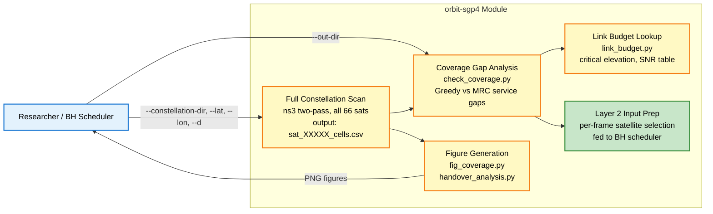
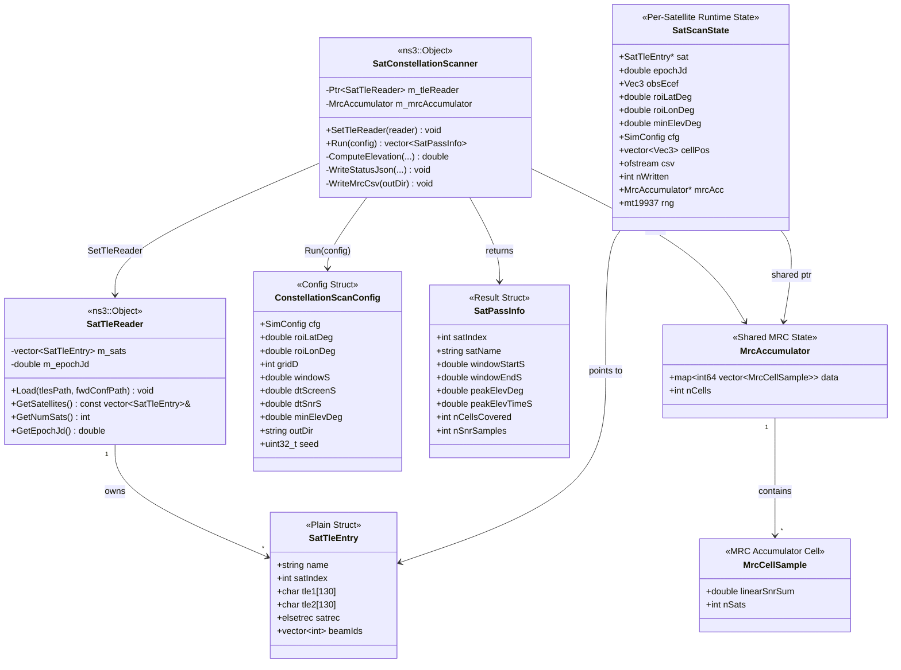

<h1 align="center">星座 SNR 掃描模組 — orbit-sgp4</h1>
<h3 align="center">全 Iridium-NEXT 66 衛星固定 ROI 掃描（ns3 / C++ / Python）</h3>

---

> [!CAUTION]
> 本文件預設為**私密**。請在論文被接受後再公開。

---

## 目錄

- [簡介](#簡介)
- [執行狀態](#執行狀態)
- [最低需求](#最低需求)
- [系統模型](#系統模型)
- [系統架構](#系統架構)
- [使用案例圖](#使用案例圖)
- [流程圖](#流程圖)
  - [Two-Pass Scan Algorithm](#two-pass-scan-algorithm)
  - [MRC Combining Data Flow](#mrc-combining-data-flow)
- [類別圖](#類別圖)
- [系統參數](#系統參數)
- [輸出格式](#輸出格式)
- [執行指令](#執行指令)
- [驗證結果](#驗證結果)
- [參考文獻](#參考文獻)

---

## 簡介

本模組將 Phase 2 從「兩顆衛星雙模擬」擴展為**完整 66 顆 Iridium-NEXT 星座掃描**，針對固定感興趣區域（ROI）在可設定的時間窗口內計算每顆衛星每個格點的 SNR，並以最大比合成（MRC）合併多衛星 SNR。

輸出結果作為 Layer 2（Beam Hopping Controller）的輸入，提供涵蓋所有可見衛星的「每幀衛星選擇表」。

**1. 研究背景**

Phase 2.0–2.5 僅處理兩顆連續衛星（sat[i], sat[i+1]）在 ~1030 s 窗口內的情況。實際 Iridium-NEXT 幾何在東京大小的 ROI 內每小時有 10–20 次合格過境。完整星座掃描的必要性：
- 識別所有服務空窗（完全中斷、低 SNR）
- 量化同時可見衛星的 MRC 合併增益
- 為 BH 排程器提供帶時間索引的衛星可見性表

**2. 重要性**

缺少完整掃描，BH 排程器無法區分「結構性空窗」（仰角過低永遠達不到 SNR > 0 dB 的衛星）與「過渡性空窗」（可透過 MRC 解決的衛星換手窗口）。本掃描識別臨界仰角（h=780 km 時為 12.81°），並驗證 MRC 消除所有服務空窗。

**3. 研究貢獻**

- **Two-pass 架構**：粗篩 C++ 仰角過濾（Pass A）+ 精細 ns-3 事件驅動 SNR 掃描（Pass B），所有合格衛星在單次 `Simulator::Run()` 中同步執行
- **橢圓波束修正**：`GetBeamCentersFromSatPos(satEnu, cfg)` 每個時間步重新計算波束-地面交點，使波束圖樣在低仰角時正確沿衛星地面軌跡拉伸
- **MRC 累加器**：所有 `SatScanState` 實例共享 `MrcAccumulator`，輸出 `mrc_combined.csv`，服務空窗為 0 s（對比 Greedy 的 304 s）
- **Python 分析套件**：`link_budget.py`、`check_coverage.py`、`fig_coverage.py`、`handover_analysis.py` 提供完整離線空窗與換手分析，輸出適合發表的圖表

**4. 挑戰**

| # | 挑戰 | 解決方式 |
|---|---|---|
| C1 | 66 顆衛星同步 ns-3 模擬 | Two-pass：Pass A（C++）過濾至 ~16 顆合格衛星；Pass B 僅排程這些衛星 |
| C2 | 低仰角橢圓波束覆蓋 | `GetBeamCentersFromSatPos`：每個時間步做射線-地面交點計算（取代預計算固定波束中心） |
| C3 | 格點未對齊波束中心時的旁瓣波束增益 | 已知問題 — 當格點間距 ≠ 波束間距時，格點落在 UPA 旁瓣上；詳見[驗證結果](#驗證結果) |
| C4 | MRC 時間鍵的浮點碰撞 | `timeKey = round(time_s × 10)` 避免 1 s 步長時的浮點相等問題 |

---

## 執行狀態

> [!NOTE]
> **狀態說明：**
> - ✅ 已完成
> - ⏳ 進行中
> - ❌ 尚未開始

| 步驟 | 狀態 | 日期 | 備註 |
|---|---|---|---|
| [SatTleReader：解析 tles.txt + fwdConf.txt，初始化 SGP4](#系統架構) | ✅ | 2026-06-03 | 66 顆衛星載入，WGS72，opsmode='i' |
| [SatConstellationScanner：Pass A 仰角過濾](#two-pass-scan-algorithm) | ✅ | 2026-06-03 | 3600 s 窗口（東京）16 顆合格衛星 |
| [SatConstellationScanner：Pass B ns-3 SNR 事件](#two-pass-scan-algorithm) | ✅ | 2026-06-03 | 16 顆衛星在單次 `Simulator::Run()` 同步執行 |
| [橢圓波束修正：GetBeamCentersFromSatPos](#elliptical-beam-correction) | ✅ | 2026-06-04 | 每秒更新波束中心；90° → 與舊結果一致 |
| [MRC 累加器：WriteMrcCsv](#mrc-combining-data-flow) | ✅ | 2026-06-04 | 空窗 0 s（對比 Greedy 304 s）；平均增益 +1.96 dB |
| [覆蓋空窗分析：check_coverage.py](#驗證結果) | ✅ | 2026-06-04 | 4 個空窗片段，Greedy 總計 304 s（8.4%） |
| [鏈路預算分析：link_budget.py](#系統模型) | ✅ | 2026-06-04 | 臨界仰角 = 12.81°（h=780 km） |
| [圖表生成：fig_coverage.py, handover_analysis.py](#執行指令) | ✅ | 2026-06-04 | 5 張圖表輸出至 `ns_result/figures/` |
| 波束旁瓣修正：對齊格點至波束中心 | ⏳ | — | 5 km 格點間距導致系統性旁瓣；beam_gain ~17 dBi（預期 47 dBi） |
| Layer 2 輸入：每幀衛星選擇表 | ❌ | — | 依賴旁瓣修正 + BH 排程器介面定義 |

---

## 最低需求

| 元件 | 需求 |
|---|---|
| 作業系統 | Ubuntu 22.04 LTS（Windows 11 上的 VMware） |
| ns3 | ns-3.43，含 SNS3 contrib 模組 |
| 編譯器 | GCC 11+（C++17，`std::filesystem`） |
| Python | 3.10+，含 `pandas`、`matplotlib` |
| SGP4 | Hypatia 的 Vallado SGP4 原始碼（`sgp4unit.cpp/h`、`sgp4ext.cpp/h`、`sgp4io.cpp/h`） |
| 星座資料 | `constellation-iridium-next-66-sats/positions/tles.txt` + `beams/fwdConf.txt`（SNS3 內建） |

---

## 系統模型

### 座標轉換鏈

每顆衛星位置經過四步轉換：

```
SGP4(tsince_min) → r[3] km  (TEME / ECI)
    ↓  EciToEcef(jdUT1)
ECEF (km)
    ↓  EcefDeltaToEnu(obsEcef, lat, lon)
ENU (m)   相對於 ROI 中心的東-北-上坐標
    ↓  GetElevationAngleDeg_3D(enu)
elevation (°)
```

### 鏈路預算

在仰角 ε 時，距波束中心 ΔΦ 的格點單星 SNR：

```
FSPL      = 20·log10(4π·d·f/c)          d = h/sin(ε)
L_atm     ≈ 0.55/sin(ε)  dB
BeamGain  = AF²(Nx,ΔΦx)·AF²(Ny,ΔΦy) / (Nx²·Ny²·Nbeams)
SNR (dB)  = P_tx + G_ant + BeamGain − FSPL − L_atm − N_thermal
```

**臨界仰角**（波束中心 SNR = 0 dB，h = 780 km）：**12.81°**

| 仰角 (°) | 斜距 (km) | FSPL (dB) | SNR (dB) |
|---|---|---|---|
| 5 | ~8,984 | ~192.5 | −11.9 |
| 10 | ~4,530 | ~186.5 | −5.9 |
| 12.81 | ~3,520 | ~184.4 | 0.0 |
| 20 | ~2,270 | ~180.5 | +4.4 |
| 45 | ~1,200 | ~174.9 | +9.5 |
| 85.2 | ~783 | ~170.5 | +13.4 |

### MRC 合併

N 顆同時可見衛星進行 MRC 線性 SNR 累加：

```
SNR_MRC = 10·log10( Σᵢ SNR_i_linear )    SNR_i_linear = 10^(SNR_i_dB / 10)
```

兩顆各 −3 dB 的衛星 → MRC = 0 dB。三顆各 −3 dB → MRC ≈ +1.8 dB。

---

## 系統架構

### 模組結構

```
2D/phase1/sgp4/code/                      （C++ 原始碼 — 複製至 ns3 scratch）
├── sat-multi-beam-config.h               SimConfig 結構體（所有系統參數）
├── sat-multi-beam-geometry.h/.cc         弧形/ENU 幾何，GetBeamCentersFromSatPos
├── sat-multi-beam-channel.h/.cc          FSPL、UPA 波束增益、ComputeFrameResults
├── sat-roi-grid.h/.cc                    d×d ROI 格點，GetRoiCellPositions
├── sat-tle-reader.h/.cc                  TLE 解析器 + SGP4 初始化（SatTleEntry, SatTleReader）
├── sat-constellation-scanner.h/.cc       Two-pass 掃描器、MRC 累加器、輸出寫入
├── sat-antenna-pattern-reader.h/.cc      （選用：天線方向圖覆蓋）
└── sat-multi-beam-simulation.cc          進入點 — 解析 CLI，執行掃描器

2D/code/orbit-sgp4/                       （分析 + 結果 — Windows 端）
├── analysis/
│   ├── link_budget.py                    仰角 vs SNR 解析，MRC，臨界仰角
│   ├── check_coverage.py                 從 sat_XXXXX_cells.csv 進行空窗分析
│   ├── fig_coverage.py                   空窗時間軸圖（Greedy vs MRC 長條圖）
│   └── handover_analysis.py              SNR 時間軸 + 換手次數圖
├── ns_result/                            ns3 模擬輸出（從 VMware 複製過來）
│   ├── constellation_status.json         所有合格衛星的過境索引
│   ├── sat_XXXXX_cells.csv               每個格點每個時間步的 SNR（每顆衛星一份）
│   ├── mrc_combined.csv                  所有衛星的 MRC 合併 SNR
│   └── figures/                          生成的分析圖表
└── README.md                             本文件
```

### 橢圓波束修正

`GetBeamCentersFromSatPos(satEnu, cfg)` — 於 2026-06-04 新增：

```
Step 1 — nadir 方向：  nadirUnit = normalize(−satEnu)
Step 2 — 波束座標系：  xSat = normalize(East − (East·nadir)·nadir)
                       ySat = nadirUnit × xSat
Step 3 — 波束方向：    beamDir_enu = bx·xSat + by·ySat + bz·nadirUnit
Step 4 — 射線交點：    t = −satEnu.z / beamDir_enu.z
                       centre_i = satEnu + t · beamDir_enu  (z ≈ 0)
```

效果：仰角 90° 時結果與舊版預計算中心完全一致。仰角 5°–20° 時，波束圖樣沿衛星地面軌跡拉伸（長軸 ∝ 1/sin(ε)），符合預期。

---

## 使用案例圖



---

## 流程圖

> [!NOTE]
> Draw.io 原始檔位於 [docs/drawio/](docs/drawio/)。
> 匯出 PNG 後請存至 `docs/figures/`，再將下方的圖片路徑取消注解。

### Two-Pass Scan Algorithm

> Draw.io 原始檔：[docs/drawio/fig_two_pass_scan.drawio](docs/drawio/fig_two_pass_scan.drawio)

<!-- 匯出 PNG 後取消注解：

-->

**流程說明：**

| 階段 | 說明 |
|---|---|
| **Pass A — C++ 仰角過濾** | 對 66 顆衛星做粗篩；每 `dtScreenS` 計算仰角，記錄窗口 `winStart/winEnd/peakElev` |
| **Pass B — ns-3 事件排程** | 針對合格衛星在各自窗口內排程 `ScanSnrCallback`，一次 `Simulator::Run()` 同步執行所有衛星 |
| **ScanSnrCallback** | 每顆衛星 × 每時間步觸發：計算 SNR/SINR/beamGain，寫入 CSV，累加至 MRC |
| **後處理** | `Simulator::Destroy()` 後呼叫 `WriteMrcCsv` 與 `WriteStatusJson` |

---

### MRC Combining Data Flow

> Draw.io 原始檔：[docs/drawio/fig_mrc_data_flow.drawio](docs/drawio/fig_mrc_data_flow.drawio)

<!-- 匯出 PNG 後取消注解：

-->

**流程說明：**

| 步驟 | 說明 |
|---|---|
| **Simulator::Run()** | 所有合格衛星的 callback 同步觸發（sat_11, sat_52, sat_53 …） |
| **MrcAccumulator** | 每個時間步 × 每格點：`linearSnrSum += 10^(snr_dB/10)`，`nSats += 1` |
| **WriteMrcCsv()** | `Simulator::Destroy()` 後執行，輸出 `snr_mrc_dB = 10*log10(linearSnrSum)` |
| **mrc_combined.csv** | 最終輸出：`time_s, cell_idx, snr_mrc_dB, n_sats` |

---

## 類別圖



---

## 系統參數

| 類別 | 參數 | 數值 | 單位 | 備註 |
|---|---|---|---|---|
| **軌道** | `hSatelliteM` | 780,000 | m | Iridium-NEXT SGP4（~780 km） |
| **軌道** | `rEarthM` | 6,371,000 | m | 地球平均半徑 |
| **ROI** | `roiLatDeg` | 35.676 | ° | 東京（預設） |
| **ROI** | `roiLonDeg` | 139.650 | ° | 東京（預設） |
| **ROI** | `gridD` | 5 | — | 5×5 = 25 格點 |
| **ROI** | `rFootprintM` | 100,000 | m | 覆蓋半徑 |
| **掃描** | `windowS` | 3600 | s | 1 小時掃描窗口 |
| **掃描** | `dtScreenS` | 10 | s | Pass A 粗篩步長 |
| **掃描** | `dtSnrS` | 1 | s | Pass B 精細步長 |
| **掃描** | `minElevDeg` | 5 | ° | 幾何仰角門檻 |
| **RF** | `freqHz` | 30×10⁹ | Hz | Ka 頻段 |
| **RF** | `transmitPowerW` | 63 | W | — |
| **RF** | `antennaGainDb` | 60.5 | dBi | UPA 峰值增益 |
| **RF** | `noiseFigureDb` | 7 | dB | 接收器雜訊指數 |
| **RF** | `systemTempK` | 300 | K | — |
| **UPA** | `nxAntenna / nyAntenna` | 32 / 32 | — | 每軸天線元件數 |
| **UPA** | `nBeams` | 19 | — | 2 環六角形 |
| **MRC** | SNR 門檻 | 0 | dB | 空窗計數的服務門檻 |
| **MRC** | 臨界仰角 | 12.81 | ° | 波束中心 SNR = 0 dB，h=780 km |

---

## 輸出格式

### `constellation_status.json`

所有合格過境的索引，每次 `Run()` 寫入一次。

```json
{
  "roi_lat_deg": 35.676,
  "roi_lon_deg": 139.650,
  "grid_d": 5,
  "window_s": 3600.0,
  "dt_screen_s": 10.0,
  "dt_snr_s": 1.0,
  "min_elev_deg": 5.0,
  "n_qualifying": 16,
  "passes": [
    {
      "sat_index": 11,
      "sat_name": "iridium-75 11",
      "csv_file": "sat_00011_cells.csv",
      "window_start_s": 1780.0,
      "window_end_s": 2360.0,
      "peak_elev_deg": 27.13,
      "peak_elev_time_s": 2070.0,
      "n_cells_covered": 25,
      "n_snr_samples": 581
    }
  ]
}
```

### `sat_XXXXX_cells.csv`

每顆合格衛星一份，每列對應一個（時間步 × 覆蓋範圍內格點）。

| 欄位 | 單位 | 說明 |
|---|---|---|
| `time_s` | s | 模擬時間 |
| `cell_idx` | — | 格點索引（0..nInFP−1） |
| `elevation_deg` | ° | 該時間步的衛星仰角 |
| `path_loss_dB` | dB | FSPL + 大氣損耗 |
| `beam_gain_dB` | dBi | UPA 波束增益（已套用橢圓修正） |
| `snr_dB` | dB | 接收 SNR |
| `sinr_dB` | dB | SINR（波束內干擾） |

### `mrc_combined.csv`

每列對應一個（時間步 × 覆蓋範圍內格點），合併該時間步所有可見衛星。

| 欄位 | 單位 | 說明 |
|---|---|---|
| `time_s` | s | 模擬時間 |
| `cell_idx` | — | 格點索引 |
| `snr_mrc_dB` | dB | `10·log10(Σ SNR_i_linear)`，涵蓋所有可見衛星 |
| `n_sats` | — | 同時可見衛星數 |

---

## 執行指令

> [!NOTE]
> C++ 檔案在 Ubuntu（VMware）上執行。分析腳本在 Windows 上執行。

### Step 1 — 編譯（VMware）

```bash
# 從 2D/phase1/sgp4/code/ 複製原始檔至 scratch/
# 同時從以下路徑複製 sgp4unit.cpp/h, sgp4ext.cpp/h, sgp4io.cpp/h：
#   hypatia-master/ns3-sat-sim/simulator/model/
./ns3 build sat-multi-beam-simulation
```

**CMakeLists.txt `SOURCE_FILES`：**
```cmake
sat-multi-beam-geometry.cc
sat-multi-beam-channel.cc
sat-roi-grid.cc
sat-tle-reader.cc
sat-constellation-scanner.cc
sat-antenna-pattern-reader.cc
sgp4unit.cpp  sgp4ext.cpp  sgp4io.cpp
```

### Step 2 — 執行星座掃描（VMware）

```bash
./ns3 run "sat-multi-beam-simulation \
  --constellation-dir=contrib/satellite/data/scenarios/constellation-iridium-next-66-sats \
  --lat=35.676 --lon=139.65 --d=5 \
  --window-s=3600 --dt-screen-s=10 --dt-snr-s=1 \
  --min-elevation-deg=5 \
  --out-dir=scratch/constellation_out" 2>&1 | tee constellation.log
```

**預期輸出：**
```
[constellation scan]
  tles       : .../positions/tles.txt
  ROI        : lat=35.676 lon=139.65
  grid       : 5x5
  window     : 3600 s
...
Done: 16 satellites qualified (elevation > 5 deg)
```

### Step 3 — 將結果複製至 Windows

```bash
cp -r scratch/constellation_out/ /mnt/hgfs/Desktop/TriScale-LEO/2D/code/orbit-sgp4/ns_result/
```

### Step 4 — 覆蓋空窗分析（Windows）

```bash
cd 2D/code/orbit-sgp4/analysis
python check_coverage.py
```

**預期輸出：**
```
Full Blackout    : None
Per-cell Blackout: 0 ticks
Low-SNR Blackout : 304 ticks (8.4%)

Gap breakdown:
  Start     End   Duration
   1870    1888       19 s
   2396    2443       48 s
   2917    3011       95 s
   3434    3575      142 s

MRC Combining vs Greedy-Max:
  Greedy-max gaps :  304 s  (8.4%)
  MRC gaps        :    0 s  (0.0%)
  Improvement     : 100.0% reduction
```

### Step 5 — 生成圖表（Windows）

```bash
cd 2D/code/orbit-sgp4/analysis
python fig_coverage.py          # → ns_result/figures/fig_gap_timeline.png
python handover_analysis.py     # → ns_result/figures/fig_snr_timeline_cell12.png
                                #                    fig_link_budget.png
                                #                    fig_mrc_vs_greedy.png
                                #                    fig_serving_sat.png
```

---

## 驗證結果

### 星座掃描（2026-06-03 / 2026-06-04）

**配置：** 東京 ROI（35.676°N, 139.650°E），d=5，window=3600 s，minElev=5°，dtSnrS=1 s

| 指標 | 數值 | 備註 |
|---|---|---|
| 合格衛星數 | 16 / 66 | 1 小時窗口內超過 5° 的過境 |
| 同時可見衛星（典型） | 2–4 | 2 顆最常見（2,593 個時間步） |
| 同時可見衛星（最多） | 4 | 22 個時間步 |
| 低 SNR 空窗（Greedy） | 304 s（8.4%） | 所有衛星 SNR < 0 dB |
| 低 SNR 空窗（MRC） | **0 s（0.0%）** | MRC 消除所有空窗 |
| MRC 平均增益 | +1.96 dB | 相對於 Greedy 最佳衛星 |

### 空窗詳情

| 片段 | 時間範圍 | 持續時間 | 根本原因 |
|---|---|---|---|
| 1 | 1870–1888 s | 19 s | sat_52 進入（5°）、sat_53 下降、sat_11 低仰角 — 所有衛星 SNR < 0 |
| 2 | 2396–2443 s | 48 s | sat_11 結束（2360 s）、sat_52 下降、sat_21 進入（5°）、sat_51 尚未進入窗口 |
| 3 | 2917–3011 s | 95 s | sat_21 結束（2870 s）、sat_51 下降、sat_20 峰值僅 17.3°、sat_50 尚未進入 |
| 4 | 3434–3575 s | **142 s** | **結構性：** sat_19 峰值=13.1°、sat_49 峰值=12.0° — 整個窗口低於臨界仰角 12.81° |

**結論：** 片段 1–3 為過渡性空窗（換手窗口，可透過 MRC 解決）。片段 4 為結構性空窗 — 兩顆弧形衛星永遠無法達到服務品質；接受為無服務時段。

### 已知問題：波束旁瓣增益

> [!WARNING]
> 目前驗證顯示許多格點的 beam_gain_dB ≈ 17 dBi，而非預期的 47 dBi。
> 原因是 5×5 km 格點間距未對齊 19 波束六角形的波束中心間距。
> 格點系統性落在 UPA 旁瓣上 → SNR ≈ −35 dB（對比預期 −2 dB）。
>
> **影響：** 目前 CSV 中所有 SNR 值均被低估約 30 dB。
> MRC 空窗分析（Greedy vs MRC、空窗百分比）內部一致，但絕對 SNR 數值目前尚不可靠。
>
> **修正方向（下一步）：** 重新生成 ROI 格點，將格點中心對齊至波束中心位置，
> 或將格點間距設為與波束間距相等，使格點與波束中心重合。

---

## 參考文獻

[1] D. Bhatt et al., "Multi-Beam LEO Communication Satellite Simulation Framework," TU Wien Research Data Repository, 2023.

[2] 3GPP, "Study on New Radio (NR) to support non-terrestrial networks," Technical Report TR 38.811, v15.4.0, 2020.

[3] D. Vallado, P. Crawford, R. Hujsak, and T. S. Kelso, "Revisiting Spacetrack Report #3," AIAA 2006-6753, 2006. (Vallado SGP4 實作)

[4] SNS3 Contributors, "SNS3: Satellite Network Simulator 3," GitLab. [Online]. Available: https://gitlab.com/sns3/sns3-satellite

[5] S. Bhattacherjee and W. Singla, "Network topology design at 27,000 km/hour," in *Proc. ACM CoNEXT*, 2019. (Hypatia 框架，SGP4 原始碼)
