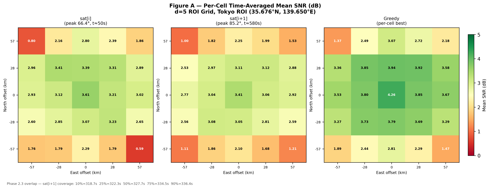
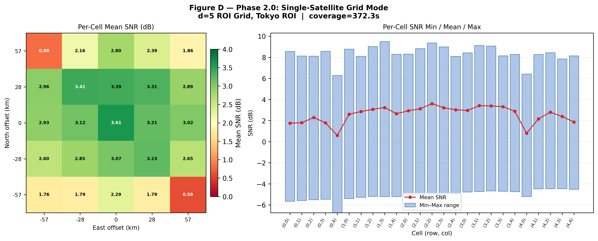

# Phase 2 SOP — 從 Clone 到產圖

## 目錄

- [資料夾結構](#資料夾結構)
- [執行環境需求](#執行環境需求)
- [模擬參數說明](#模擬參數說明)
- [Step 1 — 複製程式碼到 ns3 scratch](#step-1--複製程式碼到-ns3-scratch)
- [Step 2 — 更新 CMakeLists.txt](#step-2--更新-cmakeliststxt)
- [Step 3 — 編譯](#step-3--編譯)
- [Step 4 — 產生軌道 CSV（可跳過）](#step-4--產生軌道-csv可跳過)
- [Step 5 — 執行 Grid mode 模擬](#step-5--執行-grid-mode-模擬)
- [Step 6 — 執行 Dual mode 模擬](#step-6--執行-dual-mode-模擬)
- [Step 7 — 產生所有圖表](#step-7--產生所有圖表)
- [圖表內容說明](#圖表內容說明)
- [驗收條件總表](#驗收條件總表)
- [常見問題](#常見問題)

---

## 資料夾結構

```
2D/phase2/
├── code/                            ← 所有 C++ 原始碼與 Python 腳本
│   ├── sat-multi-beam-config.h      ← [共用] 全系統參數結構（SimConfig）
│   ├── sat-multi-beam-geometry.h/.cc← [共用] 幾何計算（Vec3、衛星位置、波束中心、ENU 轉換）
│   ├── sat-multi-beam-channel.h/.cc ← [共用] 通道模型（路徑損耗、UPA 波束增益、Rician、ComputeFrameResults）
│   ├── sat-orbit-reader.h/.cc       ← [Phase 2] SGP4 軌道 CSV 讀取與 ENU 座標轉換
│   ├── sat-roi-grid.h/.cc           ← [Phase 2] d×d ROI 格點網格生成
│   ├── sat-phase2-grid.h/.cc        ← [Phase 2.0] Grid mode 模組
│   ├── sat-phase2-dual.h/.cc        ← [Phase 2.2/2.3] Dual mode 模組
│   ├── sat-multi-beam-simulation.cc ← 主程式（CLI 解析 + Phase 1/2 dispatch）
│   ├── run_sgp4.py                  ← 軌道 CSV 產生器（PyEphem SGP4）
│   └── exp_phase2_plots.py          ← 統一繪圖腳本（Figure A–D）
│
├── data/                            ← 軌道 CSV（已預先產生）
│   ├── orbit_sat_i.csv              ← sat[i]:   iridium-75 45，峰值仰角 66.4°
│   └── orbit_sat_i1.csv             ← sat[i+1]: iridium-75 44，峰值仰角 85.2°
│
├── result/
│   ├── grid/                        ← Grid mode 輸出（Step 5 產生）
│   │   ├── cell_result.csv
│   │   └── cell_summary.csv
│   └── dual/                        ← Dual mode 輸出（Step 6 產生）
│       ├── cell_result.csv
│       ├── cell_summary.csv
│       └── overlap.json
│
└── figures/                         ← 圖表輸出（Step 7 產生）
    ├── fig_A_snr_heatmap.png/.svg   ← sat[i] / sat[i+1] / Greedy SNR 熱圖
    ├── fig_B_snr_cdf.png/.svg       ← 三種策略 per-cell SNR CDF
    ├── fig_C_overlap_timeline.png/.svg ← sat[i+1] ROI coverage buildup 曲線
    └── fig_D_grid_snr_heatmap.png/.svg ← 單星 SNR 熱圖 + min/max range
```

---

## 程式碼架構說明

### 依賴關係圖

```
sat-multi-beam-config.h          ← 最底層：所有模組都 include 這個
        ↓
sat-multi-beam-geometry.h/.cc    ← Vec3、衛星位置、波束中心、ENU 轉換
        ↓
sat-multi-beam-channel.h/.cc     ← 通道模型（依賴 geometry 取得位置資訊）
sat-orbit-reader.h/.cc           ← 軌道讀取（依賴 geometry 的 Vec3）
sat-roi-grid.h/.cc               ← ROI 格點（依賴 geometry 的 Vec3）
        ↓
sat-phase2-grid.h/.cc            ← Grid mode（組合以上所有元件）
sat-phase2-dual.h/.cc            ← Dual mode（組合以上所有元件）
        ↓
sat-multi-beam-simulation.cc     ← 主程式（CLI → dispatch → 呼叫各 mode）
```

---

### `sat-multi-beam-config.h`

**角色：** 全系統唯一的參數結構，所有模組共用。

**核心內容：**

| 成員 | 型別 | 預設值 | 說明 |
|------|------|--------|------|
| `hSatelliteM` | double | 600,000 m | LEO 軌道高度 |
| `centerFreqHz` | double | 30 GHz | Ka band 載波頻率 |
| `bandwidthHz` | double | 25 MHz | 通道頻寬 |
| `nAntennaX/Y` | int | 32 × 32 | UPA 陣元數（每 beam） |
| `nBeams` | int | 19 | 六角排列波束數 |
| `ricianK` | double | 10.0 | Rician K-factor |
| `latitudeCenterDeg` | double | 35.676° N | ROI 中心（東京） |
| `rFootprintM` | double | 100,000 m | 單星服務圓半徑 |

**衍生方法：** `GetNoisePower()`、`GetAntennaSpacing()`、`GetHpbwRad()`。

---

### `sat-multi-beam-geometry.h/.cc`

**角色：** 幾何計算層，提供所有位置相關的基本運算。

**主要 API：**

| 函式 | 說明 |
|------|------|
| `Vec3` | 三維 Cartesian 向量（x=East, y=North, z=Up） |
| `GetSatelliteArcPositions()` | Phase 1 arc mode：衛星沿 x-z 平面弧線運動的完整位置序列 |
| `GetHexBeamCenters()` | 19 個波束中心位置（兩圈六角排列，ECEF offset 座標） |
| `EcefOffsetToEnu()` | ECEF offset → 本地 ENU 旋轉（Phase 2 grid/dual 必用） |
| `GetElevationAngleDeg_3D()` | 從 ENU 座標計算衛星仰角（Phase 2 用，Phase 1 用 2D 版本） |

---

### `sat-multi-beam-channel.h/.cc`

**角色：** 物理層通道模型，是 SNR/SINR 計算的核心。

**計算流程（`ComputeFrameResults`）：**

```
對每個 user：
  1. ComputePathLoss_dB()   → 自由空間損耗 + 3GPP NTN 大氣吸收
  2. ComputeUPABeamGainPower() × 19 beams
       → Dirichlet kernel |AF_x|² · |AF_y|²（精確 UPA steering vector）
       → beam association = argmax(beam gain power)
  3. SampleRicianAmplitude() → 若 withFading=true 加入 Rician 衰落
  4. SNR  = P_desired / noise_power
     SINR = P_desired / (Σ inter-beam interference + noise)
```

**Phase 2.5 z 軸旋轉修正（已嵌入此檔）：** `BuildArrayTransform()` 在 Step 0 計算 `cosZ/sinZ`，補償低仰角時衛星飛行方向（azimuth）造成的陣列旋轉誤差。

---

### `sat-orbit-reader.h/.cc`

**角色：** 讀取 `run_sgp4.py` 產生的 SGP4 軌道 CSV，並轉換座標。

**`OrbitPoint` 欄位：**

| 欄位 | 說明 |
|------|------|
| `timeS` | 模擬時間（s，從 0 開始） |
| `latDeg / lonDeg` | 衛星地面點 WGS72 geodetic 座標 |
| `altM` | 衛星高度（m，≈ 780,000 m for Iridium） |
| `elevationDeg` | PyEphem 計算的觀測仰角（直接使用，不重新計算） |

**`OrbitPointToEnuVec3()`：** 將 geodetic 位置轉換為以觀測點為原點的本地 ENU 座標（供 `ComputeFrameResults` 使用）。

---

### `sat-roi-grid.h/.cc`

**角色：** 在衛星 footprint 內建立 d×d 矩形格點。

**設計：**
- 內接正方形：L = W = r_footprint × √2（Phase 2.0 elevation=90° 近似）
- `inFootprint` 篩選：只有 cx² + cy² ≤ r² 的格點才計算 SNR
- `GetRoiCellPositions()` 輸出直接傳入 `ComputeFrameResults()` 的 `userPos`

---

### `sat-phase2-grid.h/.cc`

**角色：** Phase 2.0 Grid mode 完整實作，對外只暴露一個函式。

**對外 API：**
```cpp
struct RunGridConfig { SimConfig cfg; string orbitCsv; int gridD; ... };
void RunGridMode(const RunGridConfig&);
```

**內部流程（anonymous namespace）：**

```
GridSimState（持有所有執行狀態）
    ↓
GridUpdateStep()  每 100ms 觸發一次（ns3 event loop）
    ├── 從 orbit 找當前時刻衛星位置
    ├── 仰角 >= minElevDeg → ComputeFrameResults()
    ├── AppendGridCellCsvRows() → cell_result.csv
    └── 累積 CellStats（mean/min/max SNR、coverage_s）
    ↓
WriteGridSummaryCsv() → cell_summary.csv
Simulator::Destroy()
```

---

### `sat-phase2-dual.h/.cc`

**角色：** Phase 2.2/2.3 Dual mode 完整實作。

**對外 API：**
```cpp
struct RunDualConfig { SimConfig cfg; string orbitCsvI; string orbitCsvI1;
                       double snrThreshDb; ... };
void RunDualMode(const RunDualConfig&);
```

**內部流程：**

```
DualSimState（兩組 orbit + 兩組 CellStats + Phase 2.3 閾值狀態）
    ↓
DualUpdateStep()  每 100ms 觸發
    ├── sat[i]   仰角 >= min → ComputeFrameResults() → snr_i
    ├── sat[i+1] 仰角 >= min → ComputeFrameResults() → snr_i1
    │       sentinel −999 = 不可見
    ├── Greedy = max(snr_i, snr_i1) 逐格取最大
    ├── [Phase 2.3] 統計當前時刻 sat[i+1] SNR >= snrThreshDb 的格數
    │       → 若比例首次超過 10/25/50/75/90%，記錄時刻
    └── AppendDualCellCsvRows() → cell_result.csv
    ↓
WriteDualSummaryCsv() → cell_summary.csv
WriteDualOverlapJson() → overlap.json
Simulator::Destroy()
```

---

### `sat-multi-beam-simulation.cc`

**角色：** 程式進入點，負責 CLI 解析與模式 dispatch。

**執行流程：**

```
main()
  └── CommandLine::Parse()  ← 所有 mode 的參數統一在此註冊
        ↓
  if mode == "grid" → RunGridMode()  → return 0   ← Phase 2 early dispatch
  if mode == "dual" → RunDualMode()  → return 0   ← Phase 2 early dispatch
        ↓
  （以下只有 Phase 1 執行）
  建立 userPos、beamCenters
  if mode == "nadir"  → 固定仰角點模擬
  if mode == "arc"    → 衛星弧線過境模擬
  if mode == "macro"  → 巨觀通道（可選 Rician）
```

> Phase 2 在 `userPos` 建立之前就 return，避免 Phase 1 初始化佔用不必要的記憶體。

---

### `run_sgp4.py`

**角色：** 用 PyEphem + SGP4 模型產生衛星軌道 CSV。

**`--mode sequence` 工作流程：**

```
讀取 iridium.txt TLE
搜尋觀測點上空連續兩顆衛星同時在窗口內的過境組合
    → sat[i]:   選定的首星（較早過境）
    → sat[i+1]: 緊接的次星（較晚過境）
對共同時間窗口 [t_start, t_end] 以 --step-ms 步進輸出：
    time_s, sat_lat_deg, sat_lon_deg, sat_alt_m, elevation_deg, azimuth_deg
輸出：orbit_sat_i.csv 和 orbit_sat_i1.csv（相同時間軸）
```

---

### `exp_phase2_plots.py`

**角色：** 統一繪圖腳本，從三種輸入檔案產生四張圖。

**輸入 → 輸出對應：**

| Figure | 輸入 | 輸出 |
|--------|------|------|
| A（SNR 熱圖） | `dual/cell_summary.csv` | `fig_A_snr_heatmap.png/.svg` |
| B（SNR CDF） | `dual/cell_summary.csv` | `fig_B_snr_cdf.png/.svg` |
| C（Coverage buildup） | `dual/cell_result.csv` + `overlap.json` | `fig_C_overlap_timeline.png/.svg` |
| D（Grid 熱圖）| `grid/cell_summary.csv` | `fig_D_grid_snr_heatmap.png/.svg` |

---

## 執行環境需求

| 環境 | 用途 |
|------|------|
| Ubuntu 22.04 + ns-3.43 | Step 1–6（C++ 編譯與模擬） |
| WPython 3.9+ | Step 7（繪圖，可在任一環境執行） |

**Python 依賴（Step 4 和 Step 7 需要）：**

```bash
pip install ephem numpy pandas matplotlib
python -c "import ephem, numpy, pandas, matplotlib; print('OK')"
```

---

## 模擬參數說明

### 衛星與通道參數（SimConfig，所有 mode 共用）

| 參數 | CLI flag | 預設值 | 說明 |
|------|----------|--------|------|
| 觀測點緯度 | `--lat` | `35.676` °N | ROI 中心（東京） |
| 觀測點經度 | `--lon` | `139.650` °E | ROI 中心（東京） |
| 軌道高度 | `--altitude-m` | `780,000` m | Iridium NEXT 標稱軌道高度 |
| 載波頻率 | `--freq-hz` | `30 × 10⁹` Hz | Ka band 下行 |
| UPA 天線陣列大小 | `--upa-n` | `32` | 每軸振子數（32×32） |
| 陣元間距 | `--upa-d` | `0.5λ` | 半波長間距 |
| Beam 數量 | 固定 | `19` | 中心 + 2 圈六角排列 |
| 地球半徑 | `--r-earth-m` | `6,371,000` m | WGS-84 近似值 |
| Footprint 半徑 | `--r-footprint-m` | `100,000` m | 單顆衛星服務圓半徑 |
| 最低仰角門檻 | `--min-elevation-deg` | `5.0` ° | 低於此值不計算 SNR |

### Grid mode 專屬參數（`--mode=grid`）

| 參數 | CLI flag | 本次設定值 | 說明 |
|------|----------|-----------|------|
| 格點維度 | `--d` | `5` | d×d = 5×5 = 25 格 |
| 格邊長 | 自動計算 | `141.4 km` | L = r_footprint × √2（內接正方形） |
| 格點間距 | 自動計算 | `28.3 km` | L / (d−1) |
| 時間步長 | `--update-ms` | `100` ms | ns3 事件間隔 |
| 衛星軌道 CSV | `--orbit-csv` | `orbit_sat_i.csv` | sat[i] = iridium-75 45 |
| 輸出目錄 | `--out-dir` | `result/grid/` | cell_result.csv + cell_summary.csv |

### Dual mode 專屬參數（`--mode=dual`）

| 參數 | CLI flag | 本次設定值 | 說明 |
|------|----------|-----------|------|
| 格點維度 | `--d` | `5` | 同 Grid mode |
| 主衛星軌道 CSV | `--orbit-csv-i` | `orbit_sat_i.csv` | sat[i] = iridium-75 45，峰值仰角 66.4° at t≈50s |
| 次衛星軌道 CSV | `--orbit-csv-i1` | `orbit_sat_i1.csv` | sat[i+1] = iridium-75 44，峰值仰角 85.2° at t≈580s |
| SNR 覆蓋門檻 | `--snr-thresh-db` | `0.0` dB | Phase 2.3：計算 sat[i+1] 覆蓋某格的最低 SNR |
| 時間步長 | `--update-ms` | `100` ms | 兩顆衛星同步更新 |
| 輸出目錄 | `--out-dir` | `result/dual/` | cell_result.csv + cell_summary.csv + overlap.json |

### 關鍵時間軸

```
t = 0 s       模擬開始，sat[i] 已可見（仰角 53.9°）
t ≈ 50 s      sat[i] 峰值仰角（66.4°）
t ≈ 190 s     sat[i+1] 開始升出 5° 門檻（重疊窗口起點）
t ≈ 320-340 s sat[i+1] 達到 10→90% ROI 覆蓋率（Phase 2.3 閾值）
t ≈ 440 s     sat[i] 降至 5° 門檻以下（重疊窗口終點）
t ≈ 580 s     sat[i+1] 峰值仰角（85.2°）
t = 1030 s    模擬結束
```

### 繪圖腳本參數（`exp_phase2_plots.py`）

| 參數 | flag | 預設值 | 說明 |
|------|------|--------|------|
| Grid summary | `--grid-summary` | `result/grid/cell_summary.csv` | Figure D 輸入 |
| Dual summary | `--dual-summary` | `result/dual/cell_summary.csv` | Figure A、B 輸入 |
| Dual raw data | `--dual-result` | `result/dual/cell_result.csv` | Figure C 輸入（逐時間步資料） |
| Overlap JSON | `--overlap` | `result/dual/overlap.json` | Figure A、B、C 閾值標注 |
| 輸出目錄 | `--out-dir` | `figures/` | PNG + SVG 輸出位置 |
| 選擇圖表 | `--figures` | `A B C D` | 可指定子集，如 `--figures A B` |
| SNR 門檻 | `--snr-thresh` | `0.0` dB | Figure C 覆蓋率計算門檻（須與模擬一致） |
| 圖片解析度 | `--dpi` | `300` | PNG 輸出 DPI |

---

## Step 1 — 程式碼

在 VMware 的 ns3 根目錄下執行：
[`phase2/code/`](https://github.com/yuru1231/TriScale-LEO/tree/154bbe2a56c99ec0cbc86eb3fc74ea50ecd814df/2D/phase2)
```
sat-multi-beam-simulation.cc  
sat-multi-beam-channel.h      
sat-multi-beam-channel.cc     
sat-multi-beam-geometry.h     
sat-multi-beam-geometry.cc    
sat-multi-beam-config.h       
sat-orbit-reader.h            
sat-orbit-reader.cc           
sat-roi-grid.h                
sat-roi-grid.cc               
sat-phase2-grid.h             
sat-phase2-grid.cc            
sat-phase2-dual.h             
sat-phase2-dual.cc            
```
### Python 腳本
```
run_sgp4.py         
exp_phase2_plots.py 
```
### 軌道 CSV
```
orbit_sat_i.csv   
orbit_sat_i1.csv  
```

---

## Step 2 — 更新 CMakeLists.txt

找到 `scratch/CMakeLists.txt`（或 ns3 根目錄下管理 scratch 的 CMakeLists）中的 `build_exec` 區塊，加入三個新的 `.cc` 檔案：

```cmake
build_exec(
  NAME sat-multi-beam-simulation
  SOURCE_FILES
    scratch/sat-multi-beam-simulation.cc
    scratch/sat-multi-beam-geometry.cc
    scratch/sat-multi-beam-channel.cc
    scratch/sat-orbit-reader.cc
    scratch/sat-roi-grid.cc
    scratch/sat-phase2-grid.cc      # ← 新增
    scratch/sat-phase2-dual.cc      # ← 新增
  LIBRARIES_TO_LINK
    ${libcore}
)
```

---

## Step 3 — 編譯

```bash
./ns3 build sat-multi-beam-simulation 2>&1 | tee scratch/build.log
```

**預期輸出：**
```
Build completed successfully
```

若出現 `undefined reference` 錯誤，確認 Step 2 的兩行是否已加入 CMakeLists.txt。

**確認 `--mode` 參數存在（快速檢查）：**

```bash
./ns3 run "sat-multi-beam-simulation --help" 2>&1 | grep -E "mode|d=|orbit"
```

---

## Step 4 — 產生軌道 CSV（可跳過）

**若 `data/orbit_sat_i.csv` 和 `data/orbit_sat_i1.csv` 已複製到 `scratch/`，直接跳至 Step 5。**

如需重新產生：

```bash
python scratch/run_sgp4.py \
    --mode sequence \
    --tle-file scratch/iridium.txt \
    --observer-lat 35.676 \
    --observer-lon 139.650 \
    --start-utc "2000/01/01 00:00:00" \
    --search-window-s 7200 \
    --scan-step-s 10 \
    --min-peak-elev-deg 50 \
    --pair-index 0 \
    --margin-s 60 \
    --step-ms 100 \
    --output-sat-i  scratch/orbit_sat_i.csv \
    --output-sat-i1 scratch/orbit_sat_i1.csv \
    2>&1 | tee scratch/run_sgp4.log
```

**驗證：**

```bash
grep -v "^#" scratch/orbit_sat_i.csv  | wc -l   # 預期 10301
grep -v "^#" scratch/orbit_sat_i1.csv | wc -l   # 預期 10301
head -5 scratch/orbit_sat_i.csv                  # 確認衛星名為 iridium-75 45
head -5 scratch/orbit_sat_i1.csv                 # 確認衛星名為 iridium-75 44
```

---

## Step 5 — 執行 Grid mode 模擬

Grid mode 模擬單顆衛星（sat[i]）對 5×5 ROI 格點的覆蓋。

```bash
./ns3 run "sat-multi-beam-simulation \
  --mode=grid \
  --d=5 \
  --orbit-csv=scratch/orbit_sat_i.csv \
  --update-ms=100 \
  --min-elevation-deg=5 \
  --lat=35.676 \
  --lon=139.650 \
  --out-dir=scratch/result/grid" \
  2>&1 | tee scratch/result/grid_sim.log
```

**預期 console 輸出：**

```
[grid mode] 5×5 grid = 25 cells  in-footprint = 25
  L = W = 141.421 km  cell = 28.284 km × 28.284 km
  wrote scratch/result/grid/cell_results.csv
  wrote scratch/result/grid/cell_summary.csv
Done.  Output in: scratch/result/grid
```

**確認輸出：**

```bash
ls scratch/result/grid/
# cell_result.csv  cell_summary.csv

wc -l scratch/result/grid/cell_result.csv    # 約 93,076 行
wc -l scratch/result/grid/cell_summary.csv   # 26 行（含 header）
```

---

## Step 6 — 執行 Dual mode 模擬

Dual mode 同時模擬兩顆衛星，內建 Phase 2.3 重疊閾值偵測。

```bash
./ns3 run "sat-multi-beam-simulation \
  --mode=dual \
  --d=5 \
  --orbit-csv-i=scratch/orbit_sat_i.csv \
  --orbit-csv-i1=scratch/orbit_sat_i1.csv \
  --update-ms=100 \
  --min-elevation-deg=5 \
  --snr-thresh-db=0 \
  --lat=35.676 \
  --lon=139.650 \
  --out-dir=scratch/result/dual" \
  2>&1 | tee scratch/result/dual_sim.log
```

**預期 console 輸出：**

```
[dual mode] 5×5 grid = 25 cells  in-footprint = 25
  sat[i]   coverage_s = 372.x s
  sat[i+1] coverage_s = 651.x s
  Greedy mean SNR across 25 cells = 3.1x dB
  wrote scratch/result/dual/cell_results.csv
  wrote scratch/result/dual/cell_summary.csv
  wrote scratch/result/dual/overlap.json
Done.  Output in: scratch/result/dual
```

**確認輸出：**

```bash
ls scratch/result/dual/
# cell_result.csv  cell_summary.csv  overlap.json

cat scratch/result/dual/overlap.json
```

**預期 overlap.json：**
```json
{
  "n_in_footprint": 25,
  "snr_threshold_dB": 0.000,
  "thresholds_pct": [10, 25, 50, 75, 90],
  "sat_i1_coverage_times_s": {
    "10pct": 318.7,
    "25pct": 322.3,
    "50pct": 327.7,
    "75pct": 334.5,
    "90pct": 336.4
  }
}
```

五個時刻均須落在 [190, 440 s] 的雙星重疊窗口內。

---

## Step 7 — 產生所有圖表

**可在 VMware 或 Windows 上執行（路徑對應修改）。**

```bash
python scratch/exp_phase2_plots.py \
    --grid-summary scratch/result/grid/cell_summary.csv \
    --dual-summary scratch/result/dual/cell_summary.csv \
    --dual-result  scratch/result/dual/cell_result.csv \
    --overlap      scratch/result/dual/overlap.json \
    --out-dir      scratch/figures \
    2>&1 | tee scratch/figures_gen.log
```

**預期 console 輸出：**

```
Phase 2 — Unified Figure Generator
figures  : A, B, C, D
  [A] fig_A_snr_heatmap.png + .svg
  [B] fig_B_snr_cdf.png + .svg
  [C] fig_C_overlap_timeline.png + .svg
  [D] fig_D_grid_snr_heatmap.png + .svg
Done.
```

**確認 8 個輸出檔案存在：**

```bash
ls scratch/figures/
# fig_A_snr_heatmap.png        fig_A_snr_heatmap.svg
# fig_B_snr_cdf.png            fig_B_snr_cdf.svg
# fig_C_overlap_timeline.png   fig_C_overlap_timeline.svg
# fig_D_grid_snr_heatmap.png   fig_D_grid_snr_heatmap.svg
```

**只產生部分圖表：**

```bash
# 只畫 A 和 B
python scratch/exp_phase2_plots.py \
    --dual-summary scratch/result/dual/cell_summary.csv \
    --overlap      scratch/result/dual/overlap.json \
    --out-dir      scratch/figures \
    --figures A B
```

| 圖表 | 檔案 | 內容 |
|------|------|------|
| Figure A | `fig_A_snr_heatmap` | sat[i] / sat[i+1] / Greedy 三欄 5×5 SNR 熱圖 |
| Figure B | `fig_B_snr_cdf` | 三種策略 per-cell mean SNR CDF |
| Figure C | `fig_C_overlap_timeline` | sat[i+1] ROI coverage buildup 曲線（Phase 2.3） |
| Figure D | `fig_D_grid_snr_heatmap` | Grid mode 單星 SNR 熱圖 + min/max range bar |

---

## 圖表內容說明

### Figure A — Per-Cell Mean SNR Heatmap（`fig_A_snr_heatmap`）
<p align="center">
  
</p>
三個並排的 5×5 SNR 熱圖，對應三種衛星指派策略：

| 圖 | 策略 | 說明 |
|------|------|------|
| 左 | sat[i] | 每格取 sat[i] 可見期間的時間平均 SNR |
| 中 | sat[i+1] | 每格取 sat[i+1] 可見期間的時間平均 SNR |
| 右 | Greedy | 每個時間步各格取兩顆衛星中 SNR 較高者，再對全時間取平均 |

- **色軸**：綠色 = 高 SNR，紅色 = 低 SNR
- **數值**：均值 SNR（dB）
- **X 軸**：East offset（km），以 ROI 中心為 0
- **Y 軸**：North offset（km），以 ROI 中心為 0

---

### Figure B — CDF of Per-Cell Mean SNR（`fig_B_snr_cdf`）

<p align="center">
  
</p>

三條 empirical CDF 曲線，每條對應一種策略（sat[i] / sat[i+1] / Greedy）：

- **X 軸**：Per-cell 時間平均 SNR（dB）
- **Y 軸**：CDF（0 → 1），即「有多少比例的格點均值 SNR ≤ x」
- **實線**：階梯型 CDF（step-post）
- **虛線**：各策略均值 SNR 的垂直標記線
- **圖例**：策略名稱 + 全格均值 SNR（dB）

---

### Figure C — sat[i+1] ROI Coverage Buildup（`fig_C_overlap_timeline`）

<p align="center">
  
</p>

單一折線圖，展示 sat[i+1] 對 ROI 的覆蓋率如何隨時間建立：

- **X 軸**：模擬時間（s），範圍 [0, 1030 s]
- **Y 軸**：ROI 中被 sat[i+1] 覆蓋的格點比例（%）
  - 每個時間步統計有多少格的 `snr_i1_dB ≥ snr_thresh`（預設 0 dB）
  - sentinel 值 −999（衛星不可見）不計入覆蓋
- **橙色填色區域**：sat[i+1] 可見窗口
- **5 條彩色垂直虛線**：Phase 2.3 閾值時刻（10 / 25 / 50 / 75 / 90%）
  - 每條線旁標注首次到達該覆蓋率的時間（s）


---

### Figure D — Grid Mode SNR Heatmap + Range（`fig_D_grid_snr_heatmap`）

<p align="center">
  
</p>

單顆衛星（sat[i]）對 5×5 ROI 的時間平均 SNR：

**左圖 — SNR Heatmap：**
- 5×5 格點的時間平均 SNR（`mean_snr_dB`）
- 每格標注均值 SNR，中心格通常最高（最接近波束中心）
- X/Y 軸：East / North offset（km）

**右圖 — Per-Cell SNR Range Bar Chart：**
- X 軸：25 個格點（row, col）標籤，row-major 順序
- Y 軸：SNR（dB）
- **藍色長條**：每格的 min → max SNR 範圍，高度 = max − min，底部 = min
- **紅色折線**：各格的均值 SNR（`mean_snr_dB`）


---

## 驗收條件總表

執行以下腳本自動驗證所有條件：

```bash
python3 - <<'EOF'
import csv, json

BASE = "scratch/result"

# --- Dual summary ---
dual = list(csv.DictReader(open(f"{BASE}/dual/cell_summary.csv")))
fp   = [r for r in dual if r["in_footprint"] == "1"]
n_fp = len(fp)
mean_i  = sum(float(r["mean_snr_i_dB"])      for r in fp) / n_fp
mean_i1 = sum(float(r["mean_snr_i1_dB"])     for r in fp) / n_fp
mean_gr = sum(float(r["greedy_mean_snr_dB"]) for r in fp) / n_fp
center  = next(float(r["greedy_mean_snr_dB"])
               for r in fp if r["row"]=="2" and r["col"]=="2")

# --- Overlap ---
ov    = json.load(open(f"{BASE}/dual/overlap.json"))
times = ov["sat_i1_coverage_times_s"]

# --- Figures ---
import os
FIG = "scratch/figures"
figs = [os.path.isfile(f"{FIG}/{f}") for f in [
    "fig_A_snr_heatmap.png", "fig_B_snr_cdf.png",
    "fig_C_overlap_timeline.png", "fig_D_grid_snr_heatmap.png"]]

results = [
    ("EC-1", "有效格點 == 25",                     n_fp == 25),
    ("EC-2", "Greedy > sat[i]",                   mean_gr > mean_i),
    ("EC-3", "Greedy > sat[i+1]",                 mean_gr > mean_i1),
    ("EC-4", "全部 5 個重疊時刻在 [190,440s]",
             all(190 <= float(v) <= 440 for v in times.values())),
    ("EC-5", "Figure A PNG 存在",                 figs[0]),
    ("EC-6", "Figure B PNG 存在",                 figs[1]),
    ("EC-7", "Figure C PNG 存在",                 figs[2]),
    ("EC-8", "Figure D PNG 存在",                 figs[3]),
    ("EC-9", "中心格 Greedy SNR 在 [3.5,5.0] dB", 3.5 <= center <= 5.0),
    ("EC-10","全格 Greedy 均值 SNR 在 [3.0,3.3] dB", 3.0 <= mean_gr <= 3.3),
]

print(f"\n{'條件':<6}  {'說明':<36}  {'結果'}")
print("-" * 58)
for code, desc, passed in results:
    print(f"{code:<6}  {desc:<36}  {'PASS' if passed else 'FAIL'}")

all_pass = all(p for _, _, p in results)
print(f"\n整體：{'全部 PASS ✓' if all_pass else '有條件 FAIL，請檢查上方輸出'}")
print(f"\n  sat[i] 均值 SNR  = {mean_i:.3f} dB")
print(f"  sat[i+1] 均值 SNR = {mean_i1:.3f} dB")
print(f"  Greedy 均值 SNR   = {mean_gr:.3f} dB")
print(f"  中心格 Greedy SNR = {center:.3f} dB")
EOF
```

| 條件 | 說明 | 通過標準 |
|------|------|---------|
| EC-1 | 有效格點數 | == 25 |
| EC-2 | Greedy SNR 均值 > sat[i] 均值 | Greedy > sat[i] |
| EC-3 | Greedy SNR 均值 > sat[i+1] 均值 | Greedy > sat[i+1] |
| EC-4 | 5 個重疊閾值均在重疊窗口內 | 全部 ∈ [190, 440 s] |
| EC-5 | Figure A 存在 | `fig_A_snr_heatmap.png` |
| EC-6 | Figure B 存在 | `fig_B_snr_cdf.png` |
| EC-7 | Figure C 存在 | `fig_C_overlap_timeline.png` |
| EC-8 | Figure D 存在 | `fig_D_grid_snr_heatmap.png` |
| EC-9 | 中心格 Greedy SNR 合理 | ∈ [3.5, 5.0] dB |
| EC-10 | 全格 Greedy 均值 SNR 合理 | ∈ [3.0, 3.3] dB |

---

## 常見問題

### CMakeLists 更新後仍找不到 RunGridMode / RunDualMode

確認 `sat-phase2-grid.cc` 和 `sat-phase2-dual.cc` 都有加入 `SOURCE_FILES`，且已重新執行 Step 3 編譯。

---

### orbit CSV 行數不是 10301

`--step-ms 100` 對應 1030 s 窗口應為 10301 行。若行數不符，確認 `--margin-s` 設定覆蓋了完整的雙星過境。可用 `--search-window-s 14400` 擴大搜尋範圍。

---

### Figure C 曲線全為 0%

`dual/cell_result.csv` 的 `snr_i1_dB` 欄位全為 `-999`，表示 sat[i+1] 在模擬窗口內完全不可見。確認兩個 orbit CSV 的時間軸重疊（雙星需共用相同的 t=0 起點）。

---

### 繪圖時 `No module named 'matplotlib'`

```bash
pip install matplotlib numpy pandas
```

若在 Windows 上執行 `exp_phase2_plots.py`，路徑改為 Windows 格式：

```bash
python 2D\phase2\code\exp_phase2_plots.py \
    --grid-summary 2D\phase2\result\grid\cell_summary.csv \
    --dual-summary 2D\phase2\result\dual\cell_summary.csv \
    --dual-result  2D\phase2\result\dual\cell_result.csv \
    --overlap      2D\phase2\result\dual\overlap.json \
    --out-dir      2D\phase2\figures
```
