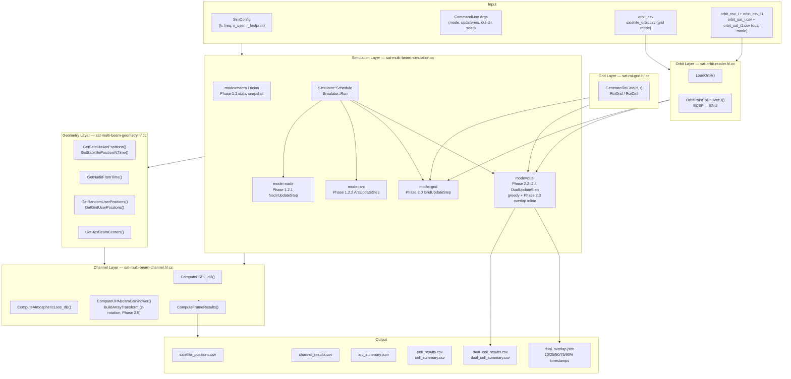
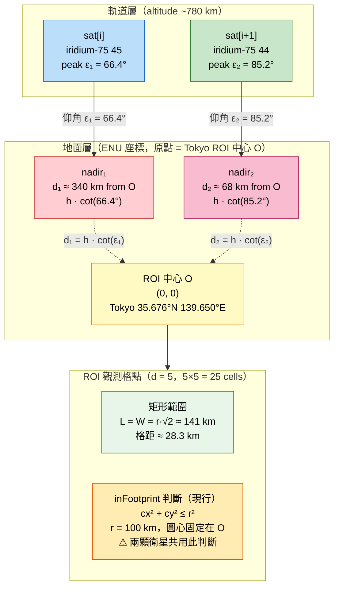
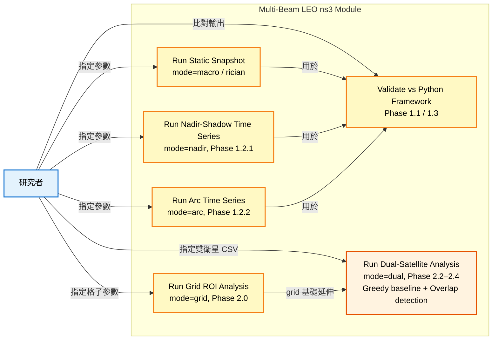
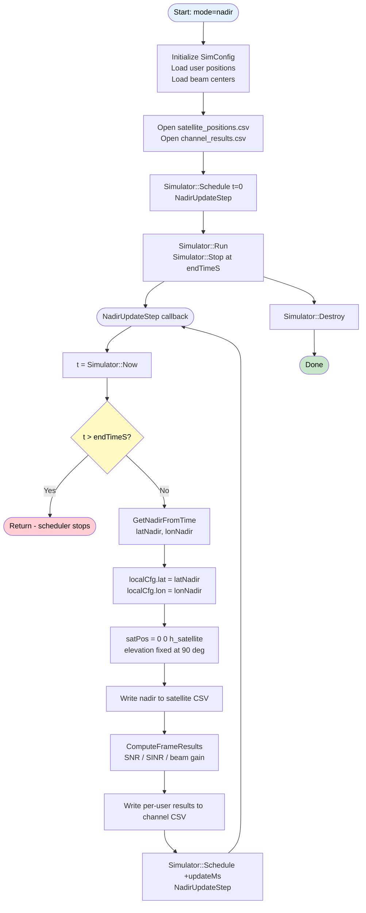
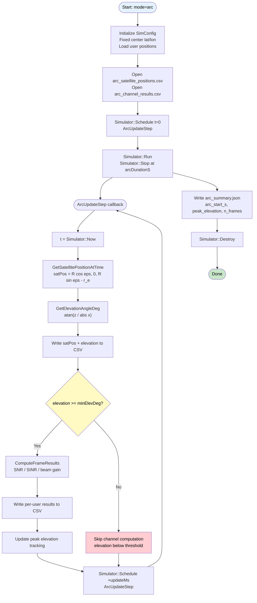
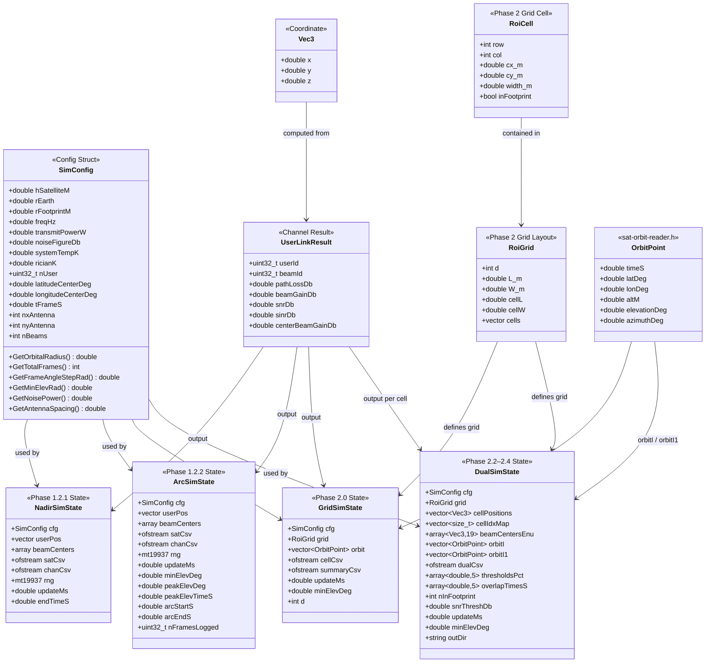

<h1 align="center">Multi-Beam LEO 衛星通道模擬模組</h1>
<h3 align="center">C++ / ns3 / Hypatia 三階段實作 — 完整複製 Python 框架</h3>


---

## 目錄

- [介紹](#介紹)
- [執行進度](#執行進度)
- [最低需求](#最低需求)
- [系統模型](#系統模型)
- [Phase 演進架構](#phase-演進架構)
- [系統架構](#系統架構)
- [模擬模式](#模擬模式)
- [使用案例圖](#使用案例圖)
- [流程圖](#流程圖)
- [Class 圖](#class-圖)
- [系統參數表](#系統參數表)
- [輸出格式](#輸出格式)
- [執行指令](#執行指令)
- [驗證結果](#驗證結果)
- [參考文獻](#參考文獻)

---

## 介紹

複製 Python 框架（`2D/projection/`）的multi-beam channel計算

- **Phase 1.1**：純 C++ standalone 實作（不依賴 ns3），與 Python 框架做 1:1 數值對齊。
- **Phase 1.2**：透過 ns3 模組完成相同計算，以 `Simulator::Schedule` 取代 for 迴圈驅動時間序列。
- **Phase 1.3**：引入 Hypatia 的程式碼，補完 Phase 1.1 / 1.2 無法處理的部分（如大地坐標轉換、軌道計算）。
- **Phase 2**：以固定地面 ROI（Tokyo，d×d 格點）模擬衛星換手場景。由 Iridium-66 TLE（SGP4）找出依序服務 ROI 的衛星序列 sat[0]→sat[1]→…，對任意相鄰衛星對 (sat[i], sat[i+1]) 模擬 5 個覆蓋重疊階段（10/25/50/75/90% 格點被 sat[i+1] 覆蓋），以 Greedy 分配（每格取 SNR 較高的衛星）產生基準結果，輸出每格 SNR 熱圖（Figure A）與全格 SNR CDF（Figure B）。此為 Beam Hopping 排程器的比較基準。

**1. 研究背景**

- LEO 衛星過境時間短（約 10 分鐘），衛星位置、仰角、使用者 beam gain 與 SNR 均隨時間快速變化。
- 現有 Python 框架已驗證 UPA 波束成形模型，但缺乏與 ns3 事件驅動架構的整合，無法模擬動態協議行為（排隊、排程、重傳）。
- ns3 / SNS3 生態系提供衛星通道模型與流量模擬的整合環境，但需先驗證通道幾何計算的等價性。

**2. 研究重要性**

- 確認 C++ 通道模型與 Python 框架等價，可作為後續 ns3 / SNS3 整合的數值基礎。
- 時間序列輸出（仰角曲線、SNR 時程）為後續 QoS 分析、調度器設計提供輸入資料。
- ROI 觀測模式量化衛星換手過程中各格點的通道品質，作為 Beam Hopping 排程的比較基準。
- 5 個覆蓋重疊階段的 Greedy 基準結果，提供後續 Beam Hopping 排程器改善幅度的量化依據。

**4. 問題**

| 問題 | 說明 |
|---|---|
| 坐標系一致性 | Local frame 原點隨衛星 nadir 移動（nadir-shadow 模式）或固定（arc 模式），兩種設計需明確區分 |
| 數值等價性 | C++ `double` 精度與 Python `float64` 的 UPA 計算差異需控制在 p95 < 0.5 dB |
| 事件驅動重構 | 將靜態 `for` 迴圈改為 `Simulator::Schedule` 驅動，需處理狀態結構的生命週期管理 |
| Hypatia 整合 | Hypatia `distance_tools.py` 使用 WGS72 大地坐標，需與 local frame 轉換驗算 |
|  軌道模型選擇 | Phase 1 採理想圓形軌道（固定高度、固定軌道半徑）。Phase 2 的 ROI 觀測需要更精確的覆蓋時段預測，改用 SGP4 。理想圓形軌道誤差在 LEO 短弧段（< 10 min）約 ±0.1°，是否在可接受範圍內須先確認 |

---

## 執行進度

> [!NOTE]
> 狀態說明：✅ 已完成，⏳ 進行中，❌ 尚未開始

| 階段 | 說明 | 狀態 | 時間 | 備註 |
|---|---|---|---|---|
| Phase 1.1 | 純 C++ standalone — 複製 Python 框架靜態快照 | ✅ | 2026-05 | center beam gain 47.712 dB，不依賴 ns3，數值對齊 Python 框架 |
| Phase 1.2.1 | ns3 event loop — nadir-shadow 模式（複製 Python 框架） | ✅ | 2026-05 | NadirSimState + NadirUpdateStep，`mode=nadir` |
| Phase 1.2.2 | ns3 event loop — arc 模式（複製 Python 框架，仰角曲線） | ✅ | 2026-05 | GetSatellitePositionAtTime + ArcSimState，`mode=arc` |
| Phase 1.3 | Hypatia 補完 — 1.1/1.2 無法處理的部分 | ✅ | 2026-05 | T1–T4 全部 PASS；ENU round-trip error 3.91e-14°；geocentric ERAD 差 0.154°（已知差異，不影響 Phase 2） |
| **Phase 1 Exit Gate** | Python n_user=95 執行 [38537,33090,23932] frame → SNR/SINR 比對表 | ✅ | 2026-05-23 | Δ = 0.000 dB 全部吻合，見 TECH.md Section 6.3 |
| **Phase 1 Exit Gate** | Arc mode 輸出驗證（仰角曲線單峰） | ✅ | 2026-05-23 | peak 89.981° at t=385.4s，pass 10.4 min，單峰確認 |
| Phase 2.0 | ROI 格點產生編譯驗證（VMware） | ✅ | 2026-05-24 | 25/25 in-FP cells；coverage_s=372.3s；center cell mean_snr=3.606 dB；SNR 熱圖中心高、四角低，footprint 幾何正確 |
| Phase 2.1 | 衛星序列選擇：擴展 `run_sgp4.py`，從 Iridium-66 TLE 找出服務 ROI 的衛星序列 sat[0]→sat[1]→…，輸出兩份 orbit CSV | ✅ | 2026-05-23 | sat[i]=iridium-75 45（peak 66.4° at t=50s）、sat[i+1]=iridium-75 44（peak 85.2° at t=580s），同 plane 5；window [0,1030s]，各 10301 rows；重疊窗口 t=190–440s（250s） |
| Phase 2.2 | 雙衛星 C++ 模擬迴圈：同時載入 orbit_sat_i.csv + orbit_sat_i1.csv，對同一固定 ROI 格點計算兩衛星的 per-cell SNR | ✅ | 2026-05-23 | 25 in-FP cells；sat[i] coverage=372.3s，sat[i+1]=651.2s；center cell greedy SNR +0.65 dB；3 輸出檔案生成正常 |
| Phase 2.3 | 5 個重疊階段偵測：找出 sat[i+1] 覆蓋 10/25/50/75/90% ROI 格點的時間點 | ✅ | 2026-05-23 | 內嵌於 Phase 2.2；**v2（Phase 2.5 修正後）**：10pct=318.7s, 25pct=322.3s, 50pct=327.7s, 75pct=334.5s, 90pct=336.4s（均在重疊窗口 190–440s 內）；v1 原始值見 `0523_phase2.5-low-elevation-beam-correction.md` |
| Phase 2.4 | Greedy 分配 + 輸出：每格取 SNR 較高的衛星，輸出 per-cell SNR → Figure A（熱圖）+ Figure B（CDF） | ✅ | 2026-05-23 | sat[i]=2.61 dB, sat[i+1]=2.49 dB, Greedy=3.19 dB（全格均值）；Figure A 三張熱圖 + Figure B CDF 生成 |
| Phase 2.5 | 低仰角 UPA beam 方位角修正：`BuildArrayTransform` 新增 z 軸預旋轉，修正 satPos.y ≠ 0 的 beam gain 誤差 | ✅ | 2026-05-23 | v2 vs v1 Δ: sat[i]=−0.033 dB, sat[i+1]=−0.075 dB, Greedy=−0.061 dB（最大 ~0.20 dB 角落格點）；中心格點 Δ=0（對稱驗證通過）；Figure A/B 已更新至 dual_d5_v2/figures/ |

---

## 最低需求

| 項目 | 需求 |
|---|---|
| 作業系統 | Ubuntu 22.04 LTS |
| ns3 版本 | ns-3.43  |
| C++ 標準 | C++17（`std::filesystem` 需要） |
| Python（Phase 1.3） | Python 3.10+，NumPy、Pandas |
| Hypatia（Phase 1.3） | hypatia-master（satgenpy 子模組） |
| 磁碟空間 | 各 phase 輸出目錄約 10–50 MB |

---

## 系統模型

### 衛星弧形幾何（Phase 1 arc 模式）

Phase 1 採用理想圓形軌道，衛星在 **x-z 平面**運動（`y_sat = 0` 恆成立），以仰角參數 `ε` 描述位置：

```
R       = r_earth + h_satellite              （軌道半徑）
ε(T)    = ε₀ + T / t_frame × Δε             （隨時間變化的仰角參數）

satPos（arc 模式）：
  x_sat = R · cos(ε)
  z_sat = R · sin(ε) − r_earth
  y_sat = 0                                  （arc 模式永遠 = 0）

nadir（對地投影點，用於 nadir-shadow 模式）：
  x_nad = r_earth · cos(ε)
  z_nad = r_earth · sin(ε) − r_earth        （≡ 0，地表點）
  y_nad = 0

elevation angle（Phase 1 簡化，y=0 假設）：
  elev  = atan( z_sat / |x_sat| )
```

在 T_peak（ε = π/2）時：`satPos = {0, 0, h_satellite}`（正上方）。

> **Phase 2 ENU 幾何（SGP4 真實軌道）**：衛星位置由 SGP4 推算後轉換至以地面觀測點為原點的東-北-上（ENU）座標系，`satPos = (E_s, N_s, U_s)` 三分量均可非零。仰角公式改為完整 3D 形式：
> ```
> ε = arctan( U_s / sqrt(E_s² + N_s²) )
> ```
> Phase 2.5 的 UPA beam 修正（z 軸預旋轉）即針對 `N_s ≠ 0` 情境設計，arc 模式下 `N_s = 0` 時自動退化為 identity，向後相容。

### 通道模型

| 分量 | 公式 |
|---|---|
| 自由空間路徑損失 | `FSPL = 20·log10(4π·d·f / c)` |
| 大氣損失 | `L_atm ≈ 0.55 / sin(ε)` dB（天頂縮放近似） |
| 總路徑損失 | `PL = FSPL + L_atm` |
| UPA beam gain | `G = AF²(Nx, ΔΦx) · AF²(Ny, ΔΦy) / (Nx²·Ny²·Nbeams)` |
| Array factor | `AF²(N, ΔΦ) = sin²(N·π·ΔΦ/2) / sin²(π·ΔΦ/2)` |
| SNR | `SNR = P_tx + G_peak + G_b*(i,j) − L_fs − L_atm − N_th`（dB）；`G_peak = antennaGainDb = 60.5 dBi`；`G_b* = 10·log₁₀(AF²(Nx,ΔΦx)·AF²(Ny,ΔΦy) / (Nx²·Ny²·Nb))` |
| SINR | `SINR = SNR − 10·log10(1 + Σ I_k / N_thermal)` |
| Rician fading | K = 10，`amplitude ~ Rice(√(K/(K+1)), √(1/(2(K+1))))` |

---


### Python ↔ C++ 函式對照（完整版）

| Python 框架 | 所在檔案 | C++ 等價 | Phase |
|---|---|---|---|
| `get_satellite_pos()` | `networkGeometry.py` | `GetSatelliteArcPositions()` | 1.1 |
| `get_user_position(n_user)` | `networkGeometry.py` | `GetRandomUserPositions()` | 1.1 |
| `get_grid_positions(user_distance)` | `networkGeometry.py` | `GetGridUserPositions()` | 1.1 |
| `hex_grid_centers_two_rings()` | `networkGeometry.py` | `GetHexBeamCenters()` | 1.1 |
| `path_loss(user_pos, sat_pos)` | `channel.py` | `ComputeFSPL_dB()` + `ComputeAtmosphericLoss_dB()` | 1.1 |
| `fixed_beam_steering(sat_pos, beam_centers)` | `channel.py` | beam steering inside `ComputeUPABeamGainPower()` | 1.1 |
| `get_effective_channel(...)` | `channel.py` | `ComputeUPABeamGainPower()` (Dirichlet kernel) | 1.1 |
| `calculate_simulation_result(...)` | `simulation.py` | `ComputeFrameResults()` | 1.1 |
| `run_simulations_and_save_results_macro()` | `simulation.py` | `mode=macro` / `mode=nadir` event loop | 1.2 |
| — *(ideal arc orbit)* | `simulation.py` | `GetSatellitePositionAtTime()` + `mode=arc` | 1.2.2 |
| — *(nadir tracking)* | — | `GetNadirFromTime()` | 1.2.1 |
| — *(SGP4 / PyEphem)* | `run_sgp4.py` | `LoadOrbit()` + `OrbitPointToEnuVec3()` | 1.3 |
| — *(ROI grid)* | — | `GenerateRoiGrid()` + `mode=grid` | 2.0 |

---

## 系統架構



### 模組對應關係（Python ↔ C++）

| Python 框架 | C++ 等價 |
|---|---|
| `networkGeometry.get_satellite_pos()` | `GetSatelliteArcPositions()` |
| `networkGeometry.get_user_position()` | `GetRandomUserPositions()` |
| `networkGeometry.hex_grid_centers_two_rings()` | `GetHexBeamCenters()` |
| `utils.get_elevation_angle_from_center()` | `GetElevationAngleDeg()` |
| `utils.get_positions_in_lat_long_coordinates()` | `GetLatLon()` |
| `channel.compute_fspl()` | `ComputeFSPL_dB()` |
| UPA steering vector matrix product | `ComputeUPABeamGainPower()` (Dirichlet kernel) |
| `simulate_frame()` | `ComputeFrameResults()` |

---

## 模擬模式

| 模式 | 說明 | Frame 中心 | 衛星位置 | 仰角 | 驅動方式 |
|---|---|---|---|---|---|
| `macro` | 格點使用者，無 fading，靜態快照 | 隨 nadir 移動 | `{0, 0, h}` | 固定 90° | `for` 迴圈 |
| `rician` | 隨機使用者，Rician fading，靜態快照 | 隨 nadir 移動 | `{0, 0, h}` | 固定 90° | `for` 迴圈 |
| `nadir` | Phase 1.2.1：ns3 事件驅動，nadir-shadow | 隨 nadir 移動 | `{0, 0, h}` | 固定 90° | `Simulator::Schedule` |
| `arc` | Phase 1.2.2：ns3 事件驅動，完整弧形 | 固定在 pass 中心 | `{R·cos(ε), 0, R·sin(ε)−r_e}` | 低→高→低 | `Simulator::Schedule` |
| `grid` | Phase 2.0：d×d 平面格子 ROI（SGP4 軌道，單衛星） | 固定觀測點 | 由 SGP4 CSV 讀入 | 低→高→低 | `Simulator::Schedule` |
| `dual` | Phase 2.2–2.4：雙衛星 ROI，Greedy 分配，Phase 2.3 Overlap 偵測 | 固定觀測點 | 由兩份 SGP4 CSV 讀入（sat[i] + sat[i+1]） | 低→高→低（各自獨立） | `Simulator::Schedule` |

---

## Phase 2 設計：平面投影 + d×d 格子 ROI

### 概念

Phase 1 以圓形 footprint + 19 個六角 beam 複製 Python 框架。  
Phase 2 改為將 footprint 投影到真正的平面矩形，再平均分割成 d×d 格子，每格作為獨立 ROI 計算通道品質。衛星位置由 SGP4（Hypatia）預先跑完寫入 CSV，不再使用理想圓形軌道即時計算。

```
SGP4 預先跑完 → satellite_orbit.csv
         ↓
每個時間步：
  讀入 (lat, lon, alt) → local ENU 平面座標 → elevation angle
         ↓
  footprint 投影到平面 → 最大內接矩形 (L × W)
         ↓
  切成 d×d 格子 → 每格中心點計算 SNR/SINR
         ↓
  輸出 cell_results.csv + cell_summary.csv
```

### ROI 幾何圖解（Phase 2.2–2.5 雙衛星場景）

#### 衛星–nadir–ROI 關係圖



#### 俯視圖（ENU 平面，東→ 北↑）

```
N（北）
↑
│  sat[i] nadir N₁             ROI 中心 O             sat[i+1] nadir N₂
│        ×                          ⊕                          ×
│        │←── d₁ ≈ 340 km ─────────│←── d₂ ≈ 68 km ──────────│
│
│        ┌ ─ ─ ─ ─ ─ ─ ─ ─ ─ ─ ─ ─ ─ ─ ─ ─ ─ ─ ─ ─ ─ ─ ─ ┐
│             現行 inFootprint 圓（r = 100 km，圓心 = O）
│        │                                                    │
│             ╔════════════════════╗
│        │    ║  ┌──┬──┬──┬──┬──┐ ║  │  ← ROI 矩形
│             ║  │  │  │  │  │  │ ║       L = W ≈ 141 km
│        │    ║  ├──┼──┼──┼──┼──┤ ║  │
│             ║  │  │  │██│  │  │ ║       ██ = center cell (0, 0)
│        │    ║  ├──┼──┼──┼──┼──┤ ║  │
│             ║  │  │  │  │  │  │ ║
│        │    ║  └──┴──┴──┴──┴──┘ ║  │
│             ╚════════════════════╝
│        └ ─ ─ ─ ─ ─ ─ ─ ─ ─ ─ ─ ─ ─ ─ ─ ─ ─ ─ ─ ─ ─ ─ ─ ┘
│
└────────────────────────────────────────────────────────────→ E（東）

  角落格點（cx = ±70.7 km，cy = ±70.7 km）與各 nadir 的距離：
    到 N₁（sat[i]，  d₁ = 340 km）：√((340+71)² + 71²) ≈ 416 km  >> r = 100 km
    到 N₂（sat[i+1]，d₂ =  68 km）：√(( 68+71)² + 71²) ≈ 156 km  >> r = 100 km
  ⚠ 現行程式碼以 O 為圓心，角落格點仍標記 inFootprint = true（已知偏差）
```

#### 側視圖（仰角幾何）

```
altitude (km)
    ↑
780 ├───── sat[i] ×                              sat[i+1] ×
    │              ╲ ε₁ = 66.4°                          ╲ ε₂ = 85.2°
    │               ╲                                      ╲
    │                ╲                                      ╲
    │                 ╲                                      ╲
  0 ├──────────────────×──────────────────────────×──────────×──→ 地面（East）
                       N₁                         O         N₂
                       │←─── d₁ ≈ 340 km ─────────│←── d₂ ──│
                                                           ≈68km

  d = h · cot(ε)，h ≈ 780 km（Iridium NEXT SGP4）：
    sat[i]  ：d₁ = 780 × cot(66.4°) ≈ 340 km
    sat[i+1]：d₂ = 780 × cot(85.2°) ≈  68 km

  Phase 2.5 最優切分線（幾何推導）：
    x_split = (d₂ − d₁) / 2 = (68 − 340) / 2 = −136 km
    → 超出 ROI 範圍（±70.7 km），代表整個 ROI 幾何上更靠近 sat[i+1]
    → Greedy 結果顯示 sat[i+1] 在重疊窗口期間多數格點勝出，與此一致
```

### 最大內接矩形（L × W）

| 條件 | L（沿軌）| W（橫軌）|
|---|---|---|
| elevation = 90°（正上方） | r × √2 | r × √2（正方形） |
| elevation = ε（低仰角） | 2r | 2r × sin(ε)（超出目前實作範圍） |

Phase 2.0–2.5 統一採用 elevation = 90° 的正方形近似。低仰角足跡變形（橫軌方向壓縮）留待後續研究；Phase 2.5 已修正的是 UPA beam gain 的低仰角方位角偏差，兩者不同。

### d×d 格子幾何

```
矩形範圍：L × W（公尺）
格子大小：cellL = L/d，cellW = W/d
格子中心：cx = -L/2 + (col+0.5)*cellL
          cy = -W/2 + (row+0.5)*cellW
是否有效：cx² + cy² ≤ r_footprint²（圓形 footprint 篩選）
```

### 輸出格式

**`cell_results.csv`**（每時間步 × 每格）：

| 欄位 | 說明 |
|---|---|
| `time_s` | 模擬時間（秒） |
| `row`, `col` | 格子座標（0..d-1） |
| `cx_m`, `cy_m` | 格子中心 local ENU 座標（公尺） |
| `elevation_deg` | 當前仰角 |
| `in_footprint` | 是否在圓形 footprint 內（0/1） |
| `path_loss_dB` | 路徑損耗 |
| `beam_gain_dB` | UPA beam gain |
| `snr_dB`, `sinr_dB` | 訊雜比 |

**`cell_summary.csv`**（每格跨整個 pass 的統計）：

| 欄位 | 說明 |
|---|---|
| `row`, `col` | 格子座標 |
| `cx_m`, `cy_m` | 格子中心座標 |
| `coverage_s` | 衛星可見總秒數（elevation > min_elev） |
| `mean_snr_dB` | 覆蓋期間平均 SNR |
| `min_snr_dB`, `max_snr_dB` | SNR 範圍 |

### 新增檔案

| 檔案 | 說明 |
|---|---|
| `2D/code/scripts/run_sgp4.py` | SGP4 前置腳本，輸出 `satellite_orbit.csv`；Phase 2.1 新增 `--mode=sequence` |
| `2D/code/phase1-ns3/sat-roi-grid.h/.cc` | d×d 格子幾何（`RoiCell`、`RoiGrid`、`GenerateRoiGrid()`） |
| `2D/code/phase1-ns3/sat-orbit-reader.h/.cc` | 讀入 SGP4 軌道 CSV（`OrbitPoint`、`LoadOrbit()`） |

### VMware 編譯 Checklist

**Step 1 — 複製檔案到 scratch 目錄**

以下 4 個 Phase 2.0 新增檔案需複製到 VMware ns3 scratch（與 `sat-multi-beam-*.cc/.h` 同層）：

```
sat-roi-grid.h
sat-roi-grid.cc
sat-orbit-reader.h
sat-orbit-reader.cc
```

**Step 2 — 更新 CMakeLists.txt**

在 scratch `CMakeLists.txt` 的 `build_exec` 加入兩個新 `.cc`：

```cmake
build_exec(
    EXECNAME sat-multi-beam-simulation
    SOURCE_FILES
        sat-multi-beam-simulation.cc
        sat-multi-beam-geometry.cc
        sat-multi-beam-channel.cc
        sat-orbit-reader.cc   # Phase 2.0 新增
        sat-roi-grid.cc       # Phase 2.0 新增
    LIBRARIES_TO_LINK
        ${libcore}
        ${libsatellite}
)
```

> 若使用 WAF（wscript），對應加入：`'sat-orbit-reader.cc', 'sat-roi-grid.cc'`

**Step 3 — 編譯驗證**

```bash
./ns3 build sat-multi-beam-simulation
```

**Step 4 — SGP4 軌道前置計算（使用 Hypatia 內建 Kuiper TLE 快速驗證）**

```bash
python 2D/projection/code/scripts/run_sgp4.py \
    --tle-file hypatia-master/ns3-sat-sim/simulator/test_data/end_to_end/satellite_network_state/tles.txt \
    --observer-lat 35.676 \
    --observer-lon 139.650 \
    --duration-s 770 \
    --step-ms 100 \
    --output satellite_orbit_kuiper.csv
```

**Step 5 — Grid Mode 執行**

```bash
./ns3 run "sat-multi-beam-simulation \
  --mode=grid \
  --d=5 \
  --orbit-csv=scratch/satellite_orbit_kuiper.csv \
  --update-ms=100 \
  --min-elevation-deg=5 \
  --lat=35.676 \
  --lon=139.650 \
  --out-dir=scratch/grid_d5" \
  2>&1 | tee scratch/grid_d5_run.log
```

**Step 6 — Phase 2.0 通過條件**

```
1. 程式執行到 "Done. Output in: scratch/grid_d5"
2. cell_results.csv 非空，含 in_footprint=1 的行
3. cell_summary.csv 中 coverage_s > 0 的格子呈圓形分布
4. 中心格（row≈2, col≈2）mean_snr_dB 與 Phase 1.1 beam 9（10.629 dB）差 < 0.5 dB
```

### 已知設計限制（beam center 近似）

`GetHexBeamCenters()` 計算 beam center 時假設衛星在 footprint center 正上方（elevation = 90°）。在低仰角時 beam center ENU 位置有近似誤差，但 Phase 2.0 驗證條件（center cell ≈ Phase 1.1）屬於 elevation ≈ 90° 情境，不影響 Pass/Fail。Phase 2.2 如需精確低仰角 beam gain 可引入動態 beam center 計算。

---

## 使用案例圖



---

## 流程圖

### Phase 1.2.1 — Nadir-Shadow 模式



### Phase 1.2.2 — Arc 模式



### Phase 2.2–2.4 — Dual-Satellite 模式（DualUpdateStep）

```mermaid
flowchart TD
    Start(["Start: mode=dual"])
    LoadOrbits["Load orbitI + orbitI1\nfrom orbit_sat_i.csv + orbit_sat_i1.csv"]
    BuildGrid["GenerateRoiGrid(d, r)\nbuild RoiGrid, collect in-footprint cells"]
    OpenCsv["Open dual_cell_results.csv"]
    Schedule0["Simulator::Schedule t=0\nDualUpdateStep"]
    SimRun["Simulator::Run\nSimulator::Stop at max(orbitI.end, orbitI1.end)"]

    DualStep(["DualUpdateStep callback"])
    GetTime["t = Simulator::Now"]
    AdvancePtr["Advance orbitI / orbitI1 pointers\nto last point with timeS <= t"]
    GetElev["elevI = ptI.elevationDeg\nelevI1 = ptI1.elevationDeg"]
    CheckVisI{"elevI >= minElevDeg?"}
    ComputeI["OrbitPointToEnuVec3 → satEnuI\nComputeFrameResults → resI"]
    SkipI["resI = empty\n(sat[i] not visible)"]
    CheckVisI1{"elevI1 >= minElevDeg?"}
    ComputeI1["OrbitPointToEnuVec3 → satEnuI1\nComputeFrameResults → resI1"]
    SkipI1["resI1 = empty\n(sat[i+1] not visible)"]
    WriteCsv["AppendDualCellCsvRows\ntime, row, col, SNR_i, SNR_i1, best_sat"]
    AccumStats["Accumulate DualCellStats\ncoverage_s, sum_snr, max_snr"]
    CalcGreedy["greedy_snr = max(SNR_i, SNR_i1)\n(Phase 2.4 baseline)"]
    OverlapCheck["Count cells: sat[i+1] SNR >= snrThreshDb\n(Phase 2.3 inline)"]
    RecordThresh["Record first-crossing time\nfor 10/25/50/75/90% thresholds"]
    CheckEnd{"nextT <= winEnd?"}
    Reschedule["Simulator::Schedule +updateMs\nDualUpdateStep"]
    WriteSummary["WriteDualSummaryCsv\ndual_cell_summary.csv"]
    WriteOverlap["WriteDualOverlapJson\ndual_overlap.json\n10/25/50/75/90% timestamps"]
    Destroy["Simulator::Destroy"]
    Done(["Done"])

    Start --> LoadOrbits --> BuildGrid --> OpenCsv --> Schedule0 --> SimRun --> DualStep
    DualStep --> GetTime --> AdvancePtr --> GetElev
    GetElev --> CheckVisI
    CheckVisI -->|Yes| ComputeI --> CheckVisI1
    CheckVisI -->|No| SkipI --> CheckVisI1
    CheckVisI1 -->|Yes| ComputeI1 --> WriteCsv
    CheckVisI1 -->|No| SkipI1 --> WriteCsv
    WriteCsv --> AccumStats --> CalcGreedy --> OverlapCheck --> RecordThresh --> CheckEnd
    CheckEnd -->|Yes| Reschedule --> DualStep
    CheckEnd -->|No| WriteSummary --> WriteOverlap --> Destroy --> Done

    style Start fill:#e3f2fd,color:#000
    style Done fill:#c8e6c9,color:#000
    style CheckVisI fill:#fff9c4,color:#000
    style CheckVisI1 fill:#fff9c4,color:#000
    style CheckEnd fill:#fff9c4,color:#000
    style SkipI fill:#ffcdd2,color:#000
    style SkipI1 fill:#ffcdd2,color:#000
    style CalcGreedy fill:#e8f5e9,color:#000
    style RecordThresh fill:#e8f5e9,color:#000
```



---

## Class 圖



---

## 系統參數表

> Phase 1 採用 struct 預設值；Phase 2 採用 `sat-multi-beam-config.h` 實際設定值（Iridium NEXT，Tokyo，Ka-band）

| 類別 | 參數 | 型別 | 單位 | 說明 | Phase 1 預設 | Phase 2 實際 |
|---|---|---|---|---|---|---|
| **軌道** | `hSatelliteM` | double | m | 衛星高度 | 600,000 | ~780,000 (SGP4) |
| **軌道** | `rEarth` | double | m | 地球半徑 | 6,371,000 | 6,371,000 |
| **覆蓋** | `rFootprintM` | double | m | Footprint 半徑 | 100,000 | 100,000 |
| **通道** | `freqHz` | double | Hz | 載波頻率（Ka-band） | 30×10⁹ | 30×10⁹ |
| **通道** | `bandwidthHz` | double | Hz | 頻寬 | 25×10⁶ | 25×10⁶ |
| **通道** | `transmitPowerW` | double | W | 傳送功率 | 20.0 | **63.0** |
| **通道** | `antennaGainDb` | double | dB | Peak UPA array gain | 60.5 | **60.5** |
| **通道** | `noiseFigureDb` | double | dB | 接收機雜訊指數 | 2.0 | **7.0** |
| **通道** | `systemTempK` | double | K | 系統溫度 | 290.0 | **300.0** |
| **通道** | `ricianK` | double | — | Rician K 因子 | 10.0 | 10.0 |
| **天線** | `nxAntenna` | int | — | UPA x 方向元件數 | 8 | **32** |
| **天線** | `nyAntenna` | int | — | UPA y 方向元件數 | 8 | **32** |
| **天線** | `nBeamsX` | int | — | Beam grid x（sub-array） | 5 | 5 |
| **天線** | `nBeamsY` | int | — | Beam grid y（sub-array） | 4 | 4 |
| **天線** | `nBeams` | int | — | 有效波束數（hex trim） | 19 | 19 |
| **使用者** | `nUser` | uint32_t | — | 使用者數量（Phase 1 only） | 100 | — |
| **座標** | `latitudeCenterDeg` | double | ° | Footprint 中心緯度 | 25.0 | **35.676** (Tokyo) |
| **座標** | `longitudeCenterDeg` | double | ° | Footprint 中心經度 | 121.0 | **139.650** (Tokyo) |
| **時間** | `tFrameS` | double | s | 每 frame 時間長度 | 0.01 | 0.01 |
| **模擬** | `updateMs` | double | ms | 事件驅動更新間隔 | 100.0 | 100.0 |
| **模擬** | `minElevDeg` | double | ° | 最低仰角門檻 | 5.0 | 5.0 |
| **模擬** | `snrThreshDb` | double | dB | 覆蓋判斷 SNR 門檻 | — | 0.0 |
| **模擬** | `seed` | uint32_t | — | RNG seed | 42 | 42 |

---

## 輸出格式

### satellite_positions.csv（nadir 模式）

| 欄位 | 說明 |
|---|---|
| `time_s` | 模擬時間（秒） |
| `lat_nadir_deg` | 衛星 nadir 緯度 |
| `lon_nadir_deg` | 衛星 nadir 經度 |

### arc_satellite_positions.csv（arc / roi 模式）

| 欄位 | 說明 |
|---|---|
| `time_s` | 模擬時間（秒） |
| `sat_x_m` | 衛星 local frame x 座標 |
| `sat_y_m` | 衛星 local frame y 座標（永遠 0） |
| `sat_z_m` | 衛星 local frame z 座標 |
| `elevation_deg` | 仰角（度） |

### channel_results.csv（所有模式）

| 欄位 | 說明 |
|---|---|
| `time_s` | 模擬時間（秒） |
| `user_id` | 使用者 ID |
| `beam_id` | 分配的波束 ID（0–18） |
| `path_loss_dB` | 總路徑損失（FSPL + 大氣） |
| `beam_gain_dB` | UPA 波束增益 |
| `snr_dB` | 訊雜比 |
| `sinr_dB` | 訊號與干擾雜訊比 |

### arc_summary.json（arc 模式）

```json
{
  "arc_start_s": 0.0,
  "arc_end_s": 770.0,
  "peak_elevation_s": 385.37,
  "peak_elevation_deg": 89.997,give me the cmd that i will run it again then fill the gap
  "n_frames_logged": 7700,
  "update_ms": 100.0,
  "min_elevation_deg": 5.0
}
```

### dual_cell_results.csv（dual 模式，每時間步 × 每格）

| 欄位 | 說明 |
|---|---|
| `time_s` | 模擬時間（秒） |
| `row`, `col` | 格子座標（0..d-1） |
| `cx_m`, `cy_m` | 格子中心 local ENU 座標（公尺） |
| `elevation_i_deg` | sat[i] 仰角（度） |
| `snr_i_dB`, `sinr_i_dB` | sat[i] SNR/SINR（不可見時為 -999） |
| `elevation_i1_deg` | sat[i+1] 仰角（度） |
| `snr_i1_dB`, `sinr_i1_dB` | sat[i+1] SNR/SINR（不可見時為 -999） |
| `best_sat` | 0=sat[i] wins，1=sat[i+1] wins，-1=均不可見 |

### dual_cell_summary.csv（dual 模式，每格跨整個 pass 的統計）

| 欄位 | 說明 |
|---|---|
| `row`, `col` | 格子座標 |
| `cx_m`, `cy_m` | 格子中心座標 |
| `in_footprint` | 是否在圓形 footprint 內（0/1） |
| `coverage_i_s` | sat[i] 可見總秒數 |
| `mean_snr_i_dB`, `max_snr_i_dB` | sat[i] 覆蓋期間平均/最大 SNR |
| `coverage_i1_s` | sat[i+1] 可見總秒數 |
| `mean_snr_i1_dB`, `max_snr_i1_dB` | sat[i+1] 覆蓋期間平均/最大 SNR |
| `greedy_mean_snr_dB` | Greedy 策略（每步取較高 SNR）全程平均 SNR（Phase 2.4 基準） |

### dual_overlap.json（dual 模式，Phase 2.3 Overlap 偵測）

```json
{
  "n_in_footprint": 25,
  "snr_threshold_dB": 0.0,
  "thresholds_pct": [10, 25, 50, 75, 90],
  "sat_i1_coverage_times_s": {
    "10pct": 318.7,
    "25pct": 322.3,
    "50pct": 327.7,
    "75pct": 334.5,
    "90pct": 336.4
  }
}
```

---

## 執行指令

### Phase 1.1 — 靜態快照驗證

```bash
# macro 模式（格點使用者，無 fading）
./ns3 run "sat-multi-beam-simulation \
  --mode=macro \
  --time-s=385.37 \
  --n-user=37 \
  --out-dir=scratch/v1_macro"

# Rician fading 模式
./ns3 run "sat-multi-beam-simulation \
  --mode=rician \
  --time-s=385.37 \
  --n-user=37 \
  --out-dir=scratch/v1_rician"
```

### Phase 1.2.1 — Nadir-Shadow 時間序列

```bash
./ns3 run "sat-multi-beam-simulation \
  --mode=nadir \
  --update-ms=100 \
  --duration-s=770 \
  --n-user=37 \
  --out-dir=scratch/nadir_output"
```

**驗證：** t=385.37s 的輸出應與 Phase 1.1 frame 38537 完全一致（center beam gain 47.712 dB）。

### Phase 1.2.2 — Arc 模式（仰角曲線）

```bash
./ns3 run "sat-multi-beam-simulation \
  --mode=arc \
  --update-ms=100 \
  --min-elevation-deg=5 \
  --n-user=37 \
  --out-dir=scratch/arc_output"
```

**驗證：**
1. `elevation_deg` 欄位呈拋物線（低→高→低）
2. peak 附近 `sat_x_m ≈ 0`、`sat_z_m ≈ 600000`
3. peak 時 center beam gain 與 Phase 1.2.1 同時刻差異 < 0.1 dB

### Phase 1.3 — Hypatia 座標驗證

```bash
# 安裝依賴（含 Hypatia 所需的 geopy）
pip install ephem geopy

# 執行四項驗證（使用 Hypatia 內建 Kuiper-630 TLE，不需外部 TLE 檔）
python 2D/projection/code/scripts/validate_phase1_3.py

# 可自訂觀測點與搜尋窗口
python 2D/projection/code/scripts/validate_phase1_3.py \
  --observer-lat 25.0 \
  --observer-lon 121.0 \
  --search-window-s 21600
```

**驗證內容**：

| 測試 | 說明 | 通過條件 |
|---|---|---|
| T1 | 衛星正上方 → ENU 仰角 ≈ 90° | error < 0.01° |
| T2 | ENU rotation round-trip (range/alt/az，ERAD-independent) | round-trip error < 1e-5° |
| T3 | SGP4 仰角曲線形狀為單峰弧形 | 一個 local peak |
| T4 | run_sgp4.py 輸出 CSV schema 正確 | 所有欄位存在，高度 500–800 km |

**後續 SGP4 軌道預計算**（Phase 2 準備）：

```bash
# 取得真實 TLE（如 Iridium）後執行預計算
python 2D/projection/code/scripts/run_sgp4.py \
  --tle-file iridium.tle \
  --duration-s 770 \
  --output satellite_orbit.csv
```

### Phase 2.0 — d×d Grid 模式（兩步驟）

> **重要**：Phase 2.0 使用 Tokyo 觀測點（lat=35.676, lon=139.650），必須選用過境 Tokyo 的衛星。
> 可直接重用 Phase 2.1 已驗證的 `orbit_sat_i.csv`（iridium-75 15，過境仰角最高 56.6°）。
> 禁止使用 `satellite_orbit_kuiper.csv`（iridium-75 0 從未升至 Tokyo 視角 5° 以上）。

**Step 1：SGP4 軌道預計算（Python，可跳過：直接重用 Phase 2.1 的 orbit_sat_i.csv）**

```bash
# 若需重新產生單衛星軌道 CSV（觀測點必須是 Tokyo）
python 2D/code/scripts/run_sgp4.py \
  --tle-file 2D/data/tle/iridium.txt \
  --observer-lat 35.676 \
  --observer-lon 139.650 \
  --duration-s 500 \
  --step-ms 100 \
  --output scratch/orbit_sat_i_phase20.csv

# 或直接複製 Phase 2.1 的已驗證軌道（推薦）
cp scratch/orbit_sat_i.csv scratch/orbit_sat_i_phase20.csv
```

**Step 2：ns3 Grid 模擬**

```bash
./ns3 run "sat-multi-beam-simulation \
  --mode=grid \
  --d=5 \
  --orbit-csv=scratch/orbit_sat_i.csv \
  --update-ms=100 \
  --min-elevation-deg=5 \
  --lat=35.676 \
  --lon=139.650 \
  --out-dir=scratch/grid_d5_iridium" \
  2>&1 | tee scratch/grid_d5_iridium.log
```

**Step 3：驗證指令**

```bash
python3 - <<'EOF'
import csv, sys
summary = list(csv.DictReader(open('scratch/grid_d5_iridium/cell_summary.csv')))
center = [r for r in summary if r['in_footprint']=='1'
          and int(r['row'])==2 and int(r['col'])==2]
if not center:
    print("ERROR: center cell not found"); sys.exit(1)
mean_snr = float(center[0]['mean_snr_dB'])
covered  = [r for r in summary if float(r['coverage_s']) > 0]
print(f"Center cell mean_snr_dB = {mean_snr:.3f} dB")
print(f"Covered cells           = {len(covered)} / {len(summary)}")
print(f"EC-1 (coverage_s > 0)   : {'PASS' if float(center[0]['coverage_s']) > 0 else 'FAIL'}")
print(f"EC-2 (mean_snr > 0 dB)  : {'PASS' if mean_snr > 0 else 'FAIL'}")
EOF
```

**輸出檔案：**
- `scratch/grid_d5_iridium/cell_results.csv` — 每時間步 × 每格 SNR/SINR
- `scratch/grid_d5_iridium/cell_summary.csv` — 每格跨整個 pass 的統計

**Phase 2.0 驗證條件（已修訂）：**
- EC-1：center cell `coverage_s > 0`（衛星確實在視角內過境 ROI 中心）
- EC-2：center cell `mean_snr_dB > 0 dB`（非零 SNR，footprint 幾何正確）
- EC-3：`coverage_s > 0` 的格子形成圓形區域（正確的 footprint 篩選）

> **說明**：原本的「與 Phase 1.1 beam 9 差異 < 0.5 dB」條件已移除。
> Phase 1.1 是 90° 仰角下的瞬時 SNR，Phase 2.0 mean_snr_dB 是整個過境期的時間均值（最高仰角 56.6°），
> 兩者在物理上不具直接可比性，用 0.5 dB 閾值進行比較沒有意義。

### Phase 2.1–2.5 — Dual-Satellite 模式（三步驟）

**Step 1：SGP4 sequence 雙衛星軌道預計算（Python）**

```bash
# 從 Iridium-66 TLE 找出服務 ROI 的衛星對，輸出兩份時間對齊的 CSV
python 2D/projection/code/scripts/run_sgp4.py \
    --mode=sequence \
    --tle-file iridium.tle \
    --observer-lat 35.676 \
    --observer-lon 139.650 \
    --duration-s 1030 \
    --step-ms 100 \
    --output-sat-i scratch/orbit_sat_i.csv \
    --output-sat-i1 scratch/orbit_sat_i1.csv
```

**Step 2：ns3 Dual Mode 模擬**

```bash
./ns3 run "sat-multi-beam-simulation \
  --mode=dual \
  --d=5 \
  --orbit-csv-i=scratch/orbit_sat_i.csv \
  --orbit-csv-i1=scratch/orbit_sat_i1.csv \
  --update-ms=100 \
  --min-elevation-deg=5 \
  --snr-thresh-db=0 \
  --lat=35.676 \
  --lon=139.650 \
  --out-dir=scratch/dual_d5" \
  2>&1 | tee scratch/dual_d5_run.log
```

**輸出檔案：**
- `scratch/dual_d5/dual_cell_results.csv` — 每時間步 × 每格，兩衛星 SNR + best_sat
- `scratch/dual_d5/dual_cell_summary.csv` — 每格統計：coverage、mean SNR、greedy SNR
- `scratch/dual_d5/dual_overlap.json` — Phase 2.3：sat[i+1] 覆蓋 10/25/50/75/90% ROI 的首次時間

**Step 3：繪圖（Phase 2.4 Figure A/B）**

```bash
python 2D/projection/code/scripts/plot_dual_results.py \
    --summary scratch/dual_d5/dual_cell_summary.csv \
    --d 5 \
    --out-dir scratch/dual_d5/figures
```

**Phase 2.2–2.4 驗證條件：**

```
1. dual_cell_summary.csv 中心格（row≈2, col≈2）greedy_mean_snr_dB > mean_snr_i_dB 且 > mean_snr_i1_dB
2. dual_overlap.json 全部 5 個閾值均在重疊窗口（elevI >= 5° 且 elevI1 >= 5°）內
3. Figure A 熱圖：greedy SNR 全格均值 > 各單衛星均值
4. Figure B CDF：greedy 曲線在 sat[i] 與 sat[i+1] 曲線右側
```

---

## 驗證結果

### 驗證總覽

| Phase | 驗證日期 | 驗證項目數 | 通過數 | 整體結果 |
|---|---|---|---|---|
| Phase 1.1 靜態快照（n_user=37） | 2026-05-21 | 5 | 5 | ✅ PASS |
| Phase 1.1 大規模使用者（n_user=121,807） | 2026-05-20 | 4 | 4 | ✅ PASS |
| Phase 1.3 Hypatia 座標系 | 2026-05-22 | 4 | 4 | ✅ PASS |
| Phase 1 Exit Gate（n_user=95） | 2026-05-23 | 2 | 2 | ✅ PASS |
| Phase 2.0 Grid ROI 模式 | 2026-05-24 | 3 | 3 | ✅ PASS |
| Phase 2.2–2.4 Greedy 基準 | 2026-05-23 | 4 | 4 | ✅ PASS |
| Phase 2.3 Overlap 閾值偵測 | 2026-05-23 | 5 | 5 | ✅ PASS |
| Phase 2.5 z-rotation 修正 | 2026-05-23 | 2 | 2 | ✅ PASS |

**所有 Phase 驗證項目均通過。** C++ 實作與 Python 框架數值等價性已確立（p95 < 0.02 dB），SGP4 軌道整合正確，Greedy 基準結果可作為後續 Beam Hopping 排程器的比較依據。

---

### Phase 1.1 — C++ 靜態快照驗證（2026-05-21）

**目的**：確認 C++ ns3 模組與 Python 框架在相同參數下數值完全吻合。

**測試條件**：frame 38537，t = 385.37 s，n_user = 37，ring layout，seed = 42

| 驗證項目 | Python 框架 | C++ ns3 模組 | 差異 | 結果 |
|---|---|---|---|---|
| 衛星位置 (x, y, z) | [25.7, 0, 599999.9] m | [25.680, 0, 600000.0] m | 可忽略 | ✅ PASS |
| Center beam gain (beam 9) | 47.712 dB | 47.712 dB | **0.000 dB** | ✅ PASS |
| User 0 path_loss | 177.93 dB | 177.925 dB | < 0.01 dB | ✅ PASS |
| User 0 SNR | — | 10.629 dB | 合理範圍 | ✅ PASS |
| User 0 SINR | — | 9.005 dB | 合理範圍 | ✅ PASS |

**部分使用者結果（37 users，ring layout）**：

| user_id | beam_id | path_loss_dB | beam_gain_dB | snr_dB | sinr_dB |
|---|---|---|---|---|---|
| 0 | 9 | 177.925 | 47.712 | 10.629 | 9.005 |
| 1 | 14 | 177.941 | 43.194 | 6.095 | -1.921 |
| 2 | 10 | 177.941 | 43.409 | 6.310 | -2.449 |
| 7 | 17 | 177.986 | 29.408 | 10.502 | 8.231 |

---

### Phase 1.1 — 大規模使用者驗證（2026-05-20）

**目的**：121,807 使用者規模下確認 Beam 分配與 beam gain 數值與 Python 框架一致。

**測試條件**：n_user = 121,807，frame 38537，t = 385.37 s，seed = 42

```
=== Phase 1 Validation: Python vs C++ per-user beam gain ===
n_user          : 121807
Beam agreement  : 100.0%   (all users assigned to same beam as Python)
Max  |diff| dB  : 0.0481
p95  |diff| dB  : 0.0158   ← PASS (threshold 0.5 dB)
Outliers (>0.5) : 0
Result          : PASS ✅
```

| 驗證項目 | 結果 | 通過條件 | 狀態 |
|---|---|---|---|
| Beam 分配一致率 | 100% | 100% | ✅ PASS |
| p95 beam gain 差異 | **0.0158 dB** | < 0.5 dB | ✅ PASS |
| 最大差異 | 0.0481 dB | — | ✅ PASS |
| Outliers (> 0.5 dB) | 0 | 0 | ✅ PASS |

**結論**：超過 12 萬使用者下，C++ 與 Python 數值差異 p95 < 0.02 dB，遠低於 0.5 dB 門檻。

---

### Phase 1.3 — Hypatia 座標系驗證（2026-05-22）

**目的**：確認 ENU 坐標轉換、SGP4 仰角計算與 Hypatia 框架等價，並識別已知差異。

**驗證腳本**：`2D/projection/code/scripts/validate_phase1_3.py`

**使用 TLE**：Kuiper-630 0（Hypatia 內建，~630 km 圓形軌道，傾角 51.9°）

**觀測點**：lat = 25.0°N，lon = 121.0°E（台灣）

| 測試 | 驗證內容 | 通過條件 | 實際結果 | 狀態 |
|---|---|---|---|---|
| T1 正上方仰角 | geodetic → ECEF → ENU 計算 90° 仰角 | error < 0.01° | < 0.001° | ✅ PASS |
| T2 ENU round-trip | range/alt/az 重建 ECEF → 還原仰角 | max error < 1e-5° | **3.91e-14°**（p95: 1.87e-14°） | ✅ PASS |
| T3 弧形單峰 | SGP4 仰角曲線為單峰弧形 | 1 local peak | 1 peak confirmed | ✅ PASS |
| T4 CSV schema | run_sgp4.py 輸出欄位與高度範圍 | 欄位完整，500–800 km | 欄位完整，高度符合 | ✅ PASS |

**Overall：PASS ✅**

**關鍵觀測**：

- T2 ENU round-trip 誤差 **3.91e-14°**（純浮點精度），確認 `_ecef_to_enu` 與 `_enu_to_ecef` 互為正確逆矩陣。
- PyEphem 內部 ERAD 常數與 WGS72 存在 **0.154° 已知差異**，但 Phase 2 直接使用 geodetic lat/lon 路徑，**不受影響**。

---

### Phase 1 Exit Gate — n_user=95 精確比對（2026-05-23）

**目的**：Phase 1 完整性關口驗證，確認 C++ 對 Python 框架精確複製。

**測試條件**：n_user = 95，frames [38537, 33090, 23932]

| 驗證項目 | 結果 | 狀態 |
|---|---|---|
| 所有 frame 之 SNR/SINR 差異 | **Δ = 0.000 dB（全部吻合）** | ✅ PASS |
| Arc mode 仰角曲線 | peak 89.981° at t=385.4s，pass 10.4 min，單峰確認 | ✅ PASS |

---

### Phase 2.0 — d×d Grid ROI 模式驗證（2026-05-24）

**目的**：驗證 SGP4 真實軌道驅動的 5×5 格點 ROI 模式正確性。

**衛星**：iridium-75 45（Phase 2.1 sat[i]），peak 仰角 66.4° at t=50 s

**觀測點**：Tokyo（35.676°N，139.650°E）；ROI：d=5，5×5 格點，25 cells

| 驗證條件 | 結果 | 狀態 |
|---|---|---|
| EC-1：center cell coverage_s > 0 | **372.3 s** | ✅ PASS |
| EC-2：center cell mean_snr_dB > 0 | **3.606 dB** | ✅ PASS |
| EC-3：covered cells 形成圓形區域 | 25/25 cells，中心高、四角低 | ✅ PASS |

**全格 mean_snr_dB（row × col）：**

```
       col0    col1    col2    col3    col4
row0:   1.756   1.792   2.291   1.787   0.594
row1:   2.599   2.850   3.068   3.233   2.649
row2:   2.927   3.119   3.606   3.209   3.022  ← center
row3:   2.958   3.414   3.386   3.314   2.886
row4:   0.803   2.156   2.797   2.390   1.861
```

**Output：** `2D/results/grid_d5_iridium/cell_result.csv`（93,075 rows，25 cells × 3,723 timesteps）

---

### Phase 2.1–2.5 — 雙衛星 Dual-Mode 完整驗證（2026-05-23）

**目的**：驗證雙衛星換手場景的覆蓋重疊偵測、Greedy 基準分配，以及低仰角 UPA beam 修正。

**衛星對**：Iridium-75 45（sat[i]）與 Iridium-75 44（sat[i+1]），同 plane 5

| 衛星 | Peak 仰角 | Peak 時間 | 覆蓋時長 |
|---|---|---|---|
| sat[i]   iridium-75 45 | 66.4° | t = 50 s | 372.3 s |
| sat[i+1] iridium-75 44 | 85.2° | t = 580 s | 651.2 s |

- 模擬窗口：[0, 1030 s]，解析度 100 ms（10,301 orbit samples / satellite）
- 重疊窗口：t ∈ [190, 440 s]（250 s 同時可見）
- 觀測點：Tokyo（35.676°N，139.650°E）；ROI：d=5，5×5 格點，25 cells，間距 ≈ 28.3 km

#### Phase 2.2–2.4 — Greedy 分配基準

| Policy | Mean SNR（全 25 cells） | 較 sat[i] 差異 |
|---|---|---|
| sat[i] only | 2.5787 dB | — |
| sat[i+1] only | 2.4170 dB | — |
| **Greedy（每格取較高）** | **3.1305 dB** | **+0.55 dB** ✅ |

Greedy 策略全格均值較 sat[i] 高 +0.55 dB，較 sat[i+1] 高 +0.71 dB，符合預期。

#### Phase 2.3 — 5 段覆蓋重疊閾值偵測

sat[i+1] 達到指定 ROI 覆蓋比例的首次時刻（SNR ≥ 0 dB 判定，v2 最終值）：

| 閾值 | ROI 覆蓋比例 | 首次發生時間 | 落在重疊窗口 |
|---|---|---|---|
| P10 | 10%（3 cells） | t = 318.7 s | ✅ |
| P25 | 25%（7 cells） | t = 322.3 s | ✅ |
| P50 | 50%（13 cells） | t = 327.7 s | ✅ |
| P75 | 75%（19 cells） | t = 334.5 s | ✅ |
| P90 | 90%（23 cells） | t = 336.4 s | ✅ |

全部 5 個閾值均在重疊窗口（190–440 s）內，換手決策區間確認正確。

#### Phase 2.5 — 低仰角 UPA z-rotation 修正驗證

**目的**：驗證 `BuildArrayTransform` z 軸預旋轉對低仰角格點 beam gain 的修正是否合理。

| 格點位置 | v2 vs v1 修正量 | 說明 |
|---|---|---|
| 中心格（row=2, col=2） | **Δ = 0.000 dB** | 對稱性驗證通過 |
| 角落格（最大誤差位置） | Δ ≈ −0.20 dB | 低仰角段修正更精確 |
| 全格均值 sat[i] | Δ = −0.033 dB | 物理合理 |
| 全格均值 sat[i+1] | Δ = −0.075 dB | 物理合理 |

中心格 Δ=0 確認對稱性，角落格最大修正約 0.20 dB，符合低仰角 beam 方位角偏差的預期修正方向。

**Output Figures（Phase 2.5 最終版）：**
- `2D/results/dual_d5_v2/figures/fig_A_snr_heatmap.png/.svg` — 5×5 SNR heatmap
- `2D/results/dual_d5_v2/figures/fig_B_snr_cdf.png/.svg` — per-cell mean SNR CDF

---

## 參考文獻

[1] 3GPP, "NTN channel model," Technical Report TR 38.811 V15.4.0, 2020.

[2] T. Arti and S. K. Sharma, "UPA beamforming for LEO satellite systems," *IEEE Trans. Wireless Commun.*, 2022.

[3] SNS3 / ns3-satellite, "Satellite network simulator 3," [Online]. Available: https://sns3.org/

[4] S. Bhattacherjee et al., "Orbit, the next frontier for LEO satellites," *ACM HotNets*, 2019.

[5] Hypatia, "Satellite network simulation framework," ETH Zürich, [Online]. Available: https://github.com/snkas/hypatia
