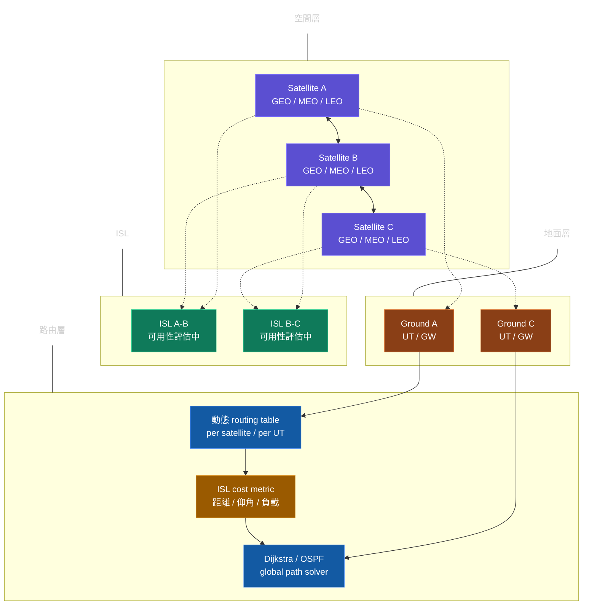
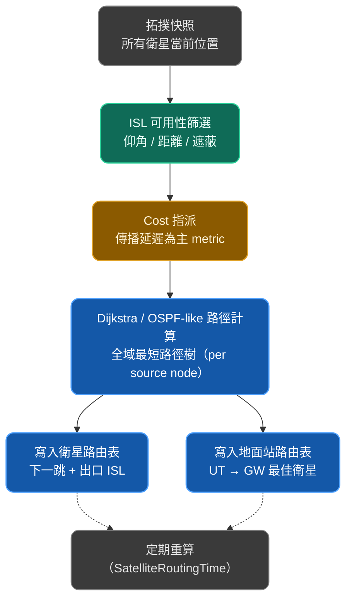
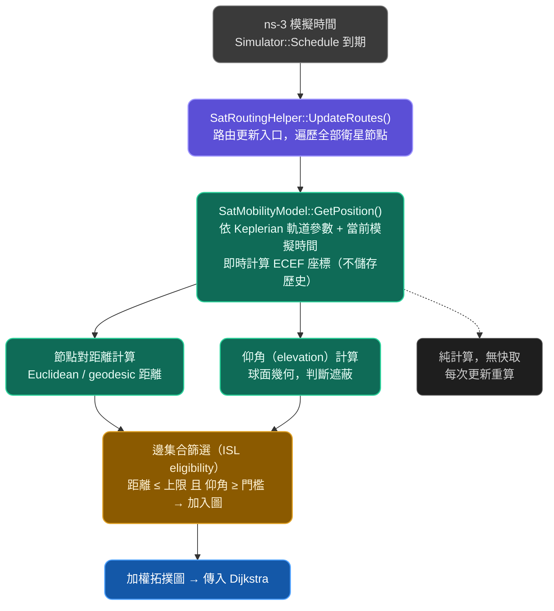
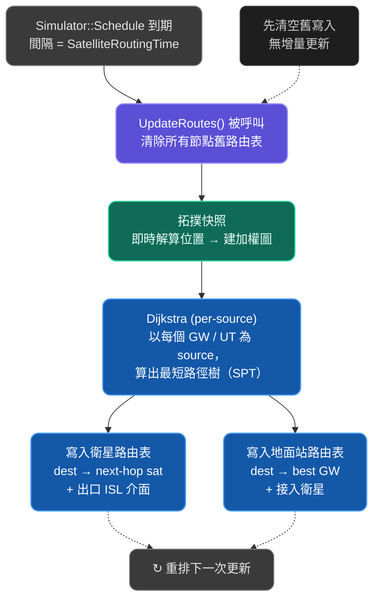
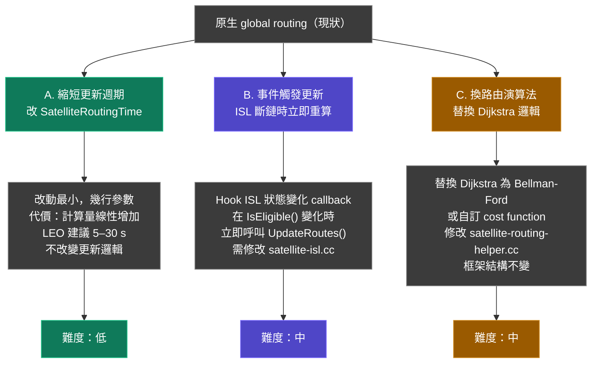

# SNS3 原生 global routing 架構

**原生 global routing 運作方式**\
SNS3 的 global routing 不是分散式協議，而是集中式週期性重算。模擬器在每個 `SatelliteRoutingTime `週期對整個衛星星座進行一次完整拓樸快照，然後以 Dijkstra 算出全域最短路徑，再將結果批次寫入各節點的路由表。這讓它在模擬上非常高效，代價是不反映真實網路的分散式收斂行為。

**動態 routing table**\
每個衛星和地面站都持有一份路由表，內容為「目的地 → 下一跳衛星 + 出口 ISL」。由於衛星持續移動，這份表在每個更新週期都可能完全改寫。更新頻率越高，模擬精度越高，但計算成本線性增加。

**ISL 評估**\
ISL 的可用性由三個條件共同決定：仰角門檻（防止地平線附近的低品質連線）、最大距離（超出物理天線範圍）、以及負載容量。三者任一不滿足，該 ISL 就從拓樸圖中移除，Dijkstra 自然就不會用它路由。cost metric 預設以傳播延遲（距離/光速）為主，可透過 `SatRoutingHelper` 加入負載權重。
# 動態 routing table 

# SNS3 拓樸快照：取得機制
在特定模擬時間點，讓每個衛星物件直接計算自己的當前位置，再彙整成圖

1. 不存在「快照物件」
SNS3 沒有獨立的拓樸快照資料結構。取得拓樸，是在 `UpdateRoutes()` 被呼叫的當下，對所有節點即時呼叫 `GetPosition()`，結果只活在這次函式呼叫的 stack 上，用完即丟。
2. 位置計算：SatMobilityModel
每個衛星節點都掛載了一個繼承自 ns-3 `MobilityModel `的` SatConstantPositionMobilityModel`（GEO）或 S`atSGP4MobilityModel / Keplerian `模型（MEO/LEO）。呼叫 `GetPosition()` 時，它取`Simulator::Now()` 作為時間參數，代入軌道方程式直接算出 ECEF 座標，不查表，也不查快取。
3. 圖的建構
拿到所有節點座標後，`SatRoutingHelper` 做 O(N²) 的節點對掃描，對每一對節點計算：距離（Euclidean in ECEF）和仰角（球面幾何）。符合 MaxISLRange 且仰角超過 ElevationMask 的節點對，才加入邊集合，邊的 weight 預設為傳播延遲（距離 / 光速）。
4. 更新觸發
`SatRoutingHelper` 在初始化時用 `Simulator::Schedule(SatelliteRoutingTime, ...)` 排程自己。每次執行完路由更新後，再排程下一次，形成週期性循環。這個間隔可在 .cc 或屬性系統中調整，越短越精確但計算成本越高（LEO 快速移動時需要較短間隔，GEO 可以拉長）。
關鍵程式位置（以 SNS3 GitLab 為準）：
```
satellite/model/satellite-mobility-model.cc    ← GetPosition()
satellite/helper/satellite-routing-helper.cc   ← UpdateRoutes(), ISL 篩選
satellite/model/satellite-isl.cc               ← IsEligible() 評估邏輯
```
# routing table pipeline

**全量覆寫，無增量更新**\
每次 `UpdateRoutes()` 被呼叫，第一件事就是對所有節點呼叫 FlushRoutes()（清空底層 Ipv4StaticRouting 的全部項目），然後才寫入新結果。SNS3 不做差異比對，也不保留上一版路由表。這讓實作簡單，但在星座規模很大時，每個週期的計算成本是 O(N² + N·E·log N)（拓樸掃描 + N 次 Dijkstra）。
**兩類節點寫入不同內容**\
衛星節點的路由表項目是「目的地 → 下一跳衛星 + 出口 ISL 介面編號」，封包到達衛星後靠這張表決定往哪條 ISL 送出。地面站（UT）的路由表則更簡單：「目的地 GW → 用哪顆衛星上行」，反映的是 UT 的 beam 可見性，而不是 ISL 路徑。
**底層儲存：`Ipv4StaticRouting`**\
SNS3 沒有自訂路由表類別，而是直接操作 ns-3 原生的 `Ipv4StaticRouting`。寫入時呼叫` AddHostRouteTo()` 或 `AddNetworkRouteTo()`，封包轉發時 ns-3 的 IP 層正常查表，不會再觸發任何路由計算。
**更新週期的設定取捨**\
`SatelliteRoutingTime `設太短（例如每秒）在 LEO 仿真時能反映快速拓樸變化，但 N 顆衛星的計算量會讓模擬跑得非常慢。GEO 因為幾乎靜止，可以設到分鐘級。實際上許多 SNS3 論文在 LEO 場景採用 5–30 秒的更新間隔，作為精度與速度的折衷。


**A. 縮短更新週期**\
在模擬腳本裡改：
```cpp
cppConfig::SetDefault("ns3::SatRoutingHelper::SatelliteRoutingTime",
                   TimeValue(Seconds(5.0)));  // 預設通常是 10–30s
```
模擬速度變慢，LEO 場景下 5–10 秒通常夠用。

**B. 事件觸發更新**
原生只有週期性觸發，沒有 ISL 斷線時的即時響應。需要在` satellite-isl.cc `的 `IsEligible() `或仰角計算的狀態轉換點，掛一個 callback：
```cpp
// 在 ISL 從 eligible 變 not eligible 時
if (wasEligible && !nowEligible) {
    Simulator::ScheduleNow(&SatRoutingHelper::UpdateRoutes, m_routingHelper);
}
```
這讓拓樸發生實質變化的當下就觸發重算，而不是等到下一個週期。搭配 A 可以做成「週期更新 + 事件驅動」的混合模式。

**C. 換路由演算法**\
`UpdateRoutes()` 裡的 Dijkstra 邏輯集中在` satellite-routing-helper.cc`，替換演算法只需改這一個函式的內部，輸入是加權圖，輸出是各節點的下一跳表，介面不用動。可以換成 Bellman-Ford（支援負權重 cost）、k-shortest paths，或加入自訂 cost function（例如把 ISL 目前的 queue 長度納入 weight）。
> 原生框架的根本限制
分散式協議（OSPF-like 節點自治）：需要每個衛星節點有獨立的鄰居發現與 flooding 機制分散式協議（OSPF-like 節點自治）：需要每個衛星節點有獨立的鄰居發現與 flooding 機制
增量更新：原生只有全量覆寫，要做 diff-based 需重寫 UpdateRoutes() 核心邏輯
流量感知路由：原生 cost 只有延遲，加入 load 需修改 ISL 介面的即時統計回饋
