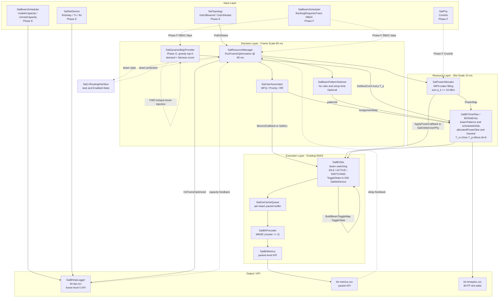

# Layer 2：Beam Hopping + User Scheduling + Power Allocation

## 1. 文件目的

- Beam Hopping 時序管理
- User Association / Scheduling
- 功率分配Power Allocation
- 雙尺度（Frame/slot）資源管理框架
- 與 Layer 1 ISL Routing 的預留介面

---

## 執行狀態

> [!NOTE]
> **狀態圖示：**
> - ✅ 已成功完成
> - ⏳ 進行中 / 待處理
> - ❌ 錯誤 / 失敗（附說明）

> **Layer 2 前置驗證已完成；ns-3 模組 Phase A–G 實作中；Phase G (Dynamic BSTP) ✅ 架構完成；Phase F ⏳。**

| 步驟 | 狀態 | 時間 | 備註 |
|------|------|------|------|
| **前置：2D 通道模型驗證（Greedy 基準）** | ✅ | 2026-05 | C++ UPA 與 Python 等價（p95 Δ < 0.02 dB）；Greedy SNR = 3.13 dB；Phase 2.6 模組化完成，`exp_phase2_plots.py` 產生 Figure A–D |
| **前置：MDP 設計（狀態 / 動作 / 獎勵）** | ✅ | 2026-06 | 狀態 194 維；連續動作空間；4 項獎勵係數（詳見 §MDP 設計） |
| **前置：Layer 1 介面確認** | ✅ | 2026-04 | `routing_plan.csv` 含 `bandwidth_budget_Mbps` 欄位 |
| Phase A：文件重寫 | ✅ | — | Layer2.md 架構完整 |
| Phase B：資料模型擴充 | ✅ | — | `SatBhTimePlan` / `BhSlotEntry` per-beam 擴充；T_s=10ms、T_p=80ms、M=8 |
| Phase C：Frame-scale 模組 | ✅ | — | `SatUserAssociator`、`SatResourceManager` |
| Phase D：Slot-scale 模組 | ✅ | — | `SatPowerAllocator` IWFA water-filling |
| Phase E：真實 SNS3 API 接線 | ✅ | 2026-05 | `ConnectTracesPhaseE()`、UT 重分配、功率寫回、`BuildBeamToggleMap()` OBC 真實 link toggle |
| Phase F：真實 RBDC 需求輸入 | ⏳ | — | `BacklogRequestsTrace` → RM + DynamicBstpProvider；DAMA CRA→RBDC 切換 |
| **Phase G：Dynamic BSTP Provider** | ✅ | 2026-06 | `SatDynamicBstpProvider`（greedy top-K）；starlink25 場景；FWD hotspot 注入 |
| Layer 2 + Layer 1 端對端整合測試 | ⏳ | — | gw2ut 場景，DRL vs Greedy vs Dynamic-BH 效能比較 |

---

## 2. 系統圖

### 2.1 Time Axis（時間結構）

- Frame 持續 T_p = 80 ms，內部切成 8 個 Slot，每個 Slot 為 10 ms。
- Frame Boundary Events（每 80 ms）
  - `PollUtStates` — 查詢 SatTopology，收集目前 UT 狀態及 RBDC 需求（Phase F）
  - `RunFrameOptimization` — 呼叫 UserAssociator + PowerAllocator，決定下一幀各 Slot 分配
  - `MoveUtsBetweenBeams` — 通知 SatNcc 和 TIM-U，UT 移到新 Beam（1-frame 延遲生效）
  - `RunDynamicBstpCycle` — Phase G：呼叫 SatDynamicBstpProvider::GetNextConf()，產生新 BHTP
- Slot Boundary Events（每 10 ms）
  - `SatBhObc` — 根據 BHTP 執行 Beam activate / deactivate（ToggleState 接線至 GW SatNetDevice）
  - `SatGwCacheQueue` — 從 Cache 中取出封包，傳送到 RF 端

**關鍵時間參數：**

| 符號 | 定義 | 值 | 說明 |
|------|------|----|------|
| T_s | 單一時隙持續時間 | **10 ms** | 原 26.5 ms，已改 |
| T_p | BHTP 週期 = M × T_s | **80 ms** | 原 503 ms，已改 |
| T_sw | Beam switching dead-time | 2 ms | 不變；可用窗口 = T_s − T_sw = 8 ms |
| T_prop | GW → SAT 指令傳播延遲 | 10 ms | 不變 |
| M | 每幀時隙總數 | **8** | 原 19，已改 |
| K | 同一時隙最多同時活躍 beam 數 | 3（預設） | basic=2，full=3，上限 4 |

---

### 2.2 Coverage Position（波束覆蓋）

**波束 Pattern 選擇指標 νsn（Beam Gain Ratio）：**

νsn 衡量一個候選波束 pattern 對本 beam UT 的天線增益，相對於對鄰近 beam 所產生的干擾增益之比值。

```
νsn = Σ G(θ_k)  for k ∈ own UTs
      ─────────────────────────────
      Σ G(θ_j)  for j ∈ neighbor beam centers
```

- **分子**：此 pattern 在本 beam 所有 UT 方向上的增益總和（越高代表服務品質越好）
- **分母**：此 pattern 在鄰近 beam 中心方向上的增益總和（越低代表干擾越小）
```c++
SatAntennaGainPattern::GetAntennaGain_lin(lat, lon)
```
**選擇原則：** 從 5 種候選波束寬度（1.0–3.0°）中，選 νsn 最大的 pattern。

| 情境 | 選到的 pattern |
|------|--------------|
| UT 集中、高需求區 | 窄波束（高增益、小干擾半徑） |
| UT 分散、邊緣覆蓋 | 寬波束（擴大覆蓋範圍） |

> 此分配在模擬開始前執行一次（setup-time），模擬期間不動態切換。

---

### 2.3 System Architecture（系統架構）



**Legend：**
- `Phase E` — 已接線的 SNS3 trace（PollUtStates、BuildBeamToggleMap、ApplyPowerCallback）
- `Phase F` — 待實作的真實 RBDC 輸入（BacklogRequestsTrace → RM + DynamicBstpProvider）
- `Phase G` — Dynamic BSTP Provider（greedy demand-aware，輕量替代 EM Scheduler）
- `⚙ optional` — 選配，setup-time 靜態分配（SatBeamPatternSelector）
- `stub` — 預留介面，Enabled=false（SatL1RoutingInterface）

---

## 2D Greedy 基準結果（前置，已完成）

> 結果來自 2026-05 完成的 2D 通道模型驗證（`2D/results/dual_d5_v2/`），作為 ns-3 Layer 2 DRL 實作的效能比較基準。詳細步驟見 [03_beam_hopping.md](../Thesis/docs/installation/03_beam_hopping.md)。

**場景：** Tokyo ROI（35.676°N，139.650°E），d=5（5×5=25 格點），衛星對 iridium-75 45/44

| 策略 | 全格平均 SNR | 說明 |
|------|-------------|------|
| sat[i] only | 2.58 dB | 單顆衛星服務 |
| sat[i+1] only | 2.42 dB | 下一顆衛星服務 |
| **Greedy（基準 B2）** | **3.13 dB** | 每格取較高 SNR（+0.55 dB vs sat[i]） |

**換手觸發時間點（Phase 2.3 Overlap 偵測）：**

| 閾值 | ROI 覆蓋 | 首次發生時間 |
|------|---------|------------|
| P10 | 10%（3 格） | t = 318.7 s |
| P25 | 25%（7 格） | t = 322.3 s |
| P50 | 50%（13 格） | t = 327.7 s |
| P75 | 75%（19 格） | t = 334.5 s |
| P90 | 90%（23 格） | t = 336.4 s |

**輸出圖形（Phase 2.6 統一繪圖腳本 `exp_phase2_plots.py`）：**

| Figure | 說明 | 來源 |
|--------|------|------|
| A | sat[i] / sat[i+1] / Greedy 5×5 SNR 熱圖 | `dual_cell_summary.csv` |
| B | 三種策略 per-cell SNR CDF | `dual_cell_summary.csv` |
| C | sat[i+1] ROI coverage buildup 曲線（含 5 個閾值標記） | `dual_cell_result.csv` + `dual_overlap.json` |
| D | 單星 SNR 熱圖 + min/max range bar | `grid_cell_summary.csv` |

> **DRL 目標：** PPO 代理在 ns-3 全模擬環境中，全格平均 SNR 超越 Greedy 基準（3.13 dB），且 EF 違反率 < 1%、AF 違反率 < 5%。

---

## 3. 雙尺度框架

### 3.1 Frame Scale

**週期**：503 ms 
**決策者**：`SatResourceManager`（NCC / GW 端）

| 決策 | 模組 | 輸入 | 輸出 |
|------|------|------|------|
| 波束模式 | SatBeamPatternSelector | 流量分佈、干擾矩陣 | patternId per beam |
| 使用者關聯 | SatUserAssociator | UT 位置、C/N0、需求 | utId → beamId 映射 |

決策頻率低，每Frame僅計算一次，輸出 `BeamConfig`（波束配置）供slot使用。

---

### 3.2 Timeslot Scale

**週期**：每 26.5 ms 執行一次  
**決策者**：`SatTimeslotController`（GW 端）

| 決策 | 模組 | 輸入 | 輸出 |
|------|------|------|------|
| 功率分配 | SatPowerAllocator | 信道矩陣、需求 | powerDbw per beam |

> **排程決策已合併至 Frame Scale**：UT 排程（WFQ / Priority / RR）由 `SatUserAssociator` 的 pre-planned schedule 負責，在每個 frame 決定哪個 UT 分配到哪個 beam，slot scale 不再需要獨立的 scheduler 模組。

---

### 3.3 資料流總覽


---

## 4. 系統參數

### 4.1 硬體與通道參數

| 參數 | 值 |來源|
|------|----|------|
| 星座 | Iridium NEXT-like 66 sats | constellation-iridium-next-66-sats |
| 衛星數 / 軌道面 | 66 sats = 6 planes × 11 sats/plane | tles.txt header: "6 11" |
| 衛星軌道高度 | ~636.5 km | TLE mean motion 14.80 rev/day → a = 7007.5 km |
| 軌道傾角 | 86.4° | TLE line 2 field 3 |
| 總 Beam 數 | 72 beams | fwdConf.txt: 72 entries |
| 頻率複用色 | 5 colors | fwdConf.txt column 3: values 1–5 |
| 活躍 GW 數 | 4（位置定義 5 個） | fwdConf.txt column 2: IDs 1–4；gw_positions.txt: 5 entries |
| 天線 Pattern | SatAntennaGain72BeamsShifted | antennapatterns（pointer to SNS3 additional-input） |
| 接收天線增益（peak） | min 50.14 / avg 51.36 / max 51.66 dBi | SatAntennaGain72BeamsShifted_*.txt（per-beam 查表，72 files） |
| 標準 | DVB | standard/standard.txt |
| 預設 MODCOD | 3（QPSK 1/3） | waveforms/default_waveform.txt |
| 總功率預算 | 43 dBm | sat-bh-helper.h: totalPowerBudgetDbm{43.0} |
| 雜訊功率 | -126.47 dBW | sat-bh-helper.h: noisePowerDbw{-126.47} |
| 最低仰角 | 5.0° | beam-hopping-manager.cc: ElevationThresholdDeg default 5.0 |

### 4.2 時間結構參數

> **⚠ 2026-06 更新**：T_s、T_p、M 均已改變，舊值作廢。

| 參數 | 符號 | 值（最新） | 舊值（已廢棄） |
|------|------|----|------|
| Timeslot | T_s | **10 ms** | 26.5 ms |
| Slots per frame | M | **8** | 19 |
| BHTP period | T_p = M × T_s | **80 ms** | 503 ms |
| Beam switching dead-time | T_sw | 2 ms | 2 ms |
| Usable slot window | T_s − T_sw | **8 ms** | 24.5 ms |
| 指令傳播延遲 | T_prop | 10 ms | 10 ms |
| 最多同時活躍 beam 數 | K | 3（預設） | 2~4 |
| HOL deadline | T_max | 80 ms（= T_p） | 530 ms |

### 4.3 波束模式參數（5 種候選）

| Pattern Index | 3dB Beamwidth | 地面覆蓋半徑 | 增益（dBi） | 適用場景 |
|:---:|:---:|:---:|:---:|------|
| 0 | 1.0° | ~10 km | 43.89 | 極高需求 / hot-spot 核心 |
| 1 | 1.5° | ~15 km | 41.39 | 高需求 |
| 2 | 2.0° | ~20 km | 37.89 | 中等需求（預設） |
| 3 | 2.5° | ~25 km | 35.01 | 低需求 |
| 4 | 3.0° | ~30 km | 31.89 | 邊緣 / cold-spot |

### 4.4 QoS 與排程參數

| 參數 | 值 |
|------|----|
| 最低速率需求 R_min | 100 kbps |
| 最大容許延遲 T_max | **80 ms（= T_p）** |
| 功率最佳化最大迭代次數 | 30 |
| 波束選擇最大迭代次數 | 10 |

### 4.5 Phase G 參數（Dynamic BSTP Provider）

| 參數 | 預設值 | 說明 |
|------|--------|------|
| `bhDemandBacklogWeight` | 1.0 | 需求分數權重 [kbps] |
| `bhFairnessWeight` | 0.5 | 公平性分數權重（time-since-served [s]） |
| `bhValiditySuperframes` | 1 | 計畫有效期（plan window = validitySF × T_p） |
| `bhStarvationThreshold` | 5 | 連續跳過 N 次後強制納入 beam |
| `bhFwdHotspotBoostKbps` | 480.0 | FWD hotspot beam 合成需求加值（starlink25） |

### 4.6 Starlink25 場景參數

| 參數 | 值 |
|------|----|
| 星座 | constellation-starlink-1584-sats |
| 衛星高度 | 550 km |
| 目標衛星 | sat_498（Tokyo 峰值仰角 89.755°，t=4168s） |
| Beam 佈局 | 5×5 UPA 橢圓網格，25 beams |
| Hotspot beams | {1,4,13,19,22}（cell_idx {0,3,12,18,21}） |
| FWD 流量比 | hotspot 600 kbps / non-hotspot 120 kbps（5:1） |
| RTN 流量 | 均勻 CBR 100 kbps/UT（Phase F RBDC 觸發源） |
| 有效帥選窗口 | `satIdStart`=490，`maxHelperSats`=10 |

---

## 5. 模組規格

### 5.1 SatBeamPatternSelector

根據各 beam 的流量分佈，從 5 種候選 pattern 中選出最佳圖形。

**選擇演算法**：
1. 計算每個 candidate pattern 的 νsn 比率
2. `νsn = Σ G(θ_k) for k in own_UTs / Σ G(θ_j) for j in neighbor_beams`
3. 選擇 νsn 最大的 pattern（最大自身增益、最小鄰近干擾）
4. 最多迭代 10 次

**主要 Attributes（TypeId）：**
- `CandidateBeamwidths` : DoubleVector, 預設 {1.0, 1.5, 2.0, 2.5, 3.0}
- `MaxSelectionIterations` : uint32_t, 預設 10

**主要 Methods：**
- `SelectPattern(beamId, trafficDemand, channelInfo) → uint32_t patternIndex`
- `ComputeNuRatio(beamId, patternIndex, utPositions) → double`
- `GetPatternGain(patternIndex, angleRad) → double gainDb`

**執行時機：Setup-time 靜態分配（一次性）**

`SatBeamPatternSelector` 在模擬開始前執行一次，為每個 beam 選好 patternId（0~4），
於 `AttachChannels()` 時傳入對應的 `SatAntennaGainPattern` 物件。模擬期間不切換。

**無法做 runtime 動態切換的原因（trace 確認）：**
- `SatPhyTx::SetAntennaGainPattern()` 有 `NS_ASSERT(m_antennaGainPattern == nullptr)`，只允許初始化一次
- `SatAntennaGainPattern::GetAntennaGain_lin()` 不是 virtual，Proxy Pattern 無法攔截

**動態控制改由其他模組負責：**
- `SatUserAssociator`：每 503 ms 決定哪個 UT 關聯到哪個 beam
- `SatPowerAllocator`：每 26.5 ms 決定每個 beam 的 TX 功率
- `SatBhObc`：每 26.5 ms 決定哪個 beam 在哪個 slot 活躍

**研究貢獻定位調整：**
heterogeneous beam pattern 初始分配（窄/寬 beam 依需求分佈靜態設定）對 BH 系統效能的影響，而非 runtime beamwidth adaptation。

**SNS3 hook：**
```cpp
// setup 時（SatBhHelper::Install() 內）
Ptr<SatAntennaGainPattern> pattern = m_patternContainer->GetAntennaGainPattern(beamId, patternId);
orbiterHelper->AttachChannels(..., pattern, ...);
```

---

### 5.2 SatUserAssociator

**職責**：Frame-scale 決定哪些 UT 關聯到哪個 beam，同時負責 UT 間的排程邏輯（WFQ / Priority / RR）。`SatUserScheduler` 已合併至此模組。

**設計原則（pre-planned schedule）：**
- 在 frame N 計算 frame N+1 的 UT-beam 分配表（基於需求預測）
- 排程策略決定哪個 UT 優先進入哪個 beam，等效於 WFQ / Priority / RR
- 在 frame N 結尾呼叫 `MoveUtBetweenBeams()`，TIM-U 延遲在 frame N+1 生效
- 延遲是設計的一部分，不是 race condition

**排程模式：**

| 模式 | 邏輯 | 效果 |
|------|------|------|
| Round-Robin | UT 輪流被分配到 beam | 公平，不考慮需求 |
| Priority | 高優先 UT 優先佔用 beam slot | 保護關鍵服務 |
| WFQ | 依 weight × 需求量決定 frame 分配份額 | 加權公平，主要模式 |

**主要 Attributes（TypeId）：**
- `SchedulingMode` : enum {WFQ=0, PRIORITY=1, ROUND_ROBIN=2}, 預設 WFQ
- `MaxReassignmentPerFrame` : uint32_t, 預設 5（限制每幀最多切換幾個 UT）
- `MinRateKbps` : double, 預設 100（最低速率保護門檻）
- `MaxDelayMs` : double, 預設 530（超過此延遲強制優先服務）

**主要 Methods：**
- `Associate(utList, beamList, channelMap, demandMap) → AssignmentMap`
- `ApplyAssociation(map)` — 觸發 UT beam reassignment（見下方 SNS3 hook 說明）
- `ComputeWfqWeight(utId, bufferBytes, demandKbps) → double`
- `EnforceDeadlineProtection(map)` — 超過 T_max 的 UT 強制升為最高優先

**SNS3 hook 說明（trace 確認）：**

採用**預先排程（pre-planned schedule）**設計，與 BHTP 概念一致：

```
Frame N：SatUserAssociator 計算 UT 需求預測 → 產生 frame N+1 UT-beam 分配表
         → 立即呼叫 MoveUtBetweenBeams() 觸發 TIM-U
Frame N+1：TIM-U 延遲到期，UT 完成 beam 切換 → 分配表生效
```

呼叫方式：
```cpp
// 在 frame N 結尾（RunFrameOptimization() 內）
ncc->MoveUtBetweenBeams(utId, srcSatId, srcBeamId, dstSatId, dstBeamId);
```

TIM-U 的 1-frame 延遲是**設計的一部分**，不是 race condition。
`SatUserAssociator` 產生的是 frame N+1 的預測分配，故在 frame N 觸發剛好對齊。

不使用 `TransferUtToBeam()` 直接呼叫（只搬 scheduler 狀態，狀態不一致）。

---

### 5.3 SatResourceManager

**職責**：Frame-scale主控器，每 503 ms 執行一次，協調 UserAssociator + PowerAllocator。

**主要 Attributes（TypeId）：**
- `FrameDuration` : Time, 預設 503ms
- `EnablePatternSelection` : bool, 預設 true
- `EnableUserAssociation` : bool, 預設 true

**觸發機制：Self-scheduling loop**
`SatResourceManager` 在 `DoInitialize()` 排第一次 `RunFrameOptimization()`；
每次執行結束時用 `Simulator::Schedule(T_frame, ...)` 排下一次，避免 timer drift。

**主要 Methods：**
- `RunFrameOptimization()` — 每 503 ms 自排程執行
- `GetBeamConfig(beamId) → BeamConfig`
- `SetDemandUpdateCallback(DemandUpdateCallback cb)`
- `SetL1Interface(Ptr<SatL1RoutingInterface> iface)`

---


### 5.4 SatPowerAllocator

**職責**：Slot-scale在總功率預算 43 dBm 下最佳化每個 active beam 的功率分配。

**最佳化目標**：最大化 sum-rate（或 min-SINR）subject to Σ p_k ≤ P_total

**最佳化變數**：`p_k = m_eirpWoGainW` per beam（linear W，即 TxMaxPowerDbw 扣掉 output/pointing/OBO/antenna losses 後的值）

SNS3 資料流：
```
TxMaxPowerDbw [dBW]
  → (扣 losses) → m_eirpWoGainW [W] = p_k（最佳化變數）
  → × G_tx（antenna gain）
  → / FSL（free-space loss）
  → × G_rx → m_rxPower_W [W]
  → / (noise + interference) → SINR
```

**SINR 公式（linear domain）：**
```
SINR_k = (p_k × G_tx_k × G_rx_k / FSL_k) / (σ² + Σ_{j≠k} p_j × G_tx_j × G_rx_k / FSL_jk)
```

**迭代演算法（最多 30 次）：**
1. 初始化：等功率分配 `p_k = P_total / K`（linear W）
2. 計算各 beam SINR（公式見上）
3. 根據 SINR 梯度更新 `p_k`（gradient ascent / water-filling）
4. 投影回可行集：`Σ p_k ≤ P_total, p_k ≥ 0`
5. 收斂條件：`||Δp||₂ < ε = 0.001`

**寫回 SNS3（ApplyPower）：**
```cpp
double txMaxDbw = SatUtils::WToDbW(p_k) + outputLossDb + pointingLossDb + oboLossDb + antLossDb;
phy->SetTxMaxPowerDbw(txMaxDbw);
phy->Initialize();  // 必須重算 m_eirpWoGainW
```

**主要 Attributes（TypeId）：**
- `TotalPowerBudgetDbm` : double, 預設 43
- `MaxIterations` : uint32_t, 預設 30
- `NoisePowerDbw` : double, 預設 -126.47
- `ConvergenceEpsilon` : double, 預設 0.001

**主要 Methods：**
- `Allocate(activeBeams, channelMap, demandMap) → PowerMap`
- `ApplyPower(PowerMap)` — 呼叫 `SatOrbiterUserPhy::SetTxMaxPowerDbw()`

**SNS3 hook（trace 確認）**：

```cpp
Ptr<SatOrbiterUserPhy> phy = orbiterNetDevice->GetUserPhy(beamId);
phy->SetTxMaxPowerDbw(powerDbw);  // 單位：dBW（不是 W）
phy->Initialize();                 // 必須重呼叫，否則 m_eirpWoGainW 不更新
```

**單位契約（已驗證）：**
- `SetTxMaxPowerDbw()` 接受 **dBW**（TX max power，含 output/pointing/OBO/antenna losses 前的值）
- 內部計算 `eirpWoGainDbw = TxMaxPowerDbw − losses`，再轉成 linear W
- `SatPowerAllocator` 的輸出必須是 TX max power 的 dBW，不是 EIRP

若 `SatPowerAllocator` 最佳化輸出是 EIRP dBW，需補回 losses：
```cpp
txMaxPowerDbw = eirpDbw - antGainDb + outputLossDb + pointingLossDb + oboLossDb + antLossDb;
```

---

### 5.5 SatBhTimePlan（擴充）

在原有欄位基礎上新增（已實作，Phase B 完成）：

**BhSlotEntry 擴充欄位：**

| 欄位 | 型別 | 填入者 | 說明 |
|------|------|--------|------|
| `beamPatterns` | `std::map<uint32_t, BeamRadiusType>` | SatBhScheduler / SatBhHelper | Per-beam antenna pattern；Key = beamId（1-indexed），取代原 slot-wide `beamRadius` |
| `scheduledUtIds` | `std::vector<uint32_t>` | SatResourceManager | 此 slot 排程的 UT ID 列表（SatUserAssociator 輸出） |
| `allocatedPowerDbw` | `std::map<uint32_t, double>` | SatPowerAllocator | Per-beam TX max power [dBW]（IWFA 輸出） |

**BhSlotEntry 新增 helpers：**
```cpp
void SetBeamPattern(uint32_t beamId, BeamRadiusType pattern);
BeamRadiusType GetBeamPattern(uint32_t beamId,
                              BeamRadiusType defaultVal = MIDDLE) const;
```

**SatBhTimePlan 新增欄位：**
- `frameId : uint32_t` — 幀計數器（由 SatResourceManager 設定，單調遞增）

> **設計注意**：`framePatternIndex` 未加入 SatBhTimePlan。同一 slot 內多個 beam 各自可用不同 pattern，故以 per-beam `beamPatterns` map 表達，不需 frame-wide 單一值。

**Print() 輸出格式（per-beam patterns）：**
```
Slot [0 ms .. 26 ms]  beams={1,4}  radius=1:SMALL,4:LARGE  modcod=5  clusters={1,4}
```

---

### 5.6 SatDynamicBstpProvider（Phase G，新增）

**職責**：輕量化 demand-aware BSTP 生成器，每 T_p 產生一份 active beam 集合（Conf），取代靜態 round-robin（Phase 1）但不需要 EM 收斂（Phase 2 Scheduler）。

**設計定位：**
- Phase 1（靜態）→ **Phase G（greedy dynamic）** → Phase 2（EM Scheduler）
- 啟用條件：`enableDynamicBstp=true` AND `enableScheduler=false`；兩者同時開啟時 Scheduler 優先
- 需 `enableObc=true` 才能真正觸發 GW SatNetDevice link toggle

**評分函數（GetNextConf 每 T_p 呼叫）：**
```
score(b) = W_demand × demand_b[kbps] + W_fairness × (now − lastServed_b)[s]
```
選 top-K 評分最高的 beam；若某 beam 連續跳過 N 次（starvationThreshold），強制納入。

**需求輸入路徑：**
```
SatBeamScheduler::BacklogRequestsTrace (Phase F)
  → SatBhHelper::OnBacklogRequestTrace()
  → SatDynamicBstpProvider::UpdateBeamDemand(beamId, kbps)   ← RTN RBDC 真實需求
  + SatBhHelper::InjectFwdDemand()（每 T_p 合成注入）
  → UpdateBeamDemand(hotspotBeamId, +480 kbps)               ← FWD hotspot 補償
```

**FWD hotspot 合成注入的必要性：**  
Phase F RBDC 只反映 RTN 方向需求（各 UT 約 100 kbps，均一分佈）。FWD hotspot（如 starlink25 {1,4,13,19,22}）的 600 kbps FWD 流量無法從 RBDC 感知。故額外注入 `bhFwdHotspotBoostKbps = 480 kbps` 讓 provider 正確識別 5:1 hotspot。

**Conf 格式（對應 SNS3 靜態 BSTP 行格式）：**
```cpp
struct Conf {
    uint32_t validityInSuperframes;  // ≥ 1
    std::vector<uint32_t> activeBeams;  // |set| ≤ K
};
```

**主要 API：**
- `AddEnabledBeamInfo(beamId, userFreqId, feederFreqId, gwId)` — 注冊可用 beam
- `UpdateBeamDemand(beamId, kbps)` — 更新需求估計（Phase F / 合成注入）
- `UpdateBeamBacklog(beamId, bytes)` — 更新佇列深度（選用）
- `GetNextConf(now) → Conf` — 每 T_p 產生一份配置（核心方法）
- `ValidateConf(conf)` — 驗證是否合法（SatBhHelper 轉換前呼叫）

**ConfToTimePlan 轉換邏輯（SatBhHelper）：**
```
Conf.activeBeams → 分散到 M=8 個 slot，每 slot 至多 K 個 beam（round-robin 排列）
validity × T_p → periodEnd
→ SatBhTimePlan（送 SatBhObc）
```

**主要 Attributes（TypeId）：**
- `DemandBacklogWeight` : double, 預設 1.0
- `FairnessWeight` : double, 預設 0.5
- `ValidityInSuperframes` : uint32_t, 預設 1
- `StarvationThreshold` : uint32_t, 預設 5

---

### 5.8 SatL1RoutingInterface（Layer 1 預留介面，stub）

**職責**：Layer 2 與 Layer 1 ISL Routing 的橋接介面，目前為 stub 實作。

**主要 Attributes（TypeId）：**
- `Enabled` : bool, 預設 false（stub 模式）

**主要 Methods：**
- `GetActivePathBeams(srcGwId, dstGwId) → std::set<uint32_t>` — 回傳路由路徑所用的 beamId 集合
- `GetLinkLoad(satId, beamId) → double loadMbps` — 回傳目前 ISL / feeder 負載
- `RegisterBeamStateCallback(BeamStateCallback cb)` — 當 beam 上線 / 下線時通知 Layer 1

**Layer 1 → Layer 2**：保護路由使用中的 beam 不被 BH scheduler 關閉  
**Layer 2 → Layer 1**：beam 狀態改變時觸發 routing cost 重算

---

### 5.9 SatBhKpiLogger（新增，Phase E）

**職責**：Frame-level KPI 統一觀測點，補足 `SatBhMetrics`（packet-level beam KPI）無法覆蓋的 5 個核心指標。由 `SatResourceManager` 持有，每 503 ms flush 一行 CSV。

**與 SatBhMetrics 的分工：**

| 模組 | 粒度 | 輸出來源 |
|------|------|----------|
| SatBhMetrics | Packet-level per-beam | OBC BeamActivate/Deactivate 回呼 |
| SatBhKpiLogger | Frame-level per-beam | ResourceManager + SNS3 trace |

**5 KPI 覆蓋：**

| 指標 | 欄位 | 來源 |
|------|------|------|
| Capacity-Demand Gap | `allocated_kbps`, `sns3_demand_kbps`, `gap_kbps` | `UsableCapacityTrace` + `UnmetCapacityTrace` |
| E2E Latency | `avg_delay_ms`, `max_delay_ms` | `SatNetDevice::RxDelay` |
| Packet Delivery Rate | `pdr_pct` | Tx/Rx 計數器 |
| Power Consumption | `tx_power_dbw` | `SatPowerAllocator::PowerMap` |
| User Association Count | `assigned_ut_count` | `AssignmentMap` |

**CSV Schema：**
```
frame_id, sim_time_s, sat_id, beam_id,
allocated_kbps, sns3_demand_kbps, bh_demand_kbps, unmet_kbps, gap_kbps,
tx_power_dbw, assigned_ut_count,
avg_delay_ms, max_delay_ms, pdr_pct, sample_count
```

**主要 API：**
```cpp
void SetOutputFile(const std::string& path);
void OnUsableCapacity(uint32_t satId, uint32_t beamId, uint32_t kbps);
void OnUnmetCapacity(uint32_t satId, uint32_t beamId, uint32_t kbps);
void OnPacketDelay(Time delay);
void OnPacketTx();
void OnFrameOptimized(uint32_t frameId,
                      const std::map<uint32_t, BeamConfig>& beamConfigs,
                      const std::vector<UtInfo>& utList,
                      const AssignmentMap& assignment);
```

**SNS3 接線（SatBhHelper::ConnectTraces()）：**
```cpp
// UsableCapacityTrace / UnmetCapacityTrace
Ptr<SatBeamScheduler> sched = ncc->GetBeamScheduler(satId, beamId);
sched->TraceConnectWithoutContext("UsableCapacityTrace",
    MakeBoundCallback(&SatBhKpiLogger::OnUsableCapacity, logger, satId, beamId));
// RxDelay（全局 delay / PDR）
Config::ConnectWithoutContext(
    "/NodeList/*/DeviceList/*/$ns3::SatNetDevice/RxDelay",
    MakeCallback(&SatBhKpiLogger::OnPacketDelay, logger));
```

**flush 觸發**：`RunFrameOptimization()` 結束時呼叫 `OnFrameOptimized()`，保證 frame_id 與所有欄位對齊，無 timer 漂移。

---

### 5.10 既有模組（保留，不改動）

| 模組 | 職責 | 狀態 |
|------|------|------|
| SatBhObc | 接收 BHTP、執行 beam switching 狀態機（IDLE/ACTIVE/SWITCHING/WAIT_PLAN） | ✅ 保留 |
| SatGwCacheQueue | beam inactive 時暫存封包，slot 開始時排空 | ✅ 保留 |
| SatBhPrecoder | cluster ≥ 2 beam 時執行 MMSE 預編碼 | ✅ 保留 |
| SatBhMetrics | 被動收集 packet-level KPI（throughput/delay/JFI/drop_rate/dwell_time） | ✅ 保留 |
| SatBhTimePlan | BHTP 資料模型（BhSlotEntry per-beam 擴充） | ✅ 已擴充（Phase B） |
| SatL1RoutingInterface | Layer 1 ISL Routing 預留介面 | ✅ stub 實作 |

---

## 6. SNS3 Hook 對照表

> 所有 API 均在 Phase E 實作時確認。✅ = Phase E 中已接線；🔒 = 不使用。

| 功能 | SNS3 API | 所在檔案 | 單位 / 注意事項 | Phase E |
|------|----------|----------|----------------|:-------:|
| 改變 beam 功率 | `SatPhy::SetTxMaxPowerDbw(double)` + `Initialize()` | satellite-phy.h:259 | **dBW**；改完必須呼叫 `Initialize()` 重算 `m_eirpWoGainW` | ✅ |
| 取得 orbiter beam PHY | `SatOrbiterNetDevice::GetUserPhy(beamId)` | satellite-orbiter-net-device.h:129 | 回傳 `Ptr<SatPhy>` | ✅ |
| 取得 orbiter node | `SatTopology::GetOrbiterNode(satId)` | satellite-topology.h:403 | — | ✅ |
| UT beam 完整重分配 | `SatNcc::MoveUtBetweenBeams(Address utAddr, srcSat, srcBeam, dstSat, dstBeam)` | satellite-ncc.h:249 | 傳入 **MAC Address**（非 uint32_t utId）；含 TIM-U + handover delay | ✅ |
| UT MAC Address 查詢 | `SatNetDevice::GetAddress()` | satellite-net-device.h | 用於建立 utId → MAC Address 映射表 | ✅ |
| UT 所在 beam 查詢 | `SatTopology::GetUtBeamId(Ptr<Node>)` | satellite-topology.h:635 | PollUtStates 每幀呼叫 | ✅ |
| UT 所屬衛星查詢 | `SatTopology::GetUtSatId(Ptr<Node>)` | satellite-topology.h:626 | 用於過濾 multi-sat 場景 | ✅ |
| 全部 UT 節點 | `SatTopology::GetUtNodes()` | satellite-topology.h:292 | 回傳 NodeContainer | ✅ |
| 取得 NCC | `SimHelper->GetSatHelper()->GetBeamHelper()->GetNcc()` | simulation-helper.h:486 | — | ✅ |
| Capacity KPI trace | `SatBeamScheduler::UsableCapacityTrace` + `UnmetCapacityTrace` | satellite-beam-scheduler.cc:269 | 用於 SatBhKpiLogger 接線 | ✅ |
| Packet delay trace | `SatNetDevice::RxDelay` | satellite-net-device.cc:104 | 用於 delay / PDR 統計 | ✅ |
| UT scheduler-only 搬移 | `SatBeamScheduler::TransferUtToBeam(utId, dstScheduler)` | satellite-beam-scheduler.cc:973 | 🔒 只搬 NCC 資料，UT MAC/PHY/routing 不更新；不使用 | 🔒 |

---

## 7. 實作 Phase

### Phase A — 文件重寫
重寫 Layer2.md 涵蓋雙尺度框架、所有模組規格。

---

### Phase B — 資料模型擴充
- `SatBhTimePlan` / `BhSlotEntry` 擴充：
  - 加入 `beamPatterns : std::map<uint32_t, BeamRadiusType>`（per-beam，取代 slot-wide `beamRadius`）
  - 加入 `scheduledUtIds`、`allocatedPowerDbw`、`frameId`
  - 新增 `SetBeamPattern()` / `GetBeamPattern()` helpers
- 新增 `SatL1RoutingInterface`（stub）

---

### Phase C — Frame-scale模組
- `SatUserAssociator`：WFQ / Priority / RR + `MoveUtBetweenBeams` 接線（傳入 MAC Address）
- `SatResourceManager`：Self-scheduling loop（503 ms）、整合 UserAssociator + PowerAllocator
- `SatBeamPatternSelector`：**已確認不可在執行期動態切換**（SNS3 `SetTxAntennaGainPattern()` 只允許初始化一次）→ 改為 setup-time 靜態分配，為**選配功能（feature flag）**，視論文需求延後實作

---

### Phase D — Slot-scale模組
- `SatPowerAllocator`：IWFA water-filling 迭代功率最佳化
  - 最佳化變數：`m_eirpWoGainW` per beam（linear W）
  - 寫回：`phy->SetTxMaxPowerDbw(dBW)` + `phy->Initialize()`
- ~~`SatUserScheduler`~~：已合併至 Phase C 的 `SatUserAssociator`

---

### Phase E — 真實 SNS3 API 接線
- `SatBhHelper::ConnectTracesPhaseE()`：
  1. `BuildUtAddressMap()`：建立 container index → MAC Address 映射（`SatNetDevice::GetAddress()`）
  2. `CacheOrbiterDevice()`：快取 `SatOrbiterNetDevice`（供 ApplyPowerCallback 使用）
  3. `MoveUtCallback` → `SatNcc::MoveUtBetweenBeams(MAC Address, ...)`（真實 UT 重分配）
  4. `ApplyPowerCallback` → `SatOrbiterUserPhy::SetTxMaxPowerDbw()` + `Initialize()`
  5. `PollUtStates()`：每 T_frame 查詢 `SatTopology::GetUtBeamId()`，更新 RM 中的 UT 狀態
- 啟動條件：`enablePhaseE=1` AND `enableResourceManager=1` AND `SetSimulationHelper()` 已呼叫
- 驗證結果：見 §8

---

### 前置 Phase 2.6 — 2D 程式碼模組化
- `sat-phase2-grid.h/.cc`：封裝 Grid Mode（`CellStats`、`GridSimState`、`GridUpdateStep`、`RunGridMode`）
- `sat-phase2-dual.h/.cc`：封裝 Dual Mode + Phase 2.3 Overlap 偵測（`DualCellStats`、`DualSimState`、`DualUpdateStep`、`RunDualMode`）
- `exp_phase2_plots.py`：統一繪圖腳本，一鍵產生 Figure A–D（SNR 熱圖、CDF、Coverage Buildup、Grid 熱圖）
- Phase 2 七步驟 SOP 已寫入 [03_beam_hopping.md](../Thesis/docs/installation/03_beam_hopping.md)

---

### Phase F — 真實 RBDC 需求輸入（⏳ 進行中）

**目的**：以真實 DAMA 上行需求取代合成 1000 kbps stub，讓 RM 與 Dynamic Provider 感知真實流量。

**啟用條件**：`enablePhaseF=true`（需先啟用 `enablePhaseE`）

**實作步驟：**
1. `Config::SetDefault("ns3::SatLowerLayerServiceConf::DaService3_RbdcAllowed", true)` — 開啟 RBDC（CRA 關閉），在 `CreateSatScenario()` 前設定
2. `ConnectTracesPhaseF()` — 對每個 beamId 的 `SatBeamScheduler` 連接 `BacklogRequestsTrace`
3. `OnBacklogRequestTrace(record)` — 解析 `"time, beamId, utId, typeEnum, value"` 字串，只保留 `DA_RBDC` 類型，更新 `m_utDemandCache`
4. `PollUtStates()` — 當 Phase F 啟用時，從 `m_utDemandCache` 讀取真實 RBDC 而非 1000 kbps stub
5. `RunDynamicBstpCycle()` — 同步呼叫 `DynamicBstpProvider::UpdateBeamDemand()`，以真實 RBDC 驅動 greedy scoring

**待實作**：
- `SatPhy::CnoInfo` trace 接線（真實 channelGains → SatPowerAllocator）

---

### Phase G — Dynamic BSTP Provider（✅ 架構完成）

**目的**：提供比靜態 BHTP（Phase 1）更智慧、比 EM Scheduler（Phase 2）更輕量的動態波束排程基準。

**啟用條件**：`enableDynamicBstp=true` AND `enableObc=true`（`enableScheduler` 應為 false）

**實作步驟：**
1. `SetupDynamicBstp()` — 建立 `SatDynamicBstpProvider` 實例，從 SatTopology 注冊所有 beam，設定 Attributes
2. `RunDynamicBstpCycle(now)` — 每 T_p 呼叫一次：
   a. `provider->GetNextConf(now)` → Conf
   b. `ConfToTimePlan(conf, periodStart)` → SatBhTimePlan
   c. `obc->ReceiveNewPlan(plan, T_prop)` → 實際 beam toggle
3. `InjectFwdDemand()` — 每 T_p 注入合成 FWD hotspot 需求（starlink25 場景補償 RBDC 無法感知 FWD 不對稱）
4. Phase F 啟用時：`OnBacklogRequestTrace()` 同時呼叫 `provider->UpdateBeamDemand()`

**驗證測試指令（starlink25 + Dynamic BSTP）：**
```bash
./ns3 run "sat-bh-example --scenario=starlink25 \
                          --enableObc=1 --enableDynamicBstp=1 \
                          --maxActiveBeams=4 --simTime=60"

# Phase G + real RBDC demand:
./ns3 run "sat-bh-example --scenario=starlink25 \
                          --enableObc=1 --enableDynamicBstp=1 \
                          --enablePhaseE=1 --enablePhaseF=1 \
                          --maxActiveBeams=2 --simTime=120"
```

---

## 8. Phase E 驗證結果

### 8.1 測試指令

```bash
NS_LOG="SatBhHelper=info:SatResourceManager=info" \
./ns3 run "sat-bh-example --enableResourceManager=1 --enableUserAssociation=1 \
           --enablePowerAllocation=1 --enablePhaseE=1 \
           --satId=1 --simTime=60" 2>&1 | tee bh_phasee_v2.log
```

**注意**：`--satId=1`（2-satellite 場景所有 UT 均在 SAT 1；預設 satId=0 會過濾掉全部 UT）。

---

### 8.2 Phase E Wiring 確認

```
SatBhHelper::BuildUtAddressMap: scanning 5 UT nodes
SatBhHelper::BuildUtAddressMap: mapped 5 of 5 UTs
SatBhHelper::CacheOrbiterDevice: found SatOrbiterNetDevice on sat 1 (device index=0)
SatBhHelper::ConnectTracesPhaseE: MoveUtCallback wired to SatNcc
SatBhHelper::ConnectTracesPhaseE: ApplyPowerCallback wired to SatOrbiterUserPhy
SatBhHelper::ConnectTracesPhaseE: scheduling PollUtStates() every T_frame=503ms
```

---

### 8.3 ResourceManager 自排程迴圈

```
SatResourceManager::RunFrameOptimization frameId=1  t=0s      utCount=0   ← PollUtStates 尚未執行
SatResourceManager::RunFrameOptimization frameId=2  t=0.503s  utCount=5   ← 第一次 Poll 後 UT 注入
SatResourceManager::RunFrameOptimization frameId=3  t=1.006s  utCount=5
...
SatResourceManager::RunFrameOptimization frameId=120 t=59.857s utCount=5  ← 全程穩定
```

**frameId=1 的 utCount=0 說明**：`DoInitialize()` 在 t=0 立即觸發 RM，但 `PollUtStates()` 也排在 t=0，NS-3 事件佇列執行順序造成第一幀 UT 尚未注入。frameId=2 起穩定（設計行為，非 race condition）。

---

### 8.4 Per-beam Pattern 輸出確認

```
Slot [0 ms .. 26 ms]  beams={1,4}  radius=1:SMALL,4:LARGE  modcod=5  clusters={1,4}
```

---

### 8.5 輸出檔案

| 檔案 | 內容 |
|------|------|
| `bh-metrics.csv` | Packet-level beam KPI（SatBhMetrics，每 503 ms） |
| `bh-timeplan.csv` | BHTP slot table（per-beam pattern 格式） |
| `bh-attributes.xml` | ns-3 ConfigStore attribute snapshot |

---

## 9. 模擬情境

### 9.1 iridium-next / leo2sat 情境

| 情境 | BH | Dynamic BSTP | Pattern Sel | User Scheduling | Power Alloc | 目的 |
|------|----|:---:|:-----------:|:---------------:|:-----------:|------|
| Baseline | ❌ | ❌ | ❌ | ❌ | Equal | 參考基準 |
| BH-only (Static) | ✅ | ❌ | ❌ | ❌ | Equal | 驗證現有 BH 核心 |
| BH + Dynamic (Phase G) | ✅ | ✅ | ❌ | ❌ | Equal | Dynamic BSTP 效益 |
| BH + QoS | ✅ | ❌ | ✅ | ✅ | Equal | 驗證排程 QoS 效益 |
| Full System | ✅ | ✅ | ✅ | ✅ | ✅ | 完整系統效能評估 |

### 9.2 starlink25 情境（Phase G 主場景）

| 情境 | 說明 | 指令摘要 |
|------|------|---------|
| Greedy Baseline | 靜態 BHTP，無動態排程 | `--scenario=starlink25 --enableObc=1` |
| Dynamic-BH (Phase G) | Greedy top-K，合成 FWD demand | `--enableDynamicBstp=1 --maxActiveBeams=4` |
| Dynamic-BH + Phase F | 真實 RBDC 需求灌入 | `+--enablePhaseE=1 --enablePhaseF=1` |
| Full: Phase E+F+G | RM + 真實 RBDC + Dynamic BH | `+--enableResourceManager=1` |

每個情境：模擬 300 s（iridium-next）/ 120 s（starlink25），warm-up 10 s，輸出 CSV 至 `Outputs/`。

---

## 10. KPI 驗證目標

| 指標 | 目標值 | 說明 |
|------|--------|------|
| Capacity-demand gap | Full < Baseline | 主要研究指標 |
| 平均延遲 | BH+QoS vs Baseline ↓ ≥ 30% | 排程效益 |
| Jain Fairness Index | ≥ 0.90 | 使用者公平性 |
| Drop rate | < 0.5% | 緩衝設計驗證 |
| Min-rate 滿足率 | ≥ 95% | QoS 保證 |

---

## 11. 關鍵檔案清單

### 新增檔案（已完成）

| 檔案 | 模組 | Phase | 狀態 |
|------|------|-------|------|
| `sat-user-associator.h/.cc` | SatUserAssociator（WFQ/Priority/RR + MoveUtBetweenBeams） | C | ✅ |
| `sat-bh-resource-manager.h/.cc` | SatResourceManager（80 ms self-scheduling loop） | C | ✅ |
| `sat-power-allocator.h/.cc` | SatPowerAllocator（IWFA water-filling） | D | ✅ |
| `sat-l1-routing-interface.h/.cc` | SatL1RoutingInterface（stub） | B | ✅ |
| `sat-dynamic-bstp-provider.h` | SatDynamicBstpProvider（greedy top-K abstract base） | G | ✅ |
| `sat-bh-kpi-logger.h/.cc` | SatBhKpiLogger（frame-level 5 KPI CSV） | E | 設計完成，待實作 |
| `sat-beam-pattern-selector.h/.cc` | SatBeamPatternSelector（setup-time 靜態選配） | C | 選配，延後 |
| `sat-constellation-params.h` | ConstellationParams（高度/beam幾何計算，starlink25） | G | ✅ |

### 已修改檔案

| 檔案 | 變更內容 | 狀態 |
|------|---------|------|
| `sat-bh-time-plan.h/.cc` | BhSlotEntry 擴充：per-beam `beamPatterns`、`scheduledUtIds`、`allocatedPowerDbw`；SatBhTimePlan 加 `frameId` | ✅ |
| `sat-bh-helper.h/.cc` | Phase C/D/E/F/G 模組安裝、feature flags、`ConnectTracesPhaseE/F()`、`SetupDynamicBstp()`、`RunDynamicBstpCycle()`、`InjectFwdDemand()`、`BuildBeamToggleMap()` | ✅ |
| `sat-bh-scheduler.cc` | `BuildPlan()` 改用 per-beam `SetBeamPattern()` | ✅ |
| `sat-bh-example.cc` | Phase C/D/E CLI args、`SetSimulationHelper()` | ✅ |

---

## 12. 參考文獻

1. [A Beam Hopping Scheme Based on Adaptive Beam Radius for LEO Satellites](https://pmc.ncbi.nlm.nih.gov/articles/PMC11511224/)
2. [The Next Generation of Beam Hopping Satellite Systems: Dynamic Beam Illumination with Multi-timescale Resource Management](https://ieeexplore.ieee.org/document/9923617)
