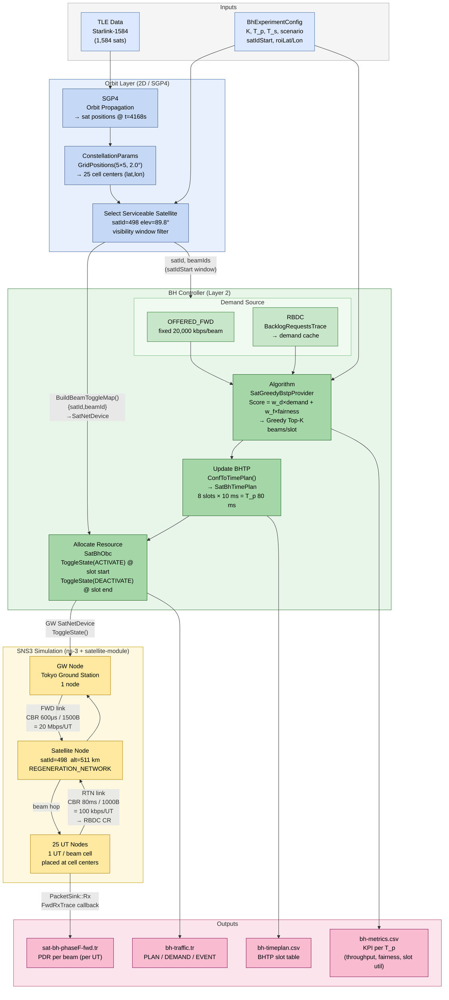

# Dynamic Beam Hopping — FWD Offered Demand Validation

**TriScale-LEO · Layer 2 Beam Hopping Controller**
2026-07-01

---

## 1. 名詞定義與挑戰 (Definition & Challenges)

### 核心術語

| 術語 | 定義 |
|------|------|
| **BHTP** (Beam Hopping Time Plan) | 定義每個 T_p 週期內各 time slot 應啟動哪些波束的時間計畫表 |
| **SatDynamicBstpProvider** | 動態 BSTP 提供者，每個 T_p 依需求貪婪選出 Top-K 波束 |
| **SatBhObc** | On-Board Controller，在槽邊界執行真實 `ToggleState()`，驅動 GW SatNetDevice |
| **OFFERED_FWD** | FWD offered load 作為排程器需求輸入，由 CBR 流量設定直接推算（非 RBDC） |
| **Configuration Management** | 以 `BhExperimentConfig` 為核心的系統參數統一管理機制 |

---


## 2. 背景環境參數 (Context Parameters)

| 參數 | 值 |
|------|----|
| 星座 | Starlink-1584（constellation-starlink-1584-sats）|
| ROI 中心 | 東京（35.676°N, 139.650°E）|
| 波束格式 | 25-beam 5×5|
| K（每槽同時啟動波束數）| 2 |
| BHTP 週期（T_p）| 8 槽 × 10 ms = **80 ms** |
| 槽長（T_s）| 10 ms |

---

## 3. Architecture Overview



---

## 4. 輸入與輸出定義 (Input / Output)

### 輸入（Inputs）

| 類別 | 參數 / 來源 | 值 |
|------|------------|-----|
| 星座模型 | `constellation-starlink-1584-sats` | 1,584 顆衛星 TLE |
| 時間快照 | `SetConstellationTimeOffset` | t = 4168 s（東京峰值仰角） |
| 波束格網 | `ConstellationParams::GridPositions(5,5,2.0°)` | 25 個 (lat, lon) 中心點 |
| UT 配置 | `BeamUserInfoMap` | 每 (satId, beamId) 放 1 UT |
| FWD 流量 | CBR UDP, 600 μs, 1500 B | 20 Mbps/UT |
| RTN 流量 | CBR UDP, 100 ms, 512 B | ~41 kbps/UT |
| Offered Demand | `fwdOfferedDemandKbps` | 20,000 kbps/beam（固定） |
| 排程參數 | K=2, T_p=80ms, T_s=10ms | — |

---

## 4. 輸入與輸出定義 — 輸出（Outputs）

| 輸出檔案 | 說明 |
|----------||------|
| `offered2-metrics-test_*.csv` |  KPI per T_p × per satellite × per beam |
| `offered2-timeplan-test_*.csv` | 初始 BHTP slot 表（slotIdx, beamIds, modcod）|
| `offered2-traffic-test_*.tr` |  BH 排程追蹤（PLAN + DEMAND + EVENT）|
| `sat-bh-phaseF-fwd.tr` | PacketSink Rx ASCII trace（PDR 驗證）|
| `bh-attributes.xml` | ns-3 ConfigStore 屬性快照 |

### .tr 欄位定義

```text
record_type, time_s, sat_id, beam_id, event, plan_id, slot_idx,
demand_kbps, duration_ms, active_beams, mapped, toggled
```

---

## 5. 性能評估指標 (Evaluation Metrics)

| 指標 | 定義 | 目標 |
|------|------|------|
| **OBC Toggle 成功率** | `EVENT(mapped=1, toggled=1)` / 總 EVENT 數 | = 100% |
| **Demand 均勻度** | OFFERED_FWD demand_kbps 的 min/max/variance | min=max=20000 |
| **BHTP 週期覆蓋率** | 最後 EVENT 時間 / simTime | ≥ 99.9% |
| **Dwell Time** | 每波束每 T_p 的服務累積時長 [ms] | 均勻分佈 |
| **Slot Utilization** | 已使用槽佔可用槽的比率 [%] | 37.5%（K=2/8槽）|
| **Drop Rate** | BH 控制層封包丟棄率 [%] | = 0% |
| **Per-Beam PDR** | `rxBytes / offeredBytes × 100` [%] | 驗證吞吐量 |

---

## 6. 應用案例流程 (Use Case)

```
[1] ParseConfig()
      └── BhExperimentConfig{scenario=starlink25, K=2, helperSatList=382,404}

[2] LoadScenario("constellation-starlink-1584-sats")
      └── ConstellationParams::GridPositions(5,5,2.0°)
            └── 25 × (kCellLat[i], kCellLon[i])

[3] SetConstellationBeamUserInfo(beamInfo)
      └── (satId=382/404, beamId=1..25) → 1 UT/beam

[4] CreateSatScenario() → 50 UT nodes placed at Tokyo ROI

[5] AddCbrTraffic(FWD: 600μs/1500B = 20Mbps, RTN: 100ms/512B)

[6] SatBhHelper::Install()
      ├── BuildBeamToggleMap() → {satId,beamId} → GW SatNetDevice
      ├── SetupDynamicBstp() → SatGreedyBstpProvider
      └── Schedule: InjectFwdDemand + RunDynamicBstpCycle (每 T_p=80ms)

[7] 每 T_p :
      InjectFwdDemand(20000 kbps × 25 beams)
        → GetNextConf() → Top-K=2 beams/slot
          → ConfToTimePlan() → SatBhTimePlan
            → OBC: ToggleState(ACTIVATE) @ slot start
            → OBC: ToggleState(DEACTIVATE) @ slot end
              → EmitTrafficTrace(EVENT, mapped=1, toggled=1)

[8] FinalFlush() → metrics.csv  |  Step9: PDR summary
```

---

## 7. 實驗場景概述 (Scenarios Overview)

### 本次實驗：starlink25 + offered-fwd（基準驗證）

- 目標：驗證 OFFERED_FWD 排程路徑端對端正確性
- 均勻 20 Mbps demand（無 hotspot 差異化）
- 無 RBDC、無 Phase F、無 ISL

### 比較基準

| 場景 | Demand 來源 | 特徵 |
|------|-------------|------|
| **offered-fwd（本次）** | OFFERED_FWD (fixed 20Mbps) | 乾淨基準，無 RBDC 干擾 |
| apply-tr | RBDC (BacklogRequestsTrace) | 真實 DAMA 需求，demand 隨時變化 |
| hotspot-5x1（計畫） | OFFERED_FWD（差異化） | beamId {1,4,13,19,22} 需求 × 5 |
| serving-sat-gating（計畫） | 依可視窗過濾 | 每時刻唯一 serving satellite |

### 已完成 vs 計畫中

| 狀態 | 功能 |
|------|------|
| ✅ | OBC real toggle，DynamicBstp，FWD offered demand，TR trace |
| ⏳ | Visibility/serving-sat schedule gating |
| ⏳ | Hotspot demand differentiation（5:1 ratio）|
| ❌ | ISL routing integration（Layer 1 接線）|

---

## 8. 實驗環境與框架 (Environment Setup)

### 軟體框架

| 元件 | 版本 / 設定 |
|------|------------|
| 模擬器 | ns-3 + SNS3 (satellite-module) |
| 星座 | `constellation-starlink-1584-sats` (1,584 sats) |
| BH 框架 | SatBhHelper / On Board Controller / Algorithm |
| 主排程器 | SatDynamicBstpProvider (SatGreedyBstpProvider ) |
| 再生模式 | `REGENERATION_NETWORK`（FWD + RTN 均啟用）|


## 9. 結果 (Results)

### TR 記錄統計

| record_type | 筆數 | 說明 |
|-------------|------|------|
| PLAN | 6,000 | 2 sat × 376 週期 × ~8 slot/週期 |
| DEMAND | 18,750 | 全為 OFFERED_FWD；RBDC = **0** |
| EVENT | 23,992 | 全部 mapped=1, toggled=1 |
| **Total** | **48,743** | — |

### BH 控制層 KPI（metrics.csv）

| 指標 | Sat 382 | Sat 404 |
|------|---------|---------|
| Dwell Time | 56–64 ms | 56–64 ms |
| Slot Utilization | **37.5%** | **37.5%** |
| Drop Rate | **0%** | **0%** |
| Jain's Fairness Index | **1.000** | **1.000** |
| Throughput (control KPI) | 0 Mbps* | 0 Mbps* |

> *BH metrics 追蹤控制層行為；實際封包吞吐量需從 SNS3 `data/*fwd-app-throughput*` 讀取

---

## 9. 結果 — 關鍵驗證結論

| 驗證項目 | 結果 | 說明 |
|----------|------|------|
| DEMAND 類型 | ✅ 100% OFFERED_FWD | 無 SYNTHETIC 或 RBDC 混入 |
| demand_kbps 均勻度 | ✅ 固定 20,000 kbps | min = max = 20,000 |
| OBC toggle 覆蓋率 | ✅ **100%**（23,992/23,992）| mapped=1, toggled=1 |
| 最後切換時間 | ✅ t = 29.998 s（plan_id=375）| 符合 simTime=30 s |
| BHTP 週期數 | ✅ ~376 週期 × 80 ms ≈ 30.08 s | 完整涵蓋模擬時長 |
| Jain 公平指數 | ✅ 1.000 | 均勻 demand → 完美輪排 |
| SNS3 原始碼修改 | ✅ **零修改** | 僅透過 trace callback 接線 |

---

## 9. 結果 — BHTP 初始槽結構

| slotIdx | 起始 (ms) | 持續 (ms) | 啟動波束 | modcod |
|---------|-----------|-----------|----------|--------|
| 0 | 0 | 10 | 1, 2 | 5 |
| 1 | 10 | 10 | 3, 4 | 5 |
| 2 | 20 | 10 | 5, 6 | 5 |
| 3 | 30 | 10 | 7, 8 | 5 |
| 4 | 40 | 10 | 9, 10 | 5 |
| 5 | 50 | 10 | 11, 12 | 5 |
| 6 | 60 | 10 | 13, 14 | 5 |
| 7 | 70 | 10 | 15, 16 | 5 |


---

## Summary

> **Pipeline Validated:**
> FWD Offered Load (20 Mbps/UT)
> → OFFERED_FWD demand (fixed 20,000 kbps/beam)
> → Greedy Top-K beam selection (K=2/slot)
> → OBC ToggleState at slot boundaries
> → GW SatNetDevice activated/deactivated
> → **100% coverage**

