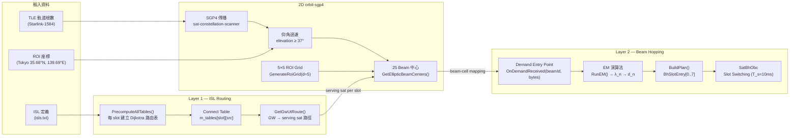
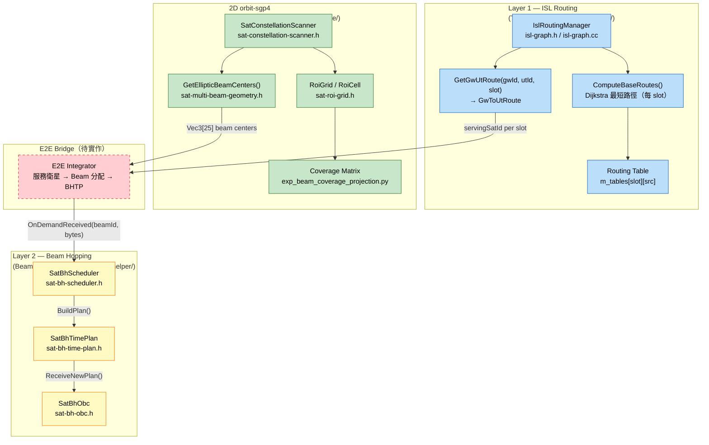
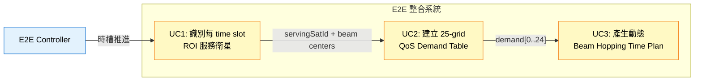
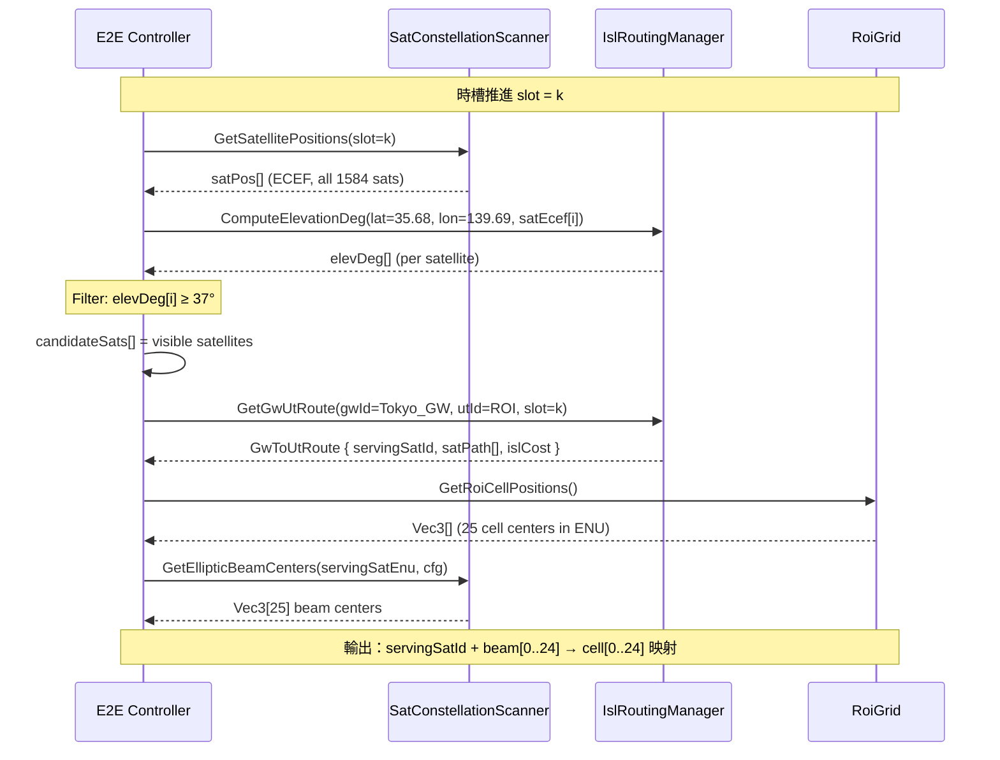
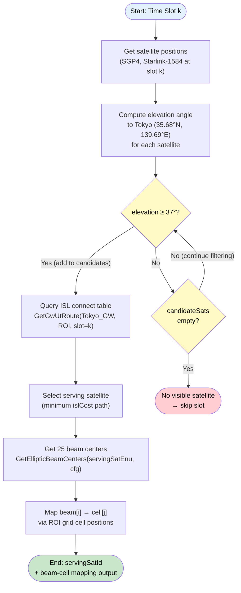
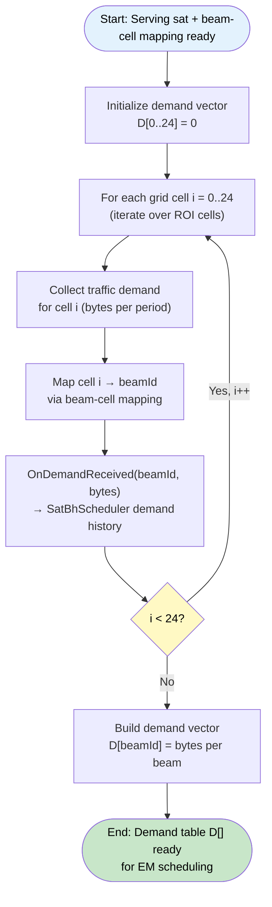
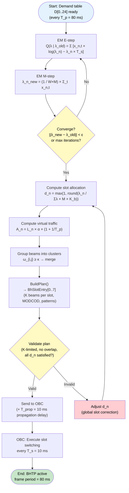
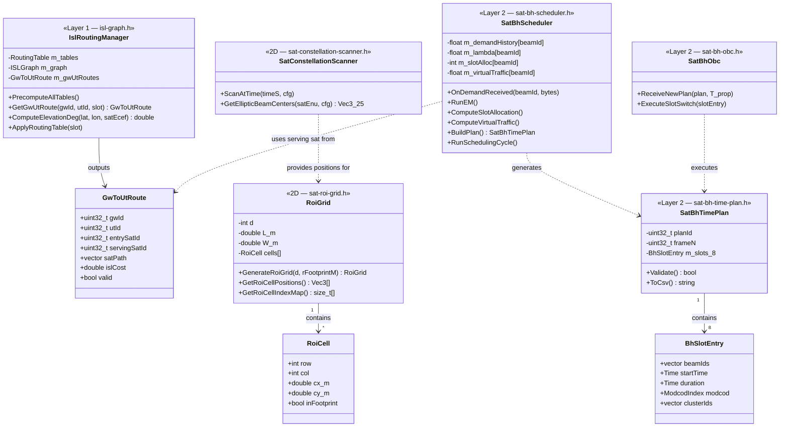

# E2E 整合系統文件

> [!CAUTION]
> 本文件為私有文件，請勿公開。發表論文後方可開放。

---

## 目錄

- [E2E 整合系統文件](#e2e-整合系統文件)
  - [目錄](#目錄)
  - [簡介](#簡介)
    - [1. 研究背景](#1-研究背景)
    - [2. 研究重要性](#2-研究重要性)
    - [3. 研究貢獻](#3-研究貢獻)
    - [4. 基準設定（固定不可更改）](#4-基準設定固定不可更改)
  - [執行進度](#執行進度)
  - [系統模型](#系統模型)
  - [系統架構](#系統架構)
  - [使用案例圖](#使用案例圖)
  - [訊息序列圖 MSC](#訊息序列圖-msc)
    - [UC1：識別 ROI 服務衛星](#uc1識別-roi-服務衛星)
  - [流程圖](#流程圖)
    - [UC1：識別 ROI 服務衛星](#uc1識別-roi-服務衛星-1)
    - [UC2：建立 QoS Demand Table](#uc2建立-qos-demand-table)
    - [UC3：產生動態 BHTP](#uc3產生動態-bhtp)
  - [類別圖](#類別圖)
  - [關鍵時間參數](#關鍵時間參數)
  - [參考文獻](#參考文獻)

---

## 簡介

### 1. 研究背景

TriScale-LEO E2E（End-to-End）整合層的目標是將三個獨立開發的功能層串接成完整的管線：

- **Layer 1（ISL 路由）**：透過預計算 Dijkstra 最短路徑，建立衛星連接表（connect table），確保封包可在 Starlink-1584 星座中透過 ISL 正確轉送至目標衛星
- **2D 軌道分析（orbit-sgp4）**：基於 SGP4 軌道傳播，計算東京上空保證服務的 ROI 範圍，並將其分割為 5×5 共 25 個格子（grid）
- **Layer 2（動態 Beam Hopping）**：依據 25 格子的 QoS 流量需求，套用Dynamic BHTP以得到最佳服務

### 2. 研究重要性

| 問題 | 說明 |
|------|------|
| 服務連續性 | 東京上方的 Starlink-1584 衛星持續移動，需動態確認哪顆衛星服務 ROI |
| 資源利用率 | 25 個 grid 的流量分佈不均，靜態 beam 分配導致資源浪費 |
| 跨層依賴 | Beam Hopping 排程需知道當前服務衛星的 ISL 連接狀態 |

### 3. 研究貢獻

1. **ROI-aware 服務衛星識別**：結合 ISL connect table 與仰角過濾（≥37°），每個 time slot 動態確認東京 ROI 的服務衛星
2. **25-grid QoS Demand Table**：以 `OnDemandReceived()` 為統一接入口，每格獨立注入流量需求
3. **BHTP 動態生成**：輸出 8 slots × 80 ms 的 BHTP，由 OBC 執行切換

### 4. 基準設定（固定不可更改）

| 參數 | 值 |
|------|-----|
| 星座 | Starlink-1584（1584 顆衛星，72 軌道面 × 22 顆） |
| 軌道高度 | 550 km |
| 軌道傾斜角 | 53° |
| 觀測地點 | 東京（35.68°N, 139.69°E） |
| 最低仰角閾值 | min_elev_deg = 37 |
| ROI 格子數 | 5×5 = 25 格 |
| 每 frame 時槽數 | M = 8（每槽 T_s = 10 ms，frame = 80 ms） |

---

## 執行進度

> **狀態說明：**
> - ○ — 曾實作，待確認 E2E 使用的 code 為乾淨版本（非實驗殘留）
> - ⏳ — 計畫中，尚未實作於 E2E

| 階段 | 狀態 | 來源位置 |
|------|------|---------|
| ISL 預計算（connect table） | ○ | `Topology & ISL Routing/Codes/isl-graph.h/cc` |
| ROI 保證覆蓋範圍計算（東京，37°） | ○ | `2D/orbit-sgp4/code/25beams/code/sat-roi-grid.h` |
| 5×5 ROI 格子建構 | ○ | `GenerateRoiGrid(d=5, rFootprintM)` in `sat-roi-grid.h` |
| 每格覆蓋矩陣計算 | ○ | `2D/orbit-sgp4/data/processed/beam_coverage_projection/` |
| 每 time slot 服務衛星識別 | ○ | `IslRoutingManager::GetGwUtRoute()` + `ComputeElevationDeg()` |
| QoS Demand 接入口（每格，單一介面） | ⏳ | `SatBhScheduler::OnDemandReceived(beamId, bytes)` 接口預留 |
| 動態 BHTP 生成 | ○ | `SatBhScheduler::RunSchedulingCycle()` in `Beam Hopping Controller/Code/helper/` |
| E2E Bridge（ISL connect table → serving sat → BHTP） | ⏳ | 尚未整合 |

---

## 系統模型

E2E 管線的輸入到輸出資料流：

---

## 系統架構

---

## 使用案例圖

---

## 訊息序列圖 MSC

### UC1：識別 ROI 服務衛星

此 MSC 說明每個 time slot 中，E2E Controller 如何透過 ISL 連接表與軌道掃描器，確認東京 ROI 的服務衛星並取得 25 個 beam 中心座標。

---

## 流程圖

### UC1：識別 ROI 服務衛星

### UC2：建立 QoS Demand Table

### UC3：產生動態 BHTP

---

## 類別圖

E2E 管線涉及三個層次的關鍵 class，以下展示其屬性、方法與跨層關係。

---

## 關鍵時間參數

| 符號 | 定義 | 值 | 備註 |
|------|------|-----|------|
| T_s | Slot 持續時間 | 10 ms | 每個 beam 切換週期（2026-06 更新） |
| T_p | BHTP 週期（M × T_s） | 80 ms | 每個 frame 的總長度 |
| T_sw | Beam 切換死區時間 | 2 ms | 可用窗口 = T_s − T_sw = 8 ms |
| T_prop | GW → 衛星傳播延遲 | 10 ms | 不可更改（550 km 軌道高度） |
| M | 每 frame 的 slot 數 | 8 | BHTP 共 8 個 BhSlotEntry |
| K | 同時啟動最大 beam 數 | 3 | 預設值，可設 2–4 |
| λ_n | 第 n 個 beam 的 Poisson 到達率 | EM 估計 | 每 frame 更新 |
| d_n | 第 n 個 beam 的 slot 分配數 | ∈ [1, M] | 由 λ_n 計算 |

---

## 參考文獻

[1] SpaceX, "Starlink Satellite Constellation," FCC Filing SAT-MOD-20190830-00087, 2019.

[2] 3GPP, "Solutions for NR to support Non-Terrestrial Networks (NTN)," Technical Specification TS 38.821, 2024.

[3] D. Bhattacherjee and A. Singla, "Network topology design at 27,000 km/hour," in *Proc. ACM CoNEXT*, 2019.

[4] F. Díaz-Rodríguez et al., "Dynamic beam hopping for high-throughput satellite systems," *IEEE Trans. on Broadcasting*, vol. 68, no. 2, 2022.
