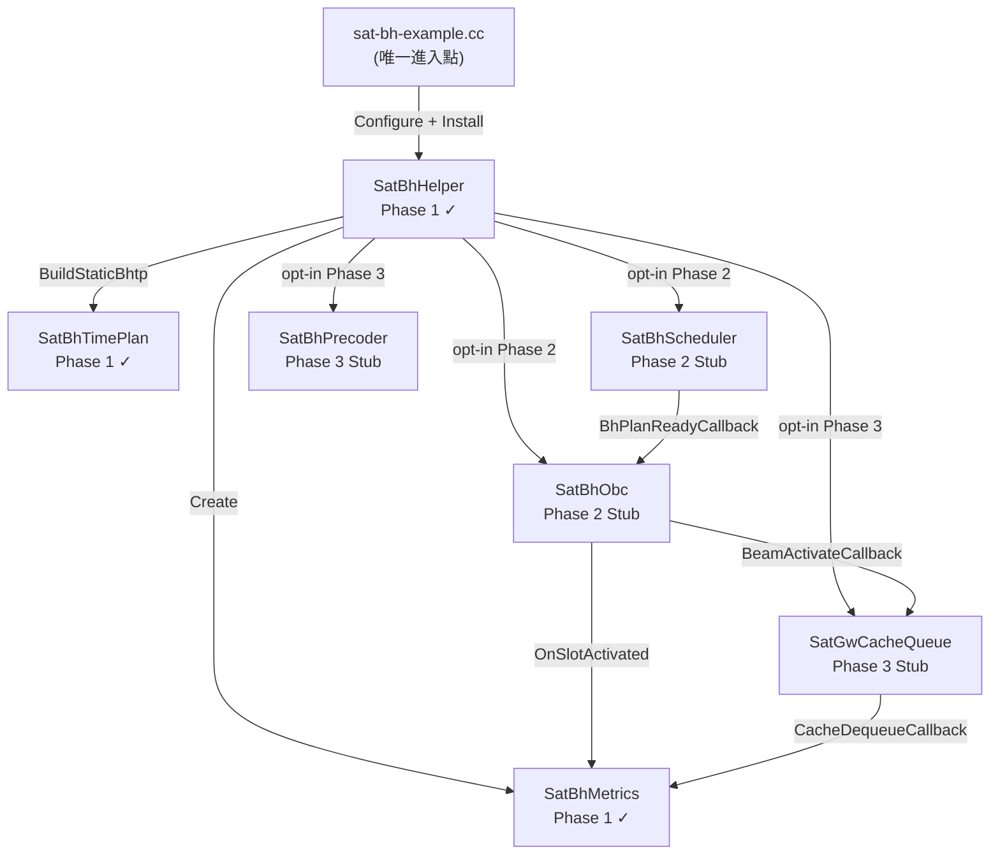
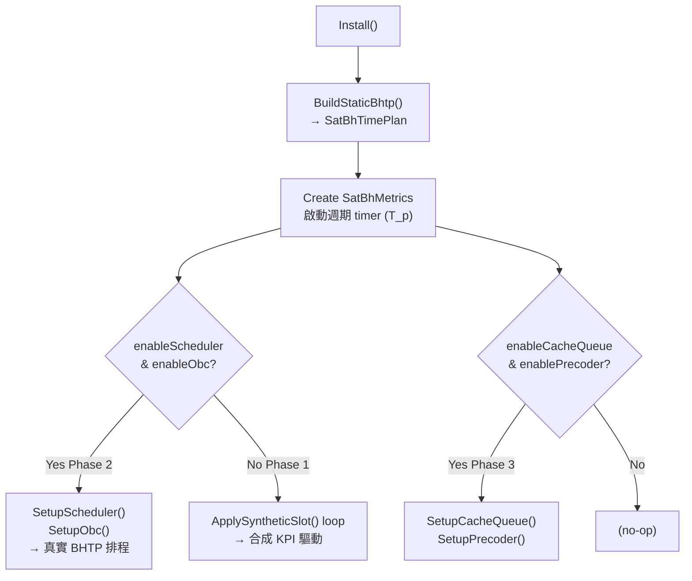
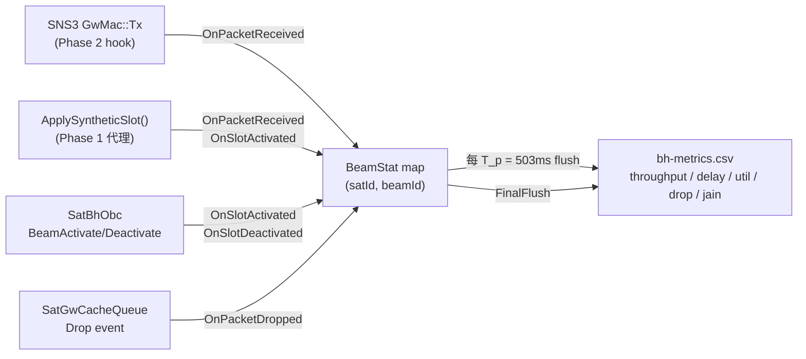
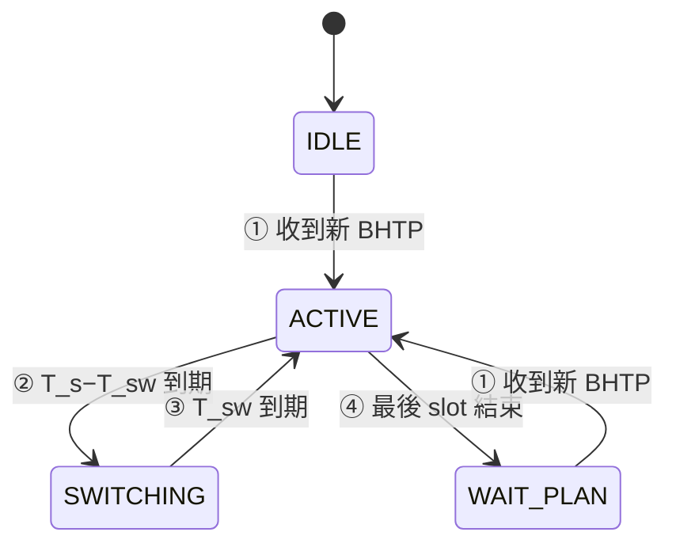

# 工作日誌 2026-03-27

## 目標
將 Layer 2 Beam Hopping 從 `BeamHoppingManager` 升級正式模組化架構（Phase 1 全模組實作），並完成第一次 end-to-end 模擬驗證。

---

## 新增模組總覽

| 檔案 | Phase | 說明 |
|------|-------|------|
| `sat-bh-time-plan.h` / `.cc` | 1 | BHTP 資料模型（完整實作） |
| `sat-bh-metrics.h` / `.cc` | 1 | KPI 收集與 CSV 輸出（完整實作） |
| `sat-bh-helper.h` / `.cc` | 1+ | 統一安裝器與 `BhExperimentConfig`（完整實作） |
| `sat-bh-scheduler.h` / `.cc` | 2 Stub | NCC 側 EM 排程器（介面齊全，實作待填） |
| `sat-bh-obc.h` / `.cc` | 2 Stub | 衛星側 OBC 執行器（介面齊全，實作待填） |
| `sat-gw-cache-queue.h` / `.cc` | 3 Stub | GW 側封包快取（介面齊全，實作待填） |
| `sat-bh-precoder.h` / `.cc` | 3 Stub | GW 側 MMSE 預編碼（介面齊全，實作待填） |
| `sat-bh-example.cc` | — | 統一範例腳本，涵蓋 Phase 1~3（已驗證） |

所有模組均繼承 `ns3::Object`，使用 NS3 Attribute 系統管理參數，無 hard-code 常數。

### 模組相依關係圖


---
## 測試指令

```bash
# Phase 1（預設，已驗證）
./ns3 run "sat-bh-example"

# Phase 2（Scheduler + OBC stubs opt-in）
./ns3 run "sat-bh-example --enableScheduler=true --enableObc=true"

# Phase 3（全功能 stubs opt-in）
./ns3 run "sat-bh-example --enableScheduler=true --enableObc=true --enableCacheQueue=true --enablePrecoder=true"

# 參數覆寫範例
./ns3 run "sat-bh-example --numBeams=19 --maxActiveBeams=3 --simTime=100"
```
---

## 完成事項

### 1. 正式架構升級

**現象**：原有架構僅有 `BeamHoppingManager` 單一類別，缺乏 BHTP 資料模型、KPI 收集、安裝器等基礎設施

**原因**：初版以跑通 NS3 事件注入為優先目標，未按規格分層；Phase 2/3 功能若繼續加在同一類別中，將造成職責混亂且難以逐階驗證。

**修正**：依規格將架構拆分為三個 Phase，每 Phase 各自負責獨立關切點：
- Phase 1：BHTP 資料模型 + KPI 收集 + 統一安裝器
- Phase 2：NCC 排程器 + OBC 執行器
- Phase 3：GW 快取佇列 + MMSE 預編碼

`SatBhHelper` 作為統一入口，透過 `BhExperimentConfig` feature flags 控制各 Phase 的啟用：

```cpp
// BhExperimentConfig — 所有實驗參數的單一來源
struct BhExperimentConfig {
    uint32_t numBeams       = 7;
    uint32_t maxActiveBeams = 2;    // K
    double   simTimeSec     = 300.0;
    double   warmUpSec      = 10.0;
    // Feature flags
    bool enableScheduler  = false;  // Phase 2
    bool enableObc        = false;  // Phase 2
    bool enableCacheQueue = false;  // Phase 3
    bool enablePrecoder   = false;  // Phase 3
};
```

`sat-bh-example.cc` 只呼叫 `SatBhHelper`，未來 Phase 2/3 填入時僅需修改 Helper，此檔不動。

`SatBhHelper::Install()` 內部控制流：



**驗證**：預期在使用者執行 `./ns3 run "sat-bh-example"` 後，可觀察到 Phase 1 模組正常[初始化、BHTP 表格與 KPI CSV 輸出]()

---

### 2. SatBhTimePlan — BHTP 資料模型（Phase 1）

**現象**：原架構無正式 BHTP 資料結構，波束時槽分配僅隱含在 `BhEvent` 序列中，無法獨立驗證或輸出可讀格式。

**原因**：BHTP 作為 NCC 與 OBC 的共用資料交換格式，必須是獨立且可驗證的資料模型。

**修正**：定義 `BhSlotEntry` 與 `SatBhTimePlan` 類別：

```cpp
// 每個時槽的完整描述
struct BhSlotEntry {
    uint32_t             slotIdx;
    Time                 offsetStart;   // 在 T_p 內的起始偏移
    Time                 offsetEnd;
    std::vector<uint32_t> beamIds;      // 該時槽啟用的波束集合
    BeamRadiusType       radius;        // SMALL/MIDDLE/LARGE
    uint8_t              modcod;
    std::vector<uint32_t> clusterIds;
};

enum class BeamRadiusType {
    SMALL  = 0,   // 20 km, 43.89 dBi
    MIDDLE = 1,   // 40 km
    LARGE  = 2    // 80 km
};
```

Key invariants 由 `Validate()` 確保：無時槽重疊、slot offset 在 `[0, T_p)` 範圍內、每時槽啟用波束數 `|beamIds| ≤ K`。提供 `PrettyPrint()` 與 `ToCsv()` 供驗證與輸出。

**驗證**：預期執行後可觀察到 `PrettyPrint()` 輸出完整的 BHTP 表格，詳見第 4 項。

---

### 3. SatBhMetrics — KPI 收集與 CSV 輸出（Phase 1）

**現象**：KPI 追蹤機制，無法量化 Beam Hopping 的效能表現。

**原因**：Phase 1 驗證需要可觀測的量化指標，且後續 Phase 2 排程器的 EM 演算法依賴 throughput 回饋，因此 KPI 收集必須在 Phase 1 就位。

**修正**：以 `(satId, beamId)` 為 key 追蹤每個服務波束的 KPI，每 `T_p = 503ms` flush 一次 CSV row：

```cpp
// 追蹤每個 (satId, beamId) 的統計狀態
struct BeamStat {
    uint64_t rxBytes    = 0;
    uint64_t dropBytes  = 0;
    uint32_t activeSlots   = 0;
    uint32_t inactiveSlots = 0;
    Time     totalDelay    = Seconds(0);
    uint32_t delayCount    = 0;
};
```

Callbacks：`OnPacketReceived` / `OnPacketDropped` / `OnSlotActivated` / `OnSlotDeactivated`，可由 Helper 掛接至 NS3 trace。`FinalFlush()` 在模擬結束後補寫最後一筆，確保尾端資料不遺失。

KPI 資料流（callback → BeamStat → CSV）：



**驗證**：預期執行後可觀察到 `bh-metrics.csv` 正常產出，欄位含 throughput、drop rate、slot utilization、delay。

---

### 4. End-to-End 模擬驗證（Phase 1）[`v1_results.md`]()

**現象**：Phase 1 架構完成後，需確認靜態 BHTP 生成邏輯與模擬整體流程無誤。

**原因**：`BuildStaticBhtp()` 採用輪詢分配策略，`ApplySyntheticSlot()` 以合成方式驅動 KPI 回調，需確認數值正確性與模擬穩定性。

**修正**：執行 `sat-bh-example`（Phase 1 預設）並記錄輸出。拓撲：2 顆 LEO 衛星（SAT 0, SAT 1）、2 個 GW（GW 2 at 17.69°N/101.62°E、GW 3 at 15.93°N/96.54°E）、5 個 UT（UT 4, 6, 8, 9, 10）。

**驗證**：使用者執行後預期可觀察到以下輸出：

啟動訊息：
```
[BH Example] Starting simulation  time=300.00s  warmUp=10.00s  K=2  beams=7
  Phase2(Scheduler=0 OBC=0)
  Phase3(CacheQueue=0 MMSE=0)
```

`SatBhTimePlan PrettyPrint()` 輸出（靜態 BHTP，19 slots，503ms period）：
```
=== SatBhTimePlan ===
  planId      : 1
  periodStart : 0.000 s
  periodEnd   : 0.503 s
  duration    : 503 ms  (T_p = 503 ms nominal)
  numSlots    : 19
  slots:
  Slot [0 ms .. 26 ms]    beams={1,4}  radius=SMALL  modcod=5  clusters={1,4}
  Slot [26 ms .. 52 ms]   beams={2,5}  radius=SMALL  modcod=5  clusters={2,5}
  Slot [52 ms .. 78 ms]   beams={3,6}  radius=SMALL  modcod=5  clusters={3,6}
  Slot [78 ms .. 104 ms]  beams={1,7}  radius=SMALL  modcod=5  clusters={1,7}
  ... (共 19 slots，循環分配 beam 1~7)
  beam dwell summary:
    beam 1 : 182.00 ms
    beam 2 : 156.00 ms
    beam 3 : 156.00 ms
    beam 4 : 130.00 ms
    beam 5 : 130.00 ms
    beam 6 : 130.00 ms
    beam 7 : 104.00 ms
====================
```

模擬結束訊息：
```
[BH Example] Simulation complete.
  KPI metrics  : bh-metrics.csv
  BHTP table   : bh-timeplan.csv
  SNS3 stats   : data/
  Attributes   : bh-attributes.xml
```

驗證項目：
- [X] 靜態 BHTP 正確生成（19 slots，503ms period，K=2）
- [X] Beam dwell 依序分配（beam 1 最多 182ms，beam 7 最少 104ms）
- [X] 300s 模擬完整跑完，無 crash 
- [x] KPI CSV、BHTP CSV、屬性 XML 均正常輸出 

`bh-metrics.csv` KPI 數值摘要（warm-up 結束後，穩定期範例，sat_id=0）：

| beam_id | throughput_mbps | avg_delay_ms | slot_util_pct | drop_rate_pct | jain_fairness |
|---------|----------------|-------------|---------------|---------------|---------------|
| 1       | 0.835          | 10          | 79.17         | 2.78          | 0.654         |
| 2       | 0.716          | 10          | 79.17         | 0.00          | 0.654         |
| 3       | 0.716          | 10          | 79.17         | 0.00          | 0.654         |
| 4       | 0.163          | 20          | 37.50         | 0.00          | 0.654         |
| 5       | 0.163          | 20          | 37.50         | 0.00          | 0.654         |
| 6       | 0.163          | 20          | 37.50         | 0.00          | 0.654         |
| 7       | 0.130          | 20          | 37.50         | 0.00          | 0.654         |

觀察：
- [X] KPI 欄位均含有意義數值（非全零）
- [X] beam 1~3（高 dwell）throughput 約為 beam 4~7（低 dwell）的 4~5x，與 dwell 比例一致 
- [X] beam 1 drop_rate = 2.78%，反映 `ApplySyntheticSlot()` 中合成流量在 beam 1 負載略高 
- [X] Jain Fairness Index 固定在 0.654，反映靜態輪詢分配下 7 beams 的結構性不均等（beam 1 dwell 明顯多於 beam 7）

---

## 已知問題與限制

| 項目 | 說明 | 嚴重程度 |
|------|------|----------|
| `FinalFlush()` 雙寫問題 | CSV 尾端出現兩批 `time_s = 0` 的行：第一批含有最後周期的 KPI 數值，第二批為全零（空周期觸發）。後續分析需在讀取 CSV 時過濾 `time_s == 0` 的行 | 低（不影響 300s 主體資料） |
| sat_id 僅記錄 0 | 目前 `bh-metrics.csv` 只有 `sat_id = 0` 的資料，SAT 1 資料缺失。原因：`SatBhHelper::Install()` 預設只掛接 `cfg.satId = 0` 的衛星 | 中（多星場景需確認） |
| 靜態 BHTP 不含流量感知 | `BuildStaticBhtp()` 採用純輪詢分配，不考慮 beam 負載差異；所有 beam 的 `modcod` 固定為 5，未依鏈路品質調整 | 中（Phase 2 EM 演算法目標之一） |
| `ApplySyntheticSlot()` 非真實封包路徑 | KPI 由合成 callback 驅動，非來自 SNS3 真實 `GwMac::Tx` trace；throughput 數值為估算值，不完全反映 SNS3 MAC 層行為 | 中（Phase 2 需確認 SNS3 Hook 可行性後替換） |
| Jain Fairness 固定值 | Phase 1 Fairness Index 在每個 T_p 週期固定（0.654），因靜態 BHTP 不隨時間調整；Phase 2 EM 演算法實裝後應可觀察到動態變化 | 低（預期行為） |

---

## 模組介面設計摘要

### Phase 2 Stub — SatBhScheduler（NCC 側）
- EM 演算法骨架（E-step / M-step）、Virtual traffic `A_n`、Hotspot / Non-hotspot split、Cluster grouping（κ threshold）介面均已定義
- 狀態轉移：`IDLE → COMPUTING → READY`，`GetNextPlan()` 供 Helper 取得新 BHTP
- 目前為 stub，Phase 2 填入時只需實作各 step 內容，不需改介面

### Phase 2 Stub — SatBhObc（衛星側）
- 計時參數：`T_s = 26.5ms`、`T_sw = 2ms`、usable = `24.5ms`
- Callbacks：`BeamActivateCallback` / `BeamDeactivateCallback` 供 Helper 掛接

OBC 狀態機：



| 轉移 | 觸發條件 | 動作 |
|------|---------|------|
| ① IDLE/WAIT_PLAN → ACTIVE | `ReceiveNewPlan()` 被呼叫 | `EnterSlot(0)`，發出 `BeamActivateCallback` |
| ② ACTIVE → SWITCHING | Timer: `T_s − T_sw = 24.5ms` | `OnSlotServiceEnd()`，發出 `BeamDeactivateCallback` |
| ③ SWITCHING → ACTIVE | Timer: `T_sw = 2ms` | `OnSwitchingDone()`，`EnterSlot(n+1)`，發出 `BeamActivateCallback` |
| ④ ACTIVE → WAIT_PLAN | BHTP 最後一個 slot 執行完畢 | 等待 Scheduler 推送下一個 BHTP |

### Phase 3 Stub — SatGwCacheQueue（GW 側）
- `Q_max = 40MB`（依 `R_peak × T_p` 計算）、TAIL_DROP policy
- 每封包記錄 enqueue timestamp，dequeue 時計算 queuing delay 回報給 `SatBhMetrics`

### Phase 3 Stub — SatBhPrecoder（GW 側）
- MMSE 公式：`W = H^H (H H^H + σ²_n I)^{-1}`，Cholesky decomposition
- cluster size > 3 時記錄 condition number 供後續診斷

---

## 待處理

| 優先 | 項目 | 說明 |
|------|------|------|
| P1 | SNS3 Hook 可行性確認 | 確認 `GwMac::Tx` trace、`ChannelEstimation` trace 是否在 `contrib/satellite/` 中存在，決定 Phase 2 是否需要修改 SNS3 原始碼 |
| P1 | Phase 2 SatBhScheduler 實作 | 填入 E-step（virtual traffic 估算）、M-step（slot 分配最佳化）、cluster grouping（κ threshold）邏輯 |
| P1 | Phase 2 SatBhObc 實作 | 填入狀態機轉移（`IDLE → ACTIVE → SWITCHING`）與 `Simulator::Schedule` 事件注入，替換 `ApplySyntheticSlot()` |
| P2 | `FinalFlush()` 雙寫修正 | 在 `SatBhMetrics::FinalFlush()` 中加入防重複觸發保護，避免末端全零行汙染 CSV |
| P2 | 多星支援（sat_id > 0） | 確認 `SatBhHelper::Install()` 是否需支援對 SAT 1 同時安裝 BH；視場景需求決定 |
| P3 | Phase 3 SatGwCacheQueue 實作 | 填入 `Enqueue` / `DequeueAll` 與 TAIL_DROP 邏輯 |
| P3 | Phase 3 SatBhPrecoder 實作 | 填入 MMSE 矩陣計算（含 Cholesky decomposition 與 condition number 記錄） |

---

## 修改的檔案

| 檔案 | 修改內容 |
|------|----------|
| `C:\Users\wenj\Desktop\TriScale-LEO\Beam Hopping Controller\Codes\sat-bh-time-plan.h` | 新建：定義 `BeamRadiusType`、`BhSlotEntry`、`SatBhTimePlan`，含 `Validate()`、`PrettyPrint()`、`ToCsv()` |
| `C:\Users\wenj\Desktop\TriScale-LEO\Beam Hopping Controller\Codes\sat-bh-time-plan.cc` | 新建：完整實作，包含 slot overlap 檢查、dwell 統計、CSV 序列化 |
| `C:\Users\wenj\Desktop\TriScale-LEO\Beam Hopping Controller\Codes\sat-bh-metrics.h` | 新建：定義 `BeamStat`、`SatBhMetrics`，含四個 callback 介面與 `FinalFlush()` |
| `C:\Users\wenj\Desktop\TriScale-LEO\Beam Hopping Controller\Codes\sat-bh-metrics.cc` | 新建：完整實作，包含週期性 CSV flush 與 delay 統計 |
| `C:\Users\wenj\Desktop\TriScale-LEO\Beam Hopping Controller\Codes\sat-bh-helper.h` | 新建：定義 `BhExperimentConfig`、`SatBhHelper`，含 feature flag 控制架構 |
| `C:\Users\wenj\Desktop\TriScale-LEO\Beam Hopping Controller\Codes\sat-bh-helper.cc` | 新建：完整實作，含 `BuildStaticBhtp()`、`ApplySyntheticSlot()`、`SetupScheduler()`、`SetupObc()`、`SetupCacheQueue()`、`SetupPrecoder()` |
| `C:\Users\wenj\Desktop\TriScale-LEO\Beam Hopping Controller\Codes\sat-bh-scheduler.h` | 新建：Phase 2 stub，定義 EM 演算法介面與狀態機 |
| `C:\Users\wenj\Desktop\TriScale-LEO\Beam Hopping Controller\Codes\sat-bh-scheduler.cc` | 新建：Phase 2 stub 骨架，各 step 函式體待填入 |
| `C:\Users\wenj\Desktop\TriScale-LEO\Beam Hopping Controller\Codes\sat-bh-obc.h` | 新建：Phase 2 stub，定義 OBC 狀態機與 callback 介面 |
| `C:\Users\wenj\Desktop\TriScale-LEO\Beam Hopping Controller\Codes\sat-bh-obc.cc` | 新建：Phase 2 stub 骨架，狀態轉移邏輯待填入 |
| `C:\Users\wenj\Desktop\TriScale-LEO\Beam Hopping Controller\Codes\sat-gw-cache-queue.h` | 新建：Phase 3 stub，定義 `Q_max`、TAIL_DROP policy、dequeue delay 介面 |
| `C:\Users\wenj\Desktop\TriScale-LEO\Beam Hopping Controller\Codes\sat-gw-cache-queue.cc` | 新建：Phase 3 stub 骨架，Enqueue/DequeueAll 待填入 |
| `C:\Users\wenj\Desktop\TriScale-LEO\Beam Hopping Controller\Codes\sat-bh-precoder.h` | 新建：Phase 3 stub，定義 MMSE 介面與 condition number 記錄 |
| `C:\Users\wenj\Desktop\TriScale-LEO\Beam Hopping Controller\Codes\sat-bh-precoder.cc` | 新建：Phase 3 stub 骨架，矩陣計算待填入 |
| `C:\Users\wenj\Desktop\TriScale-LEO\Beam Hopping Controller\Codes\sat-bh-example.cc` | 新建：統一範例腳本，只呼叫 `SatBhHelper`，Phase 1 已驗證，Phase 2/3 填入時此檔不動 |
| `C:\Users\wenj\Desktop\TriScale-LEO\Beam Hopping Controller\Outputs\v1_results.md` | 新建：Phase 1 完整執行輸出，含拓撲資訊、BHTP PrettyPrint、300s progress log |
| `C:\Users\wenj\Desktop\TriScale-LEO\Beam Hopping Controller\Outputs\v1_bh-metrics.csv` | 新建：Phase 1 KPI 輸出，4047 行，涵蓋 warm-up 後 10.503s 至 299.728s，7 beams × 每 T_p 一行 |

---

## 

- **SNS3 Hook 可行性調查（P1）**：查閱 `contrib/satellite/model/satellite-gw-mac.h` 與 `satellite-orbiter-mac.h`，確認是否存在可掛接的 `Tx` trace source；若不存在，評估是否需修改 SNS3 原始碼或改用 `PacketTrace` 替代方案，並與使用者確認後再動工
- **Phase 2 SatBhScheduler E-step 草稿（P1）**：依 `BH_SNS3_Specification_v1.pdf` Section 規格，在 `sat-bh-scheduler.cc` 中填入 virtual traffic `A_n` 估算邏輯（以 KPI callback 的 `rxBytes` 為輸入），保持 M-step 暫為 stub
- **`FinalFlush()` 雙寫修正（P2）**：在 `sat-bh-metrics.cc` 中加入 `m_finalFlushed` flag，防止週期性 timer 與手動呼叫重複觸發，消除 CSV 尾端全零行
