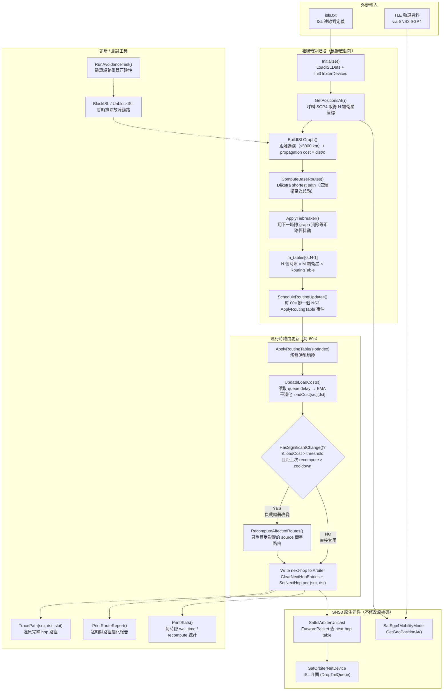
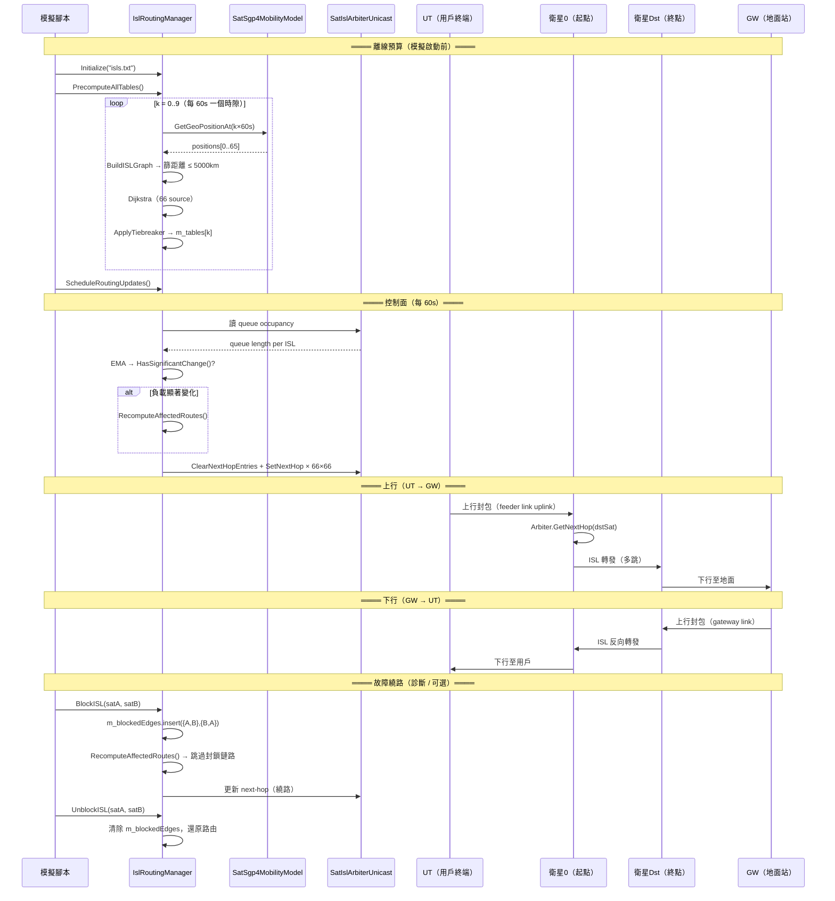
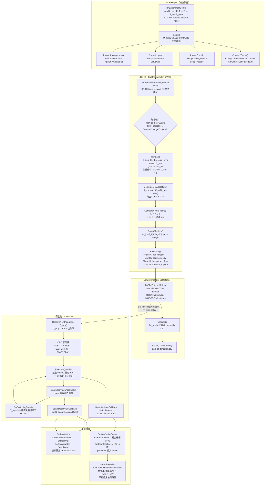
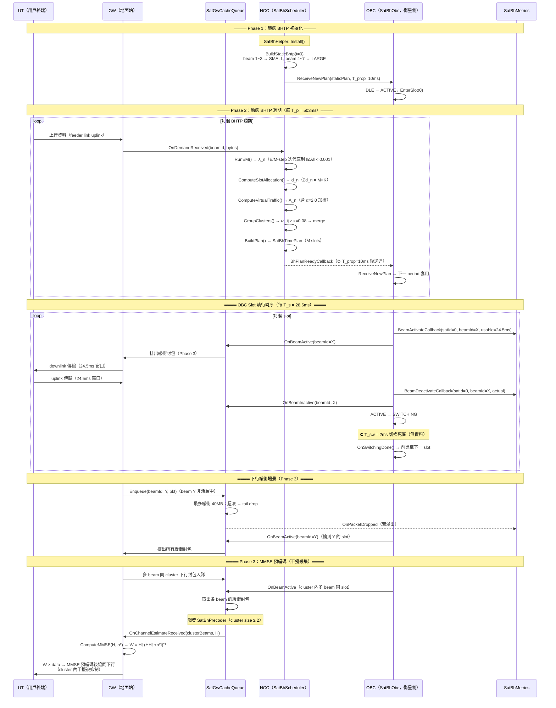
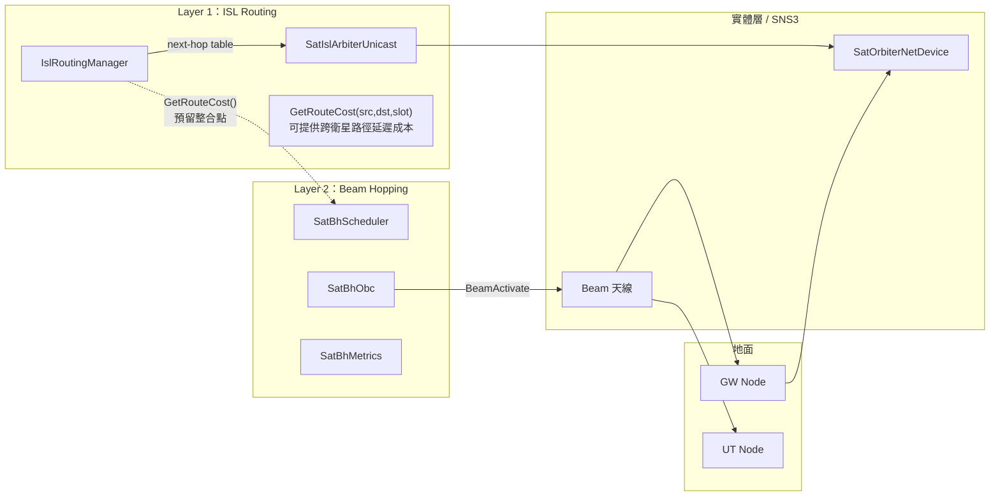

# TriScale-LEO 架構圖：Layer 1 & Layer 2 功能圖 + 時序圖

> 日期：2026-03-30
> Topology & ISL Routing (Layer 1) + Beam Hopping Controller (Layer 2)

---

## Layer 1 — Topology & ISL Routing

### 1.1 功能架構圖



---

### 1.2 關鍵程式碼：資料結構

`IslRoutingManager` 的三個核心資料結構（[v5_isl-graph.h](../Topology%20&%20ISL%20Routing/Codes/v5_isl-graph.h#L24)）：

```cpp
// 每條 ISL 邊的屬性
struct ISLEdge {
    uint32_t nodeB;
    double propagation_cost;   // dist/c，單位：秒
    uint32_t islIfIndexOnA;
    uint32_t islIfIndexOnB;
};

// 路由表的每一筆 entry
struct RouteEntry {
    uint32_t destSatId;
    uint32_t nextHopSatId;
    uint32_t islIfIndexOnA;
    double cost;
};

// 全域類型別名
using ISLGraph     = std::vector<std::vector<ISLEdge>>;
using RoutingTable = std::vector<std::vector<RouteEntry>>;
```

負載感知的 EMA 平滑參數（[v5_isl-graph.h:139](../Topology%20&%20ISL%20Routing/Codes/v5_isl-graph.h#L139)）：

```cpp
double m_emaAlpha        = 0.5;   // EMA 新樣本權重
double m_changeThreshold = 0.2;   // 負載變化觸發重算的門檻
double m_cooldownSeconds = 60.0;  // 兩次重算間最短冷卻時間
double m_islLinkRateBps  = 10e6;  // ISL 鏈路速率 10 Mbps
```

---

### 1.3 關鍵程式碼：預算主迴圈

離線預算流程（[v5_isl-graph.cc:131](../Topology%20&%20ISL%20Routing/Codes/v5_isl-graph.cc#L131)）：

```cpp
void IslRoutingManager::PrecomputeAllTables()
{
    m_tables.resize(m_numTimeSlots);

    std::vector<Vector> posCurr = GetPositionsAt(Seconds(0.0));
    ISLGraph graphCurr = BuildISLGraph(posCurr);

    for (uint32_t k = 0; k < m_numTimeSlots; k++)
    {
        // 1. Dijkstra 以當前拓撲計算路由
        RoutingTable routes = ComputeBaseRoutes(graphCurr);

        // 2. 用下一時隙的拓撲做 tiebreaker（減少路徑抖動）
        if (k < m_numTimeSlots - 1) {
            Time tauNext = Seconds(m_timeSlotInterval * (k + 1));
            ISLGraph graphNext = BuildISLGraph(GetPositionsAt(tauNext));
            routes = ApplyTiebreaker(routes, graphNext);
            graphCurr = std::move(graphNext);
        }

        m_tables[k] = std::move(routes);
    }
}
```

運行時更新（[v5_isl-graph.cc:186](../Topology%20&%20ISL%20Routing/Codes/v5_isl-graph.cc#L186)）：

```cpp
void IslRoutingManager::ApplyRoutingTable(uint32_t slotIndex)
{
    if (slotIndex > 0) {
        UpdateLoadCosts();              // EMA 更新 queue delay
        bool changed = HasSignificantChange();

        if (changed) {
            // 只重算受到負載變化影響的 source 衛星
            RecomputeAffectedRoutes(slotIndex);
        }
    }

    // 把路由表寫入每顆衛星的 Arbiter
    for (uint32_t src = 0; src < m_numSatellites; src++) {
        m_arbiters[src]->ClearNextHopEntries();
        for (auto& entry : m_tables[slotIndex][src])
            m_arbiters[src]->SetNextHop(entry.destSatId,
                                        entry.nextHopSatId,
                                        entry.islIfIndexOnA);
    }
}
```

---

### 1.4 測試入口

主要設定區段（[v5_test-iridium.cc:70](../Topology%20&%20ISL%20Routing/Codes/v5_test-iridium.cc#L70)）：

```cpp
const std::string scenarioName = "constellation-iridium-66-sats-fixed";
const uint32_t    numSats      = 66;

Ptr<IslRoutingManager> islMgr = CreateObject<IslRoutingManager>();
islMgr->SetAttribute("NumSatellites",    UintegerValue(numSats));
islMgr->SetAttribute("NumTimeSlots",     UintegerValue(10));      // 10 個 60s 時隙
islMgr->SetAttribute("IslMaxDistanceKm", DoubleValue(5000.0));
islMgr->SetAttribute("EmaAlpha",         DoubleValue(0.3));
islMgr->SetAttribute("ChangeThreshold",  DoubleValue(0.1));
islMgr->SetAttribute("CooldownSeconds",  DoubleValue(30.0));

islMgr->Initialize(islsFilePath);
islMgr->PrecomputeAllTables();
islMgr->ScheduleRoutingUpdates();
```

**測試指令：**

```bash
./ns3 run "v5-test-iridium \
  --numSlots=10 \
  --slotInterval=60 \
  --emaAlpha=0.3 \
  --changeThreshold=0.1"
```

---

### 1.5 上下行時序圖



---

### 1.6 關鍵程式碼：故障繞路工具

`BlockISL` / `UnblockISL` / `RunAvoidanceTest` 對應架構圖 `DIAG` 節點（[v5_isl-graph.h:105](../Topology%20&%20ISL%20Routing/Codes/v5_isl-graph.h#L105)）：

```cpp
// 暫時封鎖一條 ISL（雙向同時封鎖）
// 封鎖後，BuildISLGraph 跳過此邊，等同鏈路故障
void BlockISL(uint32_t nodeA, uint32_t nodeB);

// 解除封鎖，清除 m_blockedEdges，還原至原路由
void UnblockISL(uint32_t nodeA, uint32_t nodeB);

// 一鍵驗證繞路正確性：
//   1. 找出 testSrc→testDst 的當前路徑
//   2. 封鎖路徑上的第一條 ISL
//   3. 離線重算路由
//   4. 印出新路徑，驗證封鎖邊不再出現
//   5. 還原路由與封鎖狀態
void RunAvoidanceTest(uint32_t testSrc, uint32_t testDst, uint32_t slotIndex);
```

路徑追蹤與逐時隙報告（[v5_isl-graph.h:92](../Topology%20&%20ISL%20Routing/Codes/v5_isl-graph.h#L92)）：

```cpp
// TracePath：依 next-hop 表還原完整 hop 序列
// 回傳值末尾若為 UINT32_MAX 表示目的地不可達
std::vector<uint32_t> TracePath(uint32_t src, uint32_t dst, uint32_t slotIndex) const;

// PrintRouteReport：逐時隙列印路徑；路徑與上一時隙不同時標記 <CHANGED>
void PrintRouteReport(const std::vector<std::pair<uint32_t, uint32_t>>& pairs) const;
```

---
---

## Layer 2 — Beam Hopping Controller

### 2.1 功能架構圖（三相全展開）



---

### 2.2 關鍵程式碼：實驗入口

`sat-bh-example.cc` 的 main 只需三行即可啟動整個 BH 系統（[sat-bh-example.cc:183](../Beam%20Hopping%20Controller/Codes/sat-bh-example.cc#L183)）：

```cpp
// ── BH 系統安裝（唯一的 BH API 呼叫點）────────────────────────
Ptr<SatBhHelper> bhHelper = CreateObject<SatBhHelper>();
bhHelper->Configure(cfg);   // 套用 BhExperimentConfig
bhHelper->Install();        // 建立並連線所有啟用的模組
```

`BhExperimentConfig` 統一管理所有參數（[sat-bh-helper.h:70](../Beam%20Hopping%20Controller/Codes/sat-bh-helper.h#L70)）：

```cpp
struct BhExperimentConfig {
    uint32_t numBeams{7};             // 基礎情境 7 beams
    uint32_t maxActiveBeams{2};       // K = 2（同時最多 2 beam）
    uint32_t numHotspotBeams{3};      // beam 1~3 為熱點
    double   slotDurationMs{26.5};    // T_s = 26.5 ms
    double   bhtpPeriodMs{503.0};     // T_p = 503 ms
    double   switchingTimeMs{2.0};    // T_sw = 2 ms 切換死區
    double   propagationDelayMs{10.0};// T_prop = 10 ms

    double   alphaDelaySensitivity{2.0}; // α 延遲敏感因子
    double   interferenceKappa{0.08};    // κ cluster 合併門檻

    bool enableScheduler{false};  // Phase 2
    bool enableObc{false};        // Phase 2
    bool enableCacheQueue{false}; // Phase 3
    bool enablePrecoder{false};   // Phase 3
};
```

**各 Phase 的測試指令：**

```bash
# Phase 1（預設，靜態 BHTP + Metrics）
./ns3 run "sat-bh-example"

# Phase 2（動態排程 + OBC 狀態機）
./ns3 run "sat-bh-example --enableScheduler=true --enableObc=true"

# Phase 3（加入封包緩衝 + MMSE 預編碼）
./ns3 run "sat-bh-example \
  --enableScheduler=true --enableObc=true \
  --enableCacheQueue=true --enablePrecoder=true"

# 調整演算法參數
./ns3 run "sat-bh-example --alpha=3.0 --kappa=0.05 --simTime=600 --numBeams=19"
```

---

### 2.3 關鍵程式碼：OBC 狀態機介面

OBC 狀態與 Callback 型別（[sat-bh-obc.h:57](../Beam%20Hopping%20Controller/Codes/sat-bh-obc.h#L57)）：

```cpp
// OBC 狀態機四個狀態
enum class ObcState : uint8_t {
    IDLE      = 0, // 無 BHTP，OBC 閒置
    ACTIVE    = 1, // 正在執行某個 slot，beam 活躍
    SWITCHING = 2, // T_sw = 2ms 切換死區，無資料
    WAIT_PLAN = 3, // 最後一個 slot 結束，等待下一份 BHTP
};

// Beam 事件 Callback（由 SatBhHelper 連接到 Metrics 和 CacheQueue）
using BeamActivateCallback   = std::function<void(uint32_t satId, uint32_t beamId, Time usableDur)>;
using BeamDeactivateCallback = std::function<void(uint32_t satId, uint32_t beamId, Time usedDur)>;
```

狀態轉換方法（[sat-bh-obc.h:123](../Beam%20Hopping%20Controller/Codes/sat-bh-obc.h#L123)）：

```cpp
// EnterSlot：slot 開始，發出 BeamActivate，排程 T_s-T_sw 後的結束事件
void EnterSlot(int32_t slotIdx);
//   ↓ (24.5ms 後)
// OnSlotServiceEnd：發出 BeamDeactivate，ACTIVE → SWITCHING
void OnSlotServiceEnd(int32_t slotIdx);
//   ↓ (T_sw = 2ms 後)
// OnSwitchingDone：SWITCHING → ACTIVE 或 → WAIT_PLAN（最後 slot）
void OnSwitchingDone(int32_t nextSlotIdx);
```

OBC 計劃接收入口，對應架構圖 `RECV` 節點（[sat-bh-obc.h:83](../Beam%20Hopping%20Controller/Codes/sat-bh-obc.h#L83)）：

```cpp
// RECV：由 SatBhHelper 在 T_prop 延遲後呼叫（非同步）
// 狀態轉換：IDLE → ACTIVE  或  WAIT_PLAN → ACTIVE
void ReceiveNewPlan(Ptr<SatBhTimePlan> plan, Time propagationDelay);
```

---

### 2.3.1 關鍵程式碼：TRIGGER（雙模觸發條件）

對應架構圖 `TRIGGER` 節點（[sat-bh-scheduler.h:86](../Beam%20Hopping%20Controller/Codes/sat-bh-scheduler.h#L86)）：

```cpp
// 觸發模式 1 — 週期觸發（每 T_p = 503ms 自動呼叫一次）
// 由 SatBhHelper::Install() 呼叫一次後自我延續
void ScheduleNextCycle();

// 觸發模式 2 — 提前觸發（需求變化超過門檻）
// 若相鄰兩個 slot 的需求差異 > DemandChangeThreshold，立即執行
// DemandChangeThreshold 預設 0.20（20% 需求變化）
void RunSchedulingCycle(Time now);
```

對應 Attribute 設定（[sat-bh-scheduler.cc:52](../Beam%20Hopping%20Controller/Codes/sat-bh-scheduler.cc#L52)）：

```cpp
.AddAttribute("DemandChangeThreshold",
              "Demand change ratio that triggers early re-scheduling",
              DoubleValue(0.20),
              MakeDoubleAccessor(&SatBhScheduler::m_demandChangeThreshold),
              MakeDoubleChecker<double>(0.0, 1.0))
```

---

### 2.3.2 關鍵程式碼：HOOKS（SNS3 Trace 連線）

對應架構圖 `HOOKS` 節點（[sat-bh-helper.h:185](../Beam%20Hopping%20Controller/Codes/sat-bh-helper.h#L185)）：

```cpp
// ConnectTraces()：將 SNS3 既有 trace source 連接到 BH 模組的 callback
// 不修改 SNS3 原始碼，完全透過 Config::ConnectWithoutContext 非侵入式連接
void ConnectTraces();

// 計劃連接的 hook 點（Hook feasibility check 後確認可用性）：
//   DaRequestReceived   → SatBhScheduler::OnDemandReceived
//   SlotAllocated       → slot boundary 同步
//   GwMac::Tx           → SatGwCacheQueue::Enqueue
//   GwMac::Rx           → SatBhMetrics::OnPacketReceived
//   ChannelEstimation   → SatBhPrecoder::OnChannelEstimateReceived
//   HandoverCompleted   → CacheQueue 遷移（LEO 多星切換）
// 若 trace 不可用，回退至 Simulator::Schedule 輪詢
```

---

### 2.4 實際執行輸出：SNS3 拓撲

Phase 1 啟動後 SNS3 印出的拓撲（節錄自 [v1_results.md](../Beam%20Hopping%20Controller/Outputs/v1_results.md)）：

```
Satellite topology
==================
Satellites
  SAT: ID = 0, at 4.39344, 113.854, 415387
    Feeders: beam 1~7（各一條 feeder link 到 GW）
    Users:   beam 1~7（各一條 user link 到 UT）
    ISLs:    02-06-...42 → SAT 1

  SAT: ID = 1, at 17.3625, 124.686, 413074
    Feeders: beam 1~7
    ISLs:    02-06-...43 → SAT 0

GWs
  GW: ID = 2, at (17.69, 101.62)
    Devices → SAT 0 beam 1,3,5,7 / SAT 1 beam 1,3,5,7
  GW: ID = 3, at (15.93, 96.54)
    Devices → SAT 0 beam 2,4,6 / SAT 1 beam 2,4,6

UTs
  UT: ID = 4 → SAT 1, beam 5
  UT: ID = 6 → SAT 1, beam 6
  UT: ID = 8,9,10 → SAT 1, beam 7（3 個 UT 共用同一 beam）
==================
```

> **解讀：** 2 顆 LEO 衛星、2 個 GW、5 個 UT。SAT 0 的 beam 透過 feeder link 連 GW，再透過 ISL 與 SAT 1 相連。beam 7 有 3 個 UT 競爭，是本次模擬中負載最重的 beam。

---

### 2.5 實際執行輸出：BHTP 內容

Phase 1 的靜態 BHTP PrettyPrint（節錄自 [v1_results.md](../Beam%20Hopping%20Controller/Outputs/v1_results.md#L112)）：

```
=== SatBhTimePlan ===
  planId      : 1
  periodStart : 0.000 s
  periodEnd   : 0.503 s
  duration    : 503 ms  (T_p = 503 ms)
  numSlots    : 19

  Slot [  0 ms .. 26 ms]  beams={1,4}  radius=SMALL  modcod=5  clusters={1,4}
  Slot [ 26 ms .. 52 ms]  beams={2,5}  radius=SMALL  modcod=5  clusters={2,5}
  Slot [ 52 ms .. 78 ms]  beams={3,6}  radius=SMALL  modcod=5  clusters={3,6}
  Slot [ 78 ms ..104 ms]  beams={1,7}  radius=SMALL  modcod=5  clusters={1,7}
  ...（共 19 個 slot，每個 slot 同時啟動 K=2 個 beam）

  beam dwell summary:
    beam 1 : 182.00 ms   ← 出現 7 次（最多）
    beam 2 : 156.00 ms
    beam 3 : 156.00 ms
    beam 4 : 130.00 ms
    beam 5 : 130.00 ms
    beam 6 : 130.00 ms
    beam 7 : 104.00 ms   ← 出現 4 次（最少，但有 3 個 UT！）
====================
```

> **解讀：**
> - 7 個 beam，K=2，T_p = 503ms，共 19 個 slot（= M）
> - 每個 slot 26ms（= T_s），每個 slot 啟動 2 個 beam
> - beam 1 dwell = 182ms → 在這個 BHTP 週期被服務 7 次
> - **問題：** beam 7 有最多 UT（3 個）但 dwell 最短（104ms）→ Phase 2 EM 應修正此不均衡

對應的 CSV 輸出（[v1_bh-timeplan.csv](../Beam%20Hopping%20Controller/Outputs/v1_bh-timeplan.csv)）：

```
slotIdx  startMs  durationMs  beamIds  beamRadius  modcod  clusterIds
      0        0          26    1   4       SMALL       5    1   4
      1       26          26    2   5       SMALL       5    2   5
      2       52          26    3   6       SMALL       5    3   6
      3       78          26    1   7       SMALL       5    1   7
      4      104          26    2   4       SMALL       5    2   4
     ...（共 19 列）
```

> **欄位說明：**
> - `beamIds`：同一 slot 同時啟動的 2 個 beam 編號（因 K=2）
> - `beamRadius`：Phase 1 全部靜態設為 SMALL（Phase 2 才依 hotspot/non-hotspot 動態選）
> - `clusterIds`：各 beam 的干擾叢集 ID（Phase 3 才有實際意義，Phase 1 為 pass-through）

---

### 2.6 實際執行輸出：KPI Metrics

Phase 1 的 bh-metrics.csv 前幾列（節錄自 [v1_bh-metrics.csv](../Beam%20Hopping%20Controller/Outputs/v1_bh-metrics.csv)）：

```
time_s   sat_id  beam_id  throughput_mbps  avg_delay_ms  dwell_time_ms  slot_util_pct  drop_rate_pct  jain_fairness_index
 10.503       0        1         0.039989            10            168      79.166667       2.777778           0.654079
 10.503       0        2         0.034276            10            144      79.166667       0.000000           0.654079
 10.503       0        3         0.034276            10            144      79.166667       0.000000           0.654079
 10.503       0        4         0.007800            20            120      37.500000       0.000000           0.654079
 10.503       0        5         0.007800            20            120      37.500000       0.000000           0.654079
 10.503       0        6         0.007800            20            120      37.500000       0.000000           0.654079
 10.503       0        7         0.006240            20             96      37.500000       0.000000           0.654079
```

> **解讀（time = 10.503s = 第一個完整 T_p 結束後的第一個報告）：**

| 指標 | beam 1~3（hotspot）| beam 4~7（non-hotspot）| 意義 |
|---|---|---|---|
| dwell_time_ms | 144~168 ms | 96~120 ms | beam 1 dwell 最長，靜態計畫 beam 1 出現 7 次 |
| slot_util_pct | 79.2% | 37.5% | hotspot beam 的 slot 利用率明顯較高 |
| avg_delay_ms | 10 ms | 20 ms | non-hotspot beam 等待下一個 slot 的平均延遲較大 |
| drop_rate_pct | 2.78%（beam 1）| 0% | beam 1 有少許 drop，代表流量超出了 dwell 窗口 |
| jain_fairness_index | 0.654 | 0.654 | 整體公平性偏低，靜態分配不反應需求差異 |

> **Phase 2 目標：** EM 動態分配後，beam 7（3 個 UT）應獲得更多 dwell，delay 和 drop rate 應下降，JFI 應提升至 ≥ 0.90。

---

### 2.7 實際執行輸出：模擬啟動訊息

Phase 1 的啟動 log（節錄自 [v1_results.md](../Beam%20Hopping%20Controller/Outputs/v1_results.md#L149)）：

```
[BH Example] Starting simulation
  time=300.00s  warmUp=10.00s  K=2  beams=7
  Phase2(Scheduler=0 OBC=0)
  Phase3(CacheQueue=0 MMSE=0)

Progress: 3.00/300.00
Progress: 6.00/300.00
...
Progress: 297.00/300.00

[BH Example] Simulation complete.
  KPI metrics  : bh-metrics.csv
  BHTP table   : bh-timeplan.csv
  SNS3 stats   : data/
  Attributes   : bh-attributes.xml
```

> **解讀：** `Scheduler=0 OBC=0` 代表 Phase 1（靜態模式）。切換到 Phase 2 後應看到 `Scheduler=1 OBC=1`，且每隔 503ms 會有一行 EM 執行 log。

---

### 2.8 SatBhScheduler 的可調屬性

所有參數均透過 ns3 Attribute 系統設定（[sat-bh-scheduler.cc:39](../Beam%20Hopping%20Controller/Codes/sat-bh-scheduler.cc#L39)）：

```cpp
TypeId SatBhScheduler::GetTypeId() {
    static TypeId tid =
        TypeId("ns3::SatBhScheduler")
            .AddAttribute("NumBeams",              UintegerValue(19), ...)
            .AddAttribute("MaxActiveBeams",        UintegerValue(3),  ...)   // K
            .AddAttribute("BhtpPeriodMs",          DoubleValue(503.0),...)   // T_p
            .AddAttribute("SlotDurationMs",        DoubleValue(26.5), ...)   // T_s
            .AddAttribute("PropagationDelayMs",    DoubleValue(10.0), ...)   // T_prop
            .AddAttribute("EmMaxIterations",       UintegerValue(50), ...)
            .AddAttribute("EmConvergenceEps",      DoubleValue(0.001),...)   // ε
            .AddAttribute("DemandChangeThreshold", DoubleValue(0.20), ...)   // 提前觸發門檻
            .AddAttribute("AlphaDelaySensitivity", DoubleValue(2.0),  ...)   // α
            .AddAttribute("InterferenceKappa",     DoubleValue(0.08), ...)   // κ
            .AddAttribute("NonHotspotPercentile",  DoubleValue(0.25), ...);  // 25th pct 分界
    return tid;
}
```

---

### 2.9 上下行時序圖



---

### 2.10 關鍵程式碼：SatBhPrecoder（MMSE）

`MmseResult` 結果型別與 `ComputeMMSE()` 方法（[sat-bh-precoder.h:64](../Beam%20Hopping%20Controller/Codes/sat-bh-precoder.h#L64)）：

```cpp
// MMSE 計算結果
struct MmseResult {
    ChannelMatrix W;              // 計算出的預編碼矩陣（K_c × K_c）
    double        conditionNumber;// 數值穩定性指標（cluster size > 3 時 WARN）
    bool          valid;          // false 若矩陣奇異或 cluster size < 2
};

// 計算 MMSE 預編碼矩陣，僅在 cluster size ≥ 2 時啟動
// W = H^H × (H × H^H + σ²_n × I)^{-1}
// 矩陣求逆使用 Cholesky 分解保持數值穩定性
MmseResult ComputeMMSE(const std::vector<uint32_t>& clusterBeams,
                        const ChannelMatrix&          H,
                        double                        noisePower);
```

CSI 更新與啟動條件（[sat-bh-precoder.h:99](../Beam%20Hopping%20Controller/Codes/sat-bh-precoder.h#L99)）：

```cpp
// 每個 slot 開始時由 SatBhHelper 呼叫，提供最新 CSI 快照
// Phase 3 stub：儲存 H 供 ComputeMMSE 使用
// Phase 3 impl：連接 SNS3 ChannelEstimation trace（待 Hook feasibility 確認）
void OnChannelEstimateReceived(const std::vector<uint32_t>& clusterBeams,
                                const ChannelMatrix&          H);

// 啟動條件：cluster size ≥ 2，且 m_enabled = true
// 單 beam cluster 直接 bypass，不做 MMSE
void SetEnabled(bool enable);
```

內部矩陣運算（[sat-bh-precoder.h:113](../Beam%20Hopping%20Controller/Codes/sat-bh-precoder.h#L113)）：

```cpp
// Cholesky 分解求逆 — 若矩陣非正定（奇異）回傳 false
bool CholeskyInvert(const ChannelMatrix& A, ChannelMatrix& result) const;

// 矩陣相乘 A × B（K × K）
ChannelMatrix MatMul(const ChannelMatrix& A, const ChannelMatrix& B) const;

// 矩陣轉置
ChannelMatrix Transpose(const ChannelMatrix& A) const;
```

---

## 跨層關係圖：Layer 1 ↔ Layer 2



> `IslRoutingManager::GetRouteCost(src, dst, slot)` 可作為 Layer 2 虛擬流量計算中路徑延遲的參考輸入，目前兩層各自獨立運作，此為預留整合點。

---

## 符號對照表

| 符號 | 意義 | 數值（預設）|
|---|---|---|
| T_s | BH slot 持續時間 | 26.5 ms |
| T_sw | beam 切換死區 | 2 ms |
| T_eff | 可用服務窗口 = T_s − T_sw | 24.5 ms |
| T_p | BHTP 週期 = M × T_s | 503 ms |
| T_prop | NCC→OBC 命令傳播延遲 | 10 ms |
| K | 同一 slot 最大同時活躍 beam 數 | 2（基礎）/ 3（全規模）|
| M | 一個 T_p 內的 slot 數 | 19（7 beams，K=2）|
| d_n | beam n 在一個週期分配的 slot 數 | EM 估算，Σd_n = M×K |
| λ_n | EM 估算的 beam n 流量 Poisson rate | 動態 |
| A_n | 虛擬流量（含 α 延遲加權）| 動態 |
| ω_ij | beam i 對 j 的干擾因子 | 計算值 |
| κ | cluster 合併門檻 | 0.08 |
| α | 延遲敏感加權因子 | 2.0 |
| ε | EM 收斂門檻 | 0.001 |
| EMA α (L1) | ISL 負載平滑係數 | 0.3～0.5 |
