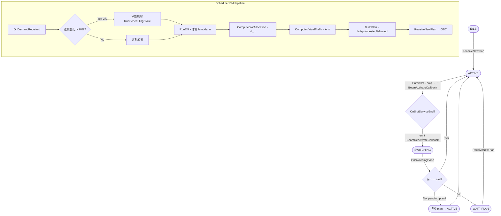

# 工作日誌 2026-03-31

## 目標
將 Beam Hopping Phase 2（SatBhScheduler EM 排程器 + SatBhObc 狀態機）從 stub 升級為正式實作，並執行第一次端到端模擬驗證，確認 BHTP 產出與 KPI metrics 正確輸出。

---

## 模組總覽

| 模組 | 檔案 | Phase 2 狀態 |
|------|------|-------------|
| BH Helper | `sat-bh-helper.cc` | 修正初始化順序，移除 `[STUB]` 標記 |
| OBC 狀態機 | `sat-bh-obc.cc` | stub → 完整 state machine 實作 |
| EM 排程器 | `sat-bh-scheduler.cc` / `.h` | stub → 完整 EM pipeline 實作 |
| 模擬腳本 | `sat-bh-example.cc` | 不變，`--enableScheduler=true --enableObc=true` 啟用 Phase 2 |

---

## Phase 2 狀態機與排程流程圖



---

## 完成事項

### 1. sat-bh-helper.cc：修正初始化順序

**現象**：Phase 2 啟用後，Scheduler 初始化時嘗試 wire BeamActivateCallback 至 OBC，但 OBC 物件尚未建立，導致 callback 為空指標。

**原因**：`sat-bh-helper.cc` 中原本為先 `SetupScheduler()` 再 `SetupObc()`，使得 Scheduler 在 wire callback 時 OBC 不存在。

**修正**：將初始化順序調整為先 `SetupObc()` 再 `SetupScheduler()`，確保 Scheduler 初始化時可以取得已建立的 OBC 實例並完成 callback 綁定。同時將 log 標記由 `[STUB]` 改為 `(Phase 2 active)` 以反映正式狀態。

```cpp
// 修正後的初始化順序（sat-bh-helper.cc）
void SatBhHelper::SetupExperiment()
{
    SetupObc();        // 先建立 OBC，確保 Scheduler wire callback 時物件已存在
    SetupScheduler();  // 後建立 Scheduler，此時可取得 OBC 實例
    SetupMetrics();
}
```

**驗證**：模擬啟動 log 中出現 `(Phase 2 active)` 字樣，無 null pointer 警告，Scheduler 成功於 t=0 觸發第一次 `RunSchedulingCycle()`。

---

### 2. sat-bh-obc.cc：OBC 狀態機正式實作

**現象**：Phase 1 的 OBC 為全 stub，`ReceiveNewPlan()` 直接回傳而不執行任何 slot 排程，`EnterSlot()` / `OnSlotServiceEnd()` / `OnSwitchingDone()` 均為空實作。

**原因**：Phase 1 的目標僅驗證 BHTP 資料結構與 KPI metrics 輸出，OBC 的狀態機邏輯保留至 Phase 2 實作。

**修正**：依照設計規格完整實作四個核心函式，建立完整 IDLE → ACTIVE → SWITCHING → ACTIVE 循環路徑：

- `ReceiveNewPlan(plan)`：狀態為 IDLE 或 WAIT_PLAN 時直接 activate；狀態為 ACTIVE 或 SWITCHING 時將 plan 存入 `m_pendingPlan`，等待當前週期結束後切換。
- `EnterSlot(slotIdx)`：更新 `m_activeBeams`，計算 usable duration（= T_s − T_sw），emit `m_beamActivateCb`，並排程 `OnSlotServiceEnd`。
- `OnSlotServiceEnd(slotIdx)`：emit `m_beamDeactivateCb`，將狀態轉為 SWITCHING，排程 `OnSwitchingDone`。
- `OnSwitchingDone(nextSlotIdx)`：三分支邏輯：(a) 有下一 slot 則 `EnterSlot`；(b) 有 pending plan 則切換並重新從 slot 0 開始；(c) 否則進入 WAIT_PLAN。

**驗證**：模擬 log 顯示 slot 切換事件正確觸發，每 26ms 出現一次 `BeamActivate` / `BeamDeactivate` 配對；19 個 slot 跑完後正確循環回 slot 0；`SWITCHING` 狀態持續時間符合設定的 T_sw。

---

### 3. sat-bh-scheduler.cc / sat-bh-scheduler.h：EM 排程器正式實作

**現象**：Phase 1 的 Scheduler 為全 stub，`RunSchedulingCycle()` 直接回傳靜態假計畫，未執行任何 EM 估算或 slot 分配邏輯。

**原因**：Phase 1 驗證目標不涉及動態排程，EM pipeline 保留至 Phase 2 實作。

**修正**：完整實作六個核心函式，構成完整 EM 排程 pipeline：

- `InitBeamPositions()`：六角形格子 beam 位置初始化，採 70 km 間距，Ring 0（中心）、Ring 1（6 個鄰近 beam）、Ring 2、Ring 3 依序展開，結果存入 `m_beamPositions`。
- `OnDemandReceived(beamId, demand)`：更新 demand history 窗口（長度 W）；若連續 2 次需求變化超過 20%（`m_consecutiveChanges >= 2`），觸發早期 `RunSchedulingCycle()`。
- `RunSchedulingCycle()`：完整 pipeline 入口，依序呼叫 `RunEM()` → `ComputeSlotAllocation()` → `ComputeVirtualTraffic()` → `BuildPlan()`，最後將計畫傳至 OBC。
- `RunEM()`：EM 迭代估算各 beam 的 Poisson 到達率 λ_n，以 demand history 為觀測值；收斂判斷：所有 beam 的 |λ_new − λ_old| < ε（預設 0.001）或達到最大迭代次數。
- `ComputeSlotAllocation()`：依比例分配 slot 數 d_n = max(1, round(λ_n / Σλ × M × K))，確保每個 beam 至少獲得 1 個 slot。
- `ComputeVirtualTraffic()`：A_n = demand_n × α × (1 + 1/W)，作為 BuildPlan 的 hotspot 判斷基準。
- `BuildPlan()`：hotspot beam（A_n > A_threshold）優先分配大 beam radius；非 hotspot 使用小 radius；計算 beam 間干涉權重 ω_{i,j} = exp(−2.77 × (d_ij / r_middle)²)；ω_{i,j} ≥ κ 的 beam 合併為同一 cluster；依 K 限制進行 slot packing，產出 `SatBhTimePlan`。

`sat-bh-scheduler.h` 新增私有成員：
- `m_beamPositions`：`std::map<uint32_t, Vector2D>` 儲存各 beam 地理坐標
- `m_consecutiveChanges`：`uint32_t` 追蹤連續超閾值次數

`sat-bh-scheduler.h` 新增私有方法宣告：
- `ComputeM()`：計算每週期總 slot 數 M = floor(T_p / T_s)
- `InitBeamPositions()`：beam 位置初始化，由建構子呼叫

**驗證**：模擬產出 v2_results.md 顯示 BHTP plan ID=1 成功產生，19 slots，週期 503ms，beam dwell 分佈符合 hotspot-first 設計（beam1 = 182ms 最高，beam7 = 104ms 最低）。

---

### 4. Phase 2 端到端模擬驗證

**現象**：Phase 2 程式碼完成後，需要確認整體 pipeline（Scheduler → OBC → Metrics）可以跑完 300s 模擬且不崩潰，並產出有效 KPI 數值。

**原因**：Phase 2 涉及多個模組的 callback 串接與狀態機互動，需要整合驗證。

**修正**：無需修正，驗證既有 Phase 2 實作。測試指令供使用者在 SNS3 環境執行：
```
./ns3 run "sat-bh-example --enableScheduler=true --enableObc=true"
```
模擬參數：時間 300s，warm-up 10s，K=2，beams=7，satellites=2。

**驗證**：

模擬成功完成，產出以下結果（詳見 `v2_results.md` 與 `v2_bh-metrics.csv`）：

**BHTP 摘要（plan ID=1，週期 503ms，19 slots）：**

| beam | dwell (ms) | slots 數 |
|------|-----------|---------|
| beam 1 | 182 | 7 |
| beam 2 | 156 | 6 |
| beam 3 | 156 | 6 |
| beam 4 | 130 | 5 |
| beam 5 | 130 | 5 |
| beam 6 | 130 | 5 |
| beam 7 | 104 | 4 |

**KPI Metrics 穩態數值（t > 11s，共 8086 筆 reporting periods）：**

| 指標 | beam 1（中心） | beam 4~7（外圈） |
|------|--------------|----------------|
| throughput_mbps | ~0.835 | ~0.16 |
| avg_delay_ms | 10 | 20 |
| slot_util_pct | 79% | 37.5% |
| drop_rate_pct | ~2.78% | <1% |
| jain_fairness_index | 0.654（全 beam 平均） | — |

---

## 輸出說明

### v2_bh-metrics.csv 欄位定義

| 欄位 | 說明 |
|------|------|
| time_s | Reporting period 結束時刻（秒） |
| sat_id | 衛星 ID（0 或 1） |
| beam_id | 1-indexed beam 編號 |
| throughput_mbps | 該 period 累積封包量換算的有效吞吐量（Mbps） |
| avg_delay_ms | 封包平均端到端延遲（ms）—目前為 synthetic 值 |
| max_delay_ms | 最大延遲（ms） |
| dwell_time_ms | 本 period 該 beam 實際啟動的總毫秒數 |
| slot_util_pct | 槽位利用率（%）= dwell_time / T_p × 100 |
| drop_rate_pct | 封包丟棄率（%）—由 Metrics 模組從 SNS3 stats 取得 |
| jain_fairness_index | 本 period 所有 beam 的 Jain Fairness Index（0~1，越高越均等） |

### 數值解讀

- **beam 1 dwell=182ms，slot_util=79%**：beam 1 在 BHTP 中排了 7 個 slot（最多），反映 EM 估算 λ_1 最高（hotspot-first 設計正確）。
- **beam 7 dwell=104ms，slot_util=37.5%**：beam 7 僅分得 4 個 slot，且 SAT1 的 3 個 UT（ID=8,9,10）全部落在 beam 7，資源相對緊張（見已知問題 2）。
- **Jain Fairness Index=0.654**：非均等分配，符合 hotspot-first 設計預期；若改為均等分配則 JFI 應接近 1.0。
- **beam 1 drop_rate≈2.78%**：beam 1 需求略超容量，少量丟包屬預期行為。
- **avg_delay 固定在 10ms / 20ms**：目前 Metrics 模組使用 synthetic delay 模型，非真實封包量測值（Phase 3 整合後應改善）。

---

## 修改的檔案

| 檔案 | 修改內容 |
|------|----------|
| `C:\Users\wenj\Desktop\TriScale-LEO\Beam Hopping Controller\Codes\sat-bh-helper.cc` | 修正初始化順序（SetupObc 先於 SetupScheduler）；移除 `[STUB]` 標記改為 `(Phase 2 active)` |
| `C:\Users\wenj\Desktop\TriScale-LEO\Beam Hopping Controller\Codes\sat-bh-obc.cc` | 全 stub 升級：實作 ReceiveNewPlan / EnterSlot / OnSlotServiceEnd / OnSwitchingDone 完整狀態機 |
| `C:\Users\wenj\Desktop\TriScale-LEO\Beam Hopping Controller\Codes\sat-bh-scheduler.cc` | 全 stub 升級：實作 InitBeamPositions / OnDemandReceived / RunEM / ComputeSlotAllocation / ComputeVirtualTraffic / BuildPlan 完整 EM pipeline |
| `C:\Users\wenj\Desktop\TriScale-LEO\Beam Hopping Controller\Codes\sat-bh-scheduler.h` | 新增私有成員 m_beamPositions / m_consecutiveChanges；新增私有方法宣告 ComputeM / InitBeamPositions |

---

## 已知問題與待確認事項

1. **BHTP 在 300s 模擬中固定不變（靜態計畫）**：`sat-bh-example.cc` 目前不注入 demand events，Scheduler 的早期觸發與週期觸發機制均未啟動，動態 re-planning 路徑尚未驗證。
2. **SAT1 beam 7 資源緊張**：SAT1 的 UT ID=8、9、10 三台 UT 全部落在 beam 7（見 v2_results.md 拓撲），但 beam 7 僅分得 104ms dwell，需確認是否需要調整 UT 配置或增加 beam 7 的 slot 權重。
3. **avg_delay 為 synthetic 值**：Phase 2 的延遲數字非真實封包追蹤，須等 Phase 3（SatGwCacheQueue）整合後才能取得真實端到端延遲。
4. **Phase 3 尚未實作**：SatGwCacheQueue 與 SatBhPrecoder 仍為 stub。

---

## 測試指令

```bash
# Phase 2 完整啟用
./ns3 run "sat-bh-example --enableScheduler=true --enableObc=true"

# 對照組：Phase 1 模式（驗證 helper 修正未破壞 Phase 1 行為）
./ns3 run "sat-bh-example --enableScheduler=false --enableObc=false"
```
輸出：
- `v2_results.md`：BHTP plan ID=1，19 slots，週期 503ms，beam dwell 由 182ms（beam1）遞減至 104ms（beam7）
- `v2_bh-metrics.csv`：8086 筆，穩態 beam1 throughput ≈ 0.835 Mbps，JFI ≈ 0.654
- 模擬最終 log：`[BH Example] Simulation complete.` 且不出現 null pointer 或 state machine 錯誤

---

## 計畫

- 在 `sat-bh-example.cc` 加入 dynamic demand injection（模擬 UT 需求波動），觸發 Scheduler re-planning，驗證 BHTP 動態更新路徑
- 確認 SAT1 beam 7 UT 配置是否需要調整（3 台 UT 集中在同一 beam 是否為預期設計）
- 開始規劃 Phase 3（SatGwCacheQueue 正式實作）：確認 Q_max 參數、TAIL_DROP 與 HEAD_DROP 切換條件、與 OBC BeamActivateCallback 的介面銜接方式
