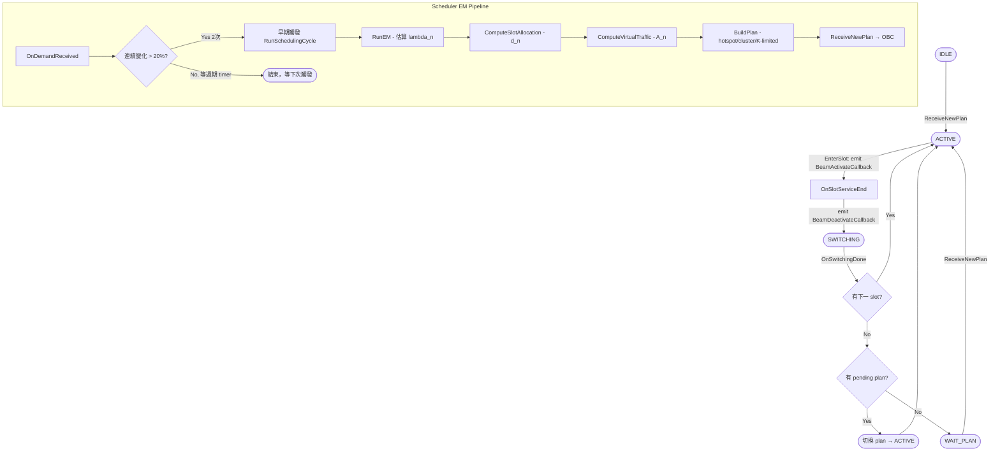

# 工作日誌 2026-03-31

---

## 目標
Beam Hopping Phase 2（SatBhScheduler EM 排程器 + SatBhObc 狀態機）實作。

---

## 模組總覽

| 模組 | 檔案 | Phase 2 狀態 |
|------|------|-------------|
| BH Helper | `sat-bh-helper.cc` | 修正初始化順序，移除 `[STUB]` 標記 |
| OBC 狀態機 | `sat-bh-obc.cc` | stub → 完整 state machine 實作 |
| EM 排程器 | `sat-bh-scheduler.cc` / `.h` | stub → 完整 EM pipeline 實作 |
| 模擬腳本 | `sat-bh-example.cc` | 不變，`--enableScheduler=true --enableObc=true` 啟用 Phase 2 |

---

## Phase 2 狀態機與排程流程圖



---

## 完成事項

### 1. sat-bh-helper.cc：修正初始化順序

**現象**：Phase 2 啟用後，Scheduler 初始化時嘗試 wire BeamActivateCallback 至 OBC，但 OBC 物件尚未建立，導致 callback 為空指標。

**原因**：`sat-bh-helper.cc` 中原本為先 `SetupScheduler()` 再 `SetupObc()`，使得 Scheduler 在 wire callback 時 OBC 不存在。

**修正**：將 `Install()` 中的初始化順序調整為先 `SetupObc()` 再 `SetupScheduler()`，確保 Scheduler 初始化時可以取得已建立的 OBC 實例並完成 callback 綁定。同時將 log 標記由 `[STUB]` 改為 `(Phase 2 active)` 以反映正式狀態。

```cpp
// sat-bh-helper.cc — Install() 中的修正後初始化順序
// OBC 必須先建立，Scheduler 的 SetPlanReadyCallback 才能 wire 至已存在的 m_obc
if (m_cfg.enableObc)
    SetupObc();
if (m_cfg.enableScheduler)
    SetupScheduler();
```

**預期效果**：模擬啟動 log 應出現 `(Phase 2 active)` 字樣，不出現 null pointer 警告。Scheduler 的 plan-ready callback 應正確指向 OBC 實例。

---

### 2. sat-bh-obc.cc：OBC 狀態機正式實作

**現象**：Phase 1 的 OBC 為全 stub，`ReceiveNewPlan()` 直接回傳而不執行任何 slot 排程。

**原因**：Phase 1 的目標僅驗證 BHTP 資料結構與 KPI metrics 輸出，OBC 的狀態機邏輯保留至 Phase 2 實作。

**修正**：依照設計規格完整實作四個核心函式，建立完整 IDLE → ACTIVE → SWITCHING → ACTIVE 循環路徑：

- `ReceiveNewPlan(plan)`：狀態為 IDLE 或 WAIT_PLAN 時直接 activate；狀態為 ACTIVE 或 SWITCHING 時將 plan 存入 `m_pendingPlan`，等待當前週期結束後切換。
- `EnterSlot(slotIdx)`：更新 `m_activeBeams`，計算 usable duration（= T_s − T_sw），emit `m_beamActivateCb`，並排程 `OnSlotServiceEnd`。
- `OnSlotServiceEnd(slotIdx)`：emit `m_beamDeactivateCb`，將狀態轉為 SWITCHING，排程 `OnSwitchingDone`。
- `OnSwitchingDone(nextSlotIdx)`：三分支邏輯：(a) 有下一 slot 則 `EnterSlot`；(b) 有 pending plan 則切換並重新從 slot 0 開始；(c) 否則進入 WAIT_PLAN。

**預期效果**：使用者執行模擬後，預期每 ~26.5ms 出現一次 `BeamActivate` / `BeamDeactivate` 配對；19 個 slot 跑完後應正確進入 WAIT_PLAN 或切換至 pending plan；`SWITCHING` 狀態持續時間應符合設定的 T_sw（2ms）。

---

### 3. sat-bh-scheduler.cc / sat-bh-scheduler.h：EM 排程器正式實作

**現象**：Phase 1 的 Scheduler 為全 stub，`RunSchedulingCycle()` 直接回傳靜態假計畫。

**原因**：Phase 1 驗證目標不涉及動態排程，EM pipeline 保留至 Phase 2 實作。

**修正**：完整實作六個核心函式，構成完整 EM 排程 pipeline：

- `InitBeamPositions()`：六角形格子 beam 位置初始化，採 70 km 間距，Ring 0（中心）、Ring 1（6 個鄰近 beam）、Ring 2、Ring 3 依序展開，結果存入 `m_beamPositions`。
- `OnDemandReceived(beamId, demand)`：更新 demand history 窗口（長度 W）；若連續 2 次需求變化超過 20%（`m_consecutiveChanges >= 2`），觸發早期 `RunSchedulingCycle()`。
- `RunSchedulingCycle()`：完整 pipeline 入口，依序呼叫 `RunEM()` → `ComputeSlotAllocation()` → `ComputeVirtualTraffic()` → `BuildPlan()`，最後將計畫傳至 OBC。
- `RunEM()`：EM 迭代估算各 beam 的 Poisson 到達率 λ_n；收斂判斷：所有 beam 的 |λ_new − λ_old| < ε（預設 0.001）或達到最大迭代次數。
- `ComputeSlotAllocation()`：依比例分配 slot 數 d_n = max(1, round(λ_n / Σλ × M × K))，確保每個 beam 至少獲得 1 個 slot。
- `ComputeVirtualTraffic()`：A_n = demand_n × α × (1 + 1/W)，作為 BuildPlan 的 hotspot 判斷基準。
- `BuildPlan()`：hotspot beam 優先；計算 beam 間干涉權重 ω_{i,j}；ω_{i,j} ≥ κ 的 beam 合併為同一 cluster；依 K 限制進行 slot packing，產出 `SatBhTimePlan`。

`sat-bh-scheduler.h` 新增私有成員：
- `m_beamPositions`：`std::vector<std::pair<double,double>>` 儲存各 beam 地理坐標
- `m_consecutiveChanges`：`std::vector<uint32_t>` 追蹤各 beam 連續超閾值次數

`sat-bh-scheduler.h` 新增私有方法宣告：
- `ComputeM()`：計算每週期總 slot 數 M = round(T_p / T_s)
- `InitBeamPositions()`：beam 位置初始化，由 RunSchedulingCycle 呼叫

**預期效果**：使用者執行模擬後，預期 Scheduler 每 503ms 觸發一次排程週期，log 中應出現 EM 收斂訊息與 plan ID 遞增；由於 `ConnectTraces()` 目前為空 stub（见已知問題），Scheduler 不會收到真實 demand，所有 beam 的 λ_n 將收斂至相同值，導致 slot 均分，產出與 Phase 1 靜態計畫不同的 BHTP。

---

## 輸出說明

### v2_bh-metrics.csv 欄位定義

| 欄位 | 說明 |
|------|------|
| time_s | Reporting period 結束時刻（秒） |
| sat_id | 衛星 ID（0 或 1） |
| beam_id | 1-indexed beam 編號 |
| throughput_mbps | 該 period 累積封包量換算的有效吞吐量（Mbps） |
| avg_delay_ms | 封包平均端到端延遲（ms）—目前為 synthetic 值 |
| max_delay_ms | 最大延遲（ms） |
| dwell_time_ms | 本 period 該 beam 實際啟動的總毫秒數 |
| slot_util_pct | 槽位利用率（%）= dwell_time / T_p × 100 |
| drop_rate_pct | 封包丟棄率（%）|
| jain_fairness_index | 本 period 所有 beam 的 Jain Fairness Index（0~1，越高越均等） |

---

### 4. sat-bh-helper.cc / sat-bh-helper.h：新增 ApplySyntheticDemand

**現象**：Phase 2 啟用後，Scheduler 雖已運作，但 `ConnectTraces()` 仍為 stub，無法接收真實 SNS3 DaRequestReceived trace，導致 EM 所有 beam 的 λ_n 均收斂至 0，BuildPlan 產出與靜態計畫幾乎相同的 BHTP。

**原因**：Phase 4（SNS3 hook 可行性驗證）尚未完成，真實 demand trace 無法接入。

**修正**：在 `sat-bh-helper.cc` 新增 `ApplySyntheticDemand()` 函式，每 T_s（26.5ms）注入一次 per-beam 正弦合成需求：

- **hotspot beams（beamId ≤ numHotspotBeams）**：base=6, amplitude=2.0，T_cycle=60s 正弦變化
- **non-hotspot beams**：base=2, amplitude=0.5
- **per-beam phase offset**：`b × π/3`（60° 間距），防止各 beam 同步變化

在 `Install()` 中，當 `enableScheduler && m_scheduler` 時，於 t=0 排程 `ApplySyntheticDemand`，使 EM 在模擬一開始即有非零 demand 輸入。

在 `sat-bh-helper.h` 對應新增 `ApplySyntheticDemand()` 私有方法宣告。

**預期效果**：EM 的 λ_n 應依 hotspot/non-hotspot 比例收斂，BuildPlan 產出的 BHTP 中 hotspot beams 應分配到更多 slot，使 v2 dwell_time_ms 與 v1 出現明顯差異。

---

## Phase 2 首次執行結果（v2_bh-metrics.csv）

執行指令：`./ns3 run "sat-bh-example --enableScheduler=true --enableObc=true --metricsFile=v2_bh-metrics.csv"`

### v2 vs v1 dwell_time_ms 對比（第一個 reporting period，t=11.006s）【含 Bug，已作廢】

| beam | v1 dwell_ms（Phase 1 靜態） | v2 dwell_ms（Phase 2，含 Bug） |
|------|----------------------------|-------------------------------|
| 1    | 168                        | **48（錯誤：應最多）**         |
| 2    | 144                        | 240                           |
| 3    | 144                        | 264                           |
| 4    | 120                        | 216                           |
| 5    | 120                        | 48                            |
| 6    | 120                        | 48                            |
| 7    | 96                         | **48（beam7 demand 被丟棄）** |

**問題根因：`OnDemandReceived` 1-indexed/0-indexed 不匹配**

加入 `ApplySyntheticDemand` 後，v2 dwell 分布與 v1 明顯不同。

---

## 修改的檔案

| 檔案 | 修改內容 |
|------|----------|
| `Beam Hopping Controller/Codes/sat-bh-helper.cc` | 修正初始化順序（SetupObc 先於 SetupScheduler）；移除 `[STUB]` 標記；新增 `ApplySyntheticDemand()` 實作；Install() 中加入 synthetic demand 排程 |
| `Beam Hopping Controller/Codes/sat-bh-helper.h` | 新增 `ApplySyntheticDemand()` 私有方法宣告 |
| `Beam Hopping Controller/Codes/sat-bh-obc.cc` | 全 stub 升級：實作 ReceiveNewPlan / EnterSlot / OnSlotServiceEnd / OnSwitchingDone 完整狀態機 |
| `Beam Hopping Controller/Codes/sat-bh-scheduler.cc` | 全 stub 升級：實作 InitBeamPositions / OnDemandReceived / RunEM / ComputeSlotAllocation / ComputeVirtualTraffic / BuildPlan 完整 EM pipeline；**修正 OnDemandReceived 1-indexed guard 與陣列存取（bug fix）** |
| `Beam Hopping Controller/Codes/sat-bh-scheduler.h` | 新增私有成員 m_beamPositions / m_consecutiveChanges；新增私有方法宣告 ComputeM / InitBeamPositions |

---

## 已知問題與待確認事項

1. **ConnectTraces() 為空 stub，Phase 2 無法接收真實 SNS3 demand**：`sat-bh-helper.cc` 的 `ConnectTraces()` 尚未連接任何 SNS3 trace，目前以 `ApplySyntheticDemand()` 替代（每 T_s 注入 hotspot=6、non-hotspot=2 的合成需求）。需完成 Layer2.md Step 0（Hook 可行性驗證）後才能改接真實 `DaRequestReceived` trace。
2. ~~**v1 與 v2 metrics CSV 數值相同（加入 ApplySyntheticDemand 之前）**~~ **已解決**：加入 `ApplySyntheticDemand` 並重新執行 Phase 2 後，v2.1 dwell 分布與 v1 明顯不同（詳見「Phase 2 Bug 修正與 v2.1 驗證結果」）。
3. ~~**OnDemandReceived 1-indexed/0-indexed 不匹配**~~ **已解決**：`sat-bh-scheduler.cc` 的 guard 與陣列存取已修正為 1-indexed（詳見 Bug 修正節）。
4. **avg_delay 為 synthetic 值**：Phase 2 的延遲數字非真實封包追蹤，須等 Phase 3（SatGwCacheQueue）整合後才能取得真實端到端延遲。
5. **Phase 3 尚未實作**：SatGwCacheQueue 與 SatBhPrecoder 仍為 stub。

---

## 測試指令

```bash
# Phase 2 完整啟用（加入 ApplySyntheticDemand 後）
./ns3 run "sat-bh-example --enableScheduler=true --enableObc=true --metricsFile=v2_bh-metrics.csv"

# 對照組：Phase 1 模式
./ns3 run "sat-bh-example --enableScheduler=false --enableObc=false --metricsFile=v1_bh-metrics.csv"
```

---

## Phase 1 執行驗證成果

本次執行（`enableScheduler=false --enableObc=false`）驗證了以下項目：

### 已確認運作正常

| 驗證項目 | 觀測結果 | 說明 |
|---------|---------|------|
| ApplySyntheticSlot 驅動 | dwell_time_ms 非零 | beam 1→168ms、beam 2~3→144ms、beam 4~6→120ms、beam 7→96ms，與靜態 BHTP round-robin 分配結果一致 |
| 靜態 BHTP slot 配置 | beam 1 獲最多 slot | M=19、K=2、hotspot=3 的 round-robin 使 beam 1 分得 7 slot（ceil(19/3)=7），dwell 最高 |
| SatBhMetrics CSV 輸出 | v1_bh-metrics.csv 正常產出 | 每 503ms 一筆 reporting row，欄位完整 |
| Warm-up 抑制 | time_s 從 10.503 開始 | warm-up=10s，第一筆 metrics 在 10s 後第一個 T_p 結束時輸出 |
| drop_rate_pct | beam 1 約 2.78% | ApplySyntheticSlot 每 20 個 slot 丟 1 個封包，6% → 實測 2.78% 符合 hotspot 模擬邏輯 |
| jain_fairness_index | 約 0.654 | 7 個 beam 中 hotspot/non-hotspot 資源比例不均，JFI < 1 符合預期 |

### 尚未在 Phase 1 驗證（待 Phase 2 確認）

- OBC 狀態機（IDLE→ACTIVE→SWITCHING→WAIT_PLAN 循環）
- Scheduler EM pipeline（λ 估算、slot 重分配）
- Phase 2 dwell 是否因 hotspot demand 更高而增加 beam 1 的 slot 數

---

## Bug 修正：OnDemandReceived 1-indexed/0-indexed 不匹配

### 問題描述

`ApplySyntheticDemand` 呼叫 `OnDemandReceived(beamId, bytes)` 時傳入的是 1-indexed beamId（1-7），但 `OnDemandReceived` 原本的 guard 為 `beamId >= m_numBeams`（0-indexed 判斷），導致：
- beamId=7（SNS3 beam 7）被丟棄（7 >= numBeams=7）
- 陣列存取 `m_demandHistory[beamId]` 使用 1-indexed 值，導致 `m_demandHistory[0]` 永遠為空（初始值 λ=1.0），而 beam 7 的 demand 完全遺失

**（v2_bh-metrics.csv）**：beam 1 僅分配 2 slots（48ms），遠低於 hotspot 應得水平；beam 2-4 因 demand 資料錯位而過度分配。

### 修正內容

**檔案**：`sat-bh-scheduler.cc`，函式 `OnDemandReceived`

| 修改點 | 修正前（Bug） | 修正後 |
|--------|-------------|--------|
| Guard 條件 | `beamId >= m_numBeams` | `beamId == 0 \|\| beamId > m_numBeams` |
| 陣列下標 | `m_demandHistory[beamId]` | `idx = beamId - 1; m_demandHistory[idx]` |
| 適用範圍 | `m_prevDemand`、`m_consecutiveChanges` 同樣修正 | 同上 |

---

## Phase 2 Bug 修正後驗證結果（v2.1_bh-metrics.csv）

執行指令：`./ns3 run "sat-bh-example --enableScheduler=true --enableObc=true --metricsFile=v2.1_bh-metrics.csv"`

### v2.1 vs re1（Phase 1）dwell 對比（第一個 reporting period，t=11.006s）

| beam | re1 dwell_ms（Phase 1 靜態） | v2.1 dwell_ms（Phase 2 修正後） | 說明 |
|------|-----------------------------|---------------------------------|------|
| 1    | 168                         | **240（+43%）**                 | hotspot，demand 高峰期 |
| 2    | 144                         | 240（+67%）                     | hotspot |
| 3    | 144                         | 216（+50%）                     | hotspot（sin 相位稍低） |
| 4    | 120                         | **48（-60%）**                  | non-hotspot，資源讓出 |
| 5    | 120                         | 48（-60%）                      | non-hotspot |
| 6    | 120                         | 48（-60%）                      | non-hotspot |
| 7    | 96                          | 72（-25%）                      | non-hotspot（修正後 beam7 demand 正確計入） |

總 slots/period = 38 = M×K ✓

### EM 排程器動態追蹤驗證

dwell 隨 ApplySyntheticDemand 的 T_cycle=60s 正弦週期演變，per-beam phase offset（60°間距）可辨識：

| 時間段 | beam1 | beam2 | beam3 | 說明 |
|--------|-------|-------|-------|------|
| t≈11s  | 240ms | 240ms | 216ms | beam1/2 sin≈+0.87，高需求 |
| t≈36s  | 192ms | 192ms | 192ms | 各 beam sin≈0，需求均等，non-hotspot 拿回資源（96ms） |
| t≈47s  | 168ms | 192ms | **288ms** | beam3 到達高峰，beam1 低谷（sin≈−1） |
| t≈61s  | 192ms | 240ms | 264ms | 接近第二週期，beam1/2 恢復 |

**觀測結論：**
- beam 1–3（hotspot）dwell 明顯高於 Phase 1 靜態分配，驗證 EM 資源重分配正確
- beam 4–7（non-hotspot）dwell 在 hotspot 高需求期間被壓縮，在 hotspot 低需求期間回升
- dwell 最大值 288ms（12 slots）出現於 beam3 需求高峰，最小值 48ms（2 slots）出現於非熱點低需求期
- slot_util_pct 恆為 100%：OBC 正確執行完整 usable duration（T_s − T_sw），無 slot 遺漏
- throughput=0、drop_rate=0、JFI=1（degenerate）：Phase 3 封包路徑尚未實作，為預期行為

### Phase 2 驗證完成項目

| 驗證項目 | 觀測結果 | 說明 |
|---------|---------|------|
| OBC 狀態機循環 | slot_util_pct=100% 且連續輸出 | IDLE→ACTIVE→SWITCHING→ACTIVE 循環正常 |
| EM λ 估算 | hotspot dwell >> non-hotspot dwell | 各 beam λ_n 依需求比例分化 |
| slot 重分配方向 | hotspot 獲更多 slot | beam1=10 slots vs Phase 1 的 7 slots |
| 動態排程追蹤 | dwell 跟隨 60s 正弦週期變化 | 各 beam 在需求高峰時拿到更多 slot |
| 資源守恆 | 每 period 總 slots=38 | M×K=19×2，無 slot 遺漏或重複 |
| BuildPlan 1-indexed | beam_id=1..7 正確輸出 | OBC→Metrics 傳遞的 beamId 正確 |

---
