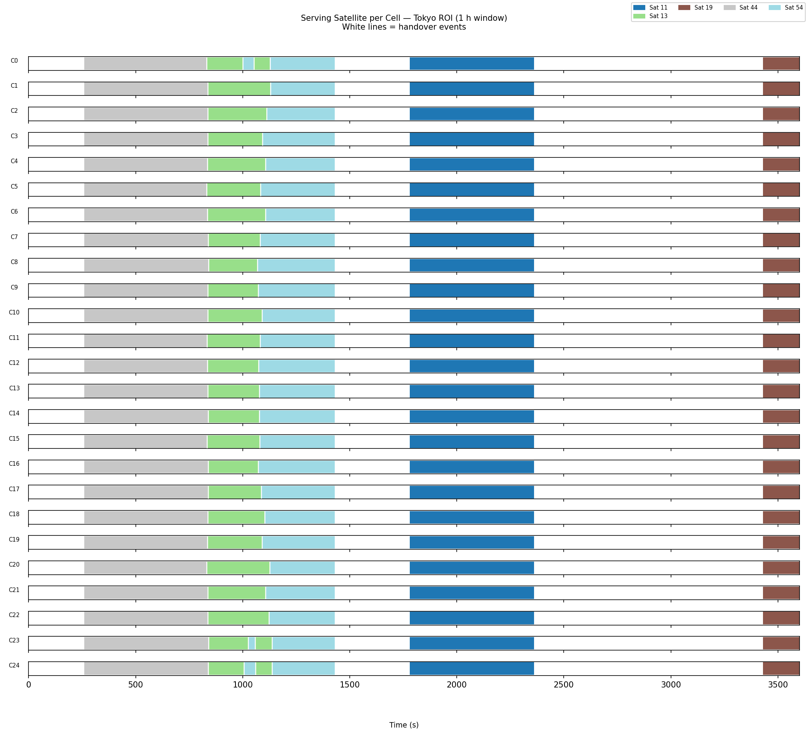
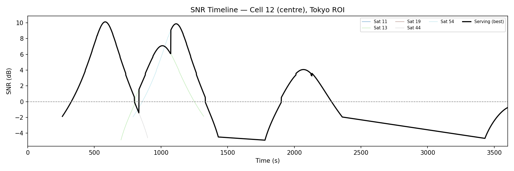
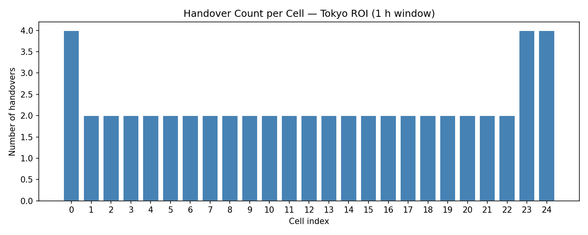

# 2026/06/03


## orbit-sgp4 vs Phase 2 檔案差異

`2D/code/orbit-sgp4/code/` 共 9 個檔案，來源分兩類：

---

### 修改自 Phase 2

#### `sat-multi-beam-geometry.h / .cc`

| | Phase 2 (`phase2/code/`) | orbit-sgp4 (`orbit-sgp4/code/`) |
|---|---|---|
| 衛星位置來源 | CSV row → `OrbitPoint` → `OrbitPointToEnuVec3()` | SGP4 → ECI `r[3]` (km) |
| 新增函式 | — | `EciToEcef(eciKm, jdUT1)` |
| 新增函式 | — | `EcefToGeodetic(ecefM, rEarth, lat, lon, alt)` |
| 新增 include | — | `#include "sgp4unit.h"` （`gstime()` 計算 GAST） |
| 移除函式 | `GetSatelliteArcPositions()`, `GetSatellitePositionAtTime()` | ← 已在 Phase 2 保留，orbit-sgp4 不再需要 |

`EciToEcef` 原理：GAST = `gstime(jdUT1)`，繞 z 軸旋轉：
```
ecef.x =  eci.x·cos(GAST) + eci.y·sin(GAST)
ecef.y = -eci.x·sin(GAST) + eci.y·cos(GAST)
ecef.z =  eci.z
```

`EcefToGeodetic` 使用球形地球（與 Phase 2 其餘模組一致）：
```
lat = asin(z / r),  lon = atan2(y, x),  alt = r − rEarth
```

---

#### `sat-multi-beam-simulation.cc`

| | Phase 2 (`phase2/code/`) | orbit-sgp4 (`orbit-sgp4/code/`) |
|---|---|---|
| 模式 | macro, rician, nadir, arc, grid, dual | **constellation 唯一模式** |
| CLI 參數 | 15 個（含多模式參數） | 9 個（全為 constellation 專用） |
| 衛星軌道輸入 | `--orbit-csv`（PyEphem CSV） | `--constellation-dir`（直接讀 TLE） |

---

### 新檔案

#### `sat-tle-reader.h / .cc`

讀取 SNS3 constellation 資料夾：

- **`tles.txt`**：解析 66 顆衛星的名稱 + TLE 兩行，呼叫 Hypatia `twoline2rv()` 初始化每顆衛星的 `elsetrec`（SGP4 propagator record）
- **`fwdConf.txt`**：解析 beam → sat 對應（第 2 欄 sat_id，1-indexed → 0-indexed satIndex），填入 `SatTleEntry::beamIds`

```
twoline2rv(tle1, tle2, 'c', 'e', 'i', wgs72, start, stop, delta, satrec)
// 'c' = catalog mode, 'e' = epoch time, 'i' = improved，與 Hypatia satellite.cc 一致
```

`GetEpochJd()` 回傳 `satrec.jdsatepoch`（TLE epoch 的 Julian Date），供 scanner 計算每步的 JD 而不重新解析。

---

#### `sat-antenna-pattern-reader.h / .cc`

**Stub**：`GetGainDb()` 永遠回傳 `0.0 dB`。

Phase 2 的 channel model（`ComputeFrameResults`）已獨立計算 UPA 增益，此 stub 不影響結果。  
SNS3 GEO pattern（`SatAntennaGain72BeamsShifted`）查表方式為絕對地理 lat/lon，東京 `lon=139.6°` 超出歐洲服務區範圍，故不採用（詳見下方 NaN 診斷章節）。

---

#### `sat-constellation-scanner.h / .cc`

掃描器。兩階段設計，避免對 66 顆 × 3600 s 全程做高成本 SNR 計算：

**Pass A — 粗篩（dtScreenS = 10 s）**

```
for each sat:
    for t = 0..windowS step dtScreenS:
        sgp4(satrec, t/60) → r[3] (ECI km)
        EciToEcef(r, jdNow) → ECEF km
        EcefOffset → ENU at ROI centre
        elevation = GetElevationAngleDeg_3D(enu)
        if elevation > minElevDeg → 記錄 windowStart / windowEnd / peakElev
```

**Pass B — 細算 SNR（dtSnrS = 1 s，僅在 Pass A 通過的衛星 + 時段內）**

```
for t = windowStart..windowEnd step dtSnrS:
    sgp4 → ECI → ECEF → ENU (satPos)
    ComputeFrameResults(satPos, cellPositions, beamCentersEnu, cfg)
    寫入 sat_XXXXX_cells.csv
```

**輸出：**

| 檔案 | 內容 |
|---|---|
| `constellation_status.json` | 所有通過篩選衛星的名稱、窗口、峰值仰角、CSV 路徑 |
| `sat_XXXXX_cells.csv` | 每顆衛星，每 dtSnrS 秒 × 每個 in-footprint cell 的 SNR/SINR |

beam centers 計算方式與 Phase 2 `RunGridMode()` 完全一致：  
`GetHexBeamCenters(cfg)` → `EcefOffsetToEnu(center, roiLat, roiLon)` × 19 beams

---

## Constellation Scan：UPA Beam Model + Handover Analysis

### 診斷 beam_gain_dB = nan 

執行 constellation scan 後，16 個衛星 CSV 全部出現：

```
beam_gain_dB = nan,  snr_dB = -inf,  sinr_dB = -inf
path_loss_dB = 有效值（~183–191 dB）
```

加入 debug 輸出確認 config 正常（`txPow=63`, `nBeams=19`），排除 config 問題。

**追查路徑：**

1. `ComputePatternFrameResults` 被啟動（`m_antReader.HasRealData() == true`）
2. 對每個 cell 呼叫 `antReader.GetGainDb(beamId, latDeg, lonDeg)`
3. SNS3 的 `SatAntennaGain72BeamsShifted` 使用**絕對地理座標（lat/lon）查表**
4. 該 pattern 檔案涵蓋的是歐洲 GEO 衛星服務區（lon ≈ -40° 到 +50°E）
5. 東京 `lon = 139.6°E` 超出查表範圍 → 72 個 beam 全部回傳 `NaN`
6. 所有 beam 被 `continue` 跳過 → `servingBeamId = -1` → `beam_gain = NaN`, `SNR = -inf`

**為何不使用真實 pattern：**

| 比較 | SNS3 GEO Pattern | Iridium LEO UPA |
|---|---|---|
| 衛星類型 | GEO（固定軌道） | LEO（780 km，移動） |
| 查表方式 | 絕對地理 lat/lon | 陣列空間頻率 ΔΦ |
| 東京覆蓋 | 超出範圍 | 任意 ROI |
| 學術標準 | 特定衛星硬體 | Dirichlet kernel |

結論：SNS3 GEO pattern 不適用 Iridium LEO + 任意 ROI，應使用 UPA 模型。

---

### 移除查表基礎架構，改為純 UPA 路徑

修改 5 個檔案，移除 `SatAntennaPatternReader` 的 real-data 分支：

**`sat-antenna-pattern-reader.h`**
- 移除 `HasRealData()`、`m_hasData`、`m_dir` private 成員
- 移除 real-data constructor 邏輯
- 保留空白 `GetGainDb()` stub（回傳 0.0，UPA 增益由 `ComputeFrameResults` 獨立計算）

**`sat-antenna-pattern-reader.cc`**
- 移除 if/else 路徑，直接 `return 0.0`

**`sat-constellation-scanner.h`**
- 移除 `SatAntennaPatternReader& antReader` 建構子參數
- 移除 `m_antReader` private 成員
- 移除 `#include "sat-antenna-pattern-reader.h"`

**`sat-constellation-scanner.cc`**
- `SatConstellationScanner(tleReader, antReader)` → `SatConstellationScanner(tleReader)`

**`sat-multi-beam-simulation.cc`**
- 移除 `SatAntennaPatternReader antReader("")`
- `SatConstellationScanner scanner(tleReader, antReader)` → `scanner(tleReader)`

Constellation scanner 現在一律走 `ComputeFrameResults()` 的 UPA 路徑，與 Phase 2 行為一致。

---

### ns-3 event-driven

 `Simulator::Schedule` 事件驅動，16 顆衛星的事件全部入隊後由 ns-3 scheduler 統一排程。

**架構對比：**

| | 舊版（pure C++ loop） | 新版（ns-3 event-driven） |
|---|---|---|
| Pass A 粗篩 | pure C++ for-loop | pure C++ for-loop（不變） |
| Pass B 細算 | `for (t = start; t <= end; t += dt)` | `Simulator::Schedule(Seconds(t), ...)` |
| 時間管理 | 手動遞增 | ns-3 scheduler |
| 多衛星並發 | sequential（一顆跑完再跑下一顆） | concurrent（所有衛星事件混入同一佇列） |
| 擴充性 | 無法接 ns-3 節點 / mobility | 可直接接 ns-3 網路拓撲 |

**核心邏輯：**

```cpp
// 對每顆通過篩選的衛星，在通過窗口內排程事件
for (double t = winStart; t <= winEnd; t += dtSnrS)
{
    Simulator::Schedule(Seconds(t), &ScanSnrCallback, state.get(), t);
}

// 16 顆衛星的事件全部入隊，scheduler 按時間順序觸發
Simulator::Stop(Seconds(windowS));
Simulator::Run();
Simulator::Destroy();
```

`ScanSnrCallback` 是原 `ScanSnrPass` inner loop 的 body，每次觸發執行一個 timestep × 25 cells 的 UPA SNR 計算，結果寫入對應衛星的 CSV。

`SatScanState`（新增）：per-satellite heap-allocated 狀態，包含衛星 TLE record、observer ECEF、cell 位置、beam centers、CSV file handle、RNG，在 `Simulator::Run()` 期間保持存活。

---

### 行為分析

新增 `2D/code/orbit-sgp4/analysis/handover_analysis.py`：

**功能：**
1. 讀取 16 個 CSV，合併成統一 DataFrame
2. 每個 `(time_s, cell_idx)` 選出 SNR 最高的衛星（含 hysteresis 門檻）
3. 偵測連續時間步之間的 serving satellite 切換事件
4. 輸出 `handover_events.csv` 及三張圖

**修正 hysteresis bug：**

初版實作在 serving satellite 離開覆蓋後，仍保留其最後 SNR 作為比較基準，導致後續衛星永遠無法觸發換手（需高出 7 + 3 = 10 dB），SNR timeline 呈現錯誤的平坦線。

修正：每個 time step 先查表確認 current serving satellite 是否仍在 `usable` 中；若已離開，立即強制切換到當前最佳衛星。

---

## 分析結果

### 執行參數

```bash
python handover_analysis.py --out-dir ../out --hysteresis 3
```

| 參數 | 值 |
|---|---|
| ROI | 東京（lat=35.676, lon=139.65） |
| 觀測窗口 | 3600 s（1 小時） |
| 最低仰角 | 5° |
| Grid | 5×5 = 25 cells |
| Hysteresis | 3 dB |
| Beam model | UPA（Dirichlet kernel，32×32 elements） |

---

### 覆蓋與換手統計

| 指標 | 結果 |
|---|---|
| 通過篩選衛星數 | 16 顆 |
| 實際擔任 serving 的衛星數 | 5 顆 |
| 平均覆蓋時間 | 1923 s（53.4%） |
| 覆蓋缺口 | 2 段：350 s + 1070 s |
| 多數 cell 換手次數 | 2 次 |
| 邊緣 cell（C0, C23, C24）換手次數 | 4 次 |

---

### Serving Satellite 序列（典型 cell）

```
t = 0   – 260  s  → 無覆蓋
t = 260 – 900  s  → Sat 44（仰角 85°，SNR 峰值 ~10 dB）
t = 900 – 1050 s  → Sat 13（仰角 43°，SNR ~6.5 dB）  ← 換手 1
t = 1050– 1430 s  → Sat 54（仰角 75°，SNR ~9.7 dB）  ← 換手 2
t = 1430– 1780 s  → 覆蓋缺口（350 s）
t = 1780– 2360 s  → Sat 11（仰角 27°，SNR ~4 dB）
t = 2360– 3430 s  → 覆蓋缺口（1070 s）
t = 3430– 3600 s  → Sat 19（仰角 13°，SNR < 0 dB）
```

換手發生於 t ≈ 900–1100 s，在 Sat 44 / Sat 13 / Sat 54 的重疊窗口內。

---

### 圖表

**Fig 1 — Serving Satellite per Cell**



25 個 cell 服務衛星時間線。白線為換手事件，灰色空白區域為覆蓋缺口。

---

**Fig 2 — SNR Timeline（Cell 12，中心格）**



各衛星 SNR 曲線（鐘形）與 serving（黑色粗線）。Hysteresis=3 dB 使 serving 線在 Sat 54（75°）與 Sat 13（43°）重疊區間選擇 Sat 54。覆蓋缺口區間黑線正確中斷。

---

**Fig 3 — Handover Count per Cell**



大多數 cell 換手 2 次，邊緣 cell（C0, C23, C24）換手 4 次，因邊緣位置衛星 beam gain 差異較小，換手觸發更頻繁。

---

## UPA Beam Model 說明

本模擬使用 **UPA（Uniform Planar Array）** 數學模型，不依賴真實天線量測資料：

$$
\text{beam\_gain}(u, j) = \frac{|AF_x(\Delta\Phi_x)|^2 \cdot |AF_y(\Delta\Phi_y)|^2}{N_x^2 N_y^2 N_\text{beams}}
$$

其中 $AF_x$ 為 Dirichlet kernel（陣列因子）：

$$
|AF_x(\Delta\Phi_x)|^2 = \left(\frac{\sin(N_x \pi \Delta\Phi_x / 2)}{\sin(\pi \Delta\Phi_x / 2)}\right)^2
$$

| 參數 | 值 |
|---|---|
| $N_x$ | 32 elements |
| $N_y$ | 32 elements |
| $N_\text{beams}$ | 19（2-ring hexagonal） |
| 頻率 | 30 GHz（Ka-band） |
| 天線間距 | $\lambda/2$ |

**選擇 UPA 而非 SNS3 pattern 的理由：**
- SNS3 `SatAntennaGain72BeamsShifted` 為 GEO 衛星 pattern，以絕對 lat/lon 查表（歐洲服務區），無法覆蓋東京
- UPA 物理模型不依賴地理座標，適用任意 ROI
- Dirichlet kernel 為 phased array 標準學術模型，與 Phase 1/2 保持一致

---

## 輸出檔案

| 檔案 | 說明 |
|---|---|
| `2D/code/orbit-sgp4/out/sat_XXXXX_cells.csv` | 16 個衛星的 per-cell SNR 時間序列 |
| `2D/code/orbit-sgp4/analysis/handover_events.csv` | 每次換手事件詳細記錄 |
| `2D/code/orbit-sgp4/analysis/figures/fig_serving_sat.png` | 服務衛星時間線 |
| `2D/code/orbit-sgp4/analysis/figures/fig_snr_timeline_cell12.png` | 中心格 SNR 時間線 |
| `2D/code/orbit-sgp4/analysis/figures/fig_handover_count.png` | 各 cell 換手次數 |
