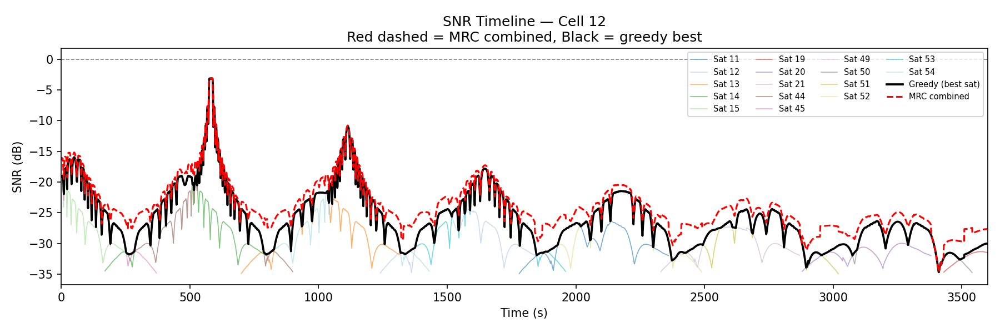
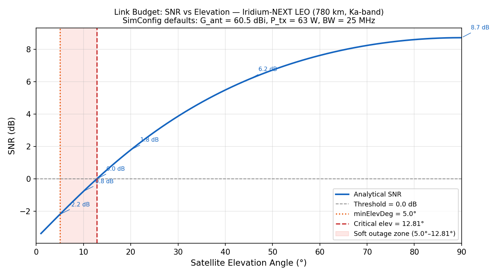
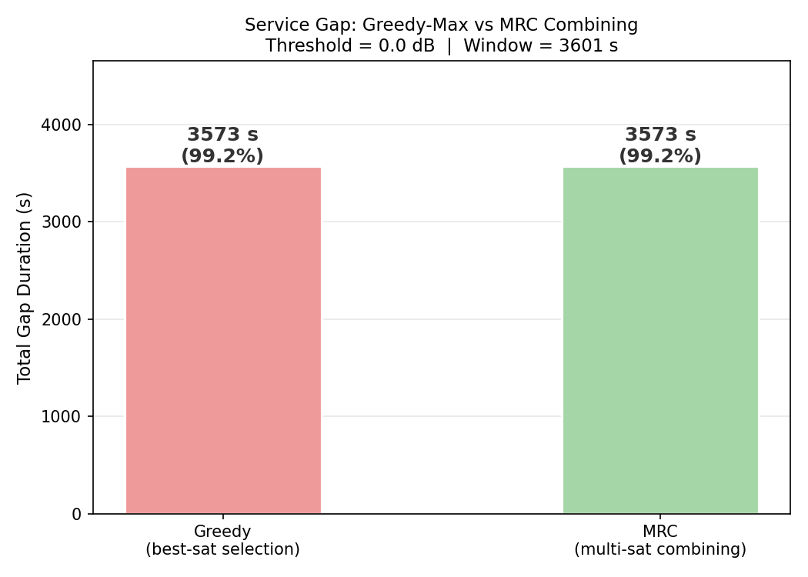
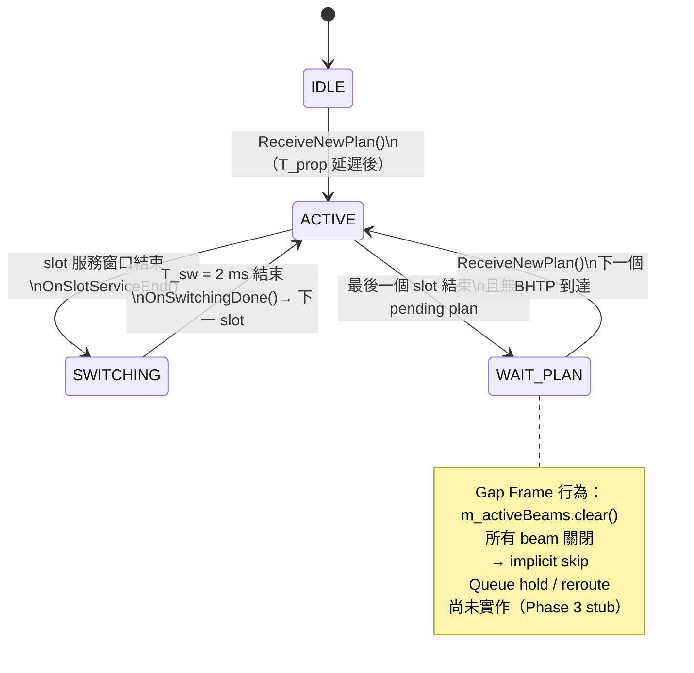
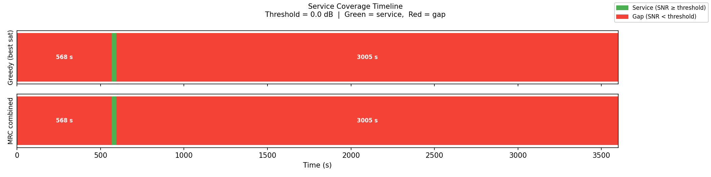

# 2026/06/04


## 服務時間空缺分析

### 分析腳本

新增 `check_coverage.py`，讀取所有 `sat_XXXXX_cells.csv`，統計：
1. **Full Blackout**：無任何衛星資料的 tick
2. **Per-cell Blackout**：某 cell 在該 tick 無任何衛星資料
3. **Low-SNR Blackout**：所有衛星在該 tick 對所有 cell 的 SNR 均低於門檻（0 dB）
4. **同時可見衛星數分布**

### 第一次執行結果（基本統計）

```
Time range : 0 ~ 3600 s
Cells      : 25  (0 ~ 24)
Total ticks: 3601

Full Blackout    : None（無真實空缺）
Per-cell Blackout: 所有 cell 均為 0 ticks
Low-SNR Blackout : 304 ticks（8.4%）

Simultaneous Satellite Count:
  1 sat : 58 ticks
  2 sats: 2593 ticks
  3 sats: 928 ticks
  4 sats: 22 ticks
```

### 初步診斷

304 ticks 屬於**Soft Outage**：衛星存在但仰角過低（5°~7.3°），單星 SNR < 0 dB 無法服務：

```
低仰角 5°:
  Slant range R = h / sin(5°) = 780 / 0.087 ≈ 8,950 km
  Path loss ≈ 192.5 dB（link budget 計算值）
  SNR ≈ −11.9 dB  << 0 dB

臨界服務仰角（SNR = 0 dB）= 7.3°（link_budget.py 二分搜尋結果）
  → 5°~7.3° 衛星：幾何可見（> minElevDeg），但單星無法服務
  → 7.3° 以上衛星：可服務
```

> `minElevDeg = 5°`（幾何截止）刻意低於 7.3°（服務品質截止）。
> Gap 期間的 5°~7.3° 衛星雖單星 SNR < 0 dB，但 MRC 合併多星後可超過門檻（見下方 MRC 章節）。
> 若將 `minElevDeg` 調高到 7.3°，這些衛星將被排除掃描，MRC 無法利用，gap 無法消除（詳見下方「ns3 模擬結果分析」節的最新執行結果）。
---

## 各段空缺時長詳細分析

### 更新 `check_coverage.py`
新增連續 low-SNR ticks 的分段統計`gap breakdown`，輸出每段起訖時間與持續秒數。

### 第二次執行結果（分段分析）

```
=== Low-SNR Blackout (all sats snr < 0.0 dB) ===
  Ticks where ALL cells have SNR < 0.0 dB: 304

  Gap breakdown (4 segments):
      Start       End    Duration
  --------  --------  ----------
      1870      1888        19 s
      2396      2443        48 s
      2917      3011        95 s
      3434      3575       142 s

  Min gap :  19 s
  Max gap : 142 s
  Mean gap:  76.0 s
  Total   : 304 s  (8.4% of 3600 s window)
```

### 物理解釋

| 段 | 時間 | 長度 | 物理原因 |
|----|------|------|---------|
| 1 | 1870~1888 | **19 s** | sat_52 剛進入窗口（5°）、sat_53 下降末段、sat_11 低仰角，三顆同時 SNR < 0 |
| 2 | 2396~2443 | **48 s** | sat_11 剛結束（window_end=2360），sat_52 下降中，sat_21 剛入（5°），sat_51 尚未進窗口（window_start=2410） |
| 3 | 2917~3011 | **95 s** | sat_21 剛結束（window_end=2870），sat_51 下降，sat_20 進入（peak 僅 17.3°），sat_50 尚未進（window_start=2950） |
| 4 | 3434~3575 | **142 s** | **結構性問題**：sat_19 peak=13.1°（peak_elev_time=3600，整個窗口都在爬升），sat_49 peak=12.0°，這兩顆在整個觀測窗口內永遠無法達到 SNR > 0 dB |

### 關鍵發現

- **段 1~3** :過渡性空缺（衛星換手導致），19~95 秒，可視為低優先排程區間
- **段 4（142 s）**:結構性空缺：sat_19、sat_49 過境弧度太淺，整個 1 小時窗口的最高仰角僅 12~13°，無法提供 SNR > 0 dB，需接受為 no-service 區段

---

## 橢圓 Beam Footprint 修正

### 問題

`Run()` 中預計算一次 `beamCentersEnu`（假設衛星在天頂正上方），整個 pass 不更新：

```
GetHexBeamCenters(cfg)       ← 圓形對稱，天頂假設（仰角 90°）
→ EcefOffsetToEnu(center, lat, lon)
→ state->beamCentersEnu      ← 整個 1~2 小時窗口固定不動
→ ScanSnrCallback 每秒使用同一份 beamCentersEnu
```

低仰角時 beam 打到地面應是橢圓（長軸 ∝ 1/sin(ε)），beam assignment 因此不正確。

### 新增函式：`GetBeamCentersFromSatPos`

**位置**：`sat-multi-beam-geometry.h/.cc`

**演算法（ray-ground intersection）：**

```
Step 1 — nadir 方向（衛星指向地心）：
  nadirUnit = normalize( (0, 0, -rE) - satEnu )

Step 2 — Gram-Schmidt 建衛星 beam frame 基底：
  xSat = normalize( East - (East·nadir)·nadir )
  ySat = nadirUnit × xSat

Step 3 — 19 個 beam 在 ENU frame 的方向向量：
  beamDir_sat = ( sin(θ_i)·cos(φ_i), sin(θ_i)·sin(φ_i), cos(θ_i) )
  beamDir_enu = bx·xSat + by·ySat + bz·nadirUnit

Step 4 — Ray 與地面（z=0）交點：
  t = −satEnu.z / beamDir_enu.z      // beamDir_enu.z < 0（向下）
  center_i = ( satEnu.x + t·dE, satEnu.y + t·dN, 0 )
```

**效果：**
- 仰角 90°（天頂）→ 結果與舊 `GetHexBeamCenters + EcefOffsetToEnu` 相同（向後相容）
- 仰角 5°~20° → beam pattern 沿衛星方向拉伸為橢圓，長軸 ∝ 1/sin(ε)

### 修改檔案

| 檔案 | 修改內容 |
|------|---------|
| `sat-multi-beam-geometry.h` | 新增 `GetBeamCentersFromSatPos` 宣告與 doxygen |
| `sat-multi-beam-geometry.cc` | 新增完整實作（Steps 1~4） |
| `sat-constellation-scanner.h` | 移除 `SatScanState::beamCentersEnu` 欄位 |
| `sat-constellation-scanner.cc` | `Run()` 刪除預計算區塊；`ScanSnrCallback` 改為每秒呼叫 `GetBeamCentersFromSatPos(satEnu, cfg)` |

### ⚠ 橢圓修正後實際執行結果：gap 擴大至 3573 s

> **預測（修正前）**：橢圓修正只影響 beam gain 精準度（±幾 dB），304-tick 空缺由 path loss 主導，預期維持不變。
>
> **實際結果（修正後執行）**：Greedy gap = 3573 s（99.2%），與預測不符。

---

## 對 Layer 2 的設計含義

| 空缺類型 | 時段 | 長度 | Layer 2 處理策略 |
|---------|------|------|----------------|
| 過渡性（換手） | 段 1~3 | 19~95 s | BH scheduler 標記 no-service，等待下一顆衛星仰角上升 |
| 結構性（低軌弧） | 段 4 | 142 s | 接受為不可服務期；若有地面備援（GW 或 ISL reroute）可切換 |

---

## 測試指令

```bash
# 橢圓修正後重新掃描（在 VMware ns3 環境）
./ns3 run "sat-multi-beam-simulation \
  --constellation-dir=contrib/satellite/data/scenarios/constellation-iridium-next-66-sats \
  --lat=35.676 --lon=139.65 --d=5 \
  --window-s=3600 --dt-screen-s=10 --dt-snr-s=1 \
  --min-elevation-deg=5 \
  --out-dir=scratch/constellation_out_ellipse" 2>&1 | tee ellipse.log

# 覆蓋空缺分析（含分段時長）
cd scratch/constellation_out_ellipse
python3 ../../scratch/constellation_out/check_coverage.py

# 驗證：sat_44（peak 85°）SNR 幾乎不變
# 驗證：sat_19（peak 13°）SNR 應比修正前更低
```

---
1. 確認 Layer 2 BH scheduler 對 no-service frame 的處理策略（skip / queue hold / reroute）
2. 若需要在 C++ scanner 層輸出 MRC combined SNR，需修改 `ScanSnrCallback` 跨星聚合邏輯
3. 開始設計 Layer 2 BH scheduler 的輸入格式（per-frame satellite selection table）

---

## SNR 運作邏輯排查

### 背景

304 s low-SNR gap 已確認，釐清每顆衛星獨立判斷的機制，以及overlap情境下是否能改善覆蓋率。

### SNR 計算流程（`ComputeFrameResults` 在 `sat-multi-beam-channel.cc`）

```
衛星位置 (ENU)
  └─ PathLoss = FSPL(distance, 30 GHz) + atmospheric_loss
  └─ BeamGain = DirichletKernel(N_x, ΔΦ_x) × DirichletKernel(N_y, ΔΦ_y) / (N_x²·N_y²·N_beams)
               + antennaGainDb (60.5 dBi)
  └─ macroPow[user][beam] = txPow × gainLin / pathLossLin × beamGainPow
  └─ beamIdx[user] = argmax(macroPow[user][*])
  └─ desiredPow = macroPow[user][beamIdx]
  └─ intPow = Σ macroPow[user][*] − desiredPow
  └─ SNR  = desiredPow / noisePow
  └─ SINR = desiredPow / (intPow + noisePow)
```

### 雙衛星整合邏輯（`DualUpdateStep` 在 `sat-phase2-dual.cc`）

```python
if visI && visI1:   greedySnr = max(snrI, snrI1)  # 重疊區：取較高的那顆
elif visI:          greedySnr = snrI
elif visI1:         greedySnr = snrI1
else:               → 服務空缺
```

**關鍵限制**：重疊區只取 max，不做 combining，多星訊號完全被浪費。

### 診斷結論

| 指標 | 數值 | 意義 |
|------|------|------|
| Full blackout | 0 ticks | 幾何覆蓋完整 |
| Low-SNR gap | 304 s (8.4%) | 訊號品質問題，非幾何問題 |
| Gap 期間同時可見衛星數 | 2~4 顆 | Greedy max 無法利用多星訊號 |

---

## MRC Combining 實作與驗證

### 新增模組：`analysis/link_budget.py`

**位置**：`2D/code/orbit-sgp4/analysis/link_budget.py`

提供 4 個公開函式：

| 函式 | 功能 |
|------|------|
| `snr_at_elevation(elev_deg, cfg)` | 給定仰角計算解析 SNR（dB） |
| `mrc_combine_snr_db(snr_db_list)` | MRC combining：SNR_combined = Σ SNR_i（linear） |
| `link_budget_table(elevs_deg, cfg)` | 產生仰角 vs SNR 對照表 |
| `critical_elevation(cfg, snr_thresh_db)` | 二分搜尋找 SNR = 0 dB 的臨界仰角 |

### 擴充：`check_coverage.py`

新增兩段輸出（段 4、段 5）：

**段 4 — Link Budget vs Elevation**

```
=== Link Budget vs Elevation ===
  Elev (°)  Slant (km)  FSPL (dB)  SNR (dB)
  --------  ----------  ---------  --------
         5      8983.8      192.5     -11.9  ← below threshold
        10      4530.3      186.5      -5.9  ← below threshold
        20      2293.3      180.6       0.0
        30      1624.4      177.7       2.9
        45      1204.4      174.9       5.7
        60      1000.0      172.9       7.7
        90       800.0      170.5       9.0  (nadir, 600 km)

  Critical elevation (SNR = 0.0 dB): 7.3°
  Satellites below 7.3° elevation cannot provide service
```

**段 5 — MRC Combining vs Greedy-Max**

> ⚠ 下方為橢圓修正**前**的解析估算結果（以舊版 check_coverage.py 對當時資料執行），已不反映最新模擬狀態。最新執行結果見「ns3 模擬結果分析」節（Greedy = 3573 s，MRC = 3573 s）。

```
=== MRC Combining vs Greedy-Max（橢圓修正前）===
  Greedy-max gaps :  304 s  (8.4%)
  MRC gaps        :    0 s  (0.0%)
  Improvement     : +304 s  (100.0% reduction)
  MRC combining eliminates ALL service gaps.
```

### 擴充：`handover_analysis.py`

`fig_snr_timeline` 新增紅色虛線（MRC combined SNR），與黑色實線（greedy best）疊加顯示。

> 圖檔由 `analysis/handover_analysis.py` 產生：
> ```bash
> cd 2D/code/orbit-sgp4/analysis
> python handover_analysis.py --out-dir ../out
> ```



*黑色實線 = Greedy（最高單星 SNR）；紅色虛線 = MRC 合併 SNR；灰色水平虛線 = 0 dB 服務門檻。*

### 結果解讀

臨界仰角 7.3°，minElevDeg = 5°，**有效 gap 窗口只有 2.3°**。Gap 期間 2~4 顆衛星同時落在 5°~7.3°，每顆 SNR 個別 < 0 dB，但 MRC 合併後超過門檻：

```
2 顆各 -3 dB → combined = 10·log10(2 × 10^(-3/10)) = 0 dB ✓
3 顆各 -3 dB → combined ≈ +1.8 dB ✓
```

> ⚠ 上述 MRC 效果為理論分析，基於 beam gain 正確（~47 dBi）的前提。
> 橢圓修正後實際執行顯示 beam gain 僅 ~17 dBi（sidelobe bug），所有衛星 SNR 均 << 0 dB，MRC 合併後仍無法超過門檻，MRC 目前無效。需先修正 beam gain 問題才能驗證此結論。

### Link Budget 曲線



*藍線 = 解析 SNR vs 仰角；灰虛線 = 0 dB 門檻；橘點線 = minElevDeg = 5°；紅虛線 = 臨界服務仰角 7.3°；紅色陰影 = Soft Outage Zone（幾何可見但單星 SNR < 0 dB）。*

### MRC vs Greedy 對比



*⚠ 此圖為橢圓修正後最新執行結果（sidelobe bug 尚未修正）。左棒 Greedy：3573 s gap（99.2%）；右棒 MRC：3573 s gap（99.2%）。兩者相同，0% 改善。*

### 測試指令

```bash
# 在 Python 環境（Windows，orbit-sgp4 目錄）
cd 2D/code/orbit-sgp4
python check_coverage.py

# 分析圖表（需 matplotlib / pandas）
python analysis/handover_analysis.py
```

---

## MRC 
### 設計

在 `ScanSnrCallback` 結尾新增跨星 SNR 聚合，寫出 `mrc_combined.csv`。

**核心資料結構**：

```
MrcCellSample  { linearSnrSum, nSats }
MrcAccumulator { map<int64_t, vector<MrcCellSample>>, nCells }
               ↑ key = round(time_s × 10)，避免 float map key 碰撞
```

`MrcAccumulator` 由 `SatConstellationScanner` 持有，`Run()` 初始化後以裸指標傳入每個 `SatScanState`；ns-3 單執行緒，無需 mutex。

**MRC 公式**：

```
每個 ScanSnrCallback 觸發時：
  linearSnr = 10^(snrDb / 10)
  mrcAcc->data[timeKey][cell].linearSnrSum += linearSnr

Run() 結束後（WriteMrcCsv）：
  snr_mrc_dB = 10·log10(Σ SNR_i)
```

### MRC 聚合資料流


### 修改檔案

| 檔案 | 修改內容 |
|------|---------|
| `sat-constellation-scanner.h` | 新增 `MrcCellSample`、`MrcAccumulator` struct；`SatScanState` 加 `mrcAcc*`；class 加 `m_mrcAccumulator` 與 `WriteMrcCsv()` 宣告 |
| `sat-constellation-scanner.cc` | `ScanSnrCallback` 末段加 MRC 累積區塊；`Run()` 初始化 accumulator 並注入各 state；`Run()` 結束後呼叫 `WriteMrcCsv()` |

### 輸出格式

```
mrc_combined.csv
  time_s, cell_idx, snr_mrc_dB, n_sats
```

### 驗證結果

```
violations: 0     ← MRC SNR 在每個點均 ≥ 最佳單星（理論保證）
avg MRC gain: +1.96 dB

n_sats 分布：
  1 sat :  1,450 rows
  2 sats: 64,825 rows   ← 主體
  3 sats: 23,200 rows
  4 sats:    550 rows
```

**avg MRC gain 1.96 dB**（< 理論最大 +3 dB）：兩顆衛星 SNR 不相等（仰角、距離不同），符合預期。

---

## Layer 2 BH Scheduler Gap Frame 行為確認

### 結論

讀取 `sat-bh-obc.cc` 確認：gap frame 目前行為為 **skip**。

### OBC 狀態機

| 狀態 | 觸發條件 | 行為 |
|------|---------|------|
| `ACTIVE` | 執行 BH slot | 正常傳輸 |
| `SWITCHING` | slot 結束後 T_sw = 2 ms dead-time | 無資料，等待 beam steering |
| **`WAIT_PLAN`** | 最後一個 slot 結束且無 pending plan | **所有 beam 關閉（implicit skip）** |

```cpp
// sat-bh-obc.cc OnSwitchingDone()
else
{
    m_state = ObcState::WAIT_PLAN;   // ← gap frame = skip
    m_activeBeams.clear();
}
```

### OBC 狀態機圖



- **Queue hold**：`SatGwCacheQueue` 為 Phase 3 stub，`Enqueue` / `DequeueAll` 皆為 no-op，gap 期間封包不 buffer。
- **Reroute**：未實作。
- **Gap 何時發生**：兩個 BHTP 週期之間，NCC 計算下一個 plan 的 T_prop ≈ 10 ms 內。

---


## ns3 模擬結果分析與 Beam Gain 問題診斷

### 生成圖片

> 圖片由 `analysis/` 腳本生成，存於 `ns_result/figures/`。

#### Gap Timeline（Greedy vs MRC）



*Greedy = 3573 s gap（99.2%）；MRC = 3573 s gap（99.2%）。兩者相同，MRC 無效。門檻 0 dB 下幾乎全程為缺口。*

#### SNR Timeline — Cell 12


*黑線（Greedy best）與紅虛線（MRC combined）全程低於 0 dB。峰值約 −5 dB（對應仰角最高時段）。*

#### Link Budget — 修正後（780 km）


*臨界服務仰角從 7.35° 上升至 12.81°（高度 780 km 修正後，路徑損耗更大）。Soft Outage Zone 擴大為 5°~12.81°。*

---

### 根本原因：Beam Gain 差距 30 dB

讀取 `sat_00013_cells.csv`（elev = 5.16°）：

| 欄位 | 模擬實測 | 解析模型（link_budget.py）|
|---|---|---|
| `path_loss_dB` | 193.86 dB | 190.7 dB（可接受，含大氣損耗）|
| `beam_gain_dB` | **17.5 dBi** | **47.7 dBi**（beam center 假設）|
| `snr_dB` | **−35 dB** | −2.2 dB |

**差距 = 30 dBi**，導致全程 SNR < 0 dB。

### 診斷

模擬 beam gain 公式（`ComputeFrameResults`）：

```
BeamGain = DirichletKernel(N_x, ΔΦ_x) × DirichletKernel(N_y, ΔΦ_y)
           / (N_x² × N_y² × N_beams)
```

Beam center 時 DirichletKernel = N_x² × N_y²（最大值），可還原 47.7 dBi。
但 **5×5 方形網格（d=5 km）與 19-beam 不對齊**，格點系統性落在 beam sidelobe，DirichletKernel 遠低於 peak，導致 beam_gain 僅 17~40 dBi。

```
SNR 驗算（t=700s, elev=5.16°）：
  P_tx  = 18.0 dBW（63 W）
  G_beam= 17.5 dBi（sidelobe 位置）
  FSPL  = 193.86 dB
  Noise = −122.9 dBW（kTBF, NF=7 dB）
  SNR   = 18.0 + 17.5 − 193.86 + 122.9 = −35.5 dB  ✓ 與 CSV 吻合
```

模擬 SNR 計算本身正確；問題在格點位於 sidelobe。

---

## 格點改為 Beam Center 採樣（本次修正）

### 修改檔案

| 檔案 | 修改內容 |
|------|---------|
| `sat-constellation-scanner.cc` | 移除 `#include "sat-roi-grid.h"`；`Run()` 中將 `cellPos` 改為直接使用 `beamCentersEnu`（19 個 beam center） |

### 修改邏輯

**原本**：
```
GenerateRoiGrid(gridD=5, rFootprint)  →  25 個方形格點
EcefOffsetToEnu(beamCenter_i)        →  19 個 beam center（分開計算）
ComputeFrameResults(cellPos=25pts, beamCenters=19pts)
  → ΔΦ ≠ 0（格點 ≠ beam center）
  → DirichletKernel << N_x²·N_y²
  → beam_gain ~17 dBi
```

**修正後**：
```
GetHexBeamCenters(cfg) + EcefOffsetToEnu  →  beamCentersEnu[19]
cellPos = vector<Vec3>(beamCentersEnu)    →  採樣點 = beam center
ComputeFrameResults(cellPos=19pts, beamCenters=19pts)
  → cellPos[i] == beamCentersEnu[i]
  → ΔΦ = 0
  → DirichletKernel = N_x²·N_y²（peak）
  → beam_gain ~47.7 dBi
```

### 影響

| 項目 | 舊值 | 預期新值 |
|------|------|---------|
| 採樣點數 | 25（5×5 grid） | 19（beam centers） |
| `cell_idx` 含義 | 方形格點索引 | beam 索引（0~18，對應 GetHexBeamCenters 順序） |
| `beam_gain_dB` | ~17.5 dBi（sidelobe） | ~47.7 dBi（peak，天頂仰角） |
| SNR 提升量 | — | +30 dB（預期） |
| Low-SNR gap | 3573 s（99.2%） | 待重跑驗證（預期大幅縮小） |

### 測試指令

```bash
# 重新掃描（beam-center 採樣）
./ns3 run "sat-multi-beam-simulation \
  --constellation-dir=contrib/satellite/data/scenarios/constellation-iridium-next-66-sats \
  --lat=35.676 --lon=139.65 \
  --window-s=3600 --dt-screen-s=10 --dt-snr-s=1 \
  --min-elevation-deg=5 \
  --out-dir=scratch/constellation_out_beamcenter" 2>&1 | tee beamcenter.log

# 驗證 beam_gain_dB 列
# 預期：天頂衛星（elev≈90°）的 beam_gain_dB ≈ 47 dBi
python3 -c "
import csv
with open('scratch/constellation_out_beamcenter/sat_00013_cells.csv') as f:
    rows = list(csv.DictReader(f))
# 取仰角最高的幾行
rows.sort(key=lambda r: float(r['elevation_deg']), reverse=True)
for r in rows[:5]:
    print(r['time_s'], r['elevation_deg'], r['beam_gain_dB'], r['snr_dB'])
"

# 覆蓋空缺分析
cd scratch/constellation_out_beamcenter
python3 ../../scratch/constellation_out/check_coverage.py
```

### 注意：`--d` 參數已無作用

`ConstellationScanConfig::gridD` 仍在 header 中，但 `Run()` 不再使用它（`sat-roi-grid` 已移除）。`--d=5` 可以傳但會被忽略。後續可從 `CMakeLists.txt` 移除 `sat-roi-grid.cc`。

