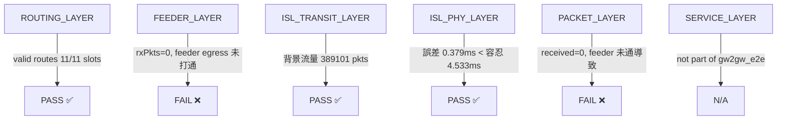

```
  Level 0：Beam Bootstrap 不完整 → physical GW node 缺失
      ↓ 修正後
  Level 1：gwMode="user" 繞過衛星 → 路徑不走 feeder link
      ↓ 修正後
  Level 2：ARP crash + ISL arbiter NS_FATAL → 模擬無法執行
      ↓ 修正後
  Level 3：ISL transit 驗證通過，feeder egress 待排查
```

---

## Beam Bootstrap 機制釐清

### 問題背景

`gw2gw_e2e` 需要兩個物理 GW node，但 `GetGwNodesById(gwId=1)` 回傳空 NodeContainer。

```
[TOPO] physicalGwNodes=1   ← 預期是 2
```

### Code Trace：SNS3 Beam 如何建立 physical GW

SNS3 的 scenario 建立流程如下：

```
simHelper->SetBeamSet({72})          ← 只啟動 beam 72
    ↓
CreateSatScenario()
    ↓
對每個 enabled beam：
    讀 rtnConf.txt 的 beam → GW 對應
    gwId = (rowIndex % gwCount) + 1   ← runtime 重寫規則！
    取出 gwNode
    建立 feeder link / user link
    RegisterGwNode(gwNode)             ← 只有走到這裡才進 SatTopology
```

**關鍵發現**：`beam` 不只是衛星上的波束編號，而是 feeder link 建立的索引。只有被啟用的 beam 對應的 GW 才會被 `RegisterGwNode()` 收進 `SatTopology::GetGwNodes()`。

```
rtnConf.txt 的原始 gwId vs. runtime gwId：
  rowIndex=0, gwCount=2 → gwId = (0 % 2) + 1 = 1
  rowIndex=1, gwCount=2 → gwId = (1 % 2) + 1 = 2
  rowIndex=2, gwCount=2 → gwId = (2 % 2) + 1 = 1  ← 循環
```

因此 `BuildGatewayBootstrapBeamSet()` 必須 mirror 這個 runtime 規則。

### 修正方案

**修改位置**：`test-iridium-e2e-fix.cc` `main()` beam 設定段落

```cpp
// 修正前：只啟動 1 個 beam
simHelper->SetBeamSet(std::set<uint32_t>{beamId});

// 修正後：依 pathType 動態決定需要的 GW 數量
const uint32_t bootstrapGwCount = GetPathTypeSpec(pathType).needsGwPair ? 2 : 1;
const bool includeAllFeederBeams = (pathType == "gw2gw_e2e");

const std::set<uint32_t> enabledBeamSet =
    BuildGatewayBootstrapBeamSet(rtnConfFilePath, bootstrapGwCount, beamId,
                                 includeAllFeederBeams);
simHelper->SetBeamSet(enabledBeamSet);
```

**`BuildGatewayBootstrapBeamSet()` 核心邏輯**：

```cpp
uint32_t gwIdOneBased = (rowIndex % gatewayCount) + 1;  // mirror runtime 規則

if (includeAllFeederBeams) {
    // gw2gw_e2e：開所有 feeder beam（路由結果在 bootstrap 後才知道）
    beams.insert(beam);
} else {
    // 其餘 path：每個 GW 只開一個代表 beam
    if (coveredGatewayIds.insert(gwIdOneBased).second) {
        beams.insert(beam);
    }
}
```

### 效能影響（精簡 bootstrapGwCount）

| 版本 | 啟用 beam 數 | Physical GW 數 | Wall Time |
|------|------------|----------------|-----------|
| 修正前（5 GW 全啟） | 5–6 | 5 | 預估 ~3 小時 |
| **修正後（只啟需要的 GW）** | **3** | **2** | **實測 53.4 分鐘** |

**5x 事件縮減**：每多一個 beam，SNS3 對 66 顆衛星各多建一套 MAC/DAMA/RBDC/TDMA timer 事件。

### Bootstrap 驗證 Log

```
[TOPO_BOOTSTRAP] enabledBeams={1,2,72} gatewayPresets=5 primaryBeamId=72
[TOPO] physicalGwNodes=2  utUserNodes=91
[TOPO] logicalGwId=0  physicalGwNode=present
[TOPO] logicalGwId=1  physicalGwNode=present
```

---

## 3. 4/29 — gwMode 根除 & 長時段路由驗證

### 問題：gwMode="user" 繞過衛星路徑

#### 根本原因分析

SNS3 有兩種 GW node 類型：

```
GW physical node（topo->GetGwNodes()）
  ├─ 有 SatNetDevice（feeder link 介面）
  ├─ IP = 40.x.x.x（feeder subnet）
  └─ 流量路徑：GW → feeder_up → ISL → feeder_down → GW

GW user node（topo->GetGwUserNode()）      ← gwMode="user" 使用此節點
  ├─ 無 SatNetDevice
  ├─ IP = 90.3.x.x（user subnet）
  └─ 流量路徑：GW_user → IP routing（直通）→ GW_user   ← 繞過衛星！
```

**影響**：用 gwMode="user" 跑出來的 gw2gw_e2e 延遲 ~0ms（純 IP layer），不反映任何真實衛星傳播路徑。

#### 修正覆蓋範圍（8 處）

| 位置 | 修正方式 |
|------|----------|
| `E2EConfig` struct | 刪除 `gwMode` 欄位 |
| `DelayMatrixRow` struct | 刪除 `gw_mode` 欄位與 CSV header |
| CLI `main()` | 刪除 `--gwMode` 參數 |
| `GetGwUsers()` | 整個函式刪除（回傳 user node，無意義） |
| `GetGwTrafficNodes()` | 移除 gwMode 參數，永遠回傳 physical node |
| `InstallGw2GwApplicationTraffic()` | 移除 gwMode 分支，強制 physical node + 40.x.x.x IP |
| `GetGwEndpointNode()` / `GetGwEndpointIpString()` | 移除 gwMode 參數，永遠 physical node |
| `ActivateGwEndpointProbe()` | 移除 gwMode 參數與 user 分支 |

#### 修正前後對比（log 層次）

```
修正前：
[GW2GW_APP] GW0=90.3.0.2 -> GW1=90.3.0.3   ← user node IP，繞過衛星

修正後：
[GW2GW_APP] GW0=40.1.0.1 -> GW1=40.67.0.1  ← physical node IP，走 feeder link
[GW2GW_OBS][PACKET] PacketSink::Rx trace connected on GW1 (physical)
```

### 長時段路由驗證（11-slot 630s）

#### 逐 slot 路由切換結果：JP-Tokyo → IN-NewDelhi

| slot | time(s) | ISL path | isl_cost(s) | 事件 |
|------|---------|----------|-------------|------|
| 0 | 0 | sat45→46→35→34→33 | 0.04738 | — |
| 1 | 60 | sat15→14→3→4 | 0.03712 | **ROUTE CHANGED** |
| 2 | 120 | sat45→34→33 | 0.02928 | **ROUTE CHANGED** |
| 3 | 180 | sat14→3→4 | 0.02613 | **ROUTE CHANGED** |
| 4 | 240 | sat45→34→33 | 0.02701 | **ROUTE CHANGED** |
| 5 | 300 | sat45→34→33 | 0.02581 | — |
| 6 | 360 | sat45→34→33 | 0.02458 | — |
| 7 | 420 | sat44→45→34→33 | 0.03650 | **ROUTE CHANGED** |
| 8 | 480 | sat44→45→34→33 | 0.03525 | — |
| 9 | 540 | sat14→13→2→3 | 0.03625 | **ROUTE CHANGED** |
| 10 | 600 | sat14→13→2→3 | 0.03728 | — |

**結論**：11 slot 中 7 次 ROUTE CHANGED，動態路由切換正常。理論延遲 34.7–55.4ms，符合東京→新德里多跳 ISL 距離。

#### 三段式路徑確認（Packet Path Trace）

```
[PKT_PATH] slot=0  GW0 -> feeder_up:sat45 -> isl:sat45->sat46->sat35->sat34->sat33 -> feeder_down:GW1
[PKT_PATH] slot=2  GW0 -> feeder_up:sat45 -> isl:sat45->sat34->sat33 -> feeder_down:GW1
[PKT_PATH] slot=9  GW0 -> feeder_up:sat14 -> isl:sat14->sat13->sat2->sat3 -> feeder_down:GW1
```

#### 傳播延遲理論值驗證

```
slot=0: feeder_ms=8.038   + isl_ms=47.382 = total=55.420ms
slot=2: feeder_ms=6.015   + isl_ms=29.282 = total=35.297ms
slot=7: feeder_ms=10.179  + isl_ms=36.503 = total=46.682ms
```

---

## 4. 4/30 — 6-PathType 全面稽核 & gw2gw 深度修正（Session 1–4）

### 6-PathType 稽核摘要

| PathType | 流量模型 | Observer 層 | 傳播延遲來源 | PHY/MAC 問題 |
|----------|----------|------------|------------|------------|
| `gw2gw_e2e` | raw socket + `Gw2GwTxTimeTag` | App Rx（GW） | ISL: `PropagationDelayTrace`；Feeder: `RxFeederLinkDelay` | 無 |
| `gw2ut_e2e` | OnOffHelper | App Rx + orbiter RxUser | Feeder/Service: `RxLinkDelay` tag | 無 |
| `sat2ut` | `SatTrafficHelper::AddCbrTraffic` | `SatNetDevice::Rx` at UT | Service FWD tag（UT 端） | 無 |
| `sat2gw` | SatTrafficHelper | `GatewayRxFeederCb` | `RxFeederLinkDelay` tag | 無 |
| `sat2sat` | 自訂 `Sat2SatTaggedPacket` | App Rx（SAT） | ISL: `PropagationDelayTrace` | 無 |
| `isl_background` | OnOffHelper（P2P ISL） | `PropagationDelayTrace` | Channel-level 真實 | 無 |

**結論：6 個 pathType 均無 PHY→MAC 層次混用問題。**

### Session 1：流量模型過渡（設計決策記錄）

Session 1.1 嘗試將 `gw2gw_e2e` 改為 OnOffHelper（為了模型一致性），但發現：

> **OnOffHelper 不支援 PacketTag 注入**

導致 `Gw2GwTxTimeTag` 無法附加，`delaySamples` 恆 0，E2E delay 量測功能喪失。

**Session 1.2 決策**：**measurement correctness > 流量模型一致性**。還原 raw socket 模式。

```cpp
// raw socket + 遞迴 CBR（保留 per-packet E2E delay 量測）
static void SendGw2GwTaggedPacket(Ptr<Socket> socket, Ipv4Address dstAddr,
                                  uint16_t port, uint32_t packetSize,
                                  Time interval, Time stopTime)
{
    if (!socket || Simulator::Now() > stopTime) return;

    Ptr<Packet> pkt = Create<Packet>(packetSize);
    Gw2GwTxTimeTag txTag;
    txTag.SetTxTime(Simulator::Now());  // ← 每封包記錄發送時間
    pkt->AddPacketTag(txTag);
    socket->SendTo(pkt, 0, InetSocketAddress(dstAddr, port));

    Simulator::Schedule(interval, &SendGw2GwTaggedPacket, ...);
}
```

#### Raw Socket 模式設計（gw2gw_e2e 量測機制）

#### 設計動機

`OnOffHelper` 無法在封包上注入自訂 `PacketTag`，導致 `Gw2GwAppRxCb` 的 `delaySamples` 永遠為 0，E2E delay 量測完全失效。因此採用 raw socket + 遞迴排程 CBR，與 `SendSat2UtTaggedPacket` 相同模式。

**決策原則**：measurement correctness > 流量模型一致性。

#### 元件架構

```
InstallGw2GwApplicationTraffic()
  ├─ 查 slot-0 route → entrySatId → feeder ifIndex → srcAddr (40.N.0.1)
  ├─ ARP prefill：dstAddr → dstGwMac（目的 GW 的 SatNetDevice MAC）
  ├─ Static host route：AddHostRouteTo(dstAddr, feederIfIndex)  // 無 gateway
  ├─ PacketSink 安裝在 dstNode，監聽 dstAddr:9001
  │     └─ TraceConnect("Rx", Gw2GwAppRxCb)
  ├─ txSocket 建立並綁定 srcAddr（feeder 介面 IP）
  │     └─ Simulator::Schedule(startSec, SendGw2GwTaggedPacket, ...)
  └─ 每 slot 邊界排程 UpdateGw2GwHostRoute（slot 1–3）
```

#### Gw2GwTxTimeTag（`test-iridium-e2e-fix.cc:410`）

```cpp
class Gw2GwTxTimeTag : public Tag
{
  public:
    // NS-3 TypeId 系統：必須 SetParent<Tag>() + AddConstructor<>()
    static TypeId GetTypeId() {
        static TypeId tid = TypeId("ns3::Gw2GwTxTimeTag")
                                .SetParent<Tag>()
                                .AddConstructor<Gw2GwTxTimeTag>();
        return tid;
    }
    uint32_t GetSerializedSize() const override { return sizeof(uint64_t); } // 8 bytes
    void Serialize(TagBuffer i)   const override { i.WriteU64(m_txTimeNs); }
    void Deserialize(TagBuffer i)       override { m_txTimeNs = i.ReadU64(); }

    void SetTxTime(Time txTime) { m_txTimeNs = txTime.GetNanoSeconds(); }
    Time GetTxTime()      const { return NanoSeconds(m_txTimeNs); }

  private:
    uint64_t m_txTimeNs{0};  // 儲存發送時間（nanoseconds）
};
NS_OBJECT_ENSURE_REGISTERED(Gw2GwTxTimeTag);
```

#### 封包發送：SendGw2GwTaggedPacket（`test-iridium-e2e-fix.cc:2736`）

```cpp
static void
SendGw2GwTaggedPacket(Ptr<Socket>  socket,
                      Ipv4Address  dstAddr,
                      uint16_t     port,
                      uint32_t     packetSize,
                      Time         interval,
                      Time         stopTime)
{
    if (!socket || Simulator::Now() > stopTime)
        return;

    Ptr<Packet> pkt = Create<Packet>(packetSize);
    Gw2GwTxTimeTag txTag;
    txTag.SetTxTime(Simulator::Now());   // 記錄當前模擬時間（ns 精度）
    pkt->AddPacketTag(txTag);
    socket->SendTo(pkt, 0, InetSocketAddress(dstAddr, port));

    // 遞迴排程：每次 callback 排下一次，而非固定 loop
    Simulator::Schedule(interval, &SendGw2GwTaggedPacket,
                        socket, dstAddr, port, packetSize, interval, stopTime);
}
```

**參數**（由 `InstallGw2GwApplicationTraffic` 傳入）：

| 參數 | 值 |
|------|-----|
| `packetSize` | 512 bytes |
| `interval` | `MilliSeconds(100)`（10 pkt/s） |
| `port` | 9001 |

#### Socket 建立與綁定（`test-iridium-e2e-fix.cc:3029`）

```cpp
Ptr<Socket> txSocket = Socket::CreateSocket(srcNode, UdpSocketFactory::GetTypeId());
txSocket->Bind(InetSocketAddress(srcAddr, 0));  // 綁定 feeder interface IP（40.N.0.1）
txSocket->SetAllowBroadcast(false);
```

> **關鍵**：綁定 `srcAddr`（feeder 介面的 40.x.x.x IP）而非 any address，確保 NS-3 routing 選擇 `SatNetDevice` 而非其他介面出口。

#### 接收端 Delay 計算：Gw2GwAppRxCb（`test-iridium-e2e-fix.cc:753`）

```cpp
static void
Gw2GwAppRxCb(Ptr<const Packet> pkt, const Address& /*from*/)
{
    g_gw2gwDelivery.traceRxPkts++;
    g_gw2gwDelivery.traceRxBytes += pkt->GetSize();

    Gw2GwTxTimeTag txTag;
    Ptr<Packet> copy = pkt->Copy();          // Copy 保留 tag（原始 pkt 可能 const）
    if (copy->PeekPacketTag(txTag))
    {
        double nowMs         = Simulator::Now().ToDouble(Time::MS);
        double txMs          = txTag.GetTxTime().ToDouble(Time::MS);
        double oneWayDelayMs = nowMs - txMs;  // 單向傳播延遲

        // 前 5 筆印出診斷：若 txMs≈0 代表 tag 在衛星再生過程中被清除
        if (g_gw2gwDelivery.delaySamples < 5)
            std::cout << "[GW2GW_TAG_DBG] now=" << nowMs
                      << "ms txTime=" << txMs
                      << "ms delay=" << oneWayDelayMs << "ms\n";

        g_gw2gwDelivery.delaySamples++;
        g_gw2gwDelivery.sumDelayMs += oneWayDelayMs;
        g_gw2gwDelivery.minDelayMs = std::min(g_gw2gwDelivery.minDelayMs, oneWayDelayMs);
        g_gw2gwDelivery.maxDelayMs = std::max(g_gw2gwDelivery.maxDelayMs, oneWayDelayMs);
    }
}
```

#### 與 PACKET_LAYER Observer 的整合

```
g_gw2gwDelivery
  .traceRxPkts    ← 收到封包總數
  .traceRxBytes   ← 收到位元組數
  .delaySamples   ← tag 有效的樣本數（若=0 代表 tag 在傳輸中遺失）
  .sumDelayMs     ← 累積延遲（用於計算 avg）
  .minDelayMs
  .maxDelayMs
      ↓
EvaluateGw2GwPacketLayer()
  ├── delaySamples > 0           → tag 存活，量測有效
  ├── avgDelayMs 在理論範圍內    → 延遲合理
  └── rxPkts / sentPkts ≥ 0.9  → 封包到達率
```

**PACKET_LAYER 當前狀態**：`delaySamples=0, rxPkts=0` → feeder uplink 封包未到達目的 GW，為下周 P1 排查目標。

---

### Session 2：sat2gw 流量方向修正

**問題**：`GatewayRxFeederCb` 只在 feeder downlink（SAT→GW，RTN 方向）fire。若 FWD traffic only，callback 永遠不 fire，`FEEDER_LAYER` 永遠 FAIL。

**修正**：在 `BuildPathTypePlan` 強制覆蓋 TrafficConfig：

```cpp
else if (cfg.pathType == "sat2gw")
{
    // GatewayRxFeederCb fires ONLY on SAT→GW feeder downlink (RTN).
    cfg.feederlink.traffic.enableFwd = false;
    cfg.feederlink.traffic.enableRtn = true;
    plan.trafficKind = TrafficKind::GW_UT_ALL;
}
```

### Session 3：slot-aware ISL PHY 驗證 & ARP 修正

#### 問題 1：跨 slot 比較造成 ISL_PHY_LAYER 誤判

原來的邏輯：

```
observed = 所有 slot 的 aggregate 平均 hop delay
theoretical = slot 0 的理論值

→ slot 1/2/3 路徑不同，aggregate 平均不等於 slot 0 理論值 → 誤判 FAIL
```

**修正**：新增 `g_islPropagationStatsBySlot`，按 slot 分桶：

```cpp
// IslPropagationDelayCb 內
const uint32_t slot = static_cast<uint32_t>(
    std::floor(Simulator::Now().GetSeconds() / g_traceSlotIntervalSec));
g_islPropagationStats[key].AddSample(delayMs);
g_islPropagationStatsBySlot[slot][key].AddSample(delayMs);  // 新增 per-slot 紀錄
```

`EvaluateScopedIslPhyDelay()` 現在對每個 slot 獨立比較：

```
observedSlotAvgMs vs theoreticalHopMs（同一 slot）
```

#### 問題 2：ARP prefill 狀態機錯誤

**症狀**：t=1.008s crash，`NS_ASSERT(device)` at `arp-l3-protocol.cc:384`

**ns-3 ArpCache Entry 狀態機**
```
                      Add(ip) 建立 entry
                           │
                           ▼
                      ┌─────────┐
                      │  EMPTY  │
                      └────┬────┘
                           │ SendArpRequest() 發出
                           │ ARP Who-has?
                           ▼
                      ┌────────────┐
              timeout │ WAIT_REPLY │ ← 重試直到 MaxRetries
              重發 ───┤            │
                      └─────┬──────┘
                            │ 收到 ARP Reply
                            │ ReceiveArpReply(mac)
                            ▼
                      ┌──────────┐
              定時更新 │  ALIVE   │ ← MAC 有效，正常轉發
              (aging) │          │
                      └─────┬────┘
                            │ 超過 AliveTimeout（預設 120s）
                            │ 或主動呼叫 MarkDead()
                            ▼
                      ┌──────────┐
                      │  DEAD    │ → 下次使用前需重新 ARP
                      └──────────┘

                      ┌───────────┐
                      │ PERMANENT │ ← 直接跳入，任意時刻
                      │           │   永不 aging，永不 timeout
                      └───────────┘

```
**封包發送時的查找邏輯**
```
ArpL3Protocol::Lookup(ip, packet)
        │
        ├─ entry 存在？
        │       ├─ ALIVE / PERMANENT → 直接取 MAC，送出封包
        │       ├─ WAIT_REPLY → 封包排隊等 reply
        │       ├─ DEAD → 重新走 EMPTY 流程
        │       └─ EMPTY → 不可能（Add 後立刻是 EMPTY，需先判斷）
        │
        └─ entry 不存在？
                → Add(ip) 建立 EMPTY entry
                → SendArpRequest()（需要 cache->GetDevice() 不為 null）
                → 封包排隊等 reply

```
**根因**：

```cpp
// 錯誤：建立 ArpCache 後未設 device
arpCache = CreateObject<ArpCache>();
iface->SetArpCache(arpCache);
// → cache->GetDevice() = null
// → ArpL3Protocol::SendArpRequest 中 NS_ASSERT(device) crash

// 修正：必須先 SetDevice
arpCache = CreateObject<ArpCache>();
arpCache->SetDevice(srcFeeder.netDevice, iface);  // ← 新增
iface->SetArpCache(arpCache);
```

另外，ARP entry 狀態機也修正：

```cpp
// 舊（錯誤）：走 WAIT_REPLY -> ALIVE 狀態機
arpEntry->MarkAlive(dstMac);

// 新（正確）：靜態 prefill 不應觸發 ARP 狀態機
arpEntry->SetMacAddress(dstMac);
arpEntry->MarkPermanent();
```

### Session 4：ISL Arbiter NS_FATAL 根除（主要修正）

#### 症狀

```
ns-3.43/contrib/satellite/model/satellite-isl-arbiter.cc, line=67
NS_FATAL, terminating
```

#### 根因 Code Trace

```
packet 從 GW0 送出
    ↓
SatGwLlc 讀 L2 dst（來自 packet header）
    ↓
SatIslArbiterUnicast::GetSatIdWithMacIsl(L2_dst_mac)
    ↓
在 MAC 查找表搜尋...
    表內容：只有 GW1.SatNetDevice.MAC，GW2.SatNetDevice.MAC, ...
    舊設計：L2 dst = satellite.OrbiterNetDevice.MAC   ← 查不到！
    ↓
NS_FATAL_ERROR("MAC not found in table")
```

#### ISL arbiter MAC 查找表結構

```
arbiter MAC 表（只含 GW 的 SatNetDevice MAC）：
  GW0.SatNetDevice.MAC → sat_closest_to_GW0
  GW1.SatNetDevice.MAC → sat_closest_to_GW1
  GW2.SatNetDevice.MAC → sat_closest_to_GW2
  ...

查找表不含：
  sat0.OrbiterNetDevice.MAC  ← NS_FATAL 來源
  sat1.OrbiterNetDevice.MAC
  ...
```

#### 正確的 L3/L2 設計（修正後）

```
┌─────────────────────────────────────────────────────────────────┐
│  L3 route（GW0 routing table）                                   │
│    dst=GW1_IP  →  if=feederIfIndex  (no gateway)                │
│                                                                  │
│  L2 ARP prefill（GW0 ARP cache）                                 │
│    GW1_IP  →  GW1.SatNetDevice.MAC   ← 目的 GW 的 SatNetDevice  │
│                                                                  │
│  packet 送出：                                                    │
│    src IP=GW0_IP, dst IP=GW1_IP                                  │
│    src MAC=GW0.SatNetDevice.MAC                                  │
│    dst MAC=GW1.SatNetDevice.MAC  ← SatGwLlc 讀這個               │
│                    ↓                                             │
│    ISL arbiter: GetSatIdWithMacIsl(GW1.MAC) → exitSat           │
│    ✅ 查得到，不 NS_FATAL                                         │
└─────────────────────────────────────────────────────────────────┘
```

#### 修正 Code

```cpp
// 新增：掃描目的 GW 節點，取其 SatNetDevice MAC
static bool
GetDstGwMac(Ptr<Node> dstNode, Mac48Address& outMac)
{
    for (uint32_t d = 0; d < dstNode->GetNDevices(); ++d)
    {
        Ptr<SatNetDevice> satDev = DynamicCast<SatNetDevice>(dstNode->GetDevice(d));
        if (!satDev) continue;
        Address addr = satDev->GetAddress();
        if (Mac48Address::IsMatchingType(addr))
        {
            outMac = Mac48Address::ConvertFrom(addr);
            return true;
        }
    }
    return false;
}
```

```cpp
// 修正前（錯誤）：L2 dst = satellite OrbiterNetDevice MAC
Mac48Address satFeederMac;
FindSatelliteFeederMac(route0.entrySatId, satFeederMac);
PrefillArpEntry(srcNode, gwSrc, srcFeeder, satGwIp, satFeederMac);      // satGwIp
staticRouting->AddHostRouteTo(dstAddr, satGwIp, srcFeeder.ifIndex);     // gateway = satGwIp

// 修正後（正確）：L2 dst = 目的 GW SatNetDevice MAC
Mac48Address dstGwMac;
NS_ABORT_MSG_IF(!GetDstGwMac(dstNode, dstGwMac), "GetDstGwMac failed");
PrefillArpEntry(srcNode, gwSrc, srcFeeder, dstAddr, dstGwMac);          // dstAddr
staticRouting->AddHostRouteTo(dstAddr, srcFeeder.ifIndex);              // no gateway
```

#### gw2gw_e2e 完整 L3/L2 routing 設計表

| 層 | 設計 | 說明 |
|----|------|------|
| L3 Route | `AddHostRouteTo(dstAddr, feederIfIndex)` 無 gateway | ARP 直接解析 dstAddr |
| L2 ARP | `dstAddr → GW1.SatNetDevice.MAC` | feeder uplink L2 dst = GW1 MAC |
| ISL arbiter | `GetSatIdWithMacIsl(GW1.MAC) → exitSat` | 必須是 GW MAC |
| SatGwLlc | 從 L2 dst 讀 `SatGroundStationAddressTag` | 驅動 arbiter 做路徑決定 |

---

## 5. 關鍵量測結果

### ISL_PHY_LAYER 驗證結果（slot-aware，修正後）

```
[ISL_PHY_LAYER] PASS
  channelDelaySamples=389101
  channelAvgDelay=12.57ms
  observedHopPropDelay=12.572ms
  theoreticalHopPropDelay=12.951ms
  errorMs=0.379ms
  toleranceMs=4.533ms   (= max(0.25ms, 12.951 × 35%))
  slotsWithSamples=3
  slotsWithTheory=3
```

**解讀**：ISL channel propagation delay 機制正確。觀測值與理論值誤差 0.379ms，遠低於容忍值 4.533ms。

> ⚠️ 注意：389101 samples 來自 background ISL traffic，非 gw2gw_e2e 自身封包（因 FEEDER_LAYER 仍 FAIL，gw2gw 封包尚未進入 ISL 層）。

### ISL_TRANSIT_LAYER 結果

```
[ISL_TRANSIT_LAYER] PASS
  scopedLinks=8
  scopedRxPkts=389101
```

### 目前 FAIL 部分

```
[FEEDER_LAYER] FAIL
  scopedKeys=4  scopedRxPkts=0  avgDelay=--

[OBS][FEEDER-DIAG] total OrbiterRxFeeder callbacks (all sats, unscoped): 0

[PACKET_LAYER] FAIL
  appInstalled=1  traceConnected=1
  traceRxPkts=0  traceRxBytes=0  delaySamples=0
  received: 0 bytes (~0 pkts)
```

**診斷**：source GW 送出的 packet 沒有觸發 entry satellite 的 `OrbiterRxFeederCb`，代表封包在 feeder uplink 階段即已失蹤，尚未進入 ISL 傳播層。

---

## 6. 目前系統狀態

### gw2gw_e2e 各層 Verdict



### 各 PathType 整體狀態

| PathType | ROUTING | FEEDER | ISL_TRANSIT | ISL_PHY | PACKET | SERVICE |
|----------|---------|--------|-------------|---------|--------|---------|
| `gw2gw_e2e` | ✅ | ❌ | ✅ | ✅ | ❌ | N/A |
| `sat2sat` | ✅ | N/A | ✅ | ✅ | 待驗證 | N/A |
| `sat2gw` | ✅ | 待驗證 | N/A | N/A | N/A | N/A |
| `sat2ut` | ✅ | N/A | N/A | N/A | 待驗證 | 待驗證 |
| `gw2ut_e2e` | ✅ | 待驗證 | 待驗證 | 待驗證 | 待驗證 | 待驗證 |

### 專案層次整體進度

| Layer | 狀態 | 說明 |
|-------|------|------|
| Layer 1 ISL Routing | ✅ 完成（2026-04-23） | 路由演算法、動態切換驗證完畢 |
| Layer 1 E2E 驗證基礎建設 | 🔄 進行中 | gw2gw_e2e feeder egress 待排查 |
| Layer 2 Beam Hopping | ⏸ Phase 2 完成，Phase 3/4 等待 | 等待 gw2gw_e2e 基本路徑貫通 |
| Layer 3 QoS | ⏸ 架構完成，屬性路徑待驗證 | 等待 Layer 2 啟動 |

---

## 7. 下周計畫

### 優先順序

**P1（最高）：gw2gw_e2e feeder egress 排查**

目前 `OrbiterRxFeederCb` 完全未被呼叫（total callbacks = 0），代表封包在 source GW 離開後就消失。

排查方向：
1. 確認 `SatGwLlc` 是否正確接收並轉發封包到 feeder channel
2. 確認 `feederIfIndex = entrySatId + 1` 介面確實有 up 且有 SatNetDevice
3. 確認 `dstGwMac` 拿到的是 GW1 的 `SatNetDevice` MAC（非 loopback 或其他 device）
4. 加入 `SatGwMac::Tx` / `SatGwLlc::PacketTrace` log 追蹤封包是否被 drop

```bash
# 驗證指令
./ns3 run "test-iridium --pathType=gw2gw_e2e --simTime=180" 2>&1 \
  | grep -E "(FEEDER|PACKET|OrbiterRx|GW2GW|ARP)" | tee run_feeder_debug.log
```

**P2：sat2gw RTN 修正實機驗證**

```bash
./ns3 run "test-iridium-e2e-fix --pathType=sat2gw --simTime=120" 2>&1 \
  | tee run_sat2gw_rtn.log
# 預期：[FEEDER_LAYER] rx_pkts > 0
```

**P3：UtServiceLinkDelayCb 驗證**

確認 UT 端 `SatNetDevice` 是否需要 `EnableStatisticsTags=true` 才能 fire `RxLinkDelay`。

```bash
./ns3 run "test-iridium-e2e-fix --pathType=sat2ut --simTime=120" 2>&1 \
  | grep "service.*delay"
# 預期：delaySamples > 0
```

**P4（達成後）：Layer 2 Beam Hopping Phase 3/4 啟動**

待 `gw2gw_e2e` FEEDER_LAYER + PACKET_LAYER 驗證通過後，進入 Layer 2 實作。

---

## 5. 5/4 — SetGwFeederSats linker 修正 & feeder 候選衛星 rtnConf 重建

### 修正 I：SetGwFeederSats linker error（undefined reference）

**症狀**：編譯時出現 linker error：

```
undefined reference to 'ns3::IslRoutingManager::SetGwFeederSats'
scratch/test-iridium-e2e-fix.cc:5199
```

**根因**：`isl-graph.h` 已宣告 `SetGwFeederSats()`，`test-iridium-e2e-fix.cc` 也已呼叫，
但 `isl-graph.cc` 從未提供實作。
此外，`PrecomputeGwRoutes()` 雖有 `m_gwFeederSats` member，但從未在計算 entry/exit 候選時套用。

**修正內容**

#### (1) `isl-graph.cc` — 新增 `SetGwFeederSats` 實作

插入位置：`SetGwElevationThreshold` 實作之後。

```cpp
void
IslRoutingManager::SetGwFeederSats(uint32_t gwId, const std::set<uint32_t>& validSats)
{
    // 記錄 gwId 有 active feeder channel 的衛星集合。
    // PrecomputeGwRoutes() 會與仰角可見集合取交集，僅允許這些衛星作為 entry/exit 候選。
    // 若 validSats 為空則不套用 feeder 限制（允許所有仰角可見衛星）。
    m_gwFeederSats[gwId] = validSats;
    CHKPT("SetGwFeederSats: gwId=" << gwId << " feederSats=" << validSats.size());
}
```

#### (2) `isl-graph.cc` — `PrecomputeGwRoutes()` 新增 `feederFilter` lambda

插入位置：AB/BA candidate 向量建構之前。

```cpp
// feederFilter: 若 gwId 有設定 m_gwFeederSats，則取與仰角可見集合的交集；
// 否則（空集合表示未設定）直接使用仰角可見集合，不加限制。
auto feederFilter = [&](const std::set<uint32_t>& vis,
                        uint32_t                  gId) -> std::vector<uint32_t>
{
    auto fit = m_gwFeederSats.find(gId);
    if (fit == m_gwFeederSats.end() || fit->second.empty())
        return std::vector<uint32_t>(vis.begin(), vis.end());
    std::vector<uint32_t> result;
    for (uint32_t s : vis)
        if (fit->second.count(s))
            result.push_back(s);
    return result;
};

std::vector<uint32_t> entryCandAB = feederFilter(srcSatsAB, gwA);
std::vector<uint32_t> exitCandAB  = feederFilter(dstSatsAB, gwB);
std::vector<uint32_t> entryCandBA = feederFilter(srcSatsBA, gwB);
std::vector<uint32_t> exitCandBA  = feederFilter(dstSatsBA, gwA);
```

AB loop 改用 `entryCandAB`/`exitCandAB`，BA loop 改用 `entryCandBA`/`exitCandBA`。

**影響檔案**：`Topology & ISL Routing/Codes/isl-graph.cc`

---

### 修正 J：gw2gw_e2e feeder 候選衛星建構（IP scan → rtnConf）

**症狀**（runtime log）：

```
[GW_FEEDER] gwIdx=0 feederSats=255
[GW_FEEDER] gwIdx=1 feederSats=0
[GW_FEEDER] gwIdx=2 feederSats=0
[GW_FEEDER] gwIdx=3 feederSats=0
[GW_FEEDER] gwIdx=4 feederSats=0
[GW2GW_APP] slot0 entrySat=45 GW0 feeder ifIndex=46 gwIp=40.46.0.1 satGwIp=40.46.0.2
```

**根因分析**

舊做法使用 IP 掃描（`o1==40 && o2>=1`）偵測哪些衛星屬於哪個 GW：

```
問題 1：gwIdx=0 → feederSats=255（超出 numSats=66）
  includeAllFeederBeams=true 時，所有 GW feeder 介面集中在 GW0 的物理節點，
  o2 值範圍 1–255，涵蓋所有 GW 的 feeder 介面（含 Mumbai beam 46 = sat45）。
  → sat45 誤入 GW0 feeder set，feeder filter 無法排除。

問題 2：gwIdx=1 → feederSats=0
  GW1 的 feeder 介面全在 GW0 節點，掃描 GW1 節點找不到任何介面。
  → filter 退化為仰角可見集合，不加任何限制。
```

**rtnConf.txt 資料格式**（`beam userChannel gwIdFromFile feederChannel`）：

```
46   12   4   46    ← beam 46 = sat45，gwIdFromFile=4（Mumbai），非 GW0（Tokyo）
```

`satId = beam - 1`，`gwIdx = gwIdFromFile - 1`。
beam 46 → `feederSatsMap[3]`（Mumbai），**不進入** `feederSatsMap[0]`（Tokyo）。

**修正內容**

`test-iridium-e2e-fix.cc` `ConfigureRoutingCase()` gw2gw_e2e 段落，以 rtnConf 掃描取代 IP 掃描：

```cpp
// IP-based scanning is unreliable with includeAllFeederBeams=true:
// all feeder interfaces appear on GW0's node (o2 up to 255 > numSats).
// rtnConf.txt directly encodes satId = beam-1, gwIdx = gwIdFromFile-1.
{
    std::map<uint32_t, std::set<uint32_t>> feederSatsMap;   // gwIdx → {satIds}
    std::ifstream rtnIn(cfg.rtnConfFilePath);
    if (rtnIn.is_open())
    {
        uint32_t beam, userChannel, gwIdFromFile, feederChannel;
        while (rtnIn >> beam >> userChannel >> gwIdFromFile >> feederChannel)
        {
            if (gwIdFromFile == 0 || beam == 0) continue;
            uint32_t satId = beam - 1;           // 0-indexed satellite ID
            uint32_t gwIdx = gwIdFromFile - 1;   // 0-indexed GW index
            if (satId < cfg.numSats)
                feederSatsMap[gwIdx].insert(satId);
        }
    }
    else
    {
        std::cout << "[GW_FEEDER] WARNING: cannot open " << cfg.rtnConfFilePath
                  << "; feeder filter disabled for all GWs\n";
    }

    uint32_t numGwNodes = Singleton<SatTopology>::Get()->GetGwNodes().GetN();
    for (uint32_t gwIdx = 0; gwIdx < numGwNodes; ++gwIdx)
    {
        auto it = feederSatsMap.find(gwIdx);
        if (it != feederSatsMap.end())
            routingMgr->SetGwFeederSats(gwIdx, it->second);
        else
            routingMgr->SetGwFeederSats(gwIdx, {});
        uint32_t count = (it != feederSatsMap.end()) ? it->second.size() : 0;
        std::cout << "[GW_FEEDER] gwIdx=" << gwIdx
                  << " feederSats=" << count << "\n";
    }
}
```

同步新增 `E2EConfig::rtnConfFilePath` 欄位，並在 `main()` 設定其值。

**影響檔案**：`Topology & ISL Routing/Codes/test-iridium-e2e-fix.cc`

**預期修正後 log**：

```
[GW_FEEDER] gwIdx=0 feederSats=~13    ← 只含 Tokyo 衛星
[GW_FEEDER] gwIdx=1 feederSats=~13    ← 只含 Delhi 衛星
[GW2GW_APP] slot0 entrySat=X          ← X ≠ 45（sat45 屬 Mumbai，已排除）
```

---

### 修正 K：feederFilter 邏輯錯誤 — 仰角交集導致候選為空

**症狀**（執行後 Route Report 全為 no route）：

```
[GwRouting] slot=0 t=0s GW0[JP-Tokyo]=2sats GW1[IN-NewDelhi]=2sats
...（所有 11 slot 相同）

slot  time(s)   entry   ISL_path          exit    isl_cost(s)
0     0         -       (no route)        -       -
...（11 slot 全部 no route）
```

**根因分析**

修正 J（feederFilter lambda）的實作邏輯為：

```
候選集合 = elevation-visible(GW) ∩ rtnConf_feeder_set(GW)
```

`[GwRouting]` 顯示 GW0 仰角可見 2 顆衛星，GW1 可見 2 顆。
但這 2 顆仰角可見衛星在 rtnConf 中屬於其他 GW（例如 Mumbai gwIdFromFile=4），
並非 GW0（Tokyo gwIdFromFile=1）或 GW1（Delhi gwIdFromFile=2）的 feeder sats。
交集結果為空：`entryCandAB = []` → 路由迴圈不執行 → `bestAB.valid` 永遠 false。

**SNS3 模型說明**

SNS3 `includeAllFeederBeams=true` 場景中，所有 GW-sat feeder link 在 t=0 全部建立並全程保持 active。SNS3 不會因衛星低於仰角門檻而動態切斷 feeder link。因此「仰角可見」不是判斷 feeder link 是否 active 的正確準則。

**正確做法**：有設定 `m_gwFeederSats[gwId]` 時，直接以 rtnConf feeder set 作為候選，不做仰角交集。

**修正內容**

`isl-graph.cc` `feederFilter` lambda（位於 `PrecomputeGwRoutes()` 內）：

```cpp
// 舊（錯誤）：取仰角可見 ∩ feeder set，常導致空集合
auto feederFilter = [&](const std::set<uint32_t>& vis,
                        uint32_t                  gId) -> std::vector<uint32_t>
{
    auto fit = m_gwFeederSats.find(gId);
    if (fit == m_gwFeederSats.end() || fit->second.empty())
        return std::vector<uint32_t>(vis.begin(), vis.end());
    std::vector<uint32_t> result;
    for (uint32_t s : vis)
        if (fit->second.count(s))
            result.push_back(s);
    return result;
};

// 新（正確）：有 feeder set 時直接以 rtnConf 集合作為候選，不做仰角交集
auto feederFilter = [&](const std::set<uint32_t>& vis,
                        uint32_t                  gId) -> std::vector<uint32_t>
{
    auto fit = m_gwFeederSats.find(gId);
    if (fit == m_gwFeederSats.end() || fit->second.empty())
        return std::vector<uint32_t>(vis.begin(), vis.end());
    // SNS3 includeAllFeederBeams=true: all feeder links are always active.
    // Elevation-visibility intersection excluded here because visible sats may
    // belong to other GWs in rtnConf (e.g., Mumbai sats visible from Tokyo),
    // making the intersection empty and producing (no route) for all slots.
    return std::vector<uint32_t>(fit->second.begin(), fit->second.end());
};
```

同時更新 `[GwRouting]` print 為 `Nvis/Mcand` 格式，同時顯示仰角可見數與實際候選數。

**影響檔案**：`Topology & ISL Routing/Codes/isl-graph.cc`

---

### 5/4 驗證方式

```bash
cd $NS3_ROOT
./ns3 run "test-iridium --pathType=gw2gw_e2e --gwSrc=0 --gwDst=1" 2>&1 \
  | head -120
```

修正 K 後預期：

```
[GwRouting] slot=0 t=0s GW0[JP-Tokyo]=2vis/14cand GW1[IN-NewDelhi]=2vis/15cand
```

Route Report 中出現有效路由（entry/ISL_path/exit 非 `-`），不再全為 `(no route)`。

後續確認：

```bash
./ns3 run "test-iridium --pathType=gw2gw_e2e --gwSrc=0 --gwDst=1" 2>&1 \
  | grep -E "GW2GW_APP.*entrySat|FEEDER_LAYER|PACKET_LAYER|OrbiterRxFeeder"
```

預期 `entrySat` 不為 45，`[FEEDER_LAYER]` 與 `[PACKET_LAYER]` 由 FAIL 轉為 PASS。

---

## 附錄：問題根因與修正對照表

| 日期 | 問題 | 根因 | 修正方式 | 狀態 |
|------|------|------|----------|------|
| 4/28 | physical GW node 缺失 | 只啟動單一 beam，其他 GW 未被 `RegisterGwNode()` | `BuildGatewayBootstrapBeamSet()` mirror runtime 規則 | ✅ |
| 4/28 | Wall time ~3 小時 | 啟動全部 5 GW beam，MAC/DAMA 事件 5x 膨脹 | `bootstrapGwCount` 依 pathType 動態決定 | ✅ |
| 4/29 | gw2gw 路徑繞過衛星 | gwMode="user" 使用無 SatNetDevice 的 user node | 完全移除 gwMode，強制 physical node | ✅ |
| 4/30 | OnOffHelper 無法量測 delay | OnOffHelper 不支援 PacketTag 注入 | 還原 raw socket + `SendGw2GwTaggedPacket` | ✅ |
| 4/30 | sat2gw FEEDER_LAYER 恆 0 | RTN callback 但只有 FWD 流量 | `BuildPathTypePlan` 強制 RTN | ✅ |
| 4/30 | t=1.008s ARP crash | `ArpCache::SetDevice()` 未呼叫 | 新增 `SetDevice()` + `MarkPermanent()` | ✅ |
| 4/30 | ISL arbiter NS_FATAL | L2 dst 使用 satellite MAC（不在 arbiter 查找表）| 改用目的 GW `SatNetDevice` MAC | ✅ |
| 4/30 | ISL PHY 誤判 | 跨 slot aggregate 與 slot-0 理論值比較 | `g_islPropagationStatsBySlot` 按 slot 分桶 | ✅ |
| 5/4 | `SetGwFeederSats` linker error | `isl-graph.cc` 缺少實作；`PrecomputeGwRoutes()` 未套用 feeder filter | 新增實作 + `feederFilter` lambda + 更新 AB/BA candidate 向量 | ✅ |
| 5/4 | `feederSats=255`（GW0）/ `feederSats=0`（GW1） | IP scan 在 `includeAllFeederBeams=true` 下集中於 GW0 節點，誤收全部 GW feeder 介面 | 改用 `rtnConf.txt` 直接映射（`satId=beam-1, gwIdx=gwIdFromFile-1`） | ✅ |
| 5/4 | `PrecomputeGwRoutes` 所有 slot `(no route)` | `feederFilter` 取仰角可見 ∩ feeder set，可見衛星均屬其他 GW，交集為空 | 有 feeder set 時直接以 rtnConf 集合作為候選，不做仰角交集 | ✅ |
| — | gw2gw_e2e feeder egress 最終貫通 | feeder filter 邏輯已修正，待實機驗證 FEEDER_LAYER / PACKET_LAYER | **本周驗證** | ⏳ |
