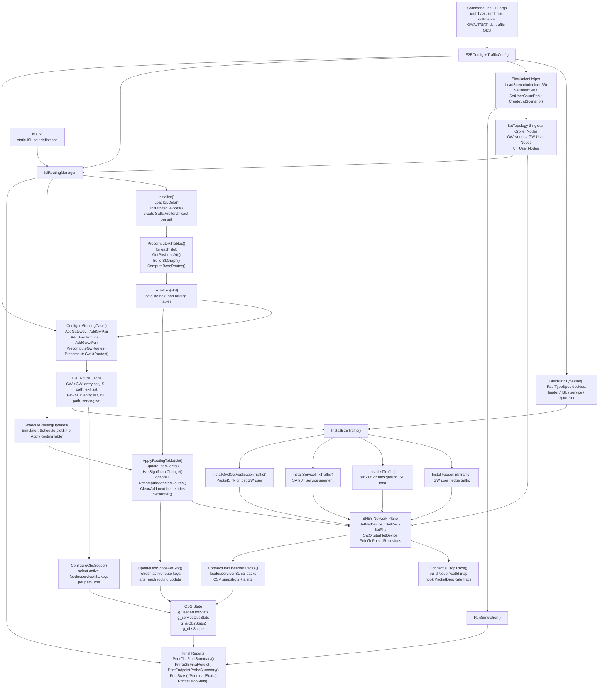
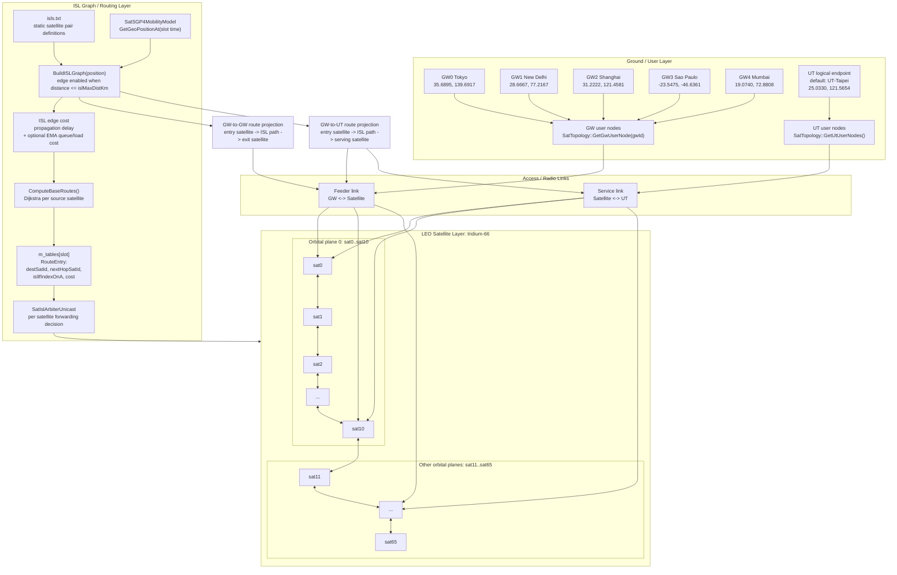
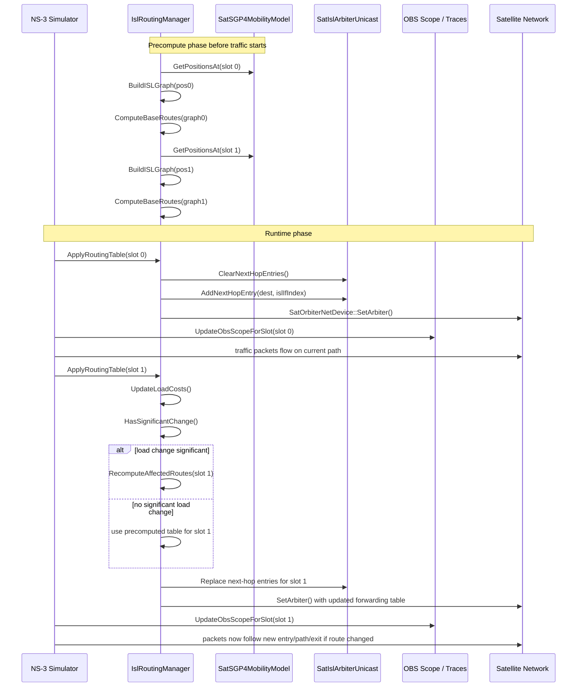

# TriScale-LEO 技術參考文件

> **目標讀者**：共同開發者、後續接手者、或任何需要從零理解並重現此模擬器的工程師。
> 本文件涵蓋完整系統架構、各層設計規格、程式碼細節、API、驗證結果與開發指南。
> 論文學術版本請查閱 [`Report/chapter3_sns3.md`](Report/chapter3_sns3.md)。

---

## 0. 快速導覽

| 想找的內容 | 對應章節 |
|-----------|---------|
| 系統架構與三層設計 | [§1](#1-系統概述) |
| IslRoutingManager 完整 API | [§2.2](#22-islroutingmanager) |
| Cost function 公式與常數 | [§2.2.3](#223-cost-function) |
| SNS3 介面實作與注意事項 | [§2.3](#23-sns3-介面) |
| E2E 測試框架（pathType 系統） | [§2.4](#24-e2e-測試框架test-iridium-e2ecc) |
| 核心資料結構定義 | [§2.5](#25-核心資料結構) |
| CLI 參數完整列表 | [§2.6](#26-cli-參考) |
| 最終驗證結果（6 種 pathType） | [§2.7](#27-最終驗證結果) |
| 已知架構限制 | [§2.8](#28-已知架構限制) |
| SNS3 修改清單 | [§2.9](#29-sns3-修改清單) |
| Layer 2 對外介面 | [§2.10](#210-layer-2-介面) |
| 系統架構圖 / 主程式流程圖 | [§3.1](#31-architecture-diagram), [§3.2](#32-main-program-flowchart) |
| LEO Network Graph | [§3.3](#33-leo-network-graph) |
| Routing Path 切換時序圖 | [§3.4](#34-routing-path-switching-diagram) |
| Function mapping table（全函式） | [§4](#4-function-mapping-table) |
| pathType 詳細行為對照 | [§5](#5-pathtype-詳細說明) |
| Layer 2 Beam Hopping 進度 | [§6](#6-layer-2--beam-hopping) |
| Layer 3 QoS Scheduling 進度 | [§7](#7-layer-3--qos-scheduling) |
| Reproduction commands / Debug | [§8](#8-開發指南) |
| 設計決策索引 | [§9](#9-設計決策索引) |

---

## 1. 系統概述

### 1.1 研究動機

原生 SNS3 在每個更新週期執行完整的 O(N²) 拓樸重建加全量 Dijkstra，無法充分利用 LEO 衛星拓樸的可預測性。本研究導入離線預計算架構：

- 模擬前依 SGP4 軌道模型離線計算所有時槽路由表（`PrecomputeAllTables`）
- 執行期只在 ISL load cost 顯著變化時對受影響節點局部重算（`RecomputeAffectedRoutes`）
- 以 `SatIslArbiterUnicast` 取代 IP 層路由，直接控制每顆衛星的 ISL 轉送決策

| 對比項目 | 原生 SNS3 | 本架構 |
|---------|----------|--------|
| 拓樸重建 | 每 60s 重建，O(N²) | 離線一次完成，執行期不重建 |
| Dijkstra | 每次全量重算 | 僅 load cost 變化超過 `ChangeThreshold` 時，對受影響節點局部重算 |
| load 感知 | 不支援 | `PointToPointIslNetDevice::GetQueue()->GetNPackets()` + EMA |
| 時鐘依賴 | `GetPosition()` 依賴 `Simulator::Now()` | SGP4 直接代入 τ_k，與模擬時鐘解耦 |

### 1.2 三層架構

| Layer | 職責 | 時間維度 | 執行時機 | 狀態 |
|-------|------|---------|---------|------|
| **Layer 1：ISL Routing** | FT pair 篩選 + 衛星間最短路由 | 分鐘級（60s slot） | 離線預計算；執行期每 60s 套用 | ✅ 完成（2026-04-23） |
| **Layer 2：Beam Hopping** | BHTP-based 多 beam 動態調度（K=3 同時活動），EM 需求估算 + 虛擬流量排程 | DVB-S2X super-frame 級（T_s=26.5ms，T_p=503ms） | NCC 端排程；OBC 端每 slot 切換 | ⏳ Phase 2 完成，Phase 3/4 待實作 |
| **Layer 3：QoS Scheduling** | 在給定 beam 服務時間內對 UE 做 priority + WFQ 排程 | 封包級 | SNS3 `SatBeamScheduler` 原生處理 | ⏳ 架構完成，attribute 路徑待驗證 |

### 1.3 層間接口

```
Layer 1 (IslRoutingManager)
  → 輸出：m_tables[slotIndex][satId] → vector<RouteEntry>
  → GetGwRoute(srcGw, dstGw, slot)、GetGwUtRoute(gw, ut, slot)
  → FtVisibilityFilter 讀取 GetRouteCost(entry, exit, slot) 做篩選

Layer 1 extension (FtVisibilityFilter)
  → 輸出：GetBestTransit(ftI, ftJ, slot) → FtTransitRoute{entrySat, exitSat, cost}
  → 告知 Layer 2 哪些衛星是 contracted path 上的 transit nodes

Layer 2 (SatBhScheduler / SatBhObc)
  → 輸出：SatBhTimePlan → BhSlotEntry{beamIds, startTime, duration, beamRadius, modcod, clusterIds}
  → SatBhMetrics 被動收集各 slot 的 KPI

Layer 3 (SNS3 native)
  → 讀取 SatBeamScheduler 設定，在對應 beam 的服務時間內依 QoS 優先序排程
```

### 1.4 開發環境

| 項目 | 規格 |
|------|------|
| 模擬器 | SNS3（基於 NS-3 3.43） |
| 平台 | VMware / Linux（Ubuntu）|
| 開發工具 | VS Code (Windows) → 手動複製到 VMware SNS3 環境執行 |
| 星座 | `constellation-iridium-66-sats-fixed`（66 sats, 6 planes × 11） |
| NS3 base path（hardcoded） | `/home/wenj/workspace/ns-3.43` |


**已修改的 SNS3 原始檔案（`contrib/satellite/`）：**

| 檔案 | 修改內容 |
|------|----------|
| `model/satellite-sgp4-mobility-model.h/.cc` | 新增 `GetGeoPositionAt(Time t)` — 與模擬時鐘解耦的軌道位置查詢 |
| `model/satellite-isl-arbiter-unicast.h` | 新增 `ClearNextHopEntries()` — 支援跨 slot 清空覆寫 |

**CMakeLists.txt**（`contrib/satellite/CMakeLists.txt`）新增：
```cmake
# source_files
helper/isl-graph.cc
helper/ft-filter.cc

# header_files
helper/isl-graph.h
helper/ft-filter.h
```

---

## 2. Layer 1 — ISL Routing（完整規格）

> **結案狀態**：Layer 1 closed — 2026-04-23
> **最終驗證**：6 種 pathType，全部 PASS

### 2.1 目標與系統組成

**目標**：在 SNS3 的 Iridium-66 LEO 星座場景中，實作基於 ISL 的時間槽路由系統：

- **離線預計算**：利用 LEO 軌道可預測性，模擬前依各時槽計算 ISL 拓樸與最短路徑路由表
- **Runtime 套用**：每隔 `slotInterval` 秒將對應時槽的路由表寫入 Arbiter，反映衛星幾何變化
- **Load-aware 重算**：以 ISL queue bytes 換算 queue delay proxy，並用 EMA 平滑；負載變化超過門檻時對受影響來源節點執行局部 Dijkstra

**系統組成：**

| 元件 | 檔案 | 職責 |
|------|------|------|
| `IslRoutingManager` | `isl-graph.h/.cc` | 路由計算、Arbiter 寫入、load-aware 動態路由 |
| E2E 測試框架 | `test-iridium-e2e.cc` | 6 種 pathType 的流量安裝、鏈路觀測、Verdict 輸出 |
| FT Visibility Filter | `ft-filter.h/.cc` | 依仰角過濾衛星可見性（Layer 2 呼叫用） |

### 2.2 IslRoutingManager

#### 2.2.1 初始化與預計算流程

```
isls.txt
   │
   ▼
LoadISLDefs()
   │  讀入 132 條 ISL 定義，建立 satellite→ifIndex 反查表
   ▼
InitOrbiterDevices()
   │  快取 66 顆衛星的 Node / SatOrbiterNetDevice / Arbiter
   ▼
PrecomputeAllTables()
   │  for each slot k:
   │    GetPositionsAt(τ_k)     → SGP4 查詢 66 顆衛星位置
   │    BuildISLGraph(pos)       → 距離 > 5000km 過濾，建鄰接表
   │    ComputeRoutesForSrc(g)   → 66 × Dijkstra，純傳播 cost
   │    m_tables[k] = result
   ▼
ScheduleRoutingUpdates()
   │  排入 N 個 NS3 事件
   ▼
[Simulator::Run]
   │
   ▼
ApplyRoutingTable(slotIndex)   ← 每 slotInterval 秒觸發
   │  slot 0: 直接套用預計算表
   │  slot k>0:
   │    UpdateLoadCosts()         → 佇列 byte→delay 換算 + EMA
   │    HasSignificantChange()    → 超過 ChangeThreshold + CooldownSeconds
   │    RecomputeAffectedRoutes() → 局部 Dijkstra（只算受影響 source）
   │    ClearNextHopEntries() + AddNextHopEntry() → 寫入 Arbiter
   ▼
PrintStats() / PrintLoadStats() / PrintIslDropStats()
```

#### 2.2.2 ISL 連接條件

| 條件 | 數值 | 說明 |
|------|------|------|
| 距離上限 | 5000 km | 超過此值的邊在建圖時排除。Iridium 跨面瞬時距離可達 ~4800 km，選 5000 km 保留跨面連通性。詳見 `Decisions/02` |
| 仰角門檻 | 不適用 | 僅用於 UT/GW 鏈路，ISL 不設仰角限制 |
| Beam 狀態 | 假設全部可用 | 不依賴 beam 狀態篩選 ISL |

#### 2.2.3 Cost Function

```
total_cost = propagation_cost + load_cost

propagation_cost = distance_ab / c             （離線算好，固定）
load_cost        = queue_bytes * 8 / bandwidth  （執行期讀取，EMA 平滑）
```

| 常數 | 數值 | 說明 |
|------|------|------|
| `c` | 3×10⁸ m/s | 光速，傳播延遲基準 |
| `bandwidth` | 10 Mbps | ISL 鏈路速率（`IslLinkRateBps` Attribute） |
| 假設封包大小 | 1500 bytes | `GetLinkQueueDelay()` 中 load cost 換算基準 |
| α, β weight | 各為 1.0（隱含） | `total_cost = propCost + loadCost`，等權，無獨立欄位 |

> 第一階段（precompute）`load_cost` 初始為 0，cost 等同純傳播延遲。

#### 2.2.4 Attributes（NS3 Config）

| Attribute | 型別 | 預設值 | 說明 |
|-----------|------|--------|------|
| `NumSatellites` | uint32 | 66 | 星座衛星總數 |
| `NumTimeSlots` | uint32 | 10 | 預計算時槽數 |
| `TimeSlotInterval` | double | 60.0 | 每槽間隔（秒） |
| `IslMaxDistanceKm` | double | 5000.0 | ISL 啟用距離門檻（km） |
| `IslsFilePath` | string | "" | isls.txt 完整路徑 |
| `EmaAlpha` | double | 0.3 | EMA 新樣本權重（0＝忽略新值，1＝只看新值） |
| `ChangeThreshold` | double | 0.1 | 觸發重算的 load cost 相對變化門檻（10%） |
| `CooldownSeconds` | double | 30.0 | 兩次重算最短間隔（秒），防振盪 |
| `IslLinkRateBps` | double | 10e6 | ISL 鏈路速率（佇列 delay 換算用） |

**參數調整的連動效應：**

| 調整項目 | 直接效果 | 注意事項 |
|---------|---------|---------|
| `EmaAlpha` ↑ | load cost 對瞬時壅塞更敏感，切換更快 | 與 `CooldownSeconds` 搭配；單獨調高易造成震盪 |
| `ChangeThreshold` ↓ | 更容易觸發 `RecomputeAffectedRoutes` | 計算開銷增加，建議搭配 `CooldownSeconds` 限制頻率 |
| `CooldownSeconds` ↑ | 降低 recompute 頻率，穩定性提升 | ISL 失效後最長延遲 `CooldownSeconds` 才能恢復 |
| `NumTimeSlots` ↑ | 預計算解析度提升 | 記憶體與初始化時間線性增加 |
| `IslMaxDistanceKm` ↑ | 連通性增強，可能建立長延遲 ISL | 超過 ~5500 km 後 Iridium 星座中可能出現不穩定跨面連結 |

#### 2.2.5 公開方法

**Lifecycle：**

| 方法 | 說明 |
|------|------|
| `Initialize(islsFilePath)` | 讀 ISL 定義、快取衛星裝置、初始化 load cost 陣列 |
| `PrecomputeAllTables()` | 離線計算所有時槽路由表，存入 `m_tables` |
| `ScheduleRoutingUpdates()` | 排入 N 個 NS3 排程事件 |
| `ApplyRoutingTable(slotIndex)` | 更新 Arbiter（含 load-aware 重算邏輯） |

**路由查詢 / 診斷：**

| 方法 | 說明 |
|------|------|
| `GetGwRoute(srcGwId, dstGwId, slot)` | 取得 GW→GW 路由（含入口 / 出口衛星與路徑資訊） |
| `GetGwUtRoute(gwId, utId, slot)` | 取得 GW→UT 路由（含 entry / serving sat） |
| `TracePath(src, dst, slot)` | 重建 src→dst 完整跳數序列 |
| `GetGwVisibleSats(gwId, slot)` | 取得 GW 在指定時槽可見的衛星集合 |
| `BlockISL(a, b)` / `UnblockISL(a, b)` | 暫時標記 ISL 不可用（繞路測試用） |

**統計輸出：**

| 方法 | 說明 |
|------|------|
| `PrintStats()` | 各槽 apply / recompute 執行時間 |
| `PrintLoadStats()` | 各 ISL 最終 EMA load cost（ms） |
| `PrintRouteReport(pairs)` | sat2sat 每槽完整路徑 |
| `PrintGwRouteReport()` | gw2gw 每槽 entry / ISL_path / exit / isl_cost |
| `PrintGwUtRouteReport()` | gw2ut 每槽 entry / ISL_path / serving / isl_cost |

#### 2.2.6 初始化範例（完整）

```cpp
Ptr<IslRoutingManager> mgr = CreateObject<IslRoutingManager>();
mgr->SetAttribute("NumSatellites",    UintegerValue(66));
mgr->SetAttribute("NumTimeSlots",     UintegerValue(numSlots));
mgr->SetAttribute("TimeSlotInterval", DoubleValue(slotInterval));
mgr->SetAttribute("IslMaxDistanceKm", DoubleValue(5000.0));
mgr->SetAttribute("IslsFilePath",     StringValue(islsFilePath));
mgr->SetAttribute("EmaAlpha",         DoubleValue(0.3));
mgr->SetAttribute("ChangeThreshold",  DoubleValue(0.1));
mgr->SetAttribute("CooldownSeconds",  DoubleValue(slotInterval / 2.0));
mgr->SetAttribute("IslLinkRateBps",   DoubleValue(10.0e6));

// 必須在 CreateSatScenario() 之後呼叫
mgr->Initialize(islsFilePath);
mgr->PrecomputeAllTables();
mgr->ScheduleRoutingUpdates();
```

#### 2.2.7 Load-aware 動態路由（行為說明）

每次 `ApplyRoutingTable(k)`（slot > 0）執行：

1. **`UpdateLoadCosts()`**：讀各 ISL queue bytes，依 `IslLinkRateBps` 換算為 queue delay proxy，以 EMA 平滑更新內部 load cost
2. **`HasSignificantChange()`**：任一 ISL 方向 load cost 相對變化超過 `ChangeThreshold=0.1`，且距上次重算超過 `CooldownSeconds=30s`，即判定需要重算
3. **`RecomputeAffectedRoutes()`**：定位受影響 ISL 邊，透過 `m_islSources[edgeIdx]` 找出受影響 source，對這些 source 重跑 Dijkstra（`BuildISLGraphWithLoad`，cost = propagation + load）

**執行期震盪抑制：**

| 機制 | 設定 |
|------|------|
| EMA 平滑 | `smoothed = (1-α) × previous + α × current`，α=0.3 |
| Hysteresis | 新路徑 cost 低於現有路徑 δ（建議 0.5×avg_prop）才允許切換 |
| Cooldown | `CooldownSeconds=30s`（預設），切換後不再重算 |

> **驗證結論**：EMA load cost 計算正確（最高 ~0.84ms），但遠小於傳播延遲（~44ms，約 2%）。`HasSignificantChange` 與局部重算有觸發，但 audit/final 條件下未觀察到由負載主導的路由切換。若需驗證 load-driven 切換，須設計 ISL 飽和壓測場景（~80%+ link utilization）。

---

### 2.3 SNS3 介面

#### 2.3.1 相關類別

| 類別 | 用途 |
|------|------|
| `PointToPointIslNetDevice` | ISL device，內含 `DropTailQueue<Packet>`，提供佇列長度查詢 |
| `SatOrbiterNetDevice` | 衛星主 device，管理所有 ISL device 與 Arbiter |
| `SatIslArbiterUnicast` | 轉送決策實作類，內部為 `map<destSatId, islInterfaceIndex>` |
| `SatSGP4MobilityModel` | 軌道位置計算，新增 `GetGeoPositionAt(Time t)` 後與模擬時鐘解耦 |

#### 2.3.2 InitOrbiterDevices()（在 Simulator::Run() 前呼叫）

```cpp
// 預先建立並安裝 66 個 arbiter，快取供排程使用
for (uint32_t i = 0; i < 66; i++) {
    Ptr<Node> sat = m_orbNodes[i];
    Ptr<SatOrbiterNetDevice> orbDev =
        DynamicCast<SatOrbiterNetDevice>(sat->GetDevice(0));
    Ptr<SatIslArbiterUnicast> arbiter =
        CreateObject<SatIslArbiterUnicast>(sat);   // 在有效上下文建立
    orbDev->SetArbiter(arbiter);
    m_arbiters[i] = arbiter;                       // 快取
}
```

> **關鍵限制**：排程內不可呼叫 `CreateObject<SatIslArbiterUnicast>()`，缺少有效 Node context 會觸發 NS_FATAL。必須在 `CreateSatScenario()` 後、`Simulator::Run()` 前建立。詳見 `Decisions/03_Arbiter lifecycle management.md`。

#### 2.3.3 ApplyRoutingTable()（排程執行時呼叫）

```cpp
Ptr<SatIslArbiterUnicast> arbiter = m_arbiters[satId];
arbiter->ClearNextHopEntries();   // 需新增此方法（見 SNS3 修改清單）
for (auto& entry : routingTable[satId]) {
    arbiter->AddNextHopEntry(entry.destSatId, entry.islIfIndexOnA);
}
```

#### 2.3.4 BuildISLGraph() 效能注意事項

位置計算必須在迴圈外預先快取，不可在 ISL 邊迴圈內逐次呼叫：

```cpp
// 正確：一次性快取所有衛星位置
std::vector<Vector> pos(m_numSatellites);
for (uint32_t i = 0; i < m_numSatellites; i++)
    pos[i] = m_orbNodes[i]->GetObject<SatSGP4MobilityModel>()
                           ->GetGeoPositionAt(tau_k).ToVector();
// 之後 ISL 邊迴圈直接用 pos[a], pos[b]
```

`PrecomputeAllTables` 以滾動快取傳遞 `graphNext`，只建 10 次圖。錯誤做法：10 個 slot 獨立呼叫實際建圖 19 次。

#### 2.3.5 UpdateLoadCosts() 實作

```cpp
std::vector<Ptr<PointToPointIslNetDevice>> islDevs =
    orbDev->GetIslsNetDevices();
for (uint32_t i = 0; i < islDevs.size(); i++) {
    uint32_t queuePackets = islDevs[i]->GetQueue()->GetNPackets();
    // 套用 EMA，計算 load_cost
}
```

#### 2.3.6 ifIndex 對應方式

不依賴 `isls.txt` 順序，改用 peer nodeId 查 vector index：

```cpp
for (uint32_t j = 0; j < islDevs.size(); j++) {
    Ptr<Node> peer = islDevs[j]->GetDestinationNode();
    if (peer) peerNodeIdToIfIdx[i][peer->GetId()] = j;
}
```

---

### 2.4 E2E 測試框架（test-iridium-e2e.cc）

#### 2.4.1 pathType 系統

E2E 框架以 `--pathType` 為唯一 CLI 入口，自動決定：流量安裝方式、觀測 scope、Verdict 輸出。

| pathType | 語意 | 觀測段 | 主 Verdict |
|----------|------|-------|-----------|
| `gw2sat` | GW→SAT feeder 上行 | feeder（衛星側 RxFeeder） | FEEDER_LAYER |
| `sat2gw` | SAT→GW feeder 下行 | feeder（GW 側 SatNetDevice::Rx） | FEEDER_LAYER |
| `sat2sat` | SAT→SAT ISL 骨幹 | ISL 路徑上各 hop | ISL_LAYER |
| `sat2ut` | SAT→UT service 下行 | service（SAT 側 + UT 側） | SERVICE_LAYER |
| `gw2ut_e2e` | GW→UT 端到端（feeder + ISL + service） | feeder + ISL（若有）+ service | FEEDER_LAYER + SERVICE_LAYER |
| `gw2gw_e2e` | GW→GW 端到端（ISL 骨幹 + GW_user 交付） | 路由驗證 + scoped ISL + PacketSink Rx | ROUTING_LAYER + ISL_LAYER + PACKET_LAYER |

#### 2.4.2 feeder 觀測來源切換

`ConnectLinkObserverTraces()` 依 pathType 決定觀測來源：

```cpp
bool useOrbiterFeeder = (pathType != "sat2gw" && pathType != "gw2gw_e2e");
bool useGwFeeder      = (pathType == "sat2gw");
bool useUtService     = (pathType == "sat2ut" || pathType == "gw2ut_e2e");
```

| pathType | feederSource（log 輸出） | 說明 |
|----------|------------------------|------|
| `gw2sat`, `gw2ut_e2e` | `orbiter_rxfeeder` | 衛星端 `SatOrbiterNetDevice::RxFeeder` |
| `sat2gw` | `gw_return_rx` | GW 端 `SatNetDevice::Rx`（return feeder） |
| `gw2gw_e2e` | `none` | feeder PHY bypass（見 §2.8.1） |
| `sat2sat`, `sat2ut` | `none` | 不觀測 feeder |

#### 2.4.3 ObsScope（觀測範圍管控）

依 pathType 限制哪些 key 進入統計，避免大量零行輸出：

```cpp
struct ObsScope {
    std::set<std::string> feederKeys;
    std::set<std::string> serviceKeys;
    std::set<std::string> islKeys;
};
static ObsScope g_obsScope;        // 即時觀測（TakeObsSnapshot 使用）
static ObsScope g_obsVerdictScope; // 最終 PASS/FAIL 判定
```

`ConfigureObsScope()` 依 pathType 初始填入 scope；每 slot 切換後由 `UpdateObsScopeForSlot()` 重算：

| pathType | feederKeys | serviceKeys | islKeys |
|----------|-----------|------------|---------|
| `gw2sat` | entry sat（per slot GetGwVisibleSats） | — | — |
| `sat2gw` | GW key（固定） | — | — |
| `sat2sat` | — | — | TracePath 展開邊集合 |
| `sat2ut` | — | `ut<trafficUtUserId>`（固定） | — |
| `gw2ut_e2e` | entry sat | `ut<trafficUtUserId>` | 路徑邊集合（entry==serving 時為空） |
| `gw2gw_e2e` | — | — | 正反向 GW-GW route 的路徑邊集合（per slot 更新） |

#### 2.4.4 Verdict 層級

`PrintE2EFinalVerdict()` 依 pathType 輸出各層：

| Verdict | 判定條件 | 適用 pathType |
|---------|---------|--------------|
| `FEEDER_LAYER` | `scopedRxPkts > 0`（scope 內 feeder key 有收包） | gw2sat, sat2gw, gw2ut_e2e |
| `SERVICE_LAYER` | `utRxPkts > 0`（UT-side 有收包） | sat2ut, gw2ut_e2e |
| `ISL_LAYER` | `scopedLinks > 0 && scopedRxPkts > 0` | sat2sat, gw2gw_e2e |
| `ISL_LAYER not_applicable` | `gw2ut_e2e` 且 entry==serving（無 ISL hop） | gw2ut_e2e |
| `ROUTING_LAYER` | `validSlots == numSlots`（全槽路由均可解析） | gw2gw_e2e |
| `PACKET_LAYER` | `PacketSink::Rx traceRxBytes > 0` | gw2gw_e2e |

#### 2.4.5 UT Endpoint Selection（trafficUtUserId）

`sat2ut` / `gw2ut_e2e` 的 UT 端 routing ID 與 SNS3 scenario UT user index 不同：

- `cfg.utId`：邏輯 UT routing ID（`IslRoutingManager` 使用）
- `cfg.trafficUtUserId`：SNS3 scenario 中真正的 UT user node index（流量安裝 / OBS key / endpoint probe 使用）

`ResolveTrafficUtUserId()` 自動解析流程：

```
1. GetGwUtRoute(gwId, utId, first valid slot) → servingSatId
2. 掃描 SatTopology::GetUtUserNodes()
3. 對每個 user node: physicalUtNode = topo->GetUtNode(utUser)
4. GetUtSatId(physicalUtNode) == servingSatId → trafficUtUserId = i
```

輸出範例：
```
[UT_SELECT] logicalUtId=0 routeServingSat=15 trafficUtUserId=22 requestedUtUserId=0
```

#### 2.4.6 Endpoint Probe（多層接收驗證）

安裝於 physical UT / GW node 上，逐層確認封包抵達：

| 層 | trace source | 意義 |
|----|-------------|------|
| PHY | `SatPhy::Rx` | 實體層接收 |
| MAC | `SatMac::Rx` | MAC 層接收 |
| Dev | `SatNetDevice::Rx` | NetDevice 層接收 |
| App | `PacketSink::Rx` | 應用層接收（port=9100，診斷用） |

| interpretation 值 | 意義 |
|-------------------|------|
| `device_rx_observed_probe_app_idle` | Dev 有收包，App sink 安裝但主流量未打到 port=9100（正常情況） |
| `no_endpoint_observed` | Dev 未收包（異常） |
| `device_rx_observed_app_not_installed` | Dev 有收包但 App sink 未安裝 |

---

### 2.5 核心資料結構

#### 2.5.1 isl-graph.h — 路由層

| 結構 | 定義 | 說明 |
|------|------|------|
| `ISLEdge` | `{nodeB, propagation_cost, islIfIndexOnA, islIfIndexOnB}` | 單條 ISL 邊資訊 |
| `ISLDef` | `{nodeA, nodeB}` | 靜態 ISL pair 定義（來自 isls.txt） |
| `RouteEntry` | `{destSatId, nextHopSatId, islIfIndexOnA, cost}` | 單條路由表項目 |
| `ISLGraph` | `vector<vector<ISLEdge>>` | 66 節點鄰接表 |
| `RoutingTable` | `vector<vector<RouteEntry>>` | 66 顆衛星各自路由表 |
| `SlotStats` | `{slotIndex, simTimeSec, applyWallMs, recomputeWallMs, recomputedSources, significantChange}` | 每槽執行統計 |
| `GwDef` | `{gwId, latDeg, lonDeg, name}` | GW 地理位置定義 |
| `GwToGwRoute` | `{srcGwId, dstGwId, entrySatId, exitSatId, satPath, islCost, valid}` | GW→GW E2E 路由 |
| `UtDef` | `{utId, latDeg, lonDeg, name}` | UT 地理位置定義 |
| `GwToUtRoute` | `{gwId, utId, entrySatId, servingSatId, satPath, islCost, valid}` | GW→UT E2E 路由 |

#### 2.5.2 test-iridium-e2e.cc — E2E 框架

```cpp
struct E2EConfig {
    std::string pathType;          // gw2sat / sat2gw / sat2sat / sat2ut / gw2ut_e2e / gw2gw_e2e
    uint32_t gwId, gwSrc, gwDst;
    uint32_t utId;                 // 邏輯 UT routing ID
    uint32_t trafficUtUserId;      // SNS3 scenario UT user index（自動解析）
    bool     trafficUtUserIdResolved;
    uint32_t satSrc, satDst;
    double   simTimeSec, utLatDeg, utLonDeg;
    std::string utName;
};

struct SegLinkStats {
    uint64_t rxPkts, rxBytes, dropPkts;
    double   sumDelayMs;
    double   DropRate() const;
    double   AvgDelayMs() const;
    double   WindowThroughputKbps(double nowSec) const;
};

struct TrafficConfig {
    bool     enableFwd{true}, enableRtn{true};
    uint32_t fwdIntervalMs{100}, rtnIntervalMs{500};
    uint32_t fwdPktBytes{1500}, rtnPktBytes{512};
    double   startSec{1.0}, stopSec{0.0};
};
```

Key factories（統一 key 格式）：

| 函式 | 回傳格式 | 用途 |
|------|---------|------|
| `MakeSatKey(satId)` | `"sat<N>"` | orbiter feeder / service obs |
| `MakeGwKey(gwId)` | `"gw<N>"` | GW-side return feeder obs |
| `MakeUtKey(utId)` | `"ut<N>"` | UT-side service obs |
| `MakeIslKey(src, dst)` | `"<src>-<dst>"` | ISL link obs |

---

### 2.6 CLI 參考

| 參數 | 型別 | 預設值 | 說明 |
|------|------|--------|------|
| `--pathType` | string | `gw2gw_e2e` | 唯一路徑語意入口（必填） |
| `--simTime` | double | 120.0 | 模擬時長（秒） |
| `--slotInterval` | double | 60.0 | 路由更新間隔（秒） |
| `--gwId` | uint32 | 0 | GW preset ID（gw2sat / sat2gw / gw2ut_e2e） |
| `--gwSrc` / `--gwDst` | uint32 | 0 / 1 | GW pair（gw2gw_e2e） |
| `--utId` | uint32 | 0 | 邏輯 UT ID（sat2ut / gw2ut_e2e） |
| `--satSrc` / `--satDst` | uint32 | 0 / 33 | SAT pair（sat2sat） |
| `--islDropThreshPct` | double | 1.0 | ISL drop rate PASS 門檻（%） |
| `--obsLogPath` | string | `e2e_link_obs.csv` | Link Observer CSV 路徑 |
| `--obsInterval` | double | 10.0 | 快照週期（秒） |

**GW Preset 對照：**

| ID | 名稱 | 座標 |
|----|------|------|
| 0 | JP-Tokyo | 35.7°N, 139.7°E |
| 1 | IN-NewDelhi | 28.6°N, 77.2°E |
| 2 | CN-Shanghai | 31.2°N, 121.5°E |
| 3 | BR-SaoPaulo | 23.5°S, 46.6°W |
| 4 | IN-Mumbai | 19.1°N, 72.9°E |

---

### 2.7 最終驗證結果

**驗證環境**：Iridium-66，simTime=120s（gw2gw_e2e=300s），slotInterval=60s，ISL 10Mbps / 5000km
**GW Preset**：GW0=JP-Tokyo（35.7°N,139.7°E），GW1=IN-NewDelhi（28.6°N,77.2°E）

#### 2.7.1 六種 pathType 總覽

| pathType | 場景 | 主 Verdict | ISL drop | wall time (s) |
|----------|------|-----------|---------|---------|
| `sat2sat` | SAT0→SAT33，7-hop | ISL_LAYER **PASS** \| scopedRxPkts=173,595 | **0.240% PASS**（14-15 熱點 10.84%） | 723.9 |
| `gw2sat` | GW0=JP-Tokyo feeder up | FEEDER_LAYER **PASS** \| scopedRxPkts=32,087 | 0.000% PASS | 554.9 |
| `sat2gw` | GW0=JP-Tokyo feeder dn | FEEDER_LAYER **PASS** \| scopedRxPkts=5,148 | 0.000% PASS | 561.7 |
| `sat2ut` | UT-Taipei service link | SERVICE_LAYER **PASS** \| utRxPkts=1,189 | 0.000% PASS | 586.2 |
| `gw2ut_e2e` | JP-Tokyo→UT-Taipei（no ISL hop） | FEEDER+SERVICE **PASS** \| utRxPkts=1,189 | 0.000% PASS | 603.9 |
| `gw2gw_e2e` | JP-Tokyo→IN-NewDelhi，300s | ROUTING+ISL+PACKET **全 PASS** \| traceRxPkts=2,979 | 0.000% PASS | 1293.0 |

#### 2.7.2 sat2sat（SAT0→SAT33，120s）

路由表（3 slots 相同）：

| slot | t(s) | full_path | route_cost |
|------|------|-----------|-----------|
| 0 | 0 | `0→1→2→57→46→35→34→33` | 0.078176 |
| 1 | 60 | `0→1→2→57→46→35→34→33` | 0.074919 |
| 2 | 120 | `0→1→2→57→46→35→34→33` | 0.072055 |

ISL drop 明細（僅列有 drop 的 link）：

| ISL | total_pkts | dropped | drop_rate |
|-----|-----------|---------|----------|
| 13-14 | 75,763 | 3 | 0.004% |
| **14-15** | **153,004** | **16,583** | **10.838%** |
| 3-14 | 75,851 | 43 | 0.057% |
| TOTAL | **6,926,118** | **16,629** | **0.240% [PASS]** |

> isl:14-15 高丟棄率為 aggressive background load 設計，製造 ISL 佇列壓力；overall 仍通過 1% 門檻。

```
[ISL_LAYER] PASS | scopedLinks=7 scopedRxPkts=173,595
```

#### 2.7.3 gw2sat（GW0=JP-Tokyo feeder up，120s）

GW0 可見衛星：3 slots 均 2 sats（sat15, sat45）。feeder:sat45=0 為預期行為（Dijkstra 選 sat15 為最短路徑）。

```
[FEEDER_LAYER] PASS | scopedKeys=2 scopedRxPkts=32,087
```

#### 2.7.4 sat2gw（GW0=JP-Tokyo feeder dn，120s）

運行事件 `POSSIBLE LINK FAILURE at t=70s` 為 slot boundary 邊緣效應假警報，非真實鏈路失效（feeder:gw0 全程 drop=0 確認）。

```
[FEEDER_LAYER] PASS | scopedKeys=1 scopedRxPkts=5,148
```

#### 2.7.5 sat2ut（UT0=UT-Taipei，120s）

```
[UT_SELECT] logicalUtId=0 routeServingSat=15 trafficUtUserId=22 requestedUtUserId=0
```

UT0[UT-Taipei] 全程由 sat15 服務。`service:sat15`=2,704 pkts（衛星端），`service:ut22`=1,189 pkts（UT 端）。

```
[SERVICE_LAYER] PASS | satKeys=1 satRxPkts=2,704 utKeys=1 utRxPkts=1,189
```

#### 2.7.6 gw2ut_e2e（GW0=JP-Tokyo→UT0=UT-Taipei，120s）

JP-Tokyo 與 UT-Taipei 地理相近，sat15 同時覆蓋兩端，entry==serving，無需 ISL hop。

```
[FEEDER_LAYER]  PASS | scopedKeys=1 scopedRxPkts=2,388
[SERVICE_LAYER] PASS | satKeys=1 satRxPkts=2,704 utKeys=1 utRxPkts=1,189
[ISL_LAYER]     not_applicable | valid route has no ISL hop
```

#### 2.7.7 gw2gw_e2e（GW0=JP-Tokyo→GW1=IN-NewDelhi，300s）

路由表（JP-Tokyo→IN-NewDelhi，route 跨槽動態切換）：

| slot | t(s) | entry | ISL_path | exit | isl_cost(s) |
|------|------|-------|----------|------|------------|
| 0 | 0 | 45 | `45→46→35→34→33` | 33 | 0.047382 |
| 1 | 60 | 15 | `15→14→3→4` | 4 | 0.037122 ← ROUTE CHANGED |
| 2 | 120 | 45 | `45→34→33` | 33 | 0.029282 ← ROUTE CHANGED |
| 3 | 180 | 14 | `14→3→4` | 4 | 0.026127 ← ROUTE CHANGED |
| 4 | 240 | 45 | `45→34→33` | 33 | 0.027011 ← ROUTE CHANGED |
| 5 | 300 | 45 | `45→34→33` | 33 | 0.025810 |

封包層交付：
```
[GW2GW_APP] received: 1,525,248 bytes (~2,979 pkts)
[GW2GW_OBS][PACKET] traceRxPkts=2979 traceRxBytes=1525248
```

```
[ROUTING_LAYER] PASS | validSlots=6/6 gwSrc=0 gwDst=1
[ISL_LAYER]     PASS | scopedLinks=16 scopedRxPkts=968,854
[PACKET_LAYER]  PASS | traceRxPkts=2979 traceRxBytes=1525248
```

IslRoutingManager Stats（全槽 HasSignificantChange=YES）：

| slot | apply(ms) | recompute(ms) | recompSrc | changed |
|------|-----------|--------------|-----------|---------|
| 0 | 0 | 0 | 0 | NO |
| 1 | 0 | 0 | 3 | YES |
| 2 | 0 | 0 | 17 | YES |
| 3 | 2 | 2 | 23 | YES |
| 4 | 0 | 0 | 30 | YES |
| 5 | 2 | 2 | 33 | YES |

---

### 2.8 已知架構限制

#### 2.8.1 gw2gw_e2e feeder PHY 不可觀測

在 SNS3 `REGENERATION_NETWORK` 模式下，GW-to-GW application traffic 在衛星端被重新產生並經 ISL 骨幹轉送。`SatOrbiterNetDevice::RxFeeder` 與 GW-side `SatNetDevice::Rx` 不觸發，計數保持 0。

**這不是 link failure**，是 traffic model 的 trace 可見性限制。因此 `gw2gw_e2e` verdict 設計為：主判定 ROUTING_LAYER + ISL_LAYER + PACKET_LAYER，feeder PHY 不參與 verdict。

#### 2.8.2 sat2gw 觀測視窗假警報

slot boundary 後約 10s 視窗，throughput window 計算為 0，觸發 `POSSIBLE LINK FAILURE`。根因為 obsInterval 視窗 baseline 不連續，非真實封包丟失。Grace period 修法已分析，刻意 deferred。

#### 2.8.3 Load-aware 重算已觸發，但未觀察到負載主導切換

EMA load cost 最高約 0.84ms，傳播延遲約 44ms（佔比 ~2%）。幾何代價仍主導 Dijkstra。若需驗證 load-driven 切換，須設計 ISL 飽和壓測場景（~80%+ link utilization）。

#### 2.8.4 sat2ut / gw2ut_e2e Endpoint Probe App 計數

Endpoint probe 使用 port=9100（診斷用），主流量不打到該 port，故 `app rxPkts=0`。`dev rxPkts=1189` 確認 physical UT device 已收到封包，正確 interpretation 為 `device_rx_observed_probe_app_idle`。

#### 2.8.5 全量覆寫路由表

目前 `ApplyRoutingTable()` 在 slot 邊界仍會重寫該 slot 的 Arbiter next-hop entries（即使路由未改變）。雖然成本低於全量重建 IP routing table，但未來仍可考慮引入 diff-based update。

#### 2.8.6 路由計算規模

Iridium-66（66 顆衛星）的 per-slot Dijkstra 計算輕易完成。若未來擴展至數百 / 數千顆衛星的大型星座，預先計算與 runtime 局部重算的成本仍需進一步優化。

---

### 2.9 SNS3 修改清單

| 檔案 | 位置 | 修改內容 | 原因 |
|------|------|----------|------|
| `satellite-sgp4-mobility-model.h/.cc` | `contrib/satellite/model/` | 新增 `GetGeoPositionAt(Time t)` | 支援與模擬時鐘解耦的軌道位置查詢，使離線預計算可重現 |
| `satellite-isl-arbiter-unicast.h` | `contrib/satellite/model/` | 新增 `ClearNextHopEntries()` | 支援跨 slot 清空覆寫，避免舊路由殘留 |

**CMakeLists.txt 新增（`contrib/satellite/CMakeLists.txt`）：**
```cmake
# source_files
helper/isl-graph.cc
helper/ft-filter.cc

# header_files
helper/isl-graph.h
helper/ft-filter.h
```

---

### 2.10 Layer 2 介面

Layer 1 對 Layer 2（Beam Hopping Controller）提供的穩定介面：

| 介面 | API | 說明 |
|------|-----|------|
| 路由查詢 | `GetGwRoute(srcGwId, dstGwId, slot)` | GW→GW 路由（entry, exit, path, cost） |
| 路由查詢 | `GetGwUtRoute(gwId, utId, slot)` | GW→UT 路由（entry, serving, path, cost） |
| 路徑展開 | `TracePath(src, dst, slot)` | 取得完整跳數序列 |
| 可見性 | `GetGwVisibleSats(gwId, slot)` | GW 在指定槽可見衛星集合 |
| ISL cost | 需新增 `GetIslLoadCost(a, b)` | `m_loadCosts` 目前為 private，不應直接作為 Layer 2 API |
| 時間槽事件 | `ScheduleRoutingUpdates()` | 路由更新已納入 NS3 event scheduler |
| FT filter | `FtVisibilityFilter` | `ft-filter.h/.cc`，Layer 2 可直接呼叫 |

**Layer 2 開發約定：**
- `IslRoutingManager` 介面已穩定，不應修改 Layer 1 架構
- Layer 2 程式碼路徑：`Beam Hopping Controller/Codes/`
- 若需存取衛星拓樸，使用 `Singleton<SatTopology>::Get()` — Layer 1 已驗證其 API

---

## 3. 架構圖與流程圖

### 3.1 Architecture Diagram



**Tracing notes：**
- `main()` 先解析 CLI 與建立 `E2EConfig`，再呼叫 `BuildPathTypePlan()`
- `SimulationHelper::CreateSatScenario()` 建立 SNS3 topology 後，才接 `ConnectIslDropTrace()` 與 `ConnectLinkObserverTraces()`
- `IslRoutingManager` 是 routing control plane：`Initialize()` 讀 `isls.txt` 並建立 per-sat arbiter，`PrecomputeAllTables()` 預先計算每個 slot 的 satellite routing table，`ScheduleRoutingUpdates()` 在 runtime 套用
- E2E route projection 由 `ConfigureRoutingCase()` 觸發，依 path type 呼叫 `PrecomputeGwRoutes()` 或 `PrecomputeGwUtRoutes()`

---

### 3.2 Main Program Flowchart

```mermaid
flowchart TD
    A["main(argc, argv)"] --> B["Set defaults\nscenarioName = constellation-iridium-66-sats-fixed\nnumSats = 66\npathType = gw2gw_e2e"]
    B --> C["CommandLine cmd.AddValue(...)"]
    C --> D["cmd.Parse(argc, argv)"]
    D --> E["Apply OBS config\ng_obsCfg + g_obsDebug"]
    E --> F{"Validate basic CLI values"}
    F -->|invalid| X["NS_ABORT_MSG_IF\nterminate"]
    F -->|valid| G["NormalizePathType()"]
    G --> H["Build E2EConfig\npathType, GW/UT/SAT ids,\ntraffic config"]
    H --> I["BuildPathTypePlan(e2eCfg)\nValidateE2EConfig()\nGetPathTypeSpec()"]
    I --> J["Compute routing timing\nislRateBps, cooldownSec, numSlots"]
    J --> K["Config::SetDefault(...)\nSNS3 regeneration, ISL rate,\nSGP4 update period, stats tags"]
    K --> L["ConfigureQoS()\ncurrently no-op"]
    L --> M["Create SimulationHelper\nLoadScenario()\nSetSimulationTime()\nSetBeamSet()\nCreateSatScenario()"]
    M --> N["Topology diagnostics\nGW nodes, UT user nodes"]
    N --> O{"satStats enabled?"}
    O -->|yes| P["Register SNS3 native stats"]
    O -->|no| Q["Skip native stats"]
    P --> R
    Q --> R
    R["ConnectIslDropTrace()\nNode->satId map\nPacketDropRateTrace"] --> S["Open OBS CSV log"]
    S --> T["Decide trace points\nuseOrbiterFeeder\nuseGwFeeder\nuseUtService"]
    T --> U["ConnectLinkObserverTraces(...)"]
    U --> V["Schedule TakeObsSnapshot()"]
    V --> W{"rbdcVerbose enabled?"}
    W -->|yes| W1["Connect RBDC trace"]
    W -->|no| W2["Skip RBDC trace"]
    W1 --> Y
    W2 --> Y
    Y["Create IslRoutingManager"] --> Z["Set routing attributes"]
    Z --> AA["routingMgr->Initialize(islsFilePath)"]
    AA --> AB["routingMgr->PrecomputeAllTables()"]
    AB --> AC["ConfigureRoutingCase()"]
    AC --> AD["ResolveTrafficUtUserId()"]
    AD --> AE["ConfigureObsScope()"]
    AE --> AF["PrintE2ERunBanner()"]
    AF --> AG["InstallE2ETraffic()"]
    AG --> AH{"Edge traffic installed?"}
    AH -->|yes| AI["Reuse upstream edge traffic\nskip separate service install"]
    AH -->|no| AJ["InstallServicelinkTraffic()"]
    AI --> AK
    AJ --> AK
    AK["InstallEndpointProbe()"] --> AL["routingMgr->ScheduleRoutingUpdates()"]
    AL --> AM["Schedule UpdateObsScopeForSlot()\nslot 1..numSlots-1"]
    AM --> AN["simHelper->RunSimulation()"]
    AN --> AO["Runtime:\nApplyRoutingTable(slot)\noptional load-aware recompute\ntraffic + trace callbacks\nperiodic OBS snapshots"]
    AO --> AP["Final summaries:\nOBS, E2E verdict, endpoint probe,\nrouting stats, load stats, ISL drop stats"]
    AP --> AQ["Print wall time + event count"]
    AQ --> AR["Simulator::Destroy()"]
    AR --> AS["return 0"]
```



**Key control-flow conclusions：**
- Routing is prepared before traffic applications are installed
- `ApplyRoutingTable()` is scheduled into simulation time; it is not merely a precompute step
- `UpdateObsScopeForSlot()` is scheduled after routing updates at the same slot boundary so observer scope follows the active route

---

### 3.3 LEO Network Graph



**Tracing notes：**
- Iridium-66 固定為 `numSats = 66`
- `LoadISLDefs()` 讀靜態 ISL pair；`BuildISLGraph()` 依衛星位置與 `islMaxDistKm` 決定哪些邊在此 slot 可用
- GW/UT 不是 ISL graph nodes，透過可見 entry/exit/serving satellite 投影到衛星圖

**Iridium-66 拓樸性質（`6×11` 週期性 mesh）：**

若將衛星寫為 `(p, s)`，`p ∈ {0..5}` 軌道面，`s ∈ {0..10}` along-track 索引：

```text
N(p, s) = {
  (p, (s - 1) mod 11),
  (p, (s + 1) mod 11),
  ((p - 1) mod 6, s),
  ((p + 1) mod 6, s)
}
```

- 同軌道面 wrap-around：`0-10`、`11-21`、`22-32`、`33-43`、`44-54`、`55-65`
- 跨軌道面 wrap-around：`0-55`、`1-56`、...、`10-65`

---

### 3.4 Routing Path Switching Diagram

```mermaid
flowchart LR
    subgraph T0["Slot 0 / t = 0s"]
        A0["Satellite positions\nGetPositionsAt(0s)"]
        G0["ISL graph G0\nBuildISLGraph(pos0)"]
        R0["Routing table T0\nComputeBaseRoutes(G0)"]
        P0["Selected path\nentry0 -> ... -> exit0/serving0"]
        O0["OBS scope\nactive ISL keys for path0"]
    end
    subgraph T1["Slot 1 / t = slotInterval"]
        A1["Satellite positions\nGetPositionsAt(slotInterval)"]
        G1["ISL graph G1\nBuildISLGraph(pos1)"]
        R1["Routing table T1\nprecomputed base routes\noptional load recompute at runtime"]
        P1["Selected path\nentry1 -> ... -> exit1/serving1"]
        O1["OBS scope\nactive ISL keys for path1"]
    end
    subgraph T2["Slot 2 / t = 2 * slotInterval"]
        A2["Satellite positions\nGetPositionsAt(2 * slotInterval)"]
        G2["ISL graph G2\nBuildISLGraph(pos2)"]
        R2["Routing table T2\nprecomputed base routes\noptional load recompute at runtime"]
        P2["Selected path\nentry2 -> ... -> exit2/serving2"]
        O2["OBS scope\nactive ISL keys for path2"]
    end
    A0 --> G0 --> R0 --> P0 --> O0
    A1 --> G1 --> R1 --> P1 --> O1
    A2 --> G2 --> R2 --> P2 --> O2
    O0 -->|"Simulator::Schedule(slot 1)"| A1
    O1 -->|"Simulator::Schedule(slot 2)"| A2
    P0 -. "path changed?" .-> P1
    P1 -. "path changed?" .-> P2
```





---

## 4. Function Mapping Table

| 功能模組 | 主要負責內容 | 對應 code / function | 主要資料結構 | 輸出 / 副作用 |
|---|---|---|---|---|
| CLI 與全域參數設定 | 解析 `pathType`、模擬時間、slot 間隔、GW/UT/SAT ID、traffic、OBS 參數 | `main()`、`CommandLine cmd.AddValue()` | `pathType`, `simTime`, `slotInterval`, `TrafficConfig` | 決定整次模擬 scenario、traffic、routing 更新週期 |
| Path type 規劃 | 判斷目前測試是哪種路徑 | `NormalizePathType()`、`GetPathTypeSpec()`、`BuildPathTypePlan()` | `PathTypeSpec`, `PathTypePlan`, `E2EConfig` | 決定 feeder / ISL / service segment 是否啟用 |
| SNS3 場景建立 | 載入 Iridium-66 scenario，建立衛星、GW、UT、beam、network device | `SimulationHelper::LoadScenario()`、`CreateSatScenario()` | `SimulationHelper`, `SatTopology` | 產生 orbiter nodes、GW nodes、UT user nodes |
| Gateway / UT preset 管理 | 將 logical GW/UT ID 映射到座標與名稱 | `GetGatewayPresets()`、`FindGatewayPreset()`、`AddGatewayOrAbort()` | `GatewayPreset`, `GwDef`, `UtDef` | 提供 GW/UT visibility 計算的地理座標 |
| ISL topology 載入 | 從 `isls.txt` 讀入衛星間靜態 ISL pair | `IslRoutingManager::LoadISLDefs()` | `ISLDef`, `m_islDefs`, `m_edgeOfPair` | 建立 satellite pair 與 ISL interface order 對應 |
| Orbiter device 初始化 | 找出每顆衛星的 `SatOrbiterNetDevice`，建立 per-sat arbiter | `IslRoutingManager::InitOrbiterDevices()` | `m_orbNodes`, `m_orbDevs`, `m_arbiters` | 每顆衛星配置 `SatIslArbiterUnicast` |
| Slot-based ISL graph 建立 | 依 slot 時間取得衛星位置，建立該時刻 ISL graph | `GetPositionsAt()`、`BuildISLGraph()` | `ISLGraph`, `ISLEdge`, `Vector` | 產生每個 slot 的可用 ISL 邊與 cost |
| Satellite routing table 預算 | 對每個 slot、每個 source satellite 計算到所有 destination 的 next hop | `PrecomputeAllTables()`、`ComputeBaseRoutes()`、`ComputeRoutesForSrc()` | `RoutingTable`, `RouteEntry`, `m_tables` | 建立 `m_tables[slot]` |
| GW-to-GW route projection | 在 GW 可見衛星集合中選 entry/exit satellite，重建 E2E ISL path | `PrecomputeGwRoutes()`、`GetGwRoute()`、`PrintGwRouteReport()` | `GwToGwRoute`, `m_gwRoutes`, `m_gwVisibility` | 產生 `GW src -> entry sat -> ISL path -> exit sat -> GW dst` |
| GW-to-UT route projection | 在 GW 可見衛星與 UT 可見衛星之間選最佳 entry/serving satellite | `PrecomputeGwUtRoutes()`、`GetGwUtRoute()`、`PrintGwUtRouteReport()` | `GwToUtRoute`, `m_gwUtRoutes`, `m_utVisibility` | 產生 `GW -> entry sat -> ISL path -> serving sat -> UT` |
| Runtime routing update | 在每個 slot boundary 套用新的 satellite forwarding table | `ScheduleRoutingUpdates()`、`ApplyRoutingTable()` | `m_tables[slot]`, `SatIslArbiterUnicast` | 清除舊 next-hop，寫入新 next-hop，更新 `SatOrbiterNetDevice` arbiter |
| Load-aware reroute | 根據 ISL queue delay 變化判斷是否重算受影響路由 | `UpdateLoadCosts()`、`HasSignificantChange()`、`RecomputeAffectedRoutes()` | `m_loadCosts`, `m_prevLoadCosts`, `m_islSources` | 若 load 變化超過 threshold，局部更新 routing table |
| Traffic 安裝 | 根據 path type 安裝 feeder、ISL、service 或 GW-to-GW app traffic | `InstallE2ETraffic()`、`InstallFeederlinkTraffic()`、`InstallIslTraffic()`、`InstallServicelinkTraffic()`、`InstallGw2GwApplicationTraffic()` | `TrafficConfig`, `ApplicationContainer` | 產生實際封包流，驅動 simulation |
| ISL drop tracing | 掛上 ISL `PacketDropRateTrace`，統計 packet drop | `ConnectIslDropTrace()`、`IslPacketDropCallback()`、`PrintIslDropStats()` | `g_nodeToSatId`, `g_islDropStats` | 輸出 ISL drop rate summary |
| Link observability | 觀測 feeder/service/ISL segment 的 rx、drop、throughput、delay | `ConnectLinkObserverTraces()`、`TakeObsSnapshot()`、`PrintObsFinalSummary()` | `SegLinkStats`, `ObsScope`, OBS stats maps | 寫 CSV、stdout alert、final OBS summary |
| OBS scope 管理 | 根據目前 path type 與 route，只觀測當前有效 link keys | `ConfigureObsScope()`、`UpdateObsScopeForSlot()` | `g_obsScope`, `g_obsVerdictScope` | slot 切換時更新 active feeder/service/ISL keys |
| Endpoint probe | 額外在 UT/GW/SAT endpoint 裝 diagnostic sink/device trace | `InstallEndpointProbe()`、`ConnectEndpointDeviceProbe()`、`InstallEndpointAppSink()` | `EndpointProbeState`, `EndpointProbeTargetStats` | 判斷封包是否真的到 endpoint layer / app layer |
| E2E verdict | 結束後依 path type 判斷各層是否 PASS/FAIL | `PrintE2EFinalVerdict()`、`PrintLayerVerdict()` | `PathTypeSpec`, `ObsScope`, route validity stats | 輸出最終 PASS/FAIL verdict |
| Native SNS3 stats | 可選開啟 SNS3 內建統計檔案輸出 | `satStats` block in `main()` | `SatStatsHelperContainer` | 產生 per-sat/per-gw/per-ut scatter files |
| Simulation lifecycle | 執行模擬、輸出統計、釋放 simulator | `RunSimulation()`、`Simulator::Destroy()` | `Simulator` | 完成整個 ns-3 simulation lifecycle |

**Functional split：**
- **Control plane**：`IslRoutingManager` builds ISL graph, routing tables, route projection, and slot-based forwarding updates
- **Data plane**：SNS3 devices carry feeder, service, and ISL traffic
- **Observability plane**：trace callbacks, OBS scope, CSV snapshots, and final verdicts connect route intent to packet-level evidence

---

## 5. pathType 詳細說明

### 5.1 pathType 重整說明（2026-04-20）

`test-iridium-e2e.cc` 已重整為純 `pathType` orchestration：

- 正式 CLI 入口只保留 `--pathType`
- 已移除 `--mode`、`--trafficProfile`、`--enableFeederlink`、`--enableIsl`、`--enableServicelink`
- 已移除 legacy plan：`ApplyLegacySegmentDefaults()`、`E2EExecutionPlan`、`BuildE2EPlan()`
- `gw2gw_e2e` 不再用 feeder PHY counter 判斷成功與否
- `sat2ut` 與 `gw2ut_e2e` 預設只對指定 `utId` 對應的 UT user node 安裝 traffic

### 5.2 pathType plan 對照

| pathType | 啟用段 | routing report | trafficKind | traffic endpoint |
|---|---|---|---|---|
| `gw2sat` | feeder | path only | `gw_ut_all` | GW user to scenario UT users |
| `sat2gw` | feeder | path only | `gw_ut_all` | scenario UT users to GW user return traffic |
| `sat2sat` | ISL | SAT2SAT report | `isl_background` | heavy GW/UT helper load as ISL transit stimulus |
| `sat2ut` | service | path only | `gw_ut_selected` | selected `utId` only |
| `gw2ut_e2e` | feeder + ISL + service | GW-UT report | `gw_ut_selected` | selected `utId` only |
| `gw2gw_e2e` | ISL verdict + packet verdict | GW-GW report | `gw2gw_application` | `GW_user(gwSrc) -> GW_user(gwDst)` UDP |

### 5.3 已移除符號（靜態檢查）

已確認 active C++ code 不再包含：`TrafficProfile`、`trafficProfile`、`modeArg`、`enableFeederlink`、`enableIsl`、`enableServicelink`、`ApplyLegacySegmentDefaults`、`E2EExecutionPlan`、`BuildE2EPlan`、`g_feederNaExpected`、`GW2GW_DIRECT`。

---

## 6. Layer 2 — Beam Hopping

> **狀態**：Phase 2 完成，Phase 3/4 待實作
> **程式碼路徑**：`Beam Hopping Controller/Codes/`

### 6.1 設計目標（TODO：填入 Phase 3/4 啟動後）

- BHTP-based 多 beam 動態調度（K=3 同時活動）
- EM（Estimated Metric）需求估算 + 虛擬流量排程
- DVB-S2X super-frame 級時間粒度（T_s=26.5ms，T_p=503ms）

### 6.2 與 Layer 1 的介面

Layer 2 應透過 `IslRoutingManager` 的以下 API 取得路由資訊（不應修改 Layer 1）：

| API | 用途 |
|-----|------|
| `GetGwRoute(srcGwId, dstGwId, slot)` | 取得 contracted path 的 entry/exit sat |
| `GetGwUtRoute(gwId, utId, slot)` | 取得 UT 的 entry/serving sat |
| `GetGwVisibleSats(gwId, slot)` | GW 可見衛星集合 |
| `FtVisibilityFilter::GetBestTransit(ftI, ftJ, slot)` | FT pair 最佳 transit nodes |

### 6.3 縮寫對照

| 縮寫 | 全名 |
|------|------|
| EM | Estimated Metric（BH Scheduler 用於虛擬流量計算） |
| WFQ | Weighted Fair Queuing |
| CRA | Constant Rate Assignment |
| RBDC | Rate-Based Dynamic Capacity |
| VBDC | Volume-Based Dynamic Capacity |
| BHTP | Beam Hopping Time Plan |

---

## 7. Layer 3 — QoS Scheduling

> **狀態**：架構完成，attribute 路徑待驗證
> **程式碼路徑**：`QoS-Aware Packet Scheduler/Codes/`

### 7.1 設計目標（TODO：驗證後填入）

- 在給定 beam 服務時間內對 UE 做 priority + WFQ 排程
- 封包級 QoS 控制
- 與 SNS3 `SatBeamScheduler` 整合

---

## 8. 開發指南

### 8.1 Reproduction Commands（Layer 1 驗證）

```bash
# 記錄 log 到檔案（建議每次執行都帶 tee）
./ns3 run "scratch/test-iridium-e2e --pathType=gw2sat --gwId=0 --simTime=120" 2>&1 | tee gw2sat.log
./ns3 run "scratch/test-iridium-e2e --pathType=sat2gw --gwId=0 --simTime=120" 2>&1 | tee sat2gw.log
./ns3 run "scratch/test-iridium-e2e --pathType=sat2sat --satSrc=0 --satDst=33 --simTime=120" 2>&1 | tee sat2sat.log
./ns3 run "scratch/test-iridium-e2e --pathType=sat2ut --gwId=0 --utId=0 --simTime=120" 2>&1 | tee sat2ut.log
./ns3 run "scratch/test-iridium-e2e --pathType=gw2ut_e2e --gwId=0 --utId=0 --simTime=120" 2>&1 | tee gw2ut_e2e.log
./ns3 run "scratch/test-iridium-e2e --pathType=gw2gw_e2e --gwSrc=0 --gwDst=1 --simTime=300" 2>&1 | tee gw2gw_e2e.log
```

### 8.2 觀察重點（執行後確認）

- routing report 是否與 pathType endpoint 對齊
- `sat2ut` / `gw2ut_e2e` traffic log 是否顯示 selected UT（而非全部 UT）
- `gw2gw_e2e` 是否輸出 `ROUTING_LAYER` + `ISL_LAYER` + `PACKET_LAYER`，且 `PACKET_LAYER` 使用 `PacketSink::Rx` trace 統計
- invalid route slot 應清空該 pathType active OBS scope，避免 stale scope

### 8.3 已知問題 / 待確認項目

| 問題 | 狀態 |
|------|------|
| `ConfigureQoS()` 目前仍是空函式 | Deferred |
| `ns3BasePath` hardcoded 為 `/home/wenj/workspace/ns-3.43` | 知悉，未修改 |
| `SatTrafficHelper::AddCbrTraffic()` 對 `gwUsers` / `utUsers` container pair 的 exact flow 展開需查 SNS3 source 或用 log 驗證 | 待確認 |
| `sat2gw` slot boundary 假警報（POSSIBLE LINK FAILURE）Grace period 修法 | Deferred |
| Load-aware routing 需 ISL 飽和壓測場景才能驗證 load-driven 切換 | 待設計 |

---

## 9. 設計決策索引

| 決策 | 原因摘要 | 文件 |
|------|---------|------|
| Arbiter 機制取代 IP 層路由 | SNS3 ISL 封包轉發繞過 IP 層，`Ipv4StaticRouting` 無效 | `Decisions/01_Arbiter mechanism replaces IP layer routing.md` |
| ISL 距離門檻設為 5000 km | 2500 km 導致拓樸圖斷裂；Iridium 跨面瞬時距離可達 ~4800 km | `Decisions/02_ISL Distance Threshold.md` |
| Arbiter 預先建立（非排程內建立） | 排程內呼叫 `CreateObject<SatIslArbiterUnicast>()` 缺少衛星節點指標，觸發 NS_FATAL | `Decisions/03_Arbiter lifecycle management.md` |
| Beam Scheduler 開銷根本原因 | SNS3 DVB MAC scheduler 無流量時仍持續排程，`Simulator::Run` 佔 99.9% wall time | `Decisions/04_Beam Scheduler.md` |
