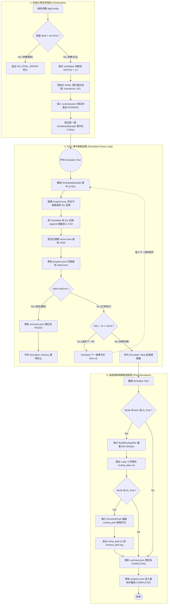

# Key Parameters Summary
## 執行模式
- `mode` : string -決定執行流程
 -  `verify_path`：只做簡單路徑驗證輸出
 -  `candidate_scan`：只做候選衛星掃描
 -  `isl_connectivity`：只輸出 ISL 連結資訊
 -  `plan`：候選衛星 + ISL + routing plan
 -  `d1_final`：plan 再加 verify 輸出

## 場景與輸出參數
| 參數               |     型別 | 預設值                              | 用途         |
| ---------------- | -----: | -------------------------------- | ---------- |
| `scenarioFolder` | string | `constellation-telesat-351-sats` | 指定星座場景     |
| `statsLevel`     | string | `min`                            | 控制輸出細節量，`min`/`full`:edge資訊多寡    |
| `outDir`         | string | `./outputs`                      | 輸出資料夾      |
| `pcapDir`        | string | `./pcap`                         | pcap 輸出資料夾 |
| `enablePcap`     |   bool | `true`                           | 是否輸出 pcap  |

## 時間控制參數
| 參數           |     型別 | 預設值     | 用途                  |
| ------------ | -----: | ------- | ------------------- |
| `simTime`    | double | `300.0` | 名義上的模擬時間            |
| `tStart`     | double | `0.0`   | 採樣開始時間              |
| `tEnd`       | double | `300.0` | 採樣結束時間              |
| `dt`         | double | `1.0`   | 採樣間隔                |
| `planWindow` | double | `60.0`  | routing plan 的時間窗長度 |

## 幾何 / 候選衛星篩選參數
| 參數        |     型別 | 預設值        | 用途     |
| --------- | -----: | ---------- | ------ |
| `refLat`  | double | `25.0330`  | 參考地點緯度 |
| `refLon`  | double | `121.5654` | 參考地點經度 |
| `elevDeg` | double | `20.0`     | 最低仰角門檻 |

`若 Elevation >= elevDeg → 才進一步檢查是否可經由 ISL 到達 GW anchor`

## ISL 與 Gateway 參數
| 參數                 |     型別 | 預設值      | 用途                     | 說明                   |
| ------------------ | -----: | -------- | ---------------------- |---------------------- |
| `islMaxDistanceKm` | double | `5000.0` | ISL 最長允許距離           |動態 adjacency 的過濾條件|
| `gwAnchorCount`    | uint32 | `3`      | 選幾顆衛星作為 gateway anchor |對指定 GW 挑最近的幾顆衛星當作可達終點集合 |
| `gwIndex`          | uint32 | `0`      | 使用第幾個 gateway          |選哪個 gateway node|

# 程式碼修改與優化亮點 (Modifications & Enhancements)
## Incremental I/O:防止崩潰導致資料遺失
[原]
```c++
// 在 Simulator::Run() 結束後，才統一將記憶體內的資料寫入檔案
if (state.doCandidate) {
    WriteCandidateCsv(JoinPath(cfg.outDir,"candidate_sats.csv"), state.candidates);
}
if (state.doIsl) {
    WriteIslCsv(JoinPath(cfg.outDir,"isl_connectivity.csv"), state.islRows);
    WritePrunedTopologyCsv(JoinPath(cfg.outDir,"topology_pruned.csv"), state.prunedEdges);
}
```
[改]
```c++
// 建立獨立的 Writer 類別/模組，在每個時間步 (ScheduledSample) 執行時：
// 使用 std::ofstream::app (Append 模式) 隨算隨寫
void WriteCandidateCsvAppend(const std::string& f, const std::vector<CandidateRow>& rows) {
    std::ofstream os(f, std::ios_base::app); // 使用 Append 模式
    // ... 寫入本回合的 rows
}

// 在 ScheduledSample 事件迴圈中呼叫：
writer.AppendCandidate(snap.candidateRows);
writer.AppendIsl(snap.islRows);
// 清空記憶體，避免 Out of Memory
snap.candidateRows.clear();
```

## 狀態追蹤與進度回報:實時的 progress.json 與 summary.json 狀態更新
[原]
```c++
// 只有在最後一步才會產出 summary.json
WriteSummaryJson(JoinPath(cfg.outDir,"summary.json"), cfg, generatedFiles, ResolveGwInfo(cfg), true);
std::cout << "[L1] done -> " << cfg.outDir << "\n";
```
[改]
```c++
// V6 初始化時先寫入 RUNNING 狀態
writer.WriteSummaryRunning(cfg);

// 在 ScheduledSample 的每個 step：
writer.UpdateProgress(state.stepCount, state.totalSteps, tSec, cfg.tEnd, ...);

// V6.1 模擬正常結束時，明確寫入 COMPLETED：
writer.WriteSummaryCompleted(cfg, generatedFiles, ResolveGwInfo(cfg));
writer.UpdateProgress("COMPLETED", state.stepCount, state.totalSteps, cfg.tEnd, cfg.tEnd, state.totalCandWritten, state.totalIslWritten);

// 若發生錯誤 (hasError)，則進入 FAILED 處理並安全中斷
if (state.hasError) {
    writer.WriteSummaryFailed(cfg, state.errorMsg);
    Simulator::Destroy();
}
```
## 時間上限強制規範 (Simulation Time Enforcement)
統一了時間參數的語意。simTime 成為 NS-3 模擬器的絕對生命週期，而 `tEnd` 則單純作為演算法採樣的停止點，避免模擬器在不該停止的時候提前中止，或永不停止。\
[原]
```c++
// 忽略了 cfg.simTime，強制使用 tEnd + 10.0
simHelper->SetSimulationTime(Seconds(cfg.tEnd + 10.0));
```
[改]
```c++
// 嚴格檢查 tEnd 是否超過設定的 simTime 物理上限
if (cfg.tEnd > cfg.simTime) {
    NS_FATAL_ERROR("tEnd (" << cfg.tEnd << ") cannot be strictly greater than simTime (" << cfg.simTime << ")");
}

// 確實以 simTime 加上 1 秒的緩衝作為模擬器天花板
simHelper->SetSimulationTime(Seconds(cfg.simTime + 1.0));
```

## Dynamic Verify Path
證明了 L1 算出來的最佳路徑（包含所有的 Hop 節點），在 NS-3 底層網路中確實是通的。\
[原]
```c++
void RunVerifyPath(const AppConfig& cfg) {
    // 寫死輸出的假資料
    std::ostringstream rd;
    rd << "verify_path\nsatA="<<cfg.satA<<" satB="<<cfg.satB<<'\n';
    WriteText(JoinPath(cfg.outDir,"route_dump.txt"),rd.str());
}
```
[改]
```c++
// 將算好的 planRows 傳入，動態生成驗證
if (cfg.mode == "d1_final" && !planRows.empty()) {
    RunVerifyPath(cfg, planRows);
    generatedFiles.push_back("verify_path.txt");
}

void RunVerifyPath(const AppConfig& cfg, const std::vector<PlanRow>& planRows) {
    // 走訪 planRows，提取真正的 fullPath (如 UT->SAT12->SAT45->GW0)
    // 並透過 NS-3 的封包追蹤 (Packet Trace / Ping) 進行實際連線測試
    // ...
}
```

# Flowchart

