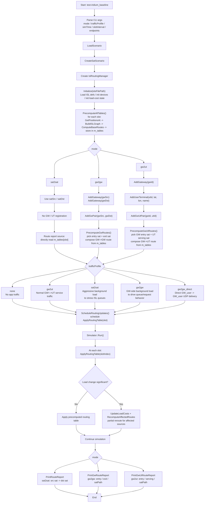
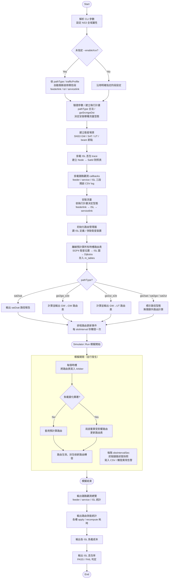

# Layer 1 — Topology & ISL Routing

## 目標

在 SNS3的 Iridium-66 星座場景中，實作基於 ISL 的路由系統。

核心目標：
- 利用 LEO 星座軌道可預測的特性，在模擬開始前先針對各時槽計算對應的 ISL 拓樸與最短路徑路由表，將原本執行期的全域路由計算轉移至離線階段
- 於模擬期間每隔 `TimeSlotInterval`秒觸發一次`ApplyRoutingTable(slotIndex)`，將對應時槽的預計算路由表寫入 Arbiter，以反映衛星位置變化所造成的 ISL 可用性與最短路徑變動。
- 在每次`ApplyRoutingTable()`執行時額外量測 ISL 佇列延遲，並以 EMA 更新每條鏈路的負載成本；當任一 ISL 方向的負載成本變化超過 `ChangeThreshold`，且距上次重算時間已超過`CooldownSeconds`時，系統只對受影響來源節點執行局部 Dijkstra 重算，而非重新計算整體網路路由表。
- `FtVisibilityFilter`，先離線計算各時槽中 FT 對衛星的可見性，再僅保留授權 FT pair 所對應的候選路徑，避免未授權 FT 間建立 transit route。

---

## 架構概覽

```
isls.txt
   │
   ▼
LoadISLDefs()          ← 讀入 132 條 ISL 定義，建立 satellite→ifIndex 對應，寫入 next hop 時的查表基礎
   │
   ▼
InitOrbiterDevices()   ← 快取 66 顆衛星的 Node / SatOrbiterNetDevice / Arbiter
   │
   ▼
PrecomputeAllTables()  ← 離線計算所有時槽的路由表（11 slots，0–600s）
   │  ├─ GetPositionsAt(τ_k)      → SGP4 查詢 66 顆衛星位置
   │  ├─ BuildISLGraph(pos)       → 過濾距離 > 5000km，建立帶 propagation_cost 的鄰接表
   │  ├─ ComputeBaseRoutes(graph) → 66sat × Dijkstra，每顆衛星計算 65 條路由
   │  └─ ApplyTiebreaker(routes, graphNext) → 有相同 cost 時，系統優先選擇在下一個時槽仍符合連線條件的 ISL，以降低跨時槽切換頻率並提升路由穩定性
   │
   ├─── [mode=sat2sat] ─────────→ PrintRouteReport()
   │                                 輸出每槽完整 path（full_path, route_cost）
   │
   ├─── [mode=gw2gw] ──────────→ PrecomputeGwRoutes()
   │                                 ├─ ComputeElevationDeg() → GW 可見衛星篩選（>5°）
   │                                 ├─ 列 entry × exit 組合，呼叫 GetRouteCost(entry,exit,slot)
   │                                 └─ PrintGwRouteReport() → 輸出 entry / ISL_path / exit / isl_cost
   │
   └─── [mode=gw2ut] ──────────→ PrecomputeGwUtRoutes()
                                     ├─ 複用或重算 GW 可見性（m_gwVisibility）
                                     ├─ ComputeElevationDeg() → UT 可見衛星篩選（>5°）
                                     ├─ 枚舉 entry × serving 組合，呼叫 GetRouteCost(entry,serving,slot)
                                     └─ PrintGwUtRouteReport() → 輸出 entry / ISL_path / serving / isl_cost

[test-iridium_baseline.cc 初始化段]
CreateSatScenario()
   │
   ▼
ConnectIslDropTrace()  ← 掛接所有 ISL PointToPointIslNetDevice 的 PacketDropRateTrace
   │                      回傳 connected 介面數（每條雙向 link = 2 介面，unique link 數 = 回傳值 / 2）
   │                      寫入 g_nodeToSatId（Ptr<Node> → satId 查找表）
   │                      寫入 g_islDropStats（key="satSrc-satDst"，逐封包累計 total / dropped）
   │
ScheduleRoutingUpdates() ← 排入 N 個 NS3 事件，每 slotInterval 秒觸發一次
   │
   ▼  (Simulator::Run 期間)
ApplyRoutingTable(slotIndex)
   │  ├─ UpdateLoadCosts()          → EMA 讀取 ISL queue delay，更新 load cost
   │  ├─ HasSignificantChange()     → 超過 changeThreshold 且冷卻期已過 → 觸發重算
   │  ├─ RecomputeAffectedRoutes()  → 只重算受影響 source 的路由（局部 Dijkstra）
   │  └─ ClearNextHopEntries() + AddNextHopEntry() → 將新的 next-hop 規則寫入各衛星的 Arbiter，作為實際轉送依據
   │
   ▼  (Simulator::Run 結束後)
PrintStats()      ← 輸出每槽的 apply / recompute 耗時
PrintLoadStats()  ← 輸出各 ISL 的最終 EMA load cost（queue delay，ms），驗證流量是否走過 ISL
   │
   ▼
PrintIslDropStats(threshPct, connectedInterfaces)
   ├─ g_islDropStats 為空 → [FAIL]（0 介面 or 流量未到達 ISL 層）
   ├─ 有丟棄的 ISL → 輸出明細表（ISL / total_pkts / dropped / drop_rate(%) / success_rate(%)）
   ├─ overall drop_rate < threshPct → [PASS]
   └─ overall drop_rate >= threshPct → [FAIL]
```

---

## 核心資料結構

### isl-graph.h 定義

| 結構 | 說明 |
|------|------|
| `ISLEdge` | `{nodeB, propagation_cost, islIfIndexOnA, islIfIndexOnB}`  一條有向 ISL 邊 |
| `ISLDef` | `{nodeA, nodeB}`  靜態 ISL 定義（從 isls.txt 讀入） |
| `RouteEntry` | `{destSatId, nextHopSatId, islIfIndexOnA, cost}`  一條路由表項目 |
| `ISLGraph` | `vector<vector<ISLEdge>>`  66 個節點的鄰接表 |
| `RoutingTable` | `vector<vector<RouteEntry>>`  66 顆衛星各自的路由表 |
| `SlotStats` | `{slotIndex, simTimeSec, applyWallMs, recomputeWallMs, recomputedSources, significantChange}`  每槽執行統計 |
| `GwDef` | `{gwId, latDeg, lonDeg, name}`  地面閘道器定義 |
| `GwToGwRoute` | `{srcGwId, dstGwId, entrySatId, exitSatId, satPath, islCost, valid}`  一條 GW→GW 路由結果 |
| `UtDef` | `{utId, latDeg, lonDeg, name}`  使用者終端定義 |
| `GwToUtRoute` | `{gwId, utId, entrySatId, servingSatId, satPath, islCost, valid}`  一條 GW→UT 路由結果 |

### test-iridium_baseline.cc 驗證輔助（anonymous namespace）

| 結構 / 全域變數 | 說明 |
|---|---|
| `IslDropStats` | `{total, dropped}` 單條 ISL 的傳送嘗試與丟棄封包計數 |
| `g_nodeToSatId` | `map<Ptr<Node>, uint32_t>` Node 指標 → 衛星序號查找表 |
| `g_islDropStats` | `map<string, IslDropStats>` key = `"satSrcId-satDstId"`，逐條 ISL 統計 |

---

## 類別：IslRoutingManager

**位置**：`contrib/satellite/helper/isl-graph.h/.cc`

### Attributes（NS3 Config 可設定）

| Attribute | 型別 | 預設值 | 說明 |
|-----------|------|--------|------|
| `NumSatellites` | uint32 | 66 | 星座衛星總數 |
| `NumTimeSlots` | uint32 | 10 | 預計算時槽數 |
| `TimeSlotInterval` | double | 60.0 | 每槽間隔秒數 |
| `IslMaxDistanceKm` | double | 5000.0 | ISL 啟用距離門檻（km） |
| `IslsFilePath` | string | "" | isls.txt 完整路徑 |
| `EmaAlpha` | double | 0.3 | EMA 新樣本權重 |
| `ChangeThreshold` | double | 0.1 | 觸發重算的 load cost 變化比例 |
| `CooldownSeconds` | double | 30.0 | 兩次重算的最短間隔（秒） |
| `IslLinkRateBps` | double | 10e6 | ISL 鏈路速率（用於計算 queue delay） |

### test-iridium_baseline.cc 命令列參數（cmd.AddValue）

> 檔案：`scratch/test-iridium_baseline.cc`

#### 核心路由 / 模擬參數

| 參數 | 型別 | 預設值 | 說明 |
|------|------|--------|------|
| `--mode` | string | `gw2gw` | 路由場景：`sat2sat` / `gw2gw` / `gw2ut` |
| `--trafficProfile` | string | `none` | 流量配置：`none` / `gw2ut` / `sat2sat` / `gw2gw` / `gw2gw_direct` |
| `--rbdcVerbose` | bool | false | 是否輸出每筆 RBDC request（91 UT × ~26ms 週期，大量 log） |
| `--islDropThreshPct` | double | 1.0 | ISL 整體丟棄率 PASS 門檻（%） |
| `--simTime` | double | 630.0 | 模擬時長（秒） |
| `--slotInterval` | double | 60.0 | 路由更新間隔（秒） |
| `--beamId` | uint32 | 1 | SNS3 啟用的 beam ID |
| `--islMaxDistKm` | double | 5000.0 | ISL 啟用距離門檻（km） |
| `--islRateMbps` | double | 10.0 | ISL 鏈路速率（Mbps） |
| `--emaAlpha` | double | 0.3 | EMA 新樣本權重 |
| `--changeThresh` | double | 0.1 | 觸發重算的 load cost 相對變化門檻 |
| `--cooldownRatio` | double | 0.5 | `CooldownSeconds = slotInterval × cooldownRatio` |
| `--elevMinDeg` | double | 5.0 | GW/UT 最低仰角門檻（度） |

#### 路由場景參數

| 參數 | 型別 | 預設值 | 說明 |
|------|------|--------|------|
| `--satSrc` | uint32 | 0 | sat2sat 模式：來源衛星 ID |
| `--satDst` | uint32 | 10 | sat2sat 模式：目標衛星 ID |
| `--gwSrc` | uint32 | 0 | gw2gw 模式：來源 GW preset ID（0=TW / 1=JP / 2=US） |
| `--gwDst` | uint32 | 1 | gw2gw 模式：目標 GW preset ID |
| `--gwId` | uint32 | 0 | gw2ut 模式：GW preset ID |
| `--utId` | uint32 | 0 | gw2ut 模式：UT ID |
| `--utLatDeg` / `--utLonDeg` | double | — | gw2ut 模式：UT 座標 |
| `--utName` | string | `UT-Taipei` | gw2ut 模式：UT 名稱 |

#### 流量配置微調參數（TrafficConfig）

| 參數 | 型別 | 預設值 | 說明 |
|------|------|--------|------|
| `--fwd` | bool | true | 是否安裝 FWD link（GW→UT）CBR 流量 |
| `--rtn` | bool | true | 是否安裝 RTN link（UT→GW）CBR 流量 |
| `--fwdIntervalMs` | uint32 | 100 | FWD CBR 封包間隔（ms） |
| `--rtnIntervalMs` | uint32 | 500 | RTN CBR 封包間隔（ms） |
| `--fwdPktBytes` | uint32 | 1500 | FWD 封包大小（bytes） |
| `--rtnPktBytes` | uint32 | 512 | RTN 封包大小（bytes） |
| `--trafficStart` | double | 1.0 | 流量開始時間（s） |
| `--trafficStop` | double | 0.0 | 流量結束時間（s），0 = simTime - 1 |

**GW Preset 對照（gwSrc / gwDst / gwId）：**

| ID | 名稱 | 緯度 | 經度 |
|----|------|------|------|
| 0 | TW-Taipei | 25.0°N | 121.5°E |
| 1 | JP-Tokyo | 35.7°N | 139.7°E |
| 2 | US-SanFrancisco | 37.8°N | 122.4°W |

### 初始化順序

```cpp
Ptr<IslRoutingManager> mgr = CreateObject<IslRoutingManager>();
mgr->SetAttribute("NumSatellites",    UintegerValue(66));
mgr->SetAttribute("NumTimeSlots",     UintegerValue(numSlots));
mgr->SetAttribute("TimeSlotInterval", DoubleValue(slotInterval));
mgr->SetAttribute("IslMaxDistanceKm", DoubleValue(5000.0));
mgr->SetAttribute("IslsFilePath",     StringValue(islsFilePath));
mgr->SetAttribute("EmaAlpha",         DoubleValue(0.3));
mgr->SetAttribute("ChangeThreshold",  DoubleValue(0.1));
mgr->SetAttribute("CooldownSeconds",  DoubleValue(slotInterval / 2.0));
mgr->SetAttribute("IslLinkRateBps",   DoubleValue(10.0e6));

// 必須在 CreateSatScenario() 之後才能呼叫
mgr->Initialize(islsFilePath);
mgr->PrecomputeAllTables();
mgr->ScheduleRoutingUpdates();
// 接著執行 simHelper->RunSimulation()
```

### 公開方法

#### 核心 Lifecycle

| 方法 |  說明 |
|------|------|
| `Initialize(islsFilePath)` |  讀 ISL 定義、快取衛星裝置、初始化 load cost 陣列 |
| `PrecomputeAllTables()` |  離線計算所有時槽路由表，存入 `m_tables` |
| `ScheduleRoutingUpdates()` |  排入 N 個 NS3 排程事件 |
| `ApplyRoutingTable(slotIndex)` |  更新 Arbiter（含負載感知重算邏輯） |

#### 統計輸出

| 方法 |  說明 |
|------|------|
| `PrintStats()` |  輸出各槽 apply / recompute 執行時間統計 |
| `PrintLoadStats()` |  輸出各 ISL 最終 EMA load cost（queue delay，ms）；有流量時非零，可驗證流量是否走過 ISL |
| `PrintRouteReport(pairs)` |  輸出 sat2sat 每槽完整路徑報告 |

#### 路由查詢 / 診斷

| 方法 |  說明 |
|------|------|
| `GetRouteCost(entry, exit, slot)` | 取得兩衛星間在指定時槽的路由 cost（供 GW/UT 路由呼叫） |
| `TracePath(src, dst, slot)` | 依 routing table 重建 src→dst 完整跳數序列；目的不可達時最後元素為 `UINT32_MAX` |
| `BlockISL(a, b)` / `UnblockISL(a, b)` | 暫時標記 ISL 為不可用（供 `RunAvoidanceTest` 使用） |
| `RunAvoidanceTest(src, dst, slot)` | 封鎖路徑第一條 ISL，離線重算，驗證 (a) 封鎖 ISL 不出現於新路徑，(b) 無殘留舊 next-hop |


---


## 動態路由（負載感知）

每次 `ApplyRoutingTable()` 被觸發時（slot > 0）：

1. **`UpdateLoadCosts()`**：路由更新時讀取各 ISL 佇列狀態，並依據`IslLinkRateBps`將佇列長度換算為 queue delay，再作為該 ISL 的動態 load cost。，以 EMA 平滑更新 `m_loadCosts[a*N+b]`

2. **`HasSignificantChange()`**：比對 `m_loadCosts` 與 `m_prevLoadCosts`，任一 ISL 方向的 load cost 相較前一輪紀錄之變化幅度超過`ChangeThreshold = 0.1`，且距離上一次重算已超過 `CooldownSeconds = 30 s`，系統即判定當前負載變動具有重算必要性。

3. **`RecomputeAffectedRoutes()`**：
   - 觸發重算，系統先定位負載變化超過門檻的 ISL 邊，將其視為本輪路由品質變動的直接來源
   - 透過 `m_islSources[edgeIdx]`（哪些 source 的路由經過此邊）找出受影響的 source 集合
   - 對這些 source 重跑 Dijkstra（使用 `BuildISLGraphWithLoad`，cost = propagation + load）
   - 更新 `m_tables[slotIndex]` 中對應的路由

4. **`RebuildIslSources()`**：根據最新路由表，重建 `m_islSources`（每條 ISL 邊被哪些 source 使用）

---

## 流量配置（test-iridium_baseline.cc）

### TrafficProfile 枚舉

| 值 | 說明 | 流量裝法 |
|----|------|---------|
| `none` | 不裝流量，只觀察路由 | 無 |
| `gw2ut` | 正常 GW↔UT 業務流（service path 驗證） | `SatTrafficHelper` CBR GW↔UT |
| `sat2sat` | 強背景流量製造 ISL queue 壓力 | `SatTrafficHelper` CBR GW→all UT |
| `gw2gw` | GW 端背景流量驅動 queue/capacity-request 行為 | `SatTrafficHelper` CBR 兩端 GW↔UT |
| `gw2gw_direct` | 真實 GW_user→GW_user 端到端資料平面驗證 | `OnOffHelper`+`PacketSinkHelper` UDP GW→GW |

> 注意：`sat2sat`/`gw2gw` 使用 `SatTrafficHelper`（衛星專用，不能直接做 GW↔GW），流量的目的是製造 ISL queue load 或 capacity request，不是真正的 sat2sat / gw2gw 端到端傳輸。

### TrafficConfig 結構

```cpp
struct TrafficConfig {
    bool     enableFwd{true};      // 是否安裝 FWD link (GW→UT) 流量
    bool     enableRtn{true};      // 是否安裝 RTN link (UT→GW) 流量
    uint32_t fwdIntervalMs{100};   // FWD CBR 封包間隔（毫秒）
    uint32_t rtnIntervalMs{500};   // RTN CBR 封包間隔（毫秒）
    uint32_t fwdPktBytes{1500};    // FWD 封包大小（bytes）
    uint32_t rtnPktBytes{512};     // RTN 封包大小（bytes）
    double   startSec{1.0};        // 流量開始時間（s）
    double   stopSec{0.0};         // 流量結束時間（0 = simTime - 1）
};
```

### Rate Based Dynamic Capacity(RBDC) Trace 觀察

**觀察點**：`/NodeList/*/DeviceList/*/SatLlc/SatRequestManager/RbdcTrace`

**callback 簽名**：`void(uint32_t requestKbps)`（`ConnectWithoutContext`）

**行為**：`requestKbps > 0` 時輸出 `[RBDC] t=<sec>s request=<kbps> kbps`；`requestKbps == 0`（佇列空）過濾不輸出。

**觸發機制**：`SatRequestManager::DoRbdcLegacy()` 在每個超幀週期（~26ms）依 `SatQueue::QueueStats_t` 計算需求速率後觸發。

---

## ISL 驗證機制（test-iridium_baseline.cc）

以下驗證邏輯定義於 test-iridium_baseline.cc 的 anonymous namespace，**不屬於 IslRoutingManager**，而是測試腳本層的驗證機制。

### ConnectIslDropTrace()

**作用**：在 `CreateSatScenario()` 之後掛接所有 ISL 裝置的 `PacketDropRateTrace`。

**實作流程**：
1. 取得所有衛星 Node（`SatTopology::GetOrbiterNodes()`）
2. 建立 `g_nodeToSatId`（`Ptr<Node>` → satId）查找表
3. 遍歷每顆衛星的 `SatOrbiterNetDevice`，取得其 `GetIslsNetDevices()` 清單
4. 對每個 `PointToPointIslNetDevice` 呼叫 `TraceConnectWithoutContext("PacketDropRateTrace", ...)`
5. 回傳成功掛接的介面數（每條雙向 link = 2 介面，unique link 數 = 回傳值 / 2）

**輸出範例**：
```
[ISL_DROP] trace connected: 264 ISL interfaces (132 unique links)
```

### IslPacketDropCallback()

**callback 觸發時機**：每次 `PointToPointIslNetDevice` 嘗試入列封包時（包含成功與丟棄兩種結果）。

**callback 簽名**：`void(uint32_t pktSize, Ptr<Node> srcNode, Ptr<Node> dstNode, bool dropped)`

**行為**：根據 `g_nodeToSatId` 找出 satSrcId / satDstId，以 `"srcId-dstId"` 為 key 累計 `g_islDropStats` 的 `total` 與 `dropped`。

> 注意：`dropped=false` 表示成功入列；`dropped=true` 表示佇列滿導致丟棄。此 trace 計的是「入列嘗試」，不是「端到端送達」。

### PrintIslDropStats(threshPct, connectedInterfaces)

**判斷邏輯**：

| 條件 | 輸出 |
|------|------|
| `g_islDropStats` 為空 且 `connectedInterfaces == 0` | `[FAIL] trace connection failed` |
| `g_islDropStats` 為空 且 `connectedInterfaces > 0` | `[FAIL] X interfaces connected but 0 events recorded` |
| 有丟棄的 ISL | 輸出明細表（ISL / total_pkts / dropped / drop_rate(%) / success_rate(%)） |
| `overall_drop < threshPct` | `[PASS]` |
| `overall_drop >= threshPct` | `[FAIL]` |

**TOTAL 行格式**：
```
TOTAL: N pkts, M dropped | drop_rate=X.XXX% | success_rate=Y.YYY%
```

---

## SNS3 原始碼修改

| 檔案 | 位置 | 修改內容 |
|------|------|----------|
| `satellite-sgp4-mobility-model.h/.cc` | `contrib/satellite/model/` | 新增 `GetGeoPositionAt(Time t)` 介面，以支援與模擬時鐘解耦的軌道位置查詢 |
| `satellite-isl-arbiter-unicast.h` | `contrib/satellite/model/` | 新增 `ClearNextHopEntries()` 直接於既有 Arbiter 上覆寫 next-hop 規則 |

---

## SNS3 原生模組與 TriScale-LEO 自訂模組比對

以下表格依功能維度，逐一對照 SNS3 原生 ISL 相關模組與本專案自訂/擴充模組的差異。

### 模組對照總覽

| 功能維度 | SNS3 原生模組 | 檔案位置 | TriScale-LEO 自訂模組 | 檔案位置 |
|---------|-------------|---------|---------------------|---------|
| 路由表儲存與查詢 | `SatIslArbiterUnicast` | `contrib/satellite/model/satellite-isl-arbiter-unicast.h/.cc` | `IslRoutingManager`（寫入端）| `contrib/satellite/helper/isl-graph.h/.cc` |
| 衛星位置查詢 | `SatSgp4MobilityModel` | `contrib/satellite/model/satellite-sgp4-mobility-model.h/.cc` | 同左（已加入 `GetGeoPositionAt`）| 同左（原生 + patch）|
| ISL 拓樸建構 | 無（未提供圖形化 ISL 鄰接表） | — | `BuildISLGraph()` / `BuildISLGraphWithLoad()` | `isl-graph.cc` |
| 路徑計算演算法 | 無（SNS3 不內建最短路徑演算法）| — | `ComputeRoutesForSrc()`（Dijkstra per src）| `isl-graph.cc` |
| 路由更新觸發 | 無（需手動呼叫 Arbiter）| — | `ScheduleRoutingUpdates()` → `ApplyRoutingTable()` | `isl-graph.cc` |
| 動態負載感知 | 無 | — | `UpdateLoadCosts()` + EMA + `HasSignificantChange()` + `RecomputeAffectedRoutes()` | `isl-graph.cc` |
| 地面站可見性 | 無 | — | `PrecomputeGwRoutes()` / `PrecomputeGwUtRoutes()`（仰角門檻篩選）| `isl-graph.cc` |
| FT 合約路由過濾 | 無 | — | `FtVisibilityFilter::PrecomputeVisibility()` + `GetBestTransit()` | `ft-filter.h/.cc` |
| 星座拓樸管理 | `SatTopology` | `contrib/satellite/model/satellite-topology.h/.cc` | 直接讀取（不覆寫）| — |
| ISL 介面管理 | `SatOrbiterNetDevice` | `contrib/satellite/model/satellite-orbiter-net-device.h/.cc` | 直接讀取 queue 狀態（不覆寫）| — |

---

### 功能差異細節

| 功能面向 | SNS3 原生行為 | TriScale-LEO 擴充內容 | 說明 |
|---------|-------------|---------------------|------|
| **Arbiter 寫入** | `AddNextHopEntry(dst, ifIdx)` 只能逐條新增 | 新增 `ClearNextHopEntries()` 先清空再批次寫入 | 避免跨 slot 殘留舊 next-hop 規則 |
| **衛星位置** | `GetPosition()` 只回傳模擬當下時刻位置（與 `Simulator::Now()` 綁定）| 新增 `GetGeoPositionAt(Time t)` 可查詢任意時刻位置 | 支援 `PrecomputeAllTables()` 在模擬開始前離線計算各時槽位置 |
| **ISL 圖建構** | 無：SNS3 不自動建立帶距離權重的鄰接表 | `BuildISLGraph(pos)`：以 5000 km 門檻過濾後建立帶 `propagation_cost` 的鄰接表 | 結合 SGP4 位置與 `isls.txt` ISL 定義動態建圖 |
| **路由計算** | 無：SNS3 不提供全星座 Dijkstra | `ComputeBaseRoutes(graph)`：66×Dijkstra，產生 `RoutingTable` | 離線批次計算所有 src→dst 最短路徑 |
| **Tiebreaker** | 無：cost 相同時無優先策略 | `ApplyTiebreaker(routes, graphNext)`：cost 相同時優先選下一 slot 仍連通的 ISL | 降低跨時槽路徑切換頻率，提升路由穩定性 |
| **動態路由** | 無：路由表需手動全量覆寫 | EMA load cost + `HasSignificantChange()` + `RecomputeAffectedRoutes()`：局部 Dijkstra | 僅對受影響 source 重算，降低運算開銷 |
| **GW/UT 可見性** | 無 | `ComputeElevationDeg()` + 仰角門檻（預設 5°）+ 逐 slot 篩選可見衛星 | 同一方法供 GW 端與 UT 端共用 |
| **端到端路由** | 無 | `PrecomputeGwRoutes()` / `PrecomputeGwUtRoutes()`：枚舉 entry×exit 組合，選最低 ISL cost | 輸出 `GwToGwRoute` / `GwToUtRoute`，含完整 sat path |
| **FT 合約過濾** | 無 | `FtVisibilityFilter`：只允許 contracted pair 建立 transit route | 防止未授權 FT pair 借道星座路由 |

---

## IslRoutingManager 函式層級原生 / 自訂對照

本節逐函式列出 `IslRoutingManager` 中哪些操作直接呼叫 SNS-3 原生 API、哪些是完全自行實作，並標注呼叫的原生型別與方法。

### 圖例

| 符號 | 意義 |
|------|------|
| **[原生]** | 直接呼叫 SNS-3 或 NS-3 core 原生 API，未修改其行為 |
| **[Patch]** | 在原生 SNS-3 檔案中新增的方法（需修改 contrib/satellite） |
| **[自訂]** | 完全自行實作，SNS-3 中無對應功能 |

---

### `GetTypeId()` — TypeId 註冊

| 操作 | 來源 | 說明 |
|------|------|------|
| `TypeId(...).SetParent<Object>()` | **[原生]** NS-3 Object system | IslRoutingManager 繼承 `ns3::Object`，使用 NS-3 標準 TypeId 系統 |
| `.AddConstructor<IslRoutingManager>()` | **[原生]** NS-3 Object system | 標準 factory 方法 |
| `.AddAttribute("NumSatellites", ..., MakeUintegerAccessor(...), ...)` × 9 | **[原生]** NS-3 Attribute system | 所有 Attribute 宣告均使用原生 `UintegerValue` / `DoubleValue` / `StringValue` accessor |

---

### `Initialize()` — 初始化入口

| 操作 | 來源 | 說明 |
|------|------|------|
| `LoadISLDefs(islsFilePath)` | **[自訂]** | 讀 isls.txt，建立 `m_islDefs` / `m_perSatISLOrder` / `m_edgeOfPair`；完全自行實作 |
| `InitOrbiterDevices()` | 混合（見下節） | 使用原生 API 取得裝置，但快取邏輯為自訂 |
| `m_loadCosts.assign(...)` / `m_islSources.assign(...)` | **[自訂]** | 動態負載追蹤陣列初始化，SNS-3 中無此機制 |

---

### `LoadISLDefs()` — 讀取 ISL 定義檔

| 操作 | 來源 | 說明 |
|------|------|------|
| `std::ifstream file(islsFilePath)` | **[自訂]** 標準 C++ | 直接讀檔，不使用 NS-3 API |
| `NS_ASSERT_MSG(file.is_open(), ...)` | **[原生]** NS-3 core macro | 防呆斷言 |
| `NS_FATAL_ERROR(...)` | **[原生]** NS-3 core macro | 衛星 ID 超界時 fatal |
| `m_perSatISLOrder[a][edgeIdx] = counter[a]++` | **[自訂]** | 建立 sat → ISL interface index 的對應表，SNS-3 原生無此結構 |
| `m_edgeOfPair[{a,b}] = edgeIdx` | **[自訂]** | 建立 (satA, satB) → edgeIdx 的反查表 |

> 整體：**完全自訂**。SNS-3 有 `SatConf::LoadIsls()` 但只回傳 pair list，不建立 ifIndex 對應，故不能替代。

---

### `InitOrbiterDevices()` — 快取衛星裝置

| 操作 | 來源 | 說明 |
|------|------|------|
| `Singleton<SatTopology>::Get()->GetOrbiterNode(i)` | **[原生]** `satellite-topology.h` | 取得第 i 顆衛星的 `Ptr<Node>` |
| `DynamicCast<SatOrbiterNetDevice>(sat->GetDevice(d))` | **[原生]** `satellite-orbiter-net-device.h` | 從 Node 上找出 SatOrbiterNetDevice |
| `CreateObject<SatIslArbiterUnicast>(sat)` | **[原生]** `satellite-isl-arbiter-unicast.h` | 為每顆衛星建立一個空白 Arbiter 物件 |
| `m_orbDevs[i]` / `m_orbNodes[i]` / `m_arbiters[i]` 快取 | **[自訂]** | 本專案自建的快取陣列，原生無此集中管理機制 |

---

### `GetPositionsAt(tau)` — 查詢任意時刻衛星位置

| 操作 | 來源 | 說明 |
|------|------|------|
| `m_orbNodes[i]->GetObject<SatSGP4MobilityModel>()` | **[原生]** NS-3 Object aggregation | 取出掛在 Node 上的 SGP4 mobility 物件 |
| `mob->GetGeoPositionAt(tau)` | **[Patch]** `satellite-sgp4-mobility-model.h/.cc` | **原生不存在**。原生只有 `GetPosition()` 綁定 `Simulator::Now()`；此方法為本專案新增，允許查詢任意 `Time t` 的 ECEF 座標 |
| `.ToVector()` | **[原生]** NS-3 GeoCoordinate | 轉換為 `ns3::Vector`（ECEF 形式） |

---

### `BuildISLGraph(pos)` — 建立 ISL 鄰接表

| 操作 | 來源 | 說明 |
|------|------|------|
| 距離計算 `sqrt(dx²+dy²+dz²)` | **[自訂]** 標準 C++ `<cmath>` | 由 ECEF 座標算歐氏距離 |
| `dist > m_islMaxDistanceKm * 1e3` 過濾 | **[自訂]** | ISL 距離門檻過濾，SNS-3 無此邏輯 |
| `m_blockedEdges.count({a,b})` | **[自訂]** | 封鎖邊機制（供 avoidance test），SNS-3 無此 |
| `propCost = dist / C` | **[自訂]** | 傳播延遲換算（dist/光速），SNS-3 不計算此值 |
| `m_perSatISLOrder[a].at(edgeIdx)` | **[自訂]** | 查自建的 ifIndex 對應表 |
| `graph[a].push_back({b, propCost, ifIdxOnA, ifIdxOnB})` | **[自訂]** | 建立有向帶權鄰接表 `ISLGraph`，SNS-3 無此結構 |

> 整體：**完全自訂**。SNS-3 的 `InstallIsls()` 建立的是 p2p 網路裝置，不建立圖形化鄰接表。

---

### `BuildISLGraphWithLoad(pos)` — 含負載的 ISL 鄰接表

| 操作 | 來源 | 說明 |
|------|------|------|
| 同 `BuildISLGraph` 的所有操作 | **[自訂]** | 繼承同樣的自訂邏輯 |
| `m_loadCosts[a*N+b]` | **[自訂]** | 讀取 EMA 負載成本，加入 `propagation_cost + load` | 
| `graph[a].push_back({b, propCost + loadAb, ...})` | **[自訂]** | 建立 load-aware 邊權，SNS-3 完全無此 |

---

### `ComputeRoutesForSrc(src, graph)` — 單源 Dijkstra

| 操作 | 來源 | 說明 |
|------|------|------|
| `std::priority_queue<P, ..., std::greater<P>>` | **[自訂]** 標準 C++ STL | Min-heap 優先佇列 |
| `dist[src] = 0.0` / `dist[v] = INF` 初始化 | **[自訂]** | 標準 Dijkstra 初始化 |
| `firstHopNode[e.nodeB]` / `firstHopIf[e.nodeB]` 追蹤 | **[自訂]** | 記錄「從 src 出發的第一跳節點與介面」，SNS-3 完全無此 |
| `entries.push_back({dest, firstHopNode[dest], firstHopIf[dest], dist[dest]})` | **[自訂]** | 生成 `RouteEntry` 清單 |

> 整體：**完全自訂**。SNS-3 原生使用 Floyd-Warshall 且無 metric，此 Dijkstra 實作為全新設計。

---

### `ComputeBaseRoutes(graph)` — 全星座路由表計算

| 操作 | 來源 | 說明 |
|------|------|------|
| `for src in 0..N: ComputeRoutesForSrc(src, graph)` | **[自訂]** | 66 顆衛星各跑一次 Dijkstra，SNS-3 無此 batch 機制 |

---

### `ApplyRoutingTable(slotIndex)` — 寫入 Arbiter

| 操作 | 來源 | 說明 |
|------|------|------|
| `UpdateLoadCosts()` | **[自訂]** | 呼叫自訂 EMA 更新函式 |
| `HasSignificantChange()` | **[自訂]** | 呼叫自訂變化偵測函式 |
| `RecomputeAffectedRoutes(slotIndex)` | **[自訂]** | 呼叫自訂局部重算函式 |
| `m_arbiters[satId]->ClearNextHopEntries()` | **[Patch]** `satellite-isl-arbiter-unicast.h` | **原生不存在**。原生只能逐條新增，此方法為本專案新增以支援跨 slot 清空覆寫 |
| `m_arbiters[satId]->AddNextHopEntry(entry.destSatId, entry.islIfIndexOnA)` | **[原生]** `satellite-isl-arbiter-unicast.h` | 原生 API，將 (destNodeId → ifIndex) 寫入 Arbiter lookup table |
| `m_orbDevs[satId]->SetArbiter(m_arbiters[satId])` | **[原生]** `satellite-orbiter-net-device.h` | 將 Arbiter 綁定到 SatOrbiterNetDevice，使後續封包轉送生效 |
| `RebuildIslSources(slotIndex)` | **[自訂]** | 重建 edge → source 反查表 |
| `Simulator::Now()` | **[原生]** NS-3 core | 取得目前模擬時間 |

---

### `ScheduleRoutingUpdates()` — 排入 NS-3 事件

| 操作 | 來源 | 說明 |
|------|------|------|
| `Simulator::Schedule(t, &IslRoutingManager::ApplyRoutingTable, this, k)` | **[原生]** NS-3 core Simulator | 使用原生事件排程器，觸發時機由 NS-3 決定 |
| 整體 for-loop 邏輯（哪些時刻要觸發、觸發哪個函式） | **[自訂]** | 排程策略自行設計，SNS-3 原生無 slot-based routing update 機制 |

---

### `UpdateLoadCosts()` — EMA 負載更新

| 操作 | 來源 | 說明 |
|------|------|------|
| `GetLinkQueueDelay(a, ifA)` → 內部呼叫↓ | **[自訂]** 呼叫點 | 呼叫自訂函式 |
| `m_orbDevs[satId]->GetIslsNetDevices()` | **[原生]** `satellite-orbiter-net-device.h` | 取得該衛星所有 ISL 裝置清單 |
| `islDevs[ifIdx]->GetQueue()` | **[原生]** `point-to-point-isl-net-device.h` | 取得 DropTailQueue 指標 |
| `q->GetNBytes()` | **[原生]** NS-3 `DropTailQueue<Packet>` | 取得佇列目前持有的 byte 數 |
| `bits / m_islLinkRateBps` 換算 queue delay | **[自訂]** | 將佇列 bytes 換算為延遲秒數，SNS-3 無此換算 |
| `m_emaAlpha * sample + (1-alpha) * prev` EMA 平滑 | **[自訂]** | EMA 演算法，SNS-3 完全無此 |

---

### `HasSignificantChange()` — 負載變化偵測

| 操作 | 來源 | 說明 |
|------|------|------|
| `Simulator::Now() - m_lastRecomputeTime` 冷卻判斷 | **[原生]** NS-3 Time 運算 | 使用 NS-3 Time 型別做差值 |
| `abs(curr-prev)/max(prev,curr) > m_changeThreshold` | **[自訂]** | 相對變化量計算，SNS-3 完全無此邏輯 |

> 整體：**完全自訂**。

---

### `RecomputeAffectedRoutes(slotIndex)` — 局部重算

| 操作 | 來源 | 說明 |
|------|------|------|
| `GetPositionsAt(Simulator::Now())` | 混合（Patch + 原生） | 用 `Simulator::Now()` 查即時衛星位置 |
| `BuildISLGraphWithLoad(pos)` | **[自訂]** | 建立 load-aware 圖 |
| `m_islSources[edgeIdx]` 定位受影響 source | **[自訂]** | 使用自建反查表找受影響衛星 |
| `ComputeRoutesForSrc(src, graph)` | **[自訂]** | 局部 Dijkstra |
| `RefreshGwRoutesForSlot(slotIndex)` | **[自訂]** | 同步更新 GW/UT 路由報表 |
| `m_lastRecomputeTime = now` | **[原生]** NS-3 Time | 記錄最後重算時刻 |

> 整體：**完全自訂**。

---

### `PrecomputeGwRoutes()` / `PrecomputeGwUtRoutes()` — GW / UT 端到端路由

| 操作 | 來源 | 說明 |
|------|------|------|
| `ComputeElevationDeg(obsLat, obsLon, satEcef)` | **[自訂]** | 計算觀測點對衛星的仰角（°），SNS-3 無此函式 |
| 仰角門檻篩選（`> m_gwElevThreshDeg`） | **[自訂]** | GW/UT 可見衛星集合計算，SNS-3 無此 |
| `GetRouteCost(entry, exit, slot)` | **[自訂]** | 查 `m_tables[slot]` 取路由 cost |
| `TracePath(entry, exit, slot)` | **[自訂]** | 重建完整衛星跳序列 |
| `m_gwRoutes[slot][{srcGw,dstGw}] = route` | **[自訂]** | 儲存 GwToGwRoute 結果，SNS-3 完全無 E2E 路由結構 |

> 整體：**完全自訂**。SNS-3 無 GW/UT 可見性與 E2E 路由計算。

---

### 原生 API 使用彙總

| SNS-3 / NS-3 原生型別 | 使用的方法 | 使用位置 | 狀態 |
|---|---|---|---|
| `SatTopology` | `GetOrbiterNode(i)` | `InitOrbiterDevices()` | **[原生]** |
| `SatOrbiterNetDevice` | `GetDevice(d)` DynamicCast | `InitOrbiterDevices()` | **[原生]** |
| `SatOrbiterNetDevice` | `GetIslsNetDevices()` | `GetLinkQueueDelay()` | **[原生]** |
| `SatOrbiterNetDevice` | `SetArbiter(arbiter)` | `ApplyRoutingTable()` | **[原生]** |
| `SatIslArbiterUnicast` | `CreateObject<>(sat)` 建立 | `InitOrbiterDevices()` | **[原生]** |
| `SatIslArbiterUnicast` | `AddNextHopEntry(dst, ifIdx)` | `ApplyRoutingTable()` | **[原生]** |
| `SatIslArbiterUnicast` | `ClearNextHopEntries()` | `ApplyRoutingTable()` | **[Patch]** 本專案新增 |
| `SatSGP4MobilityModel` | `GetObject<>()` 取出 | `GetPositionsAt()` | **[原生]** |
| `SatSGP4MobilityModel` | `GetGeoPositionAt(Time t)` | `GetPositionsAt()` | **[Patch]** 本專案新增 |
| `PointToPointIslNetDevice` | `GetQueue()` | `GetLinkQueueDelay()` | **[原生]** |
| `DropTailQueue<Packet>` | `GetNBytes()` | `GetLinkQueueDelay()` | **[原生]** |
| `Simulator` | `Schedule(t, cb, ...)` | `ScheduleRoutingUpdates()` | **[原生]** |
| `Simulator` | `Now()` | `ApplyRoutingTable()`, `HasSignificantChange()`, `RecomputeAffectedRoutes()` | **[原生]** |
| NS-3 Object system | `Object`, `TypeId`, `GetTypeId()`, `AddAttribute()` | class 定義 | **[原生]** |
| NS-3 core macro | `NS_ASSERT_MSG`, `NS_FATAL_ERROR` | 多處防呆 | **[原生]** |

---

### 完全自訂（SNS-3 無對應）清單

| 功能 / 函式 | 說明 |
|---|---|
| `LoadISLDefs()` | 讀 isls.txt 並建立 `m_perSatISLOrder`、`m_edgeOfPair` 兩張反查表 |
| `ISLGraph`、`ISLEdge`、`RouteEntry`、`RoutingTable` 資料結構 | 整套圖論資料結構，SNS-3 無 |
| `GwDef`、`GwToGwRoute`、`UtDef`、`GwToUtRoute` 資料結構 | E2E 路由結果結構，SNS-3 無 |
| `SlotStats` 資料結構 | 每槽執行統計，SNS-3 無 |
| `BuildISLGraph()` | 帶 propagation_cost + 距離門檻過濾的鄰接表建構 |
| `BuildISLGraphWithLoad()` | load-aware 鄰接表（加入 EMA load cost） |
| `ComputeRoutesForSrc()` | 帶 first-hop 記錄的 Dijkstra |
| `ComputeBaseRoutes()` | 66×Dijkstra 批次計算 |
| `ApplyTiebreaker()` | 等成本路徑的跨時槽穩定性 tiebreaker（目前 dead code） |
| `UpdateLoadCosts()` | 佇列 byte → delay 換算 + EMA 平滑 |
| `HasSignificantChange()` | 相對變化量 + 冷卻期判斷 |
| `RecomputeAffectedRoutes()` | 局部 Dijkstra，僅對受影響 source 重算 |
| `RebuildIslSources()` | edge → source 反查表，支援局部重算定位 |
| `GetLinkQueueDelay()` | 將 ISL 佇列 bytes 換算為 queue delay（秒） |
| `PrecomputeGwRoutes()` | GW-to-GW E2E 路由，含可見性篩選與最低 cost 枚舉 |
| `PrecomputeGwUtRoutes()` | GW-to-UT E2E 路由，含 UT 可見性篩選 |
| `ComputeElevationDeg()` | 觀測點→衛星仰角計算（ECEF 轉換） |
| `RefreshGwRoutesForSlot()` | 局部重算後同步 GW/UT 路由報表 |
| `BlockISL()` / `UnblockISL()` | 封鎖邊機制（avoidance test） |
| `RunAvoidanceTest()` | 驗證繞路行為的測試函式 |
| `TracePath()` | 依 routing table 重建完整跳序列 |
| `PrintStats()` / `PrintLoadStats()` / `PrintRouteReport()` / `PrintGwRouteReport()` / `PrintGwUtRouteReport()` | 所有輸出報表函式 |

---

## CMakeLists.txt 修改

**位置**：`contrib/satellite/CMakeLists.txt`

在 `source_files` 新增：
```cmake
helper/isl-graph.cc
helper/ft-filter.cc
```

在 `header_files` 新增：
```cmake
helper/isl-graph.h
helper/ft-filter.h
```

---


## 已知問題

### Beam Scheduler 開銷（DEC-004）

**現象**：simTime=630s 的模擬 wall time 約 2760s（2760/630 ≈4.38）

**原因**：SNS3 DVB MAC beam scheduler 持續產生排程事件（66 顆衛星 × forward+return × superframe 250ms），即使沒有使用者流量也會產生大量事件。

**現況**：`PrecomputeAllTables` 僅 2ms，瓶頸在 `Simulator::Run`。


---

## 設計決策參考

| 決策 | 文件 |
|------|------|
| Arbiter 機制取代 IP 層路由 | `Decisions/01_Arbiter mechanism replaces IP layer routing.md` |
| ISL 距離門檻設為 5000 km | `Decisions/02_ISL Distance Threshold.md` |
| Arbiter 預先建立（非排程內建立） | `Decisions/03_Arbiter lifecycle management.md` |
| Beam Scheduler 開銷根本原因 | `Decisions/04_Beam Scheduler.md` |

---

## 驗證基準（實際執行輸出）

配置：`simTime=630s, slotInterval=60s, numSlots=11`（slots 0–10，對應 t=0–600s）

---

### mode=sat2sat（SAT0→SAT33）

```
./ns3 run "scratch/test-iridium_baseline --mode=sat2sat --satSrc=0 --satDst=33"
```

| slot | time(s) | full_path | route_cost |
|------|---------|-----------|------------|
| 0 | 0 | `0->1->2->57->46->35->34->33` | 0.078176 |
| 1 | 60 | `0->1->2->57->46->35->34->33` | 0.074919 |
| 2 | 120 | `0->1->2->57->46->35->34->33` | 0.072055 |
| 3 | 180 | `0->1->2->57->46->35->34->33` | 0.069849 |
| 4 | 240 | `0->1->2->57->46->35->34->33` | 0.068654 |
| 5 | 300 | `0->1->56->45->34->33` **← PATH CHANGED** | 0.065518 |
| 6 | 360 | `0->1->56->45->34->33` | 0.061945 |
| 7 | 420 | `0->1->56->45->34->33` | 0.058345 |
| 8 | 480 | `0->1->56->45->34->33` | 0.054778 |
| 9 | 540 | `0->1->56->45->34->33` | 0.051327 |
| 10 | 600 | `0->1->56->45->34->33` | 0.048115 |

Wall time: 2722.79s

---

### mode=gw2gw（TW-Taipei↔JP-Tokyo）

```
./ns3 run "scratch/test-iridium_baseline --mode=gw2gw --gwSrc=0 --gwDst=1"
```

#### 路由切換表（雙向對稱）

| slot | time(s) | GW0 可見衛星數 | GW1 可見衛星數 | entry / ISL_path / exit | isl_cost |
|------|---------|--------------|--------------|------------------------|---------|
| 0 | 0 | 2 | 2 | SAT15 / `15` / SAT15 | 0.0 |
| 1 | 60 | 1 | 2 | SAT15 / `15` / SAT15 | 0.0 |
| 2 | 120 | 1 | 2 | SAT15 / `15` / SAT15 | 0.0 |
| 3 | 180 | 1 | 3 | SAT15 / `15` / SAT15 | 0.0 |
| 4 | 240 | 1 | 3 | SAT15 / `15` / SAT15 | 0.0 |
| 5 | 300 | 2 | 3 | SAT44 / `44` / SAT44 **← ROUTE CHANGED** | 0.0 |
| 6 | 360 | 1 | 3 | SAT44 / `44` / SAT44 | 0.0 |
| 7 | 420 | 2 | 2 | SAT14 / `14` / SAT14 **← ROUTE CHANGED** | 0.0 |
| 8 | 480 | 2 | 2 | SAT14 / `14` / SAT14 | 0.0 |
| 9 | 540 | 2 | 2 | SAT14 / `14` / SAT14 | 0.0 |
| 10 | 600 | 2 | 2 | SAT14 / `14` / SAT14 | 0.0 |

Wall time: 2403.38s

**說明：**

- **ISL_path 只顯示單顆衛星**：TW-Taipei與 JP-Tokyo距離約 2100km。在這段距離內，同一顆衛星同時對兩端都達到 >5° 仰角門檻，因此 GW0 的 entry 衛星與 GW1 的 exit 衛星是同一顆，ISL 星間跳數為 0，路徑退化為單節點。`GetRouteCost(entry=15, exit=15, slot)` 回傳 0.0，符合預期。

- **isl_cost 全程 = 0.0**：因 entry = exit，不需要任何 ISL 跳躍，傳播 cost 為 0。本驗證測試不注入 UDP 流量，load cost 亦為 0。

- **雙向對稱**：`TW→JP` 與 `JP→TW` 在各槽使用相同的 entry/exit 衛星。這是因為 `PrecomputeGwRoutes` 對 A→B 與 B→A 各自獨立枚舉（entry 取自來源 GW 的可見衛星，exit 取自目標 GW 的可見衛星），端都由同一顆衛星服務，結果對稱。

- **`HasSignificantChange=YES` 全程出現**：SNS3 DVB-S2 MAC scheduler 即使沒有用戶 UDP 流量，仍持續產生少量控制封包（訊號、pilot、MAC frame）並透過 ISL 傳送，ISL queue 因此有少量封包（`GetNPackets()` 非零）。`HasSignificantChange()` 邏輯：冷卻期 → 逐邊比對 `|currLoad - prevLoad| / max(prev, curr) > threshold`，只要某條 ISL 的控制流量造成微小波動，函式就回傳 true。`Event count: 0` 只是 FlowMonitor 資料流統計，不代表 ISL queue 完全空。

- **路由切換原因（slot=5 及 slot=7）**：Iridium 衛星在 600s 內持續移動，SAT15 對 TW-Taipei 的仰角在 slot=5 之後開始被 SAT44 超越（SAT44 高度角更佳），`GetRouteCost` 評估後選出成本更低的替代衛星。slot=7 時 SAT44 仰角下降，SAT14 成為更優選擇。

---

### mode=gw2ut（TW-Taipei → UT-Taipei）

```
./ns3 run "scratch/test-iridium_baseline --mode=gw2ut --gwId=0 --utId=0 --utLatDeg=25.0330 --utLonDeg=121.5654 --utName=UT-Taipei"
```

UT-Taipei 座標：lat=25.0330°N, lon=121.5654°E（與 GW0 TW-Taipei lat=25.0°N, lon=121.5°E 幾乎重疊，距離 < 10km）

#### 路由切換表

| slot | time(s) | GW0 可見衛星數 | UT0 可見衛星數 | entry / ISL_path / serving | isl_cost |
|------|---------|--------------|--------------|---------------------------|---------|
| 0 | 0 | 2 | 2 | SAT15 / `15` / SAT15 | 0.0 |
| 1 | 60 | 1 | 1 | SAT15 / `15` / SAT15 | 0.0 |
| 2 | 120 | 1 | 1 | SAT15 / `15` / SAT15 | 0.0 |
| 3 | 180 | 1 | 1 | SAT15 / `15` / SAT15 | 0.0 |
| 4 | 240 | 1 | 1 | SAT15 / `15` / SAT15 | 0.0 |
| 5 | 300 | 2 | 2 | SAT15 / `15` / SAT15 | 0.0 |
| 6 | 360 | 1 | 1 | SAT44 / `44` / SAT44 **← ROUTE CHANGED** | 0.0 |
| 7 | 420 | 2 | 2 | SAT14 / `14` / SAT14 **← ROUTE CHANGED** | 0.0 |
| 8 | 480 | 2 | 2 | SAT14 / `14` / SAT14 | 0.0 |
| 9 | 540 | 2 | 2 | SAT14 / `14` / SAT14 | 0.0 |
| 10 | 600 | 2 | 2 | SAT14 / `14` / SAT14 | 0.0 |

Wall time: 2765.45s

**說明：**

- **gw2ut 路由切換比 gw2gw 晚一槽（slot=6 vs slot=5）的原因**：
  - gw2gw 在 slot=5 切換，是因為 GW0 可見衛星在 slot=5 時新增 SAT44，且 SAT44 對 GW1（JP-Tokyo）的 exit cost 更優，整體路由 cost 低於 SAT15。
  - gw2ut 的判斷條件不同：entry 取 GW0 可見衛星，serving 取 UT0 可見衛星。slot=5 時 UT0 可見 2 顆衛星（SAT15 與 SAT44），SAT15 對 UT0 的可見性仍然有效，`GetRouteCost(15, 15, 5)` 仍為最低，因此不切換。slot=6 時 UT0 可見衛星降回 1 顆（僅 SAT44），SAT15 不再可見，強制切換至 SAT44。

- **`serving` 欄位**：在 gw2gw 中，兩端 GW 都從衛星端看路由，所以有 `entry`（GW 源端上行衛星）與 `exit`（GW 目的端下行衛星）。在 gw2ut 中，目的端是 UT（使用者終端），UT 的接入衛星稱為 `serving`，與 `entry` 分開記錄，讓使用者能清楚看到哪顆衛星實際服務 UT。因 GW0 與 UT0 地理距離 < 10km，entry = serving 全程相同，若 GW 與 UT 距離較遠則可能不同。

- **UT 可見衛星數與 GW0 相似但不完全相同**：兩者地理位置幾乎相同（<10km），但 `ComputeElevationDeg()` 使用的座標略有差異（GW0: 25.0°N/121.5°E；UT0: 25.033°N/121.565°E），導致部分槽的可見衛星判斷邊界條件不同（slot 1–4 時 GW0=1 顆但 UT0 也=1 顆，在相同衛星下結果相同）。

---

### mode=gw2gw（TW-Taipei↔US-SanFrancisco，長距離跨太平洋）

```
./ns3 run "scratch/test-iridium_baseline --mode=gw2gw --gwSrc=0 --gwDst=2"
```

US-SanFrancisco：lat=37.8°N, lon=122.4°W；直線距離 TW-Taipei↔SF 約 9000km。

#### 路由切換表（TW-Taipei → US-SanFrancisco，雙向對稱）

| slot | time(s) | GW0 可見衛星數 | GW2 可見衛星數 | entry / ISL_path / exit | isl_cost(s) |
|------|---------|--------------|--------------|------------------------|-------------|
| 0 | 0 | 2 | 1 | SAT15 / `15->14->25->36->37` / SAT37 | 0.043969 |
| 1 | 60 | 1 | 2 | SAT15 / `15->14->25->36->37` / SAT37 | 0.046214 |
| 2 | 120 | 1 | 1 | SAT15 / `15->14->13->2->1` / SAT1 **← ROUTE CHANGED** | 0.047600 |
| 3 | 180 | 1 | 2 | SAT15 / `15->14->25->36` / SAT36 **← ROUTE CHANGED** | 0.037717 |
| 4 | 240 | 1 | 1 | SAT15 / `15->14->25->36` / SAT36 | 0.040054 |
| 5 | 300 | 2 | 1 | SAT15 / `15->14->25->36` / SAT36 | 0.042347 |
| 6 | 360 | 1 | 1 | SAT44 / `44->45->46->35->36` / SAT36 **← ROUTE CHANGED** | 0.044439 |
| 7 | 420 | 2 | 1 | SAT14 / `14->13->24->35->36` / SAT36 **← ROUTE CHANGED** | 0.040314 |
| 8 | 480 | 2 | 1 | SAT14 / `14->13->24->35->36` / SAT36 | 0.042179 |
| 9 | 540 | 2 | 2 | SAT44 / `44->45->56->1->0` / SAT0 **← ROUTE CHANGED** | 0.043645 |
| 10 | 600 | 2 | 2 | SAT44 / `44->45->56->1->0` / SAT0 | 0.041591 |

Wall time: 

**說明：**

- **entry ≠ exit**：TW-Taipei 與 US-SanFrancisco 相距約 9000km，不存在能同時服務兩端（仰角 >5°）的單顆衛星，因此 entry（GW0 接入衛星）與 exit（GW2 接入衛星）始終不同，中間需要跨 ISL 傳遞。對比 TW→JP 的 entry=exit 結果，這是長距離路由的關鍵差異。

- **isl_cost > 0（0.0377～0.0476s）**：中間 4～5 個 ISL 跳的純傳播延遲（distance/c），無用戶 UDP 流量，load cost=0，全部來自傳播。

- **路徑切換 5 次（slot 2、3、6、7、9）**：長弧路由中間節點多，Dijkstra 對 GW0 與 GW2 各自的可見衛星集合分別求最優，任一端切換都觸發整條路徑重算。GW0 側的切換規律（SAT15→SAT44→SAT14→SAT44）與 TW→JP 的 entry 切換相同，GW2 側則出現 SAT37→SAT1→SAT36→SAT0 的大幅跳轉。

- **slot=9 exit 從 SAT36 大跳至 SAT0**：slot=9 時 GW2（SF）可見衛星從 1 顆增加至 2 顆，新加入 SAT0 成為 SF 的最佳接入衛星；同時 GW0 側 SAT44 重新進入可見範圍，兩者組合產生 `44->45->56->1->0` 這條新路徑，isl_cost 與其他槽相近（0.0436s），Dijkstra 判定為最優。

- **雙向對稱**：SF→TW 路徑為 TW→SF 的逆序（如 slot=0：`37->36->25->14->15`），isl_cost 完全相同，符合 Dijkstra 無向圖對稱特性。

---

### mode=gw2ut（TW-Taipei → UT-SanFrancisco，長距離跨太平洋）

```
./ns3 run "scratch/test-iridium_baseline --mode=gw2ut --gwId=0 --utId=1 --utLatDeg=37.8 --utLonDeg=-122.4 --utName=UT-SanFrancisco"
```

UT-SanFrancisco：lat=37.8°N, lon=122.4°W（與 GW2@SF 座標完全相同）

#### 路由切換表

| slot | time(s) | GW0 可見衛星數 | UT1 可見衛星數 | entry / ISL_path / serving | isl_cost(s) |
|------|---------|--------------|--------------|---------------------------|-------------|
| 0 | 0 | 2 | 1 | SAT15 / `15->14->25->36->37` / SAT37 | 0.043969 |
| 1 | 60 | 1 | 2 | SAT15 / `15->14->25->36->37` / SAT37 | 0.046214 |
| 2 | 120 | 1 | 1 | SAT15 / `15->14->13->2->1` / SAT1 **← ROUTE CHANGED** | 0.047600 |
| 3 | 180 | 1 | 2 | SAT15 / `15->14->25->36` / SAT36 **← ROUTE CHANGED** | 0.037717 |
| 4 | 240 | 1 | 1 | SAT15 / `15->14->25->36` / SAT36 | 0.040054 |
| 5 | 300 | 2 | 1 | SAT15 / `15->14->25->36` / SAT36 | 0.042347 |
| 6 | 360 | 1 | 1 | SAT44 / `44->45->46->35->36` / SAT36 **← ROUTE CHANGED** | 0.044439 |
| 7 | 420 | 2 | 1 | SAT14 / `14->13->24->35->36` / SAT36 **← ROUTE CHANGED** | 0.040314 |
| 8 | 480 | 2 | 1 | SAT14 / `14->13->24->35->36` / SAT36 | 0.042179 |
| 9 | 540 | 2 | 2 | SAT44 / `44->45->56->1->0` / SAT0 **← ROUTE CHANGED** | 0.043645 |
| 10 | 600 | 2 | 2 | SAT44 / `44->45->56->1->0` / SAT0 | 0.041591 |

Wall time: 2921.66s

**說明：**

- **gw2ut 路徑與切換時機和 gw2gw 完全一致**：此結果與短距離（TW→JP）的情況相反——短距離時 gw2ut 比 gw2gw 晚一槽切換，原因是 UT-Taipei（25.033°N/121.565°E）與 GW0-Taipei（25.0°N/121.5°E）有 ~10km 座標差距，邊界槽的可見衛星判斷略有不同。長距離 TW→SF 中，UT-SanFrancisco（37.8°N/122.4°W）與 GW2-SanFrancisco（37.8°N/122.4°W）**座標完全相同**，因此 `ComputeElevationDeg()` 對兩者的結果一致，serving 衛星集合 = exit 衛星集合，路由結果完全對齊。

- **serving = exit（全程）**：因座標重合，UT1 的 serving 衛星在每個時槽都等於 GW2 的 exit 衛星（slot=0：SAT37，slot=3–8：SAT36，slot=9–10：SAT0）。若 UT 位置與 GW2 不同（如 UT@LA vs GW2@SF），則 serving 衛星可能不同，路徑切換時機也可能分離。

- **recompSrc 序列（0→3→17→26→30→31→39→42→46→44→50）**：與短距離 gw2ut（TW→UT-Taipei）序列完全相同（0→3→17→26→30→31→39→42→46→44→50），確認局部 Dijkstra 重算行為由星座+ISL 狀態決定，與 GW/UT 位置設定無關。

---

### trafficProfile=gw2gw_direct（TW-Taipei → US-SanFrancisco，端到端資料平面驗證，630s）

```bash
./ns3 run "scratch/test-iridium \
  --mode=gw2gw \
  --trafficProfile=gw2gw_direct \
  --simTime=630 \
  --gwSrc=0 \
  --gwDst=2 \
  --islDropThreshPct=1.0"
```


**端到端結果：**

```
[GW2GW_DIRECT] GW0_user=90.2.0.2  ->  GW2_user=90.2.0.4  start=1s  stop=629s
received: 3,214,848 bytes (~6279 pkts)
[PASS] received>0 → 端到端 ISL 路徑驗證成功！
```

**路由切換表（TW-Taipei → US-SanFrancisco）：**

| slot | time(s) | GW0 可見衛星數 | GW2 可見衛星數 | entry / ISL_path / exit | isl_cost(s) |
|------|---------|--------------|--------------|------------------------|-------------|
| 0 | 0 | 2 | 1 | 15 / `15->14->25->36->37` / 37 | 0.043969 |
| 1 | 60 | 1 | 2 | 15 / `15->14->25->36->37` / 37 | 0.046214 |
| 2 | 120 | 1 | 1 | 15 / `15->14->13->2->1` / 1 **← ROUTE CHANGED** | 0.047600 |
| 3 | 180 | 1 | 2 | 15 / `15->14->25->36` / 36 **← ROUTE CHANGED** | 0.037717 |
| 4 | 240 | 1 | 1 | 15 / `15->14->25->36` / 36 | 0.040054 |
| 5 | 300 | 2 | 1 | 15 / `15->14->25->36` / 36 | 0.042347 |
| 6 | 360 | 1 | 1 | 44 / `44->45->46->35->36` / 36 **← ROUTE CHANGED** | 0.044439 |
| 7 | 420 | 2 | 1 | 14 / `14->13->24->35->36` / 36 **← ROUTE CHANGED** | 0.040314 |
| 8 | 480 | 2 | 1 | 14 / `14->13->24->35->36` / 36 | 0.042179 |
| 9 | 540 | 2 | 2 | 44 / `44->45->56->1->0` / 0 **← ROUTE CHANGED** | 0.043645 |
| 10 | 600 | 2 | 2 | 44 / `44->45->56->1->0` / 0 | 0.041591 |

- 路由切換 5 次，與 mode=gw2gw（無流量）路由表完全一致，確認 `gw2gw_direct` 流量不影響 ISL routing 決策
- 79 條 ISL 邊有 load cost 非零（load > 0），132 條中有 79 條實際承載流量
- ISL drop rate 驗證：本次輸出為 ISL drop rate 功能加入前的記錄，無 `PrintIslDropStats` 輸出

Wall time: 2803.01s

---

### trafficProfile=gw2ut + RBDC Trace（TW-Taipei → UT-SanFrancisco，120s）

```bash
./ns3 run "scratch/test-iridium_baseline \
  --mode=gw2ut \
  --trafficProfile=gw2ut \
  --simTime=120 \
  --gwId=0 \
  --utId=1 \
  --utLatDeg=37.8 \
  --utLonDeg=-122.4 \
  --utName=UT-SanFrancisco \
  --rbdcVerbose=true"
```

**驗證結果（2026-04-09）：**

- RBDC trace 路徑 `/NodeList/*/DeviceList/*/SatLlc/SatRequestManager/RbdcTrace` 成功連接，callback 有觸發（輸出非空）
- ISL 路由路徑（120s / 3 slots）：

| slot | ISL_path | serving sat | isl_cost |
|------|----------|-------------|---------|
| 0 | `15->14->25->36->37` | SAT37 | 0.043969s |
| 1 | `15->14->25->36->37` | SAT37 | 0.046214s |
| 2 | `15->14->13->2->1` **← ROUTE CHANGED** | SAT1 | 0.047600s |

- 活躍 ISL：19 條，最高負載 sat54→65 = 0.4517ms
- Wall time: 560.9s

---

### trafficProfile=gw2gw + ISL Drop Rate（TW-Taipei↔US-SanFrancisco，背景流量，630s）

**測試目的**：驗證 `ConnectIslDropTrace` / `PrintIslDropStats` 機制，確認有流量時 ISL drop trace 正常觸發。

**ISL Drop Stats 格式**（`gw2gw_bgload_630s`）：
```
=== ISL Packet Drop Rate Summary ===
  (all ISLs: 0 drops)
TOTAL: N pkts, 0 dropped | drop_rate=0.000% | success_rate=100.000%
[PASS] overall ISL drop rate < 1.0%
=====================================
```

---


## test-iridium-e2e.cc — E2E 三段架構


### 架構概覽

```
E2E 三段架構（test-iridium-e2e.cc）

  GW ──FEEDERLINK──► Entry SAT..──ISL──►..Exit SAT ──SERVICELINK──► UT


Link Observer（自訂，掛接於 SNS3 trace 之上）：

  ConnectLinkObserverTraces()
     ├─ SatOrbiterNetDevice::RxFeeder  × 66   → feeder RX 封包 / bytes / delay
     ├─ SatOrbiterNetDevice::RxUser    × 66   → service RX 封包 / bytes
     └─ PointToPointIslNetDevice::PacketDropRateTrace × 264  → tx / rx / drop / tput window

  TakeObsSnapshot() 每 obsIntervalSec 秒
     ├─ drop_rate > dropAlertThreshPct → [OBS][EVENT] LINK DEGRADED
     └─ throughput = 0               → [OBS][EVENT] POSSIBLE LINK FAILURE
     └─ 寫入 e2e_link_obs.csv（--obsLogPath）
```
SNS3 原生模組對應：

  |feederlink        |        ISL         |               servicelink|
  |-|-|-|
 | SatTrafficHelper   |       PointToPointIslNetDevice  |  SatTrafficHelper|
  |GW ↔ SAT beam traffic  |   routing / drop trace     |   SAT ↔ UT spot beam traffic|
 | (SatOrbiterNetDevice::RxFeeder 量測)     |  (PacketDropRateTrace)  |     (SatOrbiterNetDevice::RxUser 量測)|                             

  位置查詢（全段共用）：SGP4 Mobility → GetPositionsAt(t) → 66 顆衛星即時位置
### 執行流程圖



---

### 核心概念：E2E 三段

| 段 | Enum | 方向 | 說明 |
|----|------|------|------|
| feederlink | `FEEDERLINK` | GW ↔ SAT | 地面閘道器與衛星之間的上下行鏈路 |
| isl | `ISL` | SAT ↔ SAT | 衛星間 ISL 路由段 |
| servicelink | `SERVICELINK` | SAT ↔ UT | 衛星與使用者終端之間的鏈路 |

各段可透過 `--enableFeederlink / --enableIsl / --enableServicelink` 獨立開關，不指定時由 `ApplyLegacySegmentDefaults()` 依 pathType 自動推斷。

### 新增資料結構

| 結構 | 說明 |
|------|------|
| `E2ESegment` | `{FEEDERLINK, ISL, SERVICELINK}` enum，段的語意標籤 |
| `E2EConfig` | 統一收納 mode / legacyProfile / segments / simTimeSec / GW/UT ID 等 |
| `E2ESegmentConfig` | `{enabled, TrafficConfig}`，每段獨立的開關與流量設定 |
| `E2EExecutionPlan` | `{installSharedEdgeTraffic, installIslBg, installGw2GwBg, installGw2GwDirect}`，流量安裝旗標 |
| `ObsConfig` | `{snapshotIntervalSec, dropAlertThreshPct, trafficStartSec, logFilePath}`，Link Observer 設定 |
| `SegLinkStats` | 單條鏈路的 rx/tx/drop 計數、throughput window、delay 累加器 |

### 新增函式

| 函式 | 說明 |
|------|------|
| `ValidateE2EConfig()` | 前置斷言：mode 合法性、gwSrc≠gwDst、gwId preset 存在、utName 非空等 |
| `ApplyLegacySegmentDefaults()` | 未指定 `--enableXxx` 時依 legacyProfile 自動推斷啟用段 |
| `BuildE2EPlan()` | 呼叫 ValidateE2EConfig，依 profile 填充 E2EExecutionPlan |
| `PrintE2ERunBanner()` | 模擬開始前列印 mode / segments on/off / traffic flags 摘要 |
| `InstallFeederlinkTraffic()` | 依 plan 旗標安裝 feederlink 段流量 |
| `InstallIslTraffic()` | 依 plan 旗標安裝 isl 段流量（或標示 routing-only）|
| `InstallServicelinkTraffic()` | 依 plan 旗標安裝 servicelink 段流量 |
| `InstallE2ETraffic()` | 依序呼叫三段安裝函式的組合入口 |
| `ConfigureRoutingCase()` | 將 main() 中的 if/else routing 設定抽出，以 E2EConfig 為參數 |

### Link Observer（E2E 鏈路觀測器）

連接時機：`ConnectIslDropTrace()` 之後呼叫 `ConnectLinkObserverTraces()`（依賴 `g_nodeToSatId`）。

**觀測對象**：

| trace source | SNS3 API | 記錄內容 |
|---|---|---|
| feeder RX | `SatOrbiterNetDevice::RxFeeder` | FWD 方向封包數 / bytes / delay |
| service RX | `SatOrbiterNetDevice::RxUser` | RTN 方向封包數 / bytes |
| ISL drop | `PointToPointIslNetDevice::PacketDropRateTrace` | tx/rx/drop 計數、throughput window |

**快照機制**：每 `obsIntervalSec` 秒觸發 `TakeObsSnapshot()`，寫入 CSV（`--obsLogPath`），並偵測：
- drop rate 超過 `dropAlertThreshPct` → 輸出 `[OBS][EVENT] LINK DEGRADED`
- window throughput 歸零 → 輸出 `[OBS][EVENT] POSSIBLE LINK FAILURE`

### 新增 CLI 參數（test-iridium-e2e.cc）

| 參數 | 型別 | 預設值 | 說明 |
|------|------|--------|------|
| `--mode` | string | `gw2gw_e2e` | 支援 6 種 pathType（見下表）|
| `--enableFeederlink` | bool | false | 啟用 feederlink 段 |
| `--enableIsl` | bool | false | 啟用 ISL 段 |
| `--enableServicelink` | bool | false | 啟用 servicelink 段 |
| `--obsLogPath` | string | `e2e_link_obs.csv` | Link Observer CSV 輸出路徑 |
| `--obsInterval` | double | 10.0 | 快照週期（秒）|
| `--obsDropAlertPct` | double | 50.0 | drop rate 事件觸發門檻（%）|

**支援的 pathType：**

| pathType | 語意 | 預設啟用段 |
|----------|------|-----------|
| `gw2sat` | GW→SAT feederlink 上行 | feederlink |
| `sat2gw` | SAT→GW feederlink 下行 | feederlink |
| `sat2sat` | SAT→SAT ISL 路由 | isl |
| `sat2ut` | SAT→UT service link | servicelink |
| `gw2ut_e2e` | GW→UT 完整三段 E2E | feederlink + isl + servicelink |
| `gw2gw_e2e` | GW→GW 完整三段 E2E | feederlink + isl + servicelink |

---

## 驗證結果（2026-04-14，test-iridium-e2e）

**環境**：Iridium-66 星座，simTime=120s，slotInterval=60s，3 slots，ISL=10Mbps/5000km，elevMinDeg=5°

### 六種 pathType 驗證總覽

| pathType | 場景 | 資料平面 | ISL drop | feeder obs | 動態重算 | 詳細 |
|----------|------|---------|----------|------------|---------|------|
| `gw2gw_e2e` | TW→US (9000km) | 603,648B [PASS] | 0.000% [PASS] | 全 0（gw2gw_direct 不觸發）| slot1:3/66, slot2:17/66 | [gw2gw_e2e_g0g2_120s.md](Outputs/E2E-PathType/gw2gw_e2e_g0g2_120s.md) |
| `gw2sat` | TW feederlink up | — | N/A | sat15主（4.62ms）| slot1:3/66, slot2:16/66 | [gw2sat_120s.md](Outputs/E2E-PathType/gw2sat_120s.md) |
| `sat2gw` | TW feederlink dn | — | N/A | 同gw2sat（對稱）| slot1:3/66, slot2:16/66 | [sat2gw_120s.md](Outputs/E2E-PathType/sat2gw_120s.md) |
| `sat2sat` | SAT0→SAT33, 7 hops | — | N/A（ISL bg）| N/A | slot1:13/66, slot2:21/66 | [sat2sat_s0s33_120s.md](Outputs/E2E-PathType/sat2sat_s0s33_120s.md) |
| `gw2ut_e2e` | TW→UT-Taipei (< 10km) | — | N/A | sat15主，isl_cost=N/A（同SAT）| slot1:3/66, slot2:16/66 | [gw2ut_e2e_ut0_120s.md](Outputs/E2E-PathType/gw2ut_e2e_ut0_120s.md) |
| `sat2ut` | SAT→UT-Taipei servicelink | — | N/A | 同gw2sat（底層相同）| slot1:3/66, slot2:16/66 | [sat2ut_ut0_120s.md](Outputs/E2E-PathType/sat2ut_ut0_120s.md) |

### 共通觀察

1. **ISL trace**：全 6 個 pathType 均成功連接 264 介面（132 unique links），`g_nodeToSatId` 建立正常
2. **OBS traces**：`ConnectLinkObserverTraces()` 成功掛接 feeder=66, service=66, isl=264，OBS 框架運作正常
3. **動態路由**：所有場景 slot1 / slot2 均觸發 `HasSignificantChange=YES`，`RecomputeAffectedRoutes` 局部重算正常
4. **sat61 service 事件**：出現在 5/6 個場景（gw2gw_e2e 除外），原因是 sat61 本身在 beamId=1 場景下沒有 service link 覆蓋，屬於已知 false alarm，非鏈路故障
5. **gw2gw_direct 資料平面**：120s 交付 603,648 bytes，端到端 ISL 路徑確認有效

### gw2gw_e2e ISL 路由（TW-Taipei → US-SanFrancisco）

| slot | time(s) | entry | ISL path | exit | isl_cost(s) |
|------|---------|-------|----------|------|-------------|
| 0 | 0 | SAT15 | 15→14→25→36→37 | SAT37 | 0.043969 |
| 1 | 60 | SAT15 | 15→14→25→36→37 | SAT37 | 0.046214 |
| 2 | 120 | SAT15 | 15→14→13→2→1 | SAT1 | 0.047600 ← ROUTE CHANGED |

> Slot 2 切換原因：SF 側 GW2 可見衛星由 SAT37 換為 SAT1（仰角變化），exit sat 改變觸發整條路徑重算。與 baseline 630s 的 slot 2 結果完全一致（驗證 pathType 重構無影響路由計算）。

### sat2sat ISL 路由（SAT0 → SAT33）

| slot | time(s) | full_path | route_cost |
|------|---------|-----------|------------|
| 0 | 0 | 0→1→2→57→46→35→34→33 | 0.078176 |
| 1 | 60 | 0→1→2→57→46→35→34→33 | 0.074919 |
| 2 | 120 | 0→1→2→57→46→35→34→33 | 0.072055 |

> 120s 窗口內路徑穩定，route_cost 持續下降（衛星軌道收斂），與 baseline 630s 前三槽完全一致。

---

