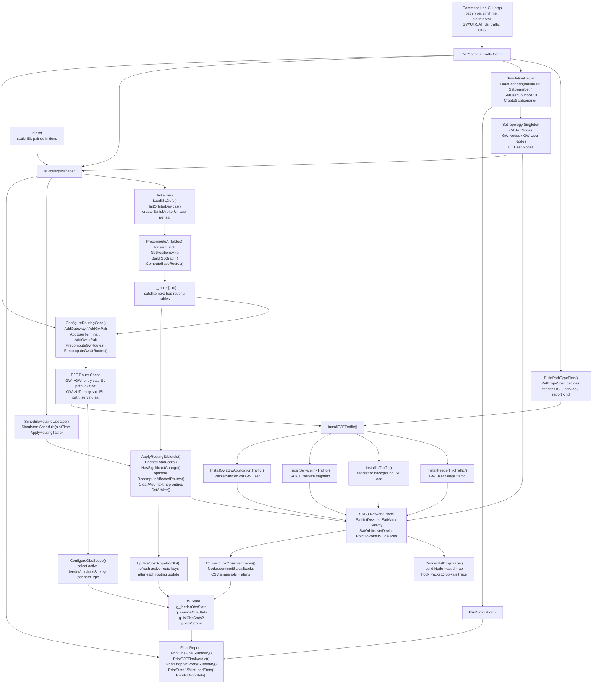
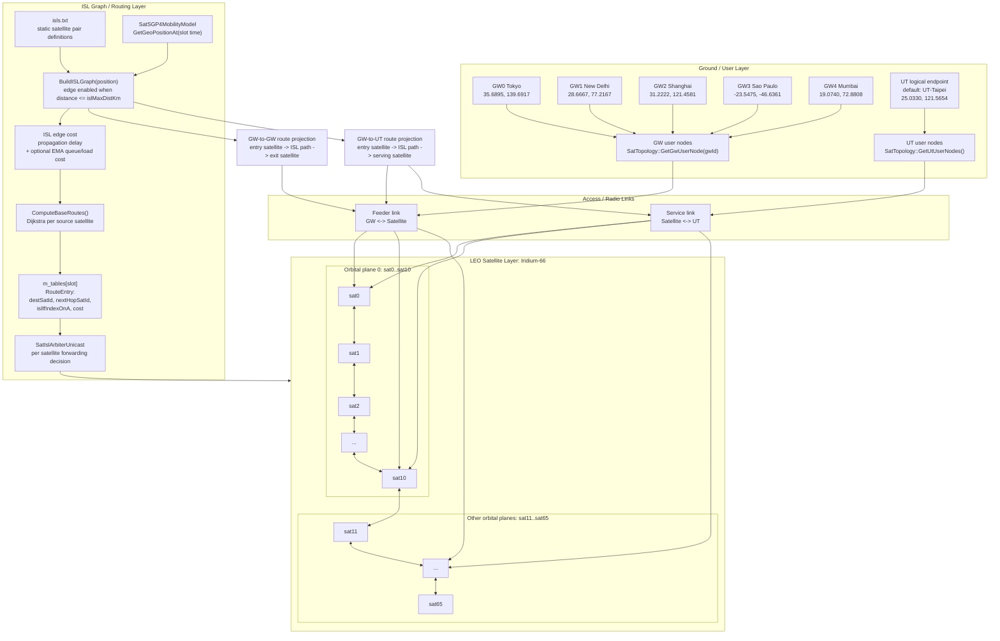
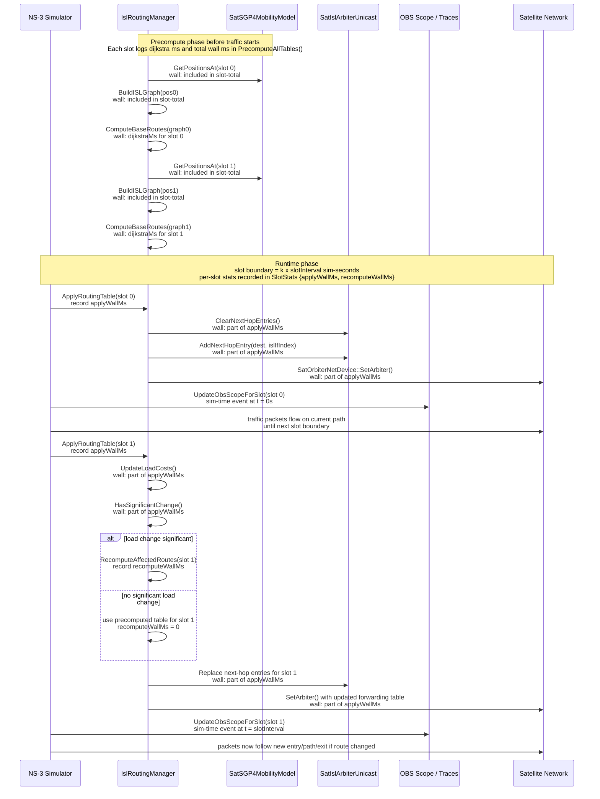

# `test-iridium-e2e.cc` Code Audit

> 本文件是 `test-iridium-e2e.cc` 的程式碼閱讀輔助，涵蓋架構圖、主程式流程圖、LEO network graph、路由切換時序圖與 function mapping。
> Layer 1 技術規格、Attribute、驗證結果與 Layer 2 介面請查閱 [`Layer1.md`](Layer1.md)。

---

## 1. Architecture Diagram



Tracing notes:

- `main()` 先解析 CLI 與建立 `E2EConfig`，再呼叫 `BuildPathTypePlan()`。
- `SimulationHelper::CreateSatScenario()` 建立 SNS3 topology 後，才接 `ConnectIslDropTrace()` 與 `ConnectLinkObserverTraces()`。
- `IslRoutingManager` 是 routing control plane：`Initialize()` 讀 `isls.txt` 並建立 per-sat arbiter，`PrecomputeAllTables()` 預先計算每個 slot 的 satellite routing table，`ScheduleRoutingUpdates()` 在 runtime 套用。
- E2E route projection 由 `ConfigureRoutingCase()` 觸發，依 path type 呼叫 `PrecomputeGwRoutes()` 或 `PrecomputeGwUtRoutes()`。

---

## 2. Main Program Flowchart

```mermaid
flowchart TD
    A["main(argc, argv)"] --> B["Set defaults<br/>scenarioName = constellation-iridium-66-sats-fixed<br/>numSats = 66<br/>pathType = gw2gw_e2e"]
    B --> C["CommandLine cmd.AddValue(...)"]
    C --> D["cmd.Parse(argc, argv)"]
    D --> E["Apply OBS config<br/>g_obsCfg + g_obsDebug"]
    E --> F{"Validate basic CLI values"}
    F -->|invalid| X["NS_ABORT_MSG_IF<br/>terminate"]
    F -->|valid| G["NormalizePathType()"]
    G --> H["Build E2EConfig<br/>pathType, GW/UT/SAT ids,<br/>traffic config"]
    H --> I["BuildPathTypePlan(e2eCfg)<br/>ValidateE2EConfig()<br/>GetPathTypeSpec()"]
    I --> J["Compute routing timing<br/>islRateBps, cooldownSec, numSlots"]
    J --> K["Config::SetDefault(...)<br/>SNS3 regeneration, ISL rate,<br/>SGP4 update period, stats tags"]
    K --> L["ConfigureQoS()<br/>currently no-op"]
    L --> M["Create SimulationHelper<br/>LoadScenario()<br/>SetSimulationTime()<br/>SetBeamSet()<br/>CreateSatScenario()"]
    M --> N["Topology diagnostics<br/>GW nodes, UT user nodes"]
    N --> O{"satStats enabled?"}
    O -->|yes| P["Register SNS3 native stats"]
    O -->|no| Q["Skip native stats"]
    P --> R
    Q --> R
    R["ConnectIslDropTrace()<br/>Node->satId map<br/>PacketDropRateTrace"] --> S["Open OBS CSV log"]
    S --> T["Decide trace points<br/>useOrbiterFeeder<br/>useGwFeeder<br/>useUtService"]
    T --> U["ConnectLinkObserverTraces(...)"]
    U --> V["Schedule TakeObsSnapshot()"]
    V --> W{"rbdcVerbose enabled?"}
    W -->|yes| W1["Connect RBDC trace"]
    W -->|no| W2["Skip RBDC trace"]
    W1 --> Y
    W2 --> Y
    Y["Create IslRoutingManager"] --> Z["Set routing attributes"]
    Z --> AA["routingMgr->Initialize(islsFilePath)"]
    AA --> AB["routingMgr->PrecomputeAllTables()"]
    AB --> AC["ConfigureRoutingCase()"]
    AC --> AD["ResolveTrafficUtUserId()"]
    AD --> AE["ConfigureObsScope()"]
    AE --> AF["PrintE2ERunBanner()"]
    AF --> AG["InstallE2ETraffic()"]
    AG --> AH{"Edge traffic installed?"}
    AH -->|yes| AI["Reuse upstream edge traffic<br/>skip separate service install"]
    AH -->|no| AJ["InstallServicelinkTraffic()"]
    AI --> AK
    AJ --> AK
    AK["InstallEndpointProbe()"] --> AL["routingMgr->ScheduleRoutingUpdates()"]
    AL --> AM["Schedule UpdateObsScopeForSlot()<br/>slot 1..numSlots-1"]
    AM --> AN["simHelper->RunSimulation()"]
    AN --> AO["Runtime:<br/>ApplyRoutingTable(slot)<br/>optional load-aware recompute<br/>traffic + trace callbacks<br/>periodic OBS snapshots"]
    AO --> AP["Final summaries:<br/>OBS, E2E verdict, endpoint probe,<br/>routing stats, load stats, ISL drop stats"]
    AP --> AQ["Print wall time + event count"]
    AQ --> AR["Simulator::Destroy()"]
    AR --> AS["return 0"]
```



Key control-flow conclusions:

- Routing is prepared before traffic applications are installed.
- `ApplyRoutingTable()` is scheduled into simulation time; it is not merely a precompute step.
- `UpdateObsScopeForSlot()` is scheduled after routing updates at the same slot boundary so observer scope follows the active route.

---

## 3. LEO Network Graph



Tracing notes:

- Iridium-66 is fixed in `main()` as `numSats = 66`.
- The SNS3 scenario creates the physical satellite/GW/UT nodes.
- `LoadISLDefs()` reads static ISL pairs; `BuildISLGraph()` decides which edges are usable at each slot based on satellite positions and `islMaxDistKm`.
- GW/UT are not ISL graph nodes. They are projected onto the satellite graph through visible entry/exit/serving satellites.

---

## 4. Routing Path Switching Diagram

```mermaid
flowchart LR
    subgraph T0["Slot 0 / t = 0s"]
        A0["Satellite positions<br/>GetPositionsAt(0s)"]
        G0["ISL graph G0<br/>BuildISLGraph(pos0)"]
        R0["Routing table T0<br/>ComputeBaseRoutes(G0)"]
        P0["Selected path<br/>entry0 -> ... -> exit0/serving0"]
        O0["OBS scope<br/>active ISL keys for path0"]
    end
    subgraph T1["Slot 1 / t = slotInterval"]
        A1["Satellite positions<br/>GetPositionsAt(slotInterval)"]
        G1["ISL graph G1<br/>BuildISLGraph(pos1)"]
        R1["Routing table T1<br/>precomputed base routes<br/>optional load recompute at runtime"]
        P1["Selected path<br/>entry1 -> ... -> exit1/serving1"]
        O1["OBS scope<br/>active ISL keys for path1"]
    end
    subgraph T2["Slot 2 / t = 2 * slotInterval"]
        A2["Satellite positions<br/>GetPositionsAt(2 * slotInterval)"]
        G2["ISL graph G2<br/>BuildISLGraph(pos2)"]
        R2["Routing table T2<br/>precomputed base routes<br/>optional load recompute at runtime"]
        P2["Selected path<br/>entry2 -> ... -> exit2/serving2"]
        O2["OBS scope<br/>active ISL keys for path2"]
    end
    A0 --> G0 --> R0 --> P0 --> O0
    A1 --> G1 --> R1 --> P1 --> O1
    A2 --> G2 --> R2 --> P2 --> O2
    O0 -->|"Simulator::Schedule(slot 1)"| A1
    O1 -->|"Simulator::Schedule(slot 2)"| A2
    P0 -. "path changed?" .-> P1
    P1 -. "path changed?" .-> P2
```





Routing switching logic:

- `PrecomputeAllTables()` prepares slot-level routing tables from satellite positions.
- `ScheduleRoutingUpdates()` schedules `ApplyRoutingTable(slot)` at slot boundaries.
- `ApplyRoutingTable()` replaces arbiter next-hop entries on each satellite.
- `PrecomputeGwRoutes()` / `PrecomputeGwUtRoutes()` add endpoint projection: `entry -> satPath -> exit/serving`.
- Path changes can be caused by ISL graph changes, GW/UT visibility changes, or runtime load-aware recomputation.
- Timing legend:
- `dijkstraMs`: precompute-time wall clock for `ComputeBaseRoutes(graph_k)`.
- `applyWallMs`: runtime wall clock for the whole `ApplyRoutingTable(slot k)` transaction, including clear/add/set-arbiter and load-check work.
- `recomputeWallMs`: runtime wall clock spent inside `RecomputeAffectedRoutes(slot k)` only; `0` means no partial reroute was triggered.

---

## 5. Function Mapping Table

| 功能模組 | 主要負責內容 | 對應 code / function | 主要資料結構 | 輸出 / 副作用 |
|---|---|---|---|---|
| CLI 與全域參數設定 | 解析 `pathType`、模擬時間、slot 間隔、GW/UT/SAT ID、traffic、OBS 參數 | `main()`、`CommandLine cmd.AddValue()` | `pathType`, `simTime`, `slotInterval`, `TrafficConfig` | 決定整次模擬 scenario、traffic、routing 更新週期 |
| Path type 規劃 | 判斷目前測試是哪種路徑 | `NormalizePathType()`、`GetPathTypeSpec()`、`BuildPathTypePlan()` | `PathTypeSpec`, `PathTypePlan`, `E2EConfig` | 決定 feeder / ISL / service segment 是否啟用 |
| SNS3 場景建立 | 載入 Iridium-66 scenario，建立衛星、GW、UT、beam、network device | `SimulationHelper::LoadScenario()`、`CreateSatScenario()` | `SimulationHelper`, `SatTopology` | 產生 orbiter nodes、GW nodes、UT user nodes |
| Gateway / UT preset 管理 | 將 logical GW/UT ID 映射到座標與名稱 | `GetGatewayPresets()`、`FindGatewayPreset()`、`AddGatewayOrAbort()` | `GatewayPreset`, `GwDef`, `UtDef` | 提供 GW/UT visibility 計算的地理座標 |
| ISL topology 載入 | 從 `isls.txt` 讀入衛星間靜態 ISL pair | `IslRoutingManager::LoadISLDefs()` | `ISLDef`, `m_islDefs`, `m_edgeOfPair` | 建立 satellite pair 與 ISL interface order 對應 |
| Orbiter device 初始化 | 找出每顆衛星的 `SatOrbiterNetDevice`，建立 per-sat arbiter | `IslRoutingManager::InitOrbiterDevices()` | `m_orbNodes`, `m_orbDevs`, `m_arbiters` | 每顆衛星配置 `SatIslArbiterUnicast` |
| Slot-based ISL graph 建立 | 依 slot 時間取得衛星位置，建立該時刻 ISL graph | `GetPositionsAt()`、`BuildISLGraph()` | `ISLGraph`, `ISLEdge`, `Vector` | 產生每個 slot 的可用 ISL 邊與 cost |
| Satellite routing table 預算 | 對每個 slot、每個 source satellite 計算到所有 destination 的 next hop | `PrecomputeAllTables()`、`ComputeBaseRoutes()`、`ComputeRoutesForSrc()` | `RoutingTable`, `RouteEntry`, `m_tables` | 建立 `m_tables[slot]` |
| GW-to-GW route projection | 在 GW 可見衛星集合中選 entry/exit satellite，重建 E2E ISL path | `PrecomputeGwRoutes()`、`GetGwRoute()`、`PrintGwRouteReport()` | `GwToGwRoute`, `m_gwRoutes`, `m_gwVisibility` | 產生 `GW src -> entry sat -> ISL path -> exit sat -> GW dst` |
| GW-to-UT route projection | 在 GW 可見衛星與 UT 可見衛星之間選最佳 entry/serving satellite | `PrecomputeGwUtRoutes()`、`GetGwUtRoute()`、`PrintGwUtRouteReport()` | `GwToUtRoute`, `m_gwUtRoutes`, `m_utVisibility` | 產生 `GW -> entry sat -> ISL path -> serving sat -> UT` |
| Runtime routing update | 在每個 slot boundary 套用新的 satellite forwarding table | `ScheduleRoutingUpdates()`、`ApplyRoutingTable()` | `m_tables[slot]`, `SatIslArbiterUnicast` | 清除舊 next-hop，寫入新 next-hop，更新 `SatOrbiterNetDevice` arbiter |
| Load-aware reroute | 根據 ISL queue delay 變化判斷是否重算受影響路由 | `UpdateLoadCosts()`、`HasSignificantChange()`、`RecomputeAffectedRoutes()` | `m_loadCosts`, `m_prevLoadCosts`, `m_islSources` | 若 load 變化超過 threshold，局部更新 routing table |
| Traffic 安裝 | 根據 path type 安裝 feeder、ISL、service 或 GW-to-GW app traffic | `InstallE2ETraffic()`、`InstallFeederlinkTraffic()`、`InstallIslTraffic()`、`InstallServicelinkTraffic()`、`InstallGw2GwApplicationTraffic()` | `TrafficConfig`, `ApplicationContainer` | 產生實際封包流，驅動 simulation |
| ISL drop tracing | 掛上 ISL `PacketDropRateTrace`，統計 packet drop | `ConnectIslDropTrace()`、`IslPacketDropCallback()`、`PrintIslDropStats()` | `g_nodeToSatId`, `g_islDropStats` | 輸出 ISL drop rate summary |
| Link observability | 觀測 feeder/service/ISL segment 的 rx、drop、throughput、delay | `ConnectLinkObserverTraces()`、`TakeObsSnapshot()`、`PrintObsFinalSummary()` | `SegLinkStats`, `ObsScope`, OBS stats maps | 寫 CSV、stdout alert、final OBS summary |
| OBS scope 管理 | 根據目前 path type 與 route，只觀測當前有效 link keys | `ConfigureObsScope()`、`UpdateObsScopeForSlot()` | `g_obsScope`, `g_obsVerdictScope` | slot 切換時更新 active feeder/service/ISL keys |
| Endpoint probe | 額外在 UT/GW/SAT endpoint 裝 diagnostic sink/device trace | `InstallEndpointProbe()`、`ConnectEndpointDeviceProbe()`、`InstallEndpointAppSink()` | `EndpointProbeState`, `EndpointProbeTargetStats` | 判斷封包是否真的到 endpoint layer / app layer |
| E2E verdict | 結束後依 path type 判斷 routing layer、ISL layer、service/feeder/app delivery 是否 pass | `PrintE2EFinalVerdict()`、`PrintLayerVerdict()` | `PathTypeSpec`, `ObsScope`, route validity stats | 輸出最終 PASS/FAIL verdict |
| Native SNS3 stats | 可選開啟 SNS3 內建統計檔案輸出 | `satStats` block in `main()` | `SatStatsHelperContainer` | 產生 per-sat/per-gw/per-ut scatter files |
| Simulation lifecycle | 執行模擬、輸出統計、釋放 simulator | `RunSimulation()`、`Simulator::Destroy()` | `Simulator` | 完成整個 ns-3 simulation lifecycle |

Functional split:

- **Control plane**: `IslRoutingManager` builds ISL graph, routing tables, route projection, and slot-based forwarding updates.
- **Data plane**: SNS3 devices carry feeder, service, and ISL traffic.
- **Observability plane**: trace callbacks, OBS scope, CSV snapshots, and final verdicts connect route intent to packet-level evidence.

---

## 6. pathType 重整結論（2026-04-20）

`test-iridium-e2e.cc` 已重整為純 `pathType` orchestration：

- 正式 CLI 入口只保留 `--pathType`。
- 已移除 `--mode`、`--trafficProfile`、`--enableFeederlink`、`--enableIsl`、`--enableServicelink`。
- 已移除 legacy plan：`ApplyLegacySegmentDefaults()`、`E2EExecutionPlan`、`BuildE2EPlan()`。
- `gw2gw_e2e` 不再用 feeder PHY counter 判斷成功與否。
- `sat2ut` 與 `gw2ut_e2e` 預設只對指定 `utId` 對應的 UT user node 安裝 traffic。

### pathType plan 對照

| pathType | 啟用段 | routing report | trafficKind | traffic endpoint |
|---|---|---|---|---|
| `gw2sat` | feeder | path only | `gw_ut_all` | GW user to scenario UT users |
| `sat2gw` | feeder | path only | `gw_ut_all` | scenario UT users to GW user return traffic |
| `sat2sat` | ISL | SAT2SAT report | `isl_background` | heavy GW/UT helper load as ISL transit stimulus |
| `sat2ut` | service | path only | `gw_ut_selected` | selected `utId` only |
| `gw2ut_e2e` | feeder + ISL + service | GW-UT report | `gw_ut_selected` | selected `utId` only |
| `gw2gw_e2e` | ISL verdict + packet verdict | GW-GW report | `gw2gw_application` | `GW_user(gwSrc) -> GW_user(gwDst)` UDP |

### 靜態檢查：已移除符號

已確認 active C++ code 不再包含：`TrafficProfile`、`trafficProfile`、`modeArg`、`enableFeederlink`、`enableIsl`、`enableServicelink`、`ApplyLegacySegmentDefaults`、`E2EExecutionPlan`、`BuildE2EPlan`、`g_feederNaExpected`、`GW2GW_DIRECT`。

---

## 7. 已知問題 / 待確認

- `ConfigureQoS()` 目前仍是空函式。
- `ns3BasePath` 仍 hardcoded 為 `/home/wenj/workspace/ns-3.43`。
- `SatTrafficHelper::AddCbrTraffic()` 對 `gwUsers` / `utUsers` container pair 的 exact flow 展開需查 SNS3 source 或用 log 驗證。
- all-UT pressure load 已不再混入 E2E 預設行為；若需要壓力測試，應另開 diagnostic module。

---

## 8. Reproduction Commands

```bash
./ns3 run "scratch/test-iridium-e2e --pathType=gw2sat --gwId=0 --simTime=120"
./ns3 run "scratch/test-iridium-e2e --pathType=sat2gw --gwId=0 --simTime=120"
./ns3 run "scratch/test-iridium-e2e --pathType=sat2sat --satSrc=0 --satDst=33 --simTime=120"
./ns3 run "scratch/test-iridium-e2e --pathType=sat2ut --gwId=0 --utId=0 --simTime=120"
./ns3 run "scratch/test-iridium-e2e --pathType=gw2ut_e2e --gwId=0 --utId=0 --simTime=120"
./ns3 run "scratch/test-iridium-e2e --pathType=gw2gw_e2e --gwSrc=0 --gwDst=1 --simTime=120"
```

觀察重點：
- routing report 是否與 pathType endpoint 對齊。
- `sat2ut` / `gw2ut_e2e` traffic log 是否顯示 selected UT，而不是全部 UT。
- `gw2gw_e2e` 是否輸出 `LINK_LAYER` 與 `PACKET_LAYER`，且 `PACKET_LAYER` 使用 `PacketSink::Rx` trace 統計。
- invalid route slot 應清空該 pathType active OBS scope，避免 stale scope。
